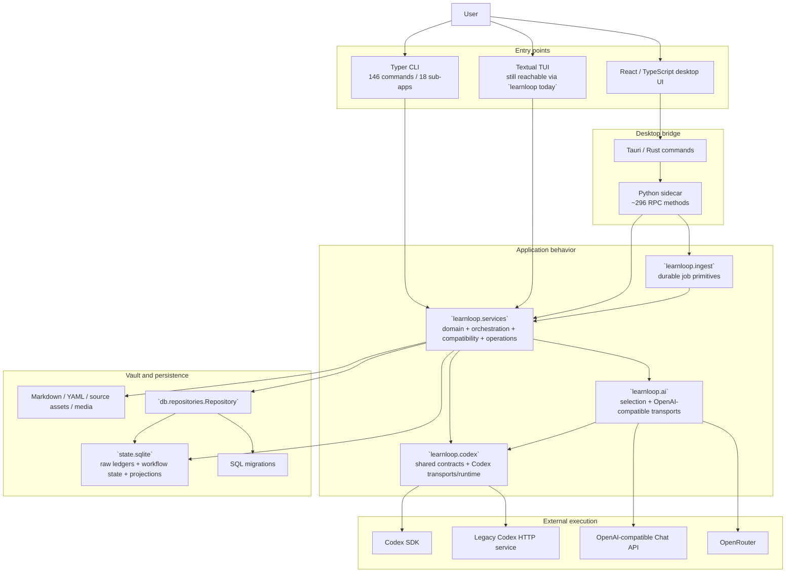
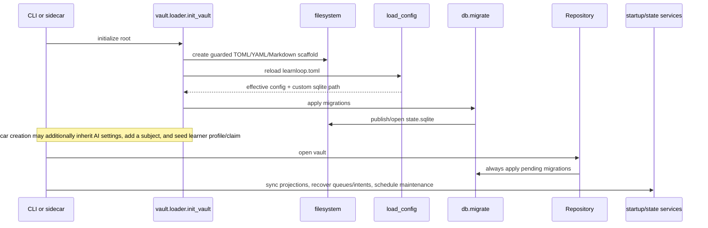
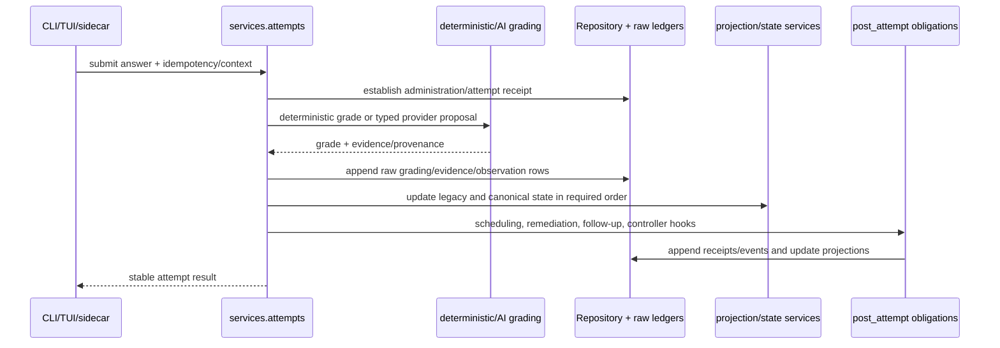
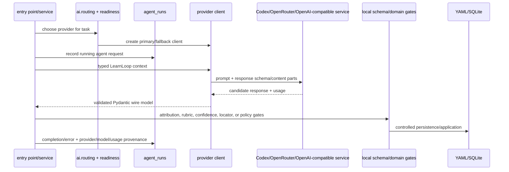
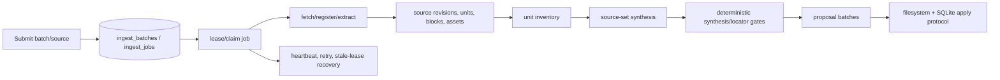
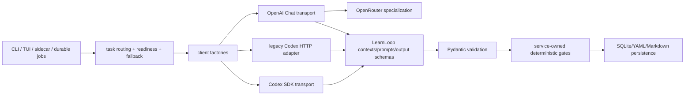

# LearnLoop Architecture Archaeology

**Snapshot:** 2026-08-17  
**Repository revision inspected:** `d0f25b2` (`before refactor`) plus the pre-existing working-tree changes present during the investigation  
**Scope:** descriptive archaeology only; this document does not design the subsequent refactor

## Evidence conventions

Conclusions use three confidence labels:

- **Observed fact** — directly established by source, call sites, tests, SQL, migrations, configuration, or history.
- **Strong inference** — several independent observations support the conclusion, but intent is not stated explicitly.
- **Hypothesis** — plausible interpretation that still requires confirmation.

Unless stated otherwise, paths are relative to the repository root. Line references describe the inspected snapshot and may drift after later edits.

## Executive Summary

LearnLoop is a local-first learning system whose behavior is distributed across six major runtime areas:

1. Python entry points: a very large Typer CLI and a still-active Textual TUI.
2. A Python sidecar exposing the application surface to the desktop client.
3. A large `services` package containing most orchestration and domain behavior.
4. Vault storage: user-readable Markdown/YAML/source assets plus `state.sqlite`.
5. AI execution code split between the historical `learnloop.codex` package and the newer `learnloop.ai` package.
6. A Tauri/React desktop application whose Rust bridge and TypeScript DTOs mirror the sidecar contract.

The system's strongest real boundaries are not its directories. They are behavioral and persistence contracts:

- provider output is a candidate that LearnLoop validates and gates before persistence;
- immutable/raw observations are separated, imperfectly but deliberately, from mutable projections and workflow state;
- old-vault state is preserved through versioned readers, migrations, backfills, and compatibility projections;
- proposal application coordinates filesystem and SQLite changes through a recovery protocol;
- attempt completion has a load-bearing ordering of evidence, state, scheduling, and post-attempt obligations;
- the desktop application depends on a large, stable RPC/error/DTO contract.

The most consequential findings are:

- **`src/learnloop/services` is a generic application layer rather than a coherent architectural layer.** It contains domain rules, orchestration, persistence adapters, compatibility projections, operational jobs, provider setup, and presentation-shaped helpers. It has 259 Python files and approximately 140,988 lines. At least 19 service modules execute raw SQL. A call graph that includes deferred imports contains a strongly connected component of roughly 68 service modules.
- **`Repository` is both a persistence gateway and a second application layer.** `src/learnloop/db/repositories.py` is about 25,883 lines with roughly 907 methods. It owns SQL for much of the system, but also imports services lazily to avoid cycles. Conversely, many services and sidecar handlers bypass it with SQL.
- **The AI boundary exists, but provider-independent contracts remain Codex-owned.** Context objects, output schemas, prompts, errors, and much of the effective interface live under `learnloop.codex`. `learnloop.ai` owns selection and OpenAI-compatible transports but imports back into `learnloop.codex`. Direct `openai_codex` imports are well isolated; conceptual Codex coupling is not.
- **OpenRouter already supports the shared structured-text workflows.** Both the Codex SDK and OpenAI/OpenRouter clients expose the same 22 text operations. OpenRouter also has native audio and whole-PDF paths. It does not have Codex interruption, checkout/revision, persistent agent-thread, or tool semantics; those are real provider differences rather than missing generic behavior.
- **Provider resolution is duplicated and inconsistent.** CLI, sidecar, TUI, startup maintenance, ingest, and job handlers resolve providers differently. Some named Codex profiles lose their configured identity, and three CLI workflows are accidentally Codex-only even though the generic client supports the required operation.
- **Configuration is much larger than the generated file suggests.** Fresh `learnloop.toml` contains about 349 explicit leaf settings, while validation yields about 597 effective leaves. Roughly 249 modeled leaves are absent from the template. Fresh vaults use `mvp-0.9`, while the README/current documentation still describe `mvp-0.8`, and the CLI upgrade command only accepts `0.7` or `0.8`.
- **Initialization and even inspection are writeful.** Opening a vault constructs `Repository`, applies migrations, syncs state, refreshes projections, schedules maintenance, and can probe/start Codex. Plain Doctor can also migrate or create the database despite not being invoked in fix mode.
- **`state.sqlite` contains several architectural generations.** The inspected workspace has 143 migration files through version 156, 251 user tables, 361 explicit indexes plus 355 autoindexes, and 62 triggers. The tracked revision ends at migration 155; migration 156 was an untracked working-tree file. The database contains immutable ledgers, mutable operational state, compatibility stores, and rebuildable projections. Treating it as only an event store or only derived state is inaccurate.
- **Existing-vault compatibility is intentional, not accidental dead code.** Newer substrate specifications explicitly freeze old-vault semantics. Legacy facet/probe tables, replay readers, backfills, and projections may be historical architecture, but they preserve meaningful persisted data and cannot be removed on a static “unused” finding.
- **Three ingestion generations coexist.** The original `services/ingest.py`, one-shot canonical `services/source_ingestion.py`, and the durable v2 queue under `learnloop.ingest`/`services/ingest_runner.py` all remain present. The current durable `legacy_ingest` handler calls one-shot canonical ingestion, which differs from the v2 specification's “wrap Quick add” description.
- **The current test suite is broad but does not make the worktree a safe refactor baseline.** Pytest collected 4,233 tests. A full run was stopped after temporary data exhausted `/tmp`; an isolated first failure reproduced in `test_activity_backfill.py` (`expected 70 replayed attempts, got 16`). A focused 143-test architecture suite passed. React has no meaningful automated coverage, Rust has only a small test set, and several persistence/provider edge cases are untested.

These findings identify where later design work must concentrate. They do not by themselves imply that large files should be split or that compatibility mechanisms should be deleted.

## System Map

### Major components

| Component | Current responsibility | Main callers | Main dependencies/state | Architectural assessment |
|---|---|---|---|---|
| `src/learnloop/cli.py` | Command registration, input/output formatting, vault opening, provider resolution, and direct workflow orchestration | Console script/users/tests | Vault loader, sidecar internals, services, AI/Codex runtime, repository | A presentation entry point that also contains application composition and compatibility behavior. At roughly 7,957 lines, size reflects both command count and mixed ownership. |
| `src/learnloop/tui` | Interactive daily-learning interface | `learnloop today`, TUI tests | Services, repository, Codex/AI selection | Historically described as legacy but observably active. Contains its own provider-resolution variant. |
| `apps/learnloop-tauri` | React desktop presentation, Rust process/RPC bridge, generated/manual DTO contract | Desktop users | Python sidecar protocol | Boundary is operationally important. TypeScript DTO surface is very large; test protection is weak relative to contract size. |
| `src/learnloop_sidecar` | Vault lifecycle, RPC validation/dispatch, serialization, background jobs, and some workflow logic | Tauri/Rust bridge, sidecar tests | Services, repository, vault loader, AI runtime | Not a thin transport adapter: approximately 296 RPCs and many direct service/private-API imports. |
| `src/learnloop/services` | Most business behavior plus orchestration, SQL, compatibility, maintenance, projections, and adapters | CLI, TUI, sidecar, simulations, repository callbacks | Repository/SQLite, vault, AI/Codex, other services | Generic application-layer namespace; the main architectural knot. |
| `src/learnloop/db` | Connection/migration mechanics and the huge repository gateway | Nearly all services and entry points | SQLite, migrations; some lazy service callbacks | Intended SQL owner, but boundary is porous in both directions. |
| `src/learnloop/vault` | Filesystem layout, YAML/Markdown models and I/O, vault initialization/loading | All entry points, services, fixture tools | Config, filesystem, repository initialization | Cohesive core, but opening and initialization have broader write side effects than the name suggests. |
| `src/learnloop/config.py` | Pydantic configuration schema, defaults, compatibility normalization, TOML loading, environment interpolation | Vault loading and most workflows | TOML, process environment | Central policy hub with historical compatibility and many runtime defaults. |
| `src/learnloop/codex` | Shared AI contexts/schemas/prompts plus Codex SDK and legacy HTTP implementation/runtime | Services, CLI, TUI, sidecar, `learnloop.ai` | Codex SDK checkout or HTTP service | Namespace encodes historical provider ownership over concepts that are mostly LearnLoop-owned. |
| `src/learnloop/ai` | Provider selection/readiness/factory, OpenAI chat transport, OpenRouter specialization, multimodal formatting | Entry points and AI-consuming services | `learnloop.codex` contracts, environment secrets, OpenAI-compatible APIs | Real but incomplete provider layer; it depends inward on the historical Codex package. |
| `migrations` + `state.sqlite` | Durable schema evolution and local state | Repository construction, init, Doctor, direct SQL paths | SQLite | Contains several generations and both canonical and derived data; compatibility is a first-class constraint. |

## Runtime / Data Flows

### Vault creation and opening

Observed details:

- `vault.loader.init_vault()` is the shared scaffold primitive used by CLI, sidecar creation, fixtures, and tests.
- Files are individually guarded rather than created in one transaction. Rerunning can complete a partial scaffold.
- The CLI permits initialization in a populated non-vault directory; sidecar creation rejects a file or populated non-vault directory.
- The sidecar may copy explicit AI settings from the active vault or machine defaults, optionally add a subject, and write a learner profile plus `learner_claims` seed.
- `SidecarContext.load()` is not read-only initialization: it constructs `Repository`, migrates, binds/recover ingest state, synchronizes projections, schedules cold probes, and normally runs startup maintenance.
- An invalid sidecar `starting_level` can be reported after base scaffold/subject creation, leaving a valid partial vault.

### Attempt completion

`services/attempts.py` is a high-fan-in orchestration hub. It wraps deterministic grading, provider-assisted grading, idempotency, provenance, evidence writes, compatibility state, canonical observations, and post-attempt work. The ordering is load-bearing: callers and tests assume raw evidence is durable before derived state and follow-up obligations are produced. Moving methods without preserving the protocol would be a behavioral change.

Ordinary practice can fall back to self-grading or deterministic behavior when a provider is unavailable. Exam and probe contexts impose stronger independence constraints and may refuse instead. Reveal events prime or invalidate later evidence through a cross-channel salience firewall.

### Structured AI request

The persistent seam is LearnLoop's typed context/result and local validation, not a Codex thread. The provider does not own authoritative filesystem paths or direct state mutation in the normal flow.

### Durable ingestion

`services/ingest_runner.py` owns both durable-queue execution mechanics and numerous domain job handlers. It resolves provider profiles, chooses native audio/PDF routes, performs extraction, dispatches inventory/synthesis/reconciliation, updates job leases, and persists outcomes. This is why it has broad fan-out and high churn: it is simultaneously infrastructure, application orchestration, and domain integration.

Three generations remain visible:

1. `services/ingest.py` — original ingestion path, now apparently test-only.
2. `services/source_ingestion.py` — one-shot canonical source ingestion with its own caching/retry semantics.
3. `learnloop.ingest` plus `services/ingest_runner.py` — durable batch/job workflow.

The current durable `legacy_ingest` job calls `source_ingestion.ingest_canonical_source()` (`ingest_runner.py`, around lines 980–1004). The v2 source-ingestion specification describes legacy ingest as a wrapper around Quick Add. The implementation therefore preserves a different intermediate generation than the document implies.

### Proposal application and recovery

Content authoring and ingestion create typed proposals first. `services/proposals.py`, `services/patches.py`, and `services/apply_protocol.py` coordinate validation, filesystem writes, SQLite acceptance, and `apply_intents` recovery. This is a filesystem/DB write-ahead protocol rather than a normal single-database transaction. Its observable requirements are:

- the provider proposes; LearnLoop validates;
- accepted YAML/Markdown and SQLite metadata converge after a crash;
- replay/recovery is idempotent;
- partial application is detectable;
- existing accepted content is not silently regenerated under a different identity.

### Canonical replay and compatibility projections

Raw attempts, grades, observations, adjudications, reveal events, and versioned contracts feed legacy and newer projection layers. Readers such as `services/facet_state_reader.py`, replay/backfill services, `services/substrate_cutover.py`, and the working-tree `services/canonical_projection_rollout.py` choose authority according to algorithm/projection version and availability. New projections do not imply that the older tables are disposable: tracked old fixtures contain meaningful legacy facet/probe data, and newer specifications explicitly preserve old-vault behavior.

## Module Responsibility Map

### Entry points and adapters

| Module/package | Responsibility and interface | Calls / state / config | Concern |
|---|---|---|---|
| `src/learnloop/cli.py` | Public Typer command surface; 146 commands across 18 sub-apps | Calls services, repository, vault, sidecar-private helpers, AI/Codex factories | Command parsing, presentation, composition, provider routing, and workflow policy are interleaved. |
| `src/learnloop/tui` | Interactive review/feedback/today UI | Calls attempts/scheduler/repository and builds provider clients | Active compatibility surface despite “legacy” framing; duplicates composition logic. |
| `src/learnloop_sidecar/server.py` and handlers | JSON-RPC-style method registration, validation, dispatch, serialization, errors | Approximately 296 RPC methods; imports 137 service modules across sidecar code | The adapter owns significant application behavior and depends on service-private symbols. |
| `apps/learnloop-tauri/src-tauri` | Starts/manages sidecar and exposes Rust commands | Process lifecycle, request/response transport | Small automated contract coverage relative to surface. |
| `apps/learnloop-tauri/src` | React screens, request hooks, DTOs | Sidecar RPC names and payloads | `dto.ts` is approximately 6,109 lines with roughly 523 exported types; no meaningful React test suite was found. |

### Persistence and vault

| Module/package | Responsibility and interface | Calls / state / config | Concern |
|---|---|---|---|
| `src/learnloop/db/connection.py` | SQLite connection with foreign keys enabled | All normal repository operations | Alternate direct connections do not always reproduce its invariants. |
| `src/learnloop/db/migrate.py` | Migration discovery/application and atomic fresh-DB publication | Called by init and every `Repository` construction | Fresh creation is crash-aware; incremental upgrades are not migration-atomic and have no process lock. |
| `src/learnloop/db/repositories.py` | Broad SQL CRUD/query/projection gateway | Called throughout source/tests; reads/writes nearly all tables | Extreme fan-in and breadth; lazily imports services, violating the intended lower-layer direction. |
| `src/learnloop/db/observation_ledger.py` | Ordered/bulk replay reads for observation ledgers | Projection/replay paths | A focused newer persistence component, but it was untracked in the inspected worktree. |
| `src/learnloop/vault/loader.py` | Load/init vault, parse filesystem-owned objects, invoke migration | CLI, sidecar, tests, fixtures | `init_vault` is shared and guarded per file, but initialization is not atomic. |
| `src/learnloop/vault/writer.py`, `yaml_io.py` | Controlled YAML/Markdown persistence | Proposal and state services | Filesystem state participates in multi-store protocols. |
| `src/learnloop/config.py` | Configuration models/defaults/compatibility/environment loading | Nearly every runtime composition path | Centralized schema but duplicated knowledge at callers; environment loading mutates process-global state. |

### Domain and orchestration hotspots

| Module | Current responsibility | Major callers/dependencies | State/configuration | Architectural concern |
|---|---|---|---|---|
| `services/attempts.py` | Attempt lifecycle, grading selection, evidence, idempotency, state updates, post-attempt dispatch | CLI/TUI/sidecar; 19 source importers and 114 test files; imports ~29 services | Attempts, grading, observations, item/mastery/facet state; grading/provider config | High fan-in/fan-out; orchestration and domain policy are inseparable without preserving ordering. |
| `services/post_attempt.py` | Obligations after accepted attempt | Attempts and specialized paths | Follow-ups, remediation, scheduler/controller events | Represents a real protocol boundary, but is coupled to many projections. |
| `services/ingest_runner.py` | Queue lease/retry plus extraction and 14+ job-domain handlers | Sidecar/CLI ingest workers | Ingest tables, source IR, AI routes, media settings | Infrastructure and many domains share one reason-to-change hub; highest observed churn (34 commits). |
| `services/source_ingestion.py` | One-shot canonical fetch/chunk/AI proposal/gating/persistence | Durable legacy handler, tests | Source/proposal/agent-run tables, ingest/provider config | Historical generation still wired into current durable path; cache identity omits provider/prompt data. |
| `services/source_set_synthesis.py` | Synthesis manifest/run/shard orchestration and provider calls | Ingest runner, tests | Source IR, manifests, proposals, provider/model | Newer identity model includes provider, model, prompt, inputs, and budgets. |
| `services/proposals.py`, `patches.py`, `apply_protocol.py` | Typed proposal lifecycle, gates, YAML/SQLite application and recovery | Authoring/ingest/CLI/sidecar | `agent_runs`, proposal tables, content files, apply intents | Multi-store transaction protocol; private AI prompt/schema functions leak here. |
| `services/activities.py` | Canonical activity identities/hashes and substrate operations | 20+ service modules use private `_canonical_hash`/`_json` | Activity tables and JSON identity | A genuine shared concept whose private API has become an implicit package-wide contract. |
| `services/scheduler.py` | Legacy/current item scheduling and explanation output | CLI/TUI/sidecar, goals/exams/controller | Practice/card state, policy config | Shares selection ownership with newer controller paths; compatibility cutover is behavioral, not directory-based. |
| `services/causal_orchestrator.py` and probe/remediation modules | Diagnostic hypothesis, probe choice, observations, remediation, follow-up | Attempt/post-attempt/controller paths | Large causal/probe table family and feature flags | Part of a dense deferred-import SCC; orchestration, stores, and domain rules cross-call. |
| `services/state_sync.py` and projection/backfill modules | Reconcile filesystem, legacy state, and canonical projections | Vault opening, Doctor, upgrade/rebuild | YAML plus many legacy/new tables, algorithm versions | Historical compatibility is intentional; “unused projection” claims require version-aware evidence. |
| `services/startup.py` | Startup health, maintenance, provider readiness | Sidecar context/open paths | Codex/AI config, maintenance notices, projections | Opening a vault can start external runtime and write state; Codex-family profile handling differs from sidecar routing. |
| `services/doctor.py` | Diagnostics, recovery, optional repairs | CLI | Files, migrations, repository, apply intents | Plain diagnostic invocation is writeful because repository construction applies migrations. |
| `services/settings_store.py` | Persist desktop/user AI settings and materialize profiles/routes | Sidecar settings handlers | `learnloop.toml`, machine defaults | Profile-copy whitelist drops `input_modalities`. |
| `services/goal_series.py` | Historical state reconstruction by copying/pruning/replaying SQLite | Goal/reporting paths | Scratch DB copy, dynamic FK traversal | Specialized and coherent, but direct SQL and replay knowledge bypass repository ownership. |
| `services/debug_time.py` | Shift timestamps across many tables for debugging | Debug CLI/tests | Direct SQL against a fixed schema list | Operational escape hatch tightly coupled to schema inventory. |

### AI modules

| Module | Current responsibility | Major callers/dependencies | Architectural concern |
|---|---|---|---|
| `codex/client.py` | Provider-independent request contexts; incomplete protocol; legacy HTTP client; Codex SDK client; text prompt builders; strict-schema conversion | 35 source files and 26 test files | At least five responsibilities and the central AI dependency hub. |
| `codex/schemas.py` | Strict Pydantic wire models for authoring, grading, tutoring, probes, reader, ingest, depth, animation, etc. | 18 source files and 55 test files | Genuinely LearnLoop-owned/provider-independent contracts in a provider namespace. |
| `codex/prompts.py` | Shared domain instructions and prompt text | `codex.client` builders | Provider-independent policy in Codex namespace. |
| `codex/runtime.py` | Local checkout/revision, SDK import checks, HTTP startup/health, Codex runtime state | CLI, sidecar, TUI, startup, ingest | Genuinely Codex-specific. |
| `ai/client.py` | Four-method generic protocol and provider factory | AI-consuming composition paths | Formal protocol understates the 22-method effective surface. |
| `ai/codex_sdk.py` | Adapt generic provider config into legacy Codex clients | Generic provider factory | Compatibility bridge; can overwrite named-profile identity and omit an HTTP path field. |
| `ai/openai_chat.py` | Chat Completions transport, all structured workflows, validation repair, retry, usage, audio/PDF | Generic factory; OpenRouter subclass | Imports many private/public symbols from `codex.client`; duplicates operation-to-prompt/schema mapping. |
| `ai/openrouter.py` | OpenRouter endpoint/key defaults, attribution headers, reasoning payload | Generic factory | Cohesive provider-specific specialization. |
| `ai/runtime.py` | Cross-provider readiness report | Entry points and workers | Chat readiness generally proves only presence of a key environment variable. |
| `ai/routing.py` | Explicit/env/task/active selection and fallback suppression | CLI, sidecar, services | Canonical selection exists, but resolution/readiness/creation is still reimplemented around it. |
| `ai/multimodal.py` | Shared media result contracts and OpenAI-compatible content parts | Chat client and ingest | Result is shared; payload shape is transport-family-specific. |
| `ai/prompts.py`, `ai/schemas.py` | Partial re-export shims | No internal callers found | Partial migration/compatibility artifacts; external consumers remain uncertain. |
| `token_usage.py` | Provider-neutral accumulated usage | Concrete clients and agent-run completion | Lives outside `ai`; a comment states moving it there would expose the current `ai -> codex` cycle. |

## `src/learnloop/services` Analysis

### What the package actually contains

**Observed fact:** `services/__init__.py` is only a docstring; there is no package facade or declared public surface. Runtime code imports individual modules directly. Of 259 Python files, 184 are imported by production code outside `services` and tests: sidecar code reaches 137, CLI code 99, simulations 19, TUI 9, and DB code 2. The counts overlap.

Dependency census:

- approximately 200 service modules import the DB layer;
- approximately 149 import vault code;
- 30 import Codex code directly;
- 26 import config;
- only 9 import `learnloop.ai`;
- at least 19 execute raw SQL themselves.

Top-level imports appear acyclic because many modules defer imports inside functions. Including those imports yields a strongly connected component of roughly 68 modules. This is evidence that import placement is being used to manage cycles, not evidence of a clean dependency direction.

### Evidence-backed conceptual clusters

These clusters describe existing cohesion; they are not a proposed directory tree.

1. **Attempt, grading, and measurement**

   `attempts`, `grading`, `grade_classifier`, `grade_resolution`, `regrade`, `clarification`, `outcome_schemas`, `observations`, `evidence`, `attempt_trace`, `reveal_ledger`, `trace_evidence`, `ability_transition`, `post_attempt`, `mastery_step_attribution`.

   Shared reason for change: accepting an interaction, deciding grading authority, appending evidence, and projecting learner state.

2. **Scheduling, goals, sessions, and exams**

   `scheduler`, `progression`, `progression_policy`, `goal_contracts`, `goal_projection`, `goal_pace`, `goal_certification`, `forecast_ledger`, `exam_session`, `exam_pool`, `exam_profile`, `exam_readiness`, `exam_seeding`, `certification`, `certification_cold_probe`, `short_session`, `reentry_*`.

   Shared reason for change: deciding what should happen next and whether a goal has been reached. Legacy scheduler and newer controller ownership overlap, so this is not one uniform implementation.

3. **Probe, causal diagnosis, remediation, and follow-up**

   `probes`, `probe_*`, `causal_*`, `diagnostic_*`, `misconceptions`, `remediation*`, `guided_redo`, `followups`, `error_hunt`, `contrast_pairs`, `discrimination_profiles`, `coldness_receipt`, `salience_firewall`.

   Shared reason for change: identify a learner-state hypothesis, commission discriminating evidence, and choose/verify a repair. This cluster is internally dense and part of the large deferred-import SCC.

4. **Activity substrate and compatibility projections**

   `activities`, `activity_*`, `card_lineage`, `surface_*`, `instrument_serving`, `administration_adapters`, `substrate_cutover`, `canonical_projection*`, `p0_projection`, `activity_backfill`, `card_outcome_replay`, `facet_state_reader`, `state_sync`, `replay`.

   Shared reason for change: represent activities/cards/surfaces and reconcile old attempt/item state with the canonical substrate. Some modules are migration/compatibility mechanisms rather than current-domain behavior.

5. **Golden path, curriculum, and controller**

   `golden_path_*`, `commitments`, `commitment_arcs`, `task_blueprints`, `depth_*`, `pattern_ladder`, `laddered_stems`, `controller_*`, `constraint_engine`, `predictive_targets`, `selection_rewards`, `randomization_layer`, `interleaving`, `familiarity`, `shadow_components`, `kinship_feature`, `open_world_gate`.

   Shared reason for change: represent curricular contracts and choose activities under constraints. Staged/legacy and canonical controller ownership coexist.

6. **Source, ingest, synthesis, and proposals**

   `ingest`, `source_ingestion`, `ingest_runner`, `source_*`, `pdf_extraction`, `extraction_health`, `source_unit_inventory`, `source_set_synthesis`, `synthesis_*`, `source_append`, `source_deletion`, `proposals`, `patches`, `apply_protocol`, `authoring_gates`, `graph_edit_proposals`, `conflict_resolution`, `provenance`.

   Shared reason for change: turn external material into source IR and controlled content proposals. It contains three generations and two distinct cache/identity models.

7. **Reader and Tutor**

   `reader_*`, `source_objects`, `annotations`, `span_view`, `tutor_qa`, `teach_back`, `question_signal`, `promotions`.

   Shared reason for change: learner interaction with sources and conversational/question workflows. These use common AI contracts but have distinct state and UI semantics.

8. **Operational, audit, and repair infrastructure**

   `startup`, `doctor`, `maintenance_feed`, `vault_lock`, `vault_upgrade`, `debug_time`, `goal_series`, `parameter_registry`, `sensitivity_certificates`, `calibration*`, `persona_realism`, `synthesis_eval`, `scoreboard`, `review_log`.

   Shared reason for change is operational integrity/evaluation, but this is the least cohesive cluster and should not be treated as a future “misc” namespace.

### Orchestration versus domain logic versus infrastructure

- Clear orchestration: `attempts`, `post_attempt`, `ingest_runner`, `source_ingestion`, `source_set_synthesis`, `causal_orchestrator`, `startup`, `golden_path_run`, `exam_session`.
- Mostly domain policy/calculation: `grade_classifier`, `evsi`, `gate_score`, `decay_pressure`, `overconfidence`, `progression_policy`, `salience_firewall`, `exam_profile`, `synthesis_gates`, `authoring_gates`.
- Persistence/projection infrastructure: `state_sync`, `replay`, `canonical_projection`, `p0_projection`, `activity_backfill`, `controller_store`, `probe_episodes`, `goal_series`.
- External/file integration: `pdf_extraction`, `source_refs`, `span_view`, `source_deletion`, `apply_protocol`, `vault_lock`.

The categories are not pure. For example, `ingest_runner` contains all three; `attempts` combines orchestration, domain policy, and persistence choreography; `controller_store` is named like persistence but participates in domain decisions.

### Boundary violations and accidental contracts

- The P1 shared-substrate specification states that business logic belongs in services and `Repository` owns SQL (`spec_p1_shared_substrate.md`, around lines 723–726). At least 19 services execute SQL directly.
- `db/repositories.py` imports service code around lines 14,794, 24,898, and 25,502. A nearby comment acknowledges the lower-layer cycle. Deferred imports avoid import-time failure but preserve the dependency inversion.
- CLI and sidecar import private service functions. Examples observed include `cli.py` around lines 3,236 and 5,755, sidecar feedback around line 433, and sidecar exams around line 15.
- More than 20 services import `activities._canonical_hash` or `activities._json`. Their leading underscore no longer describes their effective visibility.
- A file move alone cannot repair these relationships. Without changing SQL ownership, composition roots, and effective interfaces, it would only make the tree look different.

### Duplicate and parallel implementations

Genuine or likely duplicates:

- provider resolution/readiness/client creation across CLI, sidecar, TUI, startup, and ingest;
- original, one-shot, and durable ingestion generations;
- legacy and canonical learner-state/probe projections where one is a compatibility implementation of the same conceptual state;
- `[codex]` and `[ai.providers.codex]` configuration representations;
- duplicated Codex SDK and OpenAI-chat operation-to-prompt/schema dispatch.

Superficially similar but semantically distinct:

- source, activity, and reveal exposure ledgers record different authorities and downstream consequences;
- `practice_item_state` and `activity_card_state` overlap, but the latter has not replaced the former across all active consumers;
- `grading_evidence`, `raw_grade_events`, `grade_interpretations`, `grade_adjudications`, `activity_observations`, and `measurement_events` represent different stages/authorities in the measurement pipeline;
- one-shot ingest cache and source-set synthesis manifests both support reuse, but their identity semantics are materially different;
- legacy scheduler and controller selectors both choose work, but operate under different ownership/version contracts.

## AI Provider Analysis

### Actual layering

### Provider-independent capabilities already present

`SdkCodexClient` and `OpenAIChatProviderClient` implement the same 22 structured-text operations:

- authoring and canonical ingest;
- grading, Tutor Q&A, teach-back question generation, and teach-back authoring;
- misconception matching and promotion analysis;
- diagnostic trial generation;
- probe instance, dialogue, and family trials;
- reader presets and quick checks;
- rung backfill, exercise authoring, and depth-edge authoring;
- source inventory, source-set synthesis, concept-graph structuring, and append reconciliation;
- concept animation.

They use the same LearnLoop contexts, prompt builders, and Pydantic result models. This is strong evidence that these capabilities are LearnLoop-owned even though their definitions remain under `learnloop.codex`.

The declared interfaces lag implementation:

- `codex.client.CodexClient` declares only eight operations.
- `ai.client.AIProviderClient` declares only four.
- Later features use `getattr` capability discovery and deterministic degradation/typed refusal when absent. Examples include `diagnostic_gate.py`, `probe_instance_generation.py`, `probe_dialogue.py`, `source_unit_inventory.py`, `source_set_synthesis.py`, `source_append.py`, `reader_requests.py`, `reader_quick_check.py`, `rung_backfill.py`, `exercise_authoring.py`, `depth_edge_authoring.py`, and `concept_animation.py`.

Capability discovery is therefore intentional behavior, but the capability contract is implicit and distributed.

### Genuinely Codex-specific behavior

`codex/client.py::SdkCodexClient`:

- resolves a configured local Codex checkout and Python SDK source;
- dynamically imports `openai_codex` and Codex-specific config/personality/effort types;
- starts a fresh SDK context/thread for each structured call;
- runs with the vault root as SDK and turn working directory;
- supports active interruption and a forced close after a short grace period;
- maintains wall-clock timeout state and distinct interruption/timeout errors;
- accounts for billed usage even on timeout/interruption/empty output;
- emits detailed debug prompt/schema/response logging.

`codex/runtime.py` owns checkout and revision pinning, SDK-import probes, HTTP service startup/health, and Codex-specific runtime states. These are not capabilities OpenRouter should be assumed to reproduce.

Direct imports of `openai_codex` were found only in `codex/client.py` and `codex/runtime.py`. Transport dependency is thus isolated better than the package's conceptual contracts.

### Legacy Codex HTTP adapter

`HttpCodexClient` posts purpose-specific JSON endpoints and accepts flat or `{proposal: ...}` responses. It implements only the original eight-operation surface. It has no extended source/depth/reader/probe/animation methods, multimodal input, validation-repair round, or active interruption. Its request timeout behavior also differs from SDK/chat behavior.

It remains reachable from both Codex and generic factories, has configuration, and is covered by tests. Classification: **ACTIVE compatibility path; deployment prevalence UNCERTAIN**.

The bridge from a named generic provider profile to legacy HTTP omits `misconception_match_path`; a customized path on such a profile is therefore ignored. Promotion analysis uses a hard-coded fallback because neither typed configuration model exposes an equivalent path.

### OpenAI-compatible and OpenRouter support

`OpenAIChatProviderClient`:

- implements all 22 shared structured workflows;
- validates response JSON locally;
- makes one text-only repair request after malformed/schema-invalid output;
- retries only HTTP 429 and 5xx responses, with fixed delays;
- records token usage before content validation;
- collapses provider transport/API failures to `CodexUnavailable`;
- supports `json_object` and strict `json_schema` response modes;
- contains a DeepSeek-style `thinking` body in the generic adapter.

`OpenRouterProviderClient` adds the actual provider-specific values: default endpoint/key, attribution headers, and OpenRouter's `reasoning.effort` payload. The current default profile uses `deepseek/deepseek-chat`, `json_object`, and a 180-second timeout.

OpenRouter currently supports:

- every shared structured-text workflow;
- native audio transcription via chat `input_audio`;
- native whole-PDF-to-Markdown via OpenRouter file content;
- task-specific profiles and fallbacks;
- token usage and agent-run provenance;
- one validation repair and limited transient retry.

It does not currently support:

- active in-flight cancellation;
- persistent provider threads;
- streaming;
- Codex agent/tool semantics;
- local checkout/revision or subscription-backed authentication;
- video;
- native PDF page selection;
- audio formats beyond the implemented mp3/wav path;
- runtime discovery of model modality or structured-output support.

Provider thread persistence is not currently a LearnLoop requirement: Tutor continuity is reconstructed from LearnLoop-stored context/transcripts.

### Strict schema constraint

`_codex_output_schema()` converts `WireModel` schemas into a strict object form with every property required and `additionalProperties: false`. It is used by the SDK and by chat profiles selecting `json_schema`.

`tests/test_codex_output_schema.py` documents an existing limitation: open-keyed mapping fields cannot be represented under that strict shape and are sanitized into objects the model cannot fill. Known affected fields include `AppendRestructure.payload`, six `DepthEdgeInstancePayload` maps, and map-valued arms/fields in `PracticeItemPatchPayload`. Default OpenRouter uses `json_object`, so it avoids provider-side strict-schema erasure while still applying Pydantic validation afterward.

Repair behavior differs by transport:

- SDK: narrow structured-transport regeneration plus one validation repair.
- OpenAI/OpenRouter chat: initial request plus one validation repair.
- Legacy HTTP: validation only, no repair.

### Provider selection and leakage

Canonical precedence in `ai/routing.py` is:

1. explicit provider;
2. `LEARNLOOP_AI_PROVIDER`;
3. task route;
4. `ai.active_provider`.

Global fallback is suppressed for explicit/environment selections and when fallback equals primary.

Only eight named task routes exist—grading, canonical ingest, canonical-ingest retry, authoring, Tutor Q&A, teach-back, rung variant, and animation—so other capabilities inherit broader routes in caller code. For example, source inventory and source-set synthesis share canonical-ingest routing; promotion classification inherits Tutor Q&A; promotion content inherits authoring.

Full selection/readiness/factory composition is duplicated in:

- `cli.py`;
- `learnloop_sidecar/handlers/ai_providers.py`;
- TUI feedback;
- `services/startup.py`;
- `services/ingest_runner.py`;
- sidecar ingest jobs.

Observed differences:

- CLI and TUI synthesize `codex_low`/`codex_medium` from legacy `[codex]` plus hard-coded contemporary model/effort values, ignoring named-profile customizations.
- Sidecar and durable inventory/synthesis honor named `ai.providers` profiles.
- Startup treats every Codex-family name as legacy Codex, ignores low/medium named-profile values, and can skip configured fallback after a Codex-family readiness failure.
- `AIProviderSelection.uses_legacy_codex` recognizes only the exact name `codex`, while other callers define three Codex-family names.
- CLI `depth edges-author`, `depth backfill-rungs`, and `clarification retry` call legacy Codex runtime/client creation directly although the generic OpenAI/OpenRouter client implements their methods. These flows are accidentally Codex-specific.

### Identity, cache, and configuration issues

- `CodexSDKProviderClient` and `HttpAdapterProviderClient` assign the selected profile name before calling a superclass that overwrites it with `codex`. **Strong inference:** agent-run provenance collapses `codex_low`, `codex_medium`, or custom Codex SDK profiles to `codex`.
- `[codex]` and `[ai.providers.codex]` represent the same provider in two schemas. Compatibility normalization actively synchronizes them, while direct legacy callers still read `[codex]`; neither representation is dead.
- `auth_mode` is generated, modeled, copied, and exposed in health output, but no execution path consumes it. Classification: **LEGACY candidate, high confidence**.
- Settings-created OpenRouter profiles copy a field whitelist that omits `input_modalities`. Native audio/PDF routing checks the derived profile, so selecting a model in Settings can accidentally remove declared modalities.
- One-shot canonical ingest cache identity includes URI/content hash/source kind/target learning-object IDs but excludes provider, model, prompt version, instructions, and subject. A changed provider or prompt can reuse an old proposal. Newer synthesis manifests deliberately include provider, model, prompt, content snapshots, and budgets.
- Media has two OpenRouter selection paths: routed native ingest uses the exact canonical-ingest profile and its modalities, while `[ingest.audio] provider = "openrouter"` clones the base profile named `openrouter` and overrides its model independently of task routing.

### Capabilities LearnLoop demonstrably requires

Observed current requirements, without extrapolating to hypothetical providers:

- accept a typed LearnLoop request context;
- return a structured candidate validated against a LearnLoop model;
- report provider/model identity and token usage;
- expose capability availability so optional workflows can degrade or refuse;
- support task routing and constrained fallback;
- distinguish unavailable, invalid-output, timeout, and interruption semantics where relevant;
- support audio/PDF input for current ingestion paths when declared;
- allow LearnLoop—not the provider—to perform deterministic gates and authoritative persistence.

Codex checkout/revision, active interruption, and SDK thread mechanics are provider-specific requirements of the Codex integration, not universal provider requirements established by the repository.

## Configuration Analysis

### Configuration ownership and loading

`src/learnloop/config.py` is approximately 2,217 lines and owns:

- the generated `DEFAULT_CONFIG_TEXT`;
- all Pydantic configuration models;
- hard-coded defaults for fields omitted from TOML;
- legacy-to-current normalization;
- AI profile seeding and route normalization;
- `.env` and process-environment interpolation;
- permissive handling of unknown top-level/provider/budget fields.

Fresh generated TOML contains approximately 349 explicit leaf values. Parsing it produces approximately 597 effective leaves once model defaults and validators are included. About 249 modeled leaves are not shown to a new-vault user. This means the generated file is neither a minimal override file nor a complete declaration of runtime policy.

**Observed fact:** fresh `DEFAULT_CONFIG_TEXT` writes `algorithms.algorithm_version = "mvp-0.9"` (`config.py`, near lines 18–32). `services/assessment_contracts.py` also recognizes the 0.9 successor tag. `README.md` and `documentation.md` still repeatedly describe `mvp-0.8`, while `learnloop upgrade` only accepts 0.7 and 0.8 (`cli.py`, around lines 1,754–1,779).

**Observed fact:** an omitted algorithm version still defaults to `mvp-0.6`, intentionally protecting old vaults from silently adopting new projection semantics. The fresh-template value and model fallback therefore serve different compatibility roles.

`load_dotenv`-style handling mutates `os.environ` and does not overwrite existing variables. **Strong inference:** in a long-lived process that opens vault A and then vault B, values loaded from A's `.env` can remain visible to B. No cross-vault contamination test was found.

### Complete top-level inventory

The following inventories every modeled top-level setting family in `LearnLoopConfig`; nested families are expanded enough to expose their current architectural role.

| Section | Current settings/responsibility | Generation and runtime observations |
|---|---|---|
| `schema_version` | Configuration file schema marker | Generated as `1`; distinct from algorithm and DB migration versions. |
| `[storage]` | `sqlite_path` | Generated and active. Relative paths resolve from the vault, but absolute/`..` paths are not confined to the vault. |
| `[algorithms]` | `algorithm_version` | Generated `mvp-0.9`; omission defaults to legacy 0.6. Controls projection/replay authority and must remain compatibility-sensitive. |
| `[evidence.attempt_types]` | Evidence mass and optional surface exposure per attempt type | Generated and active across attempt/projection logic. User-visible policy table with substantial behavioral impact. |
| `[evidence.item_coverage_by_practice_mode]` | Default facet-surface coverage by practice mode | Generated and active. Distinct from attempt evidence mass despite similar numeric values. |
| `[evidence.correlation]` | Repeated-item, surface-family, facet-surface discounts | Generated as an empty/reserved block; overlapping effective defaults also exist in `recall_coverage`. Historical/partially activated architecture. |
| `[evidence.certification]` | Capability/correlation-group certification budget | Generated; used by newer evidence logic. |
| `[evidence.blueprints]` and `.guess_by_format` | Slip and response-format guess priors | Generated; used by blueprint likelihood logic. |
| `[scheduler]` | Risk/frontier/error/probe weights, goal-quota ramp, session duration, exploration rate/window | Generated and active. Mixes UI/session defaults, ranking policy, and experimentation. |
| `[scheduler.surprise]` | Positive/negative surprise thresholds and interval scaling | Generated and active through surprise/follow-up policy. |
| `[scheduler.followup]` | Follow-up thresholds, quantiles, gate mode/scoring, predictive EIG, misconception discrimination | Generated and active/partially inert by zero weights. Threshold values coexist with quantile policy. |
| `[goals]` | Open-ended-goal projection horizon | Generated and active. |
| `[hypothesis]` | Session card budget, cooldowns, overconfidence, reentry, decay-pressure parameters | Generated; consumed by several diagnostic/scheduling services rather than one owner. |
| `[forecasts]` | Default forecast horizon | Generated and active. |
| `[mastery]` | Observation variance, drift, variance cap, display thresholds | Generated and active. Mixes model behavior and display banding. |
| `[mastery.irt]` | 2PL toggle/defaults/clamps and empirical-Bayes item difficulty parameters | Generated and active, with EB path off by default. |
| `[probe]` | Pre-redesign attempt targets, claim skip, variance convergence, hypothesis-set size | Generated but explicitly legacy/frozen except shared size. Live equivalents moved under `probe.episode`. Existing vault compatibility prevents deletion. |
| `[probe.episode]` | Observation bounds, stopping/open-set thresholds, evidence discounts, fast path, TTL, predictive selection, onboarding and re-probe policy | Generated and active. Core current adaptive-probe policy. |
| `[probe.generation]` | Needed instance count, entry generation, LLM surfaces | Generated and active/optional. |
| `[probe.dialogue]` | Planned and maximum turns | Generated; `planned_turns` is consumed, but hard enforcement of `max_turns` was not conclusively established. |
| `[probe.calibration]` | Learner-initiated time budget, episode limit, disagreement weight | Generated and active for calibration sessions. |
| `[probe.hierarchy]` | Family-to-item shrinkage mass | Generated and active. |
| `[probe.lifecycle]` | Trust/retirement sample and quality thresholds | Generated and active. |
| `[probe.shadow]` | Shadow selection enabled/top-k | Generated; deliberately zero-authority observation/audit behavior. |
| `[probe.block]` | Redundancy, block/branch limits, block-end observation count | Generated and active in precommitted diagnostic blocks. |
| `[probe.irt]` | Mastered/unfamiliar theta and error likelihood bands | Generated and active in IRT-aware probe conditionals. |
| `[probe.self_tag]` | Learner-tag evidence weighting/promotion | Generated and active. |
| `[recall_coverage]` | Familiarity window, evidence discounts, priors/blending, bad-item mitigation, uncertainty/coverage thresholds, severity examples | Modeled and active, but much of this family is absent from generated TOML or only partially exposed. Contains policy and embedded test/calibration examples. |
| `[facet_diagnostic]` | Failed/uncertain/resolved thresholds and hedge floor | Modeled and active; absent from generated TOML. |
| `[misconceptions]` | Automatic resolution, posterior threshold, simulated discrimination gates, optional LLM trial count | Generated and active/opt-in. Comments mark some stages as parsed before consumption; call-site status varies by field. |
| `[practice_generation]` | Practice/probe target success bands and difficulty floor/width | Modeled and active; absent from generated TOML. |
| `[exam_seeding]` | Imported-exam grader confidence and default learner confidence | Generated and active. |
| `[tutor_qa]` | Context-specific question budgets, reader enablement, uncertainty/question evidence and likelihood policy | Partially generated; active. Several modeled evidence fields are hidden defaults. |
| `[tutor_promotion]` | Gap claims/likelihood, TTL, requested-item floor | Generated and active. |
| `[teach_back]` | Follow-up count, transfer evidence multiplier, session cap | Generated and active. |
| `[rung_variants]` | Easier/harder scores and claims, confidence, pending/retry limits | Modeled and active; absent from or incompletely represented in generated TOML. |
| `[animation]` | Enablement, render quality/time/duration, LaTeX, repair, executable/venv provisioning | Generated and active. Exposes security- and environment-sensitive implementation details to vault config. |
| `[ingest]` | Window/size thresholds, default goal priority, caption permission, practice-item bootstrap mode | Generated and active. |
| `[ingest.pdf]` | Engine/device/OCR/Marker LLM service and arbitrary Marker options | Generated and active; strongly implementation-specific. |
| `[ingest.audio]` | Provider, transcription URL/model/key-env/language/timeout/size | Generated and active. Independent from normal AI task routing. |
| `[ingest.native]` | Native multimodal toggle, modality toggles, size cap | Generated and active/opt-in. Requires matching provider-profile modalities. |
| `[ingest.budgets]` | Per-stage input/output/span/Quick-add token budgets | Generated and active. Permits extra fields. |
| `[ingest.providers.<name>]` | Provider context/output limits | Generated examples/overrides; active in preflight. |
| `[ingest.runner]` | Lease TTL, heartbeat, polling | Generated and active durable-queue infrastructure. |
| `[ai]` | Active provider, global fallback, provider map, task routing | Generated and active. Newer generic selection architecture. |
| `[ai.providers.<name>]` | Type/model/endpoint/key env/format/reasoning/retry/timeouts/modalities/OpenRouter headers plus Codex SDK/HTTP fields | Generated profiles plus validator-seeded defaults; active. One permissive superset exposes fields irrelevant to a given provider type. |
| `[ai.routing]` | Eight workload routes | Generated/normalized and active, but does not name every current AI capability. |
| `[codex]` | SDK/HTTP mode, checkout/revision/startup/health/auth/model/reasoning and endpoint paths | Generated and still active through legacy callers. Duplicates the named generic Codex profile. `auth_mode` appears inert. |
| `[capabilities]` | Feature/capability switches | Modeled; not all are generated. Some gates describe dormant infrastructure rather than live authority. |
| `[locks]` | Curriculum facet-identity lock thresholds (`facet_lock_mass`, `facet_surface_groups`) | Modeled and active/staged with capability ledgers. This is unrelated to the operational vault file lock. |
| `[error_impacts.<type>]` | Per-family and LO-level error-state effects | Defaulted/normalized and active. Defaults are seeded by validator even when absent. |
| `[cross_lo_propagation]` | Historical cross-LO error propagation and gates | Parsed for compatibility; comments state gate seeding is retired/deprecated. Candidate legacy configuration. |
| `[fitting.fsrs]` | Minimum data, optimization iterations/step/regularization/improvement | Generated and active for offline fitting. |
| `[trace_evidence]` | Trace evidence extraction/gating/history policy | Modeled and active/feature-gated; absent from generated TOML. |
| `[diagnostic_augmentation]` | Diagnostic augmentation/evaluation policy | Modeled and optional; absent from generated TOML. |

### Questionable and compatibility-sensitive settings

| Setting/family | Finding | Classification |
|---|---|---|
| `algorithms.algorithm_version` | Fresh value/documentation/upgrade targets disagree. Omission's 0.6 fallback is deliberate old-vault safety. | **ACTIVE; documentation/upgrade discrepancy** |
| `[probe]` legacy fields | Explicit comments map them to newer episode fields, but frozen replay still reads them. | **LEGACY, compatibility-active** |
| `[codex]` vs `[ai.providers.codex]` | Same provider represented twice; validators synchronize them and legacy paths still consume `[codex]`. | **DUPLICATE representation, both active** |
| `codex.auth_mode` / provider `auth_mode` | Generated and surfaced but no runtime consumer found. | **LEGACY candidate, high confidence** |
| `[cross_lo_propagation]` gates | Comments say seeding is retired; parsing remains. | **LEGACY/UNCERTAIN by field** |
| `[evidence.correlation]` vs `recall_coverage` discounts | Both describe correlation/familiarity discount concepts; activation is split by generation. | **PARTIAL DUPLICATE / staged architecture** |
| `recall_coverage.severity_examples` | Runtime configuration carries expected example outputs used as calibration/contract fixtures. | **ACTIVE implementation/testing detail exposed to users** |
| PDF engine/service/device/Marker options | Directly expose the chosen extraction implementation. Existing vault overrides may rely on them. | **ACTIVE infrastructure config** |
| AI SDK checkout/revision/path/endpoint fields in generic profiles | Irrelevant to chat providers but accepted because one permissive model covers all types. | **ACTIVE but leaky type model** |
| `input_modalities` | Used to authorize native media, but settings-derived profiles omit it. | **ACTIVE with copy-path defect** |
| `forecasts.default_horizon_days` | No current runtime reader was found in the call-site audit. | **ABANDONED candidate, medium confidence** |
| `probe.episode.self_graded_evidence_weight` | Modeled, but no current reader was found; another grading/reliability path may have superseded it. | **LEGACY/SUPERSEDED candidate, medium confidence** |
| `recall_coverage.facet_recall_prior_pseudo_count` and `coverage_epsilon` | No current behavioral reader found; `coverage_epsilon` remains represented in parameter-registry material. | **LEGACY candidates, medium confidence** |
| Entire absent-template families | `practice_generation`, `facet_diagnostic`, `rung_variants`, `trace_evidence`, and `diagnostic_augmentation` are runtime-configurable but invisible in fresh TOML. | **ACTIVE/optional hidden defaults** |

### `learnloop init`

`vault.loader.init_vault()` performs the shared production scaffold:

1. Resolve and create the root directory.
2. Write `learnloop.toml` only if absent.
3. Reload configuration immediately, so an existing custom `storage.sqlite_path` controls DB initialization.
4. Create `concepts/`, `profile/`, `subjects/`, `rubrics/`, and `errors/`.
5. Create, only if absent:
   - `AGENTS.md`;
   - `profile/goals.md`;
   - `concepts/concepts.yaml`;
   - `concepts/relations.yaml`;
   - `profile/goals.yaml`;
   - `errors/error_types.yaml`;
   - `facets.yaml`.
6. Seed `recall_failure`, `scaffold_failure`, and `arithmetic_slip` error types with clock-provided timestamps.
7. Apply all migrations to the configured SQLite path.

It intentionally does **not** create `prompts/`, `sessions/`, `exports/`, `.learnloop/backups/`, or `.learnloop/session-checkpoints/`; `tests/test_init.py` asserts their absence. It also does not eagerly create source caches/raw IR/media or subject child directories. `add_subject()` separately creates `subject.md`, `concept-graph.yaml`, `notes/`, `learning-objects/`, and `practice-items/`.

Entry-point differences:

- CLI `learnloop init` calls only `init_vault(path)` and prints a message. It accepts a populated non-vault directory.
- Sidecar `create_vault` rejects a file or populated non-vault directory, calls the same primitive, optionally inherits explicitly persisted AI settings/global defaults, adds a subject, writes `profile/learner.yaml`, and seeds a global learner claim.
- Existing-vault AI configuration is intentionally not overwritten.
- Fixture/calibration generators also use the shared primitive.
- Opening/sidecar `initialize` is a separate, writeful lifecycle, not scaffold creation.

Historical `spec.md` mentions backup/session/export directories and a `learnloop backup create` workflow, but there is no current complete vault/state backup implementation. Current export/import commands cover particular domains rather than a recoverable full-state backup.

## Persistent State Analysis

### Schema and migration mechanics

The inspected workspace contained:

- 143 migration files, versions 1–156 with gaps;
- 251 final user tables;
- no views;
- 361 explicit indexes plus 355 SQLite autoindexes;
- 62 triggers on 34 tables.

The tracked `HEAD` differed:

- 142 migrations through version 155;
- the same 251 tables;
- 359 explicit indexes;
- the same 62 triggers.

The delta was untracked `migrations/156_projection_ledger_indexes.sql`, which replaced/added replay indexes over `grading_evidence`, `error_events`, `activity_observations`, and `grade_adjudications`, for a net increase of two explicit indexes. It must not be described as released behavior merely because it was present in the worktree.

`db/migrate.py` has two paths:

- **Fresh DB:** builds a temporary SQLite file, applies all migrations, records ledger entries, fsyncs, and atomically renames it into place. Tests cover publication failure, retry, and stale temporary files.
- **Existing DB:** discovers missing integer versions and runs each file with `executescript`, inserts its ledger row, and commits. Current migration files do not contain explicit `BEGIN` blocks.

**Strong inference:** an interruption or statement failure during an existing-vault script can leave partial DDL committed without the corresponding `schema_migrations` row. A retry may then fail because an object already exists. There is no migration lock, so simultaneous process opens can race. Existing tests cover normal upgrade and already-applied idempotency, not mid-script interruption or concurrent migration.

`Repository.__init__` always applies migrations. This has two important effects:

- “opening” persistence is a mutating operation;
- plain `run_doctor()` can report missing migrations and then apply them because recovery/main paths instantiate `Repository` even when `fix_state=False`.

Normal connections enable `PRAGMA foreign_keys`. The sidecar SQLite-admin escape hatch creates its own connection without enabling foreign keys and allows arbitrary SQL writes. Append-only triggers still fire, but foreign-key-invalid or projection-inconsistent state can be created. Tests protect this raw editor as an intentional feature.

### Complete grouped table inventory

The following lists all 251 user tables in the final inspected schema, grouped by current concept rather than migration order.

#### Migration, proposals, content, and parameters

- `schema_migrations`, `agent_runs`, `assessment_contract_versions`
- `proposed_patches`, `proposed_patch_items`, `proposed_patch_item_dependencies`
- `change_batches`, `content_events`, `apply_intents`, `maintenance_notices`
- `parameter_registry`, `parameter_registry_manifests`, `parameter_sensitivity_certificates`, `parameter_bind_events`
- `fitted_parameters`, `item_parameter_state`, `derived_state_rebuilds`

#### Attempts, grading, authority, and measurement

- `practice_attempts`, `grading_evidence`, `error_events`, `attempt_feedback_metadata`, `attempt_debug_payloads`, `attempt_submission_receipts`, `attempt_surprise`, `ability_transition_events`
- `outcome_schemas`, `outcome_schema_versions`, `grader_calibration_models`, `grader_calibration_alphas`, `calibration_stream_samples`
- `raw_grade_events`, `grade_interpretations`, `grade_adjudications`
- `activity_administrations`, `activity_observations`, `measurement_events`
- `measurement_contract_corrections`, `grading_clarifications`, `grading_clarification_responses`, `reveal_events`, `trace_exercised_facets`

#### Learner state and evidence projections

- `practice_item_state`, `learning_object_mastery`, `learner_theta`, `learner_claims`, `capability_aliases`
- legacy `evidence_facet_recall_state`, `facet_uncertainty`
- canonical `facet_recall_state`, `facet_capability_evidence`, `facet_merges`, `capability_residual_state`, `subject_identifiability_watermarks`
- `practice_item_quality_state`, `intervention_needs`

#### Probe and hypothesis state

- `lo_probe_state`, `hypothesis_sets`, `learner_state_beliefs`, `elicitation_events`
- `probe_episodes`, `probe_state_segments`, `probe_presentations`, `probe_observations`
- `probe_family_templates`, `probe_instrument_cards`, `probe_item_family_links`, `probe_family_calibrations`, `probe_item_calibrations`, `probe_regrade_checks`, `probe_family_lifecycle_events`
- `probe_generation_needs`, `diagnostic_surface_generation_needs`, `probe_calibration_sessions`, `probe_manipulation_audits`

#### Scheduling and sessions

- `scheduler_explanations`, `scheduler_slates`, `scheduler_slate_candidates`, `decision_features`, `learning_outcome_labels`
- `sessions`, `session_checkpoints`, `queue_state`
- `followup_tasks`, `followup_ratings`
- `practice_pools`, `practice_pool_surfaces`, `practice_pool_events`

#### Shared activity/card substrate

- `activity_families`, `activity_family_versions`, `activity_family_authoring`
- `activity_cards`, `activity_card_versions`, `activity_card_authoring`, `activity_card_state`
- `activity_surfaces`, `activity_surface_authoring`, `activity_surface_reservations`, `activity_surface_lifecycle_events`, `activity_exposure_events`
- `activity_patterns`, `activity_pattern_versions`
- `card_lineages`, `card_lineage_edges`, `surface_fingerprint_memberships`, `soft_kinship_features`
- `interaction_events`, `retirement_records`, `surface_mint_requests`

#### Source, ingest, and provenance

- `source_artifacts`, `source_revisions`, `source_extraction_runs`
- `source_document_units`, `source_document_blocks`, `source_document_assets`, `source_span_reanchors`, `source_locator_schemes`, `source_block_health`
- `source_unit_selections`, `source_unit_inventories`, `source_exam_profiles`
- `entity_source_links`, `notation_mappings`, `source_conflicts`, `source_conflict_resolutions`
- `synthesis_manifests`, `synthesis_runs`, `synthesis_generation_needs`, `synthesis_shard_results`
- `ingest_batches`, `ingest_jobs`, `ingest_job_dependencies`
- `source_exposure_events`

#### Reader and source objects

- `source_render_views`, `source_render_block_crosswalk`
- `source_annotations`, `source_annotation_versions`, `source_annotation_anchor_versions`, `source_annotation_anchor_segments`, `source_annotation_events`
- `source_objects`, `source_object_versions`, `source_object_citations`, `source_object_relations`, `canonical_mapping_proposals`
- `reader_background_requests`, `reader_capture_outbox`, `reader_authored_questions`, `reader_section_progress`

#### Questions, Tutor, remediation, and misconceptions

- `question_events`, `question_promotions`, `question_promotion_requests`
- `misconceptions`, `misconception_candidates`, `item_misconception_discrimination`, `misconception_transition_events`, `misconception_disposition_events`
- `remediation_episodes`, `failure_triage_routes`, `failure_triage_events`, `rung_variant_requests`

#### Goals, exams, and forecasts

- `goal_contract_versions`, `goal_contract_heads`, `goal_contract_drafts`
- `hypothesis_events`
- `forecasts`
- `exam_pool_items`, `exam_sessions`, `exam_predictions`, `exam_answers`
- `certification_cold_probe_outcomes`, `cold_measurement_opportunities`, `cold_measurement_opportunity_decisions`

#### Curriculum, depth, and golden path

- `commitments`, `commitment_versions`, `commitment_events`, `commitment_target_versions`
- `commitment_arcs`, `commitment_arc_versions`, `commitment_arc_events`
- `depth_policy_versions`, `depth_envelope_versions`, `depth_milestone_versions`
- `depth_edge_templates`, `depth_edge_template_versions`, `depth_edge_instances`
- `task_blueprints`, `task_blueprint_versions`, `task_blueprint_review_events`, `task_feature_schema_versions`, `target_exemplars`
- `progression_policy_versions`, `angle_inventories`, `family_evidence_cap_policies`, `lapse_episodes`
- `p2_ladder_policies`, `p2_ladder_stages`
- `diagnostic_packs`, `diagnostic_pack_cards`, `diagnostic_pack_events`, `diagnostic_pack_pins`
- `golden_path_runs`, `golden_path_run_events`, `golden_path_artifacts`

#### Controller, experimentation, and kinship

- `controller_snapshots`, `controller_constraint_manifests`, `controller_decisions`, `controller_candidates`, `controller_shadow_predictions`
- `controller_ownership`, `controller_ownership_events`, `controller_outcome_windows`, `controller_prequential_reports`
- `attention_blocks`, `attention_block_events`, `policy_experiment_assignments`
- `familiarity_kernel_models`, `familiarity_kernel_features`, `familiarity_kernel_events`
- `shadow_component_events`, `composed_selector_telemetry_horizons`

#### Causal attribution and measurement evaluation

- `causal_attribution_reports`, `causal_hypotheses`
- `causal_mechanism_taxonomy_versions`, `causal_mechanism_taxonomy_assignments`, `causal_mechanism_taxonomy_retirements`
- `causal_repair_class_definitions`, `causal_blind_prediction_bundles`
- `causal_probe_candidates`, `causal_probe_candidate_events`, `causal_probe_decision_receipts`, `causal_probe_preference_events`, `causal_machine_checks`
- `causal_activity_classifications`, `causal_activity_classification_events`
- `causal_discriminating_observations`, `causal_cold_verifications`, `causal_cold_outcomes`, `causal_shadow_selection_receipts`
- `coldness_receipts`, `diagnosis_adjudications`, `missing_vocabulary_notes`, `unresolved_cause_factors`
- `discrimination_profile_matches`, `contrast_pair_servings`, `error_hunt_outcomes`
- `persona_realism_runs`, `diagnostic_eval_runs`, `diagnostic_eval_cases`, `diagnostic_augmentation_receipts`

#### Remaining persisted features

- `observation_templates`, `observation_events`
- `concept_animations`

### Persistent schema concepts

Recurring design patterns include:

- stable text/ULID-style identifiers and UTC timestamps;
- content/version/schema/producer/algorithm/projection hashes or tags;
- JSON snapshots that preserve input, output, policy, receipt, or replay context;
- append-only events paired with mutable current heads/projections;
- idempotency keys and constrained status machines;
- SQL foreign keys where both entities are SQL-owned, with services validating YAML-owned identifiers;
- raw evidence ledgers alongside derived caches and operational queues.

This mixed role is why both “SQLite is canonical mutable state” and “SQLite is a derived event store” are incomplete descriptions. It is an aggregate of authoritative observations, mutable workflows, compatibility stores, and rebuildable projections.

### Trigger-enforced invariants

The 62 triggers make persistent behavior stricter than repository methods alone:

- UPDATE and DELETE are forbidden for most causal classification/hypothesis/taxonomy/probe decision/cold outcome/diagnostic evaluation receipts and for reveal, measurement-correction, misconception-disposition, and manipulation-audit events.
- UPDATE is forbidden while DELETE remains allowed for `contrast_pair_servings`, `discrimination_profile_matches`, `error_hunt_outcomes`, `grading_clarifications`, and `trace_exercised_facets`.
- DELETE is forbidden while UPDATE remains allowed for `grading_clarification_responses`.

Any refactor that rewrites rows rather than appending/superseding them would fail at the schema boundary or, if it bypassed triggers, change persistent semantics.

### Direct SQL and special operations

- `db/repositories.py` remains the central SQL gateway, but services including goal-series reconstruction, time debugging, controller stores, activity patterns, probe audit/episodes, reader authoring, source append, scoreboard, simulations, and sidecar handlers also issue SQL.
- `goal_series.py` copies `state.sqlite` to a scratch database, removes attempts after historical checkpoints using FK introspection, and rebuilds projections. It does not mutate the live database.
- `debug_time.py` rewrites timestamps across a fixed table list and therefore encodes a second schema inventory.
- `Repository.find_record()` dynamically probes a table mapping, so raw string or static-call analysis can overstate or understate table use.
- Source deletion has an explicit three-way contract: delete source-owned IR/reader/provenance data; detach learner-owned commitment/notation references; preserve immutable historical interaction/synthesis/ingest records.
- There is no complete backup/restore path for all filesystem and SQLite state.

### Evidence-backed table classifications

| Table/concept | Classification | Evidence and confidence |
|---|---|---|
| `evidence_facet_recall_state`, `facet_uncertainty` | **LEGACY, actively preserved** | Versioned readers branch in `facet_state_reader.py`; old tracked fixtures contain rows; migration/specification freeze old semantics. High confidence. |
| `lo_probe_state` | **LEGACY, actively preserved** | Probe redesign closes old in-progress rows; new flows use episodes/observations; replay/tests retain meaningful old fixture data. High. |
| `facet_recall_state`, `facet_capability_evidence`, `probe_episodes` | **ACTIVE** | Canonical projection and redesigned probe runtime with extensive tests. High. |
| `practice_item_state` | **ACTIVE historical seam** | Scheduler, goals, exams, sidecar serializers, generation, Doctor, and sync still read it; tracked fixtures contain rows. High. |
| `activity_card_state` | **ACTIVE partial successor** | Current card-lineage/purpose-adapter code and tests use it; it has not globally replaced item state. High. |
| Old and new grading/measurement ledgers | **ACTIVE parallel generations** | Canonical replay consumes legacy attempt/grading and newer authority-propagation data; columns/tables represent different stages. High. |
| `source_exposure_events`, `activity_exposure_events`, `reveal_events` | **ACTIVE, distinct** | Source viewing, activity-surface lifecycle, and answer exposure/priming have different writers and downstream effects. High. |
| `source_exam_profiles` | **DUPLICATE/SUPERSEDED candidate** | Repository CRUD has no production/test callers; current synthesis/coverage computes `aggregate_exam_profile()` in memory; all tracked fixtures empty. Medium-high. |
| `source_locator_schemes` | **ABANDONED partial implementation candidate** | Repository API appears only in a dedicated source-layer test; runtime stores/detects locator scheme elsewhere; all tracked fixtures empty. Medium-high. |
| `learner_theta` | **ABANDONED historical architecture candidate** | Present from initial schema/old spec, but only generic find/debug references remain; no domain read/write API or tests; all tracked fixtures empty. Medium-high. |
| Sparse controller/coldness/causal/evaluation tables | **ACTIVE or DORMANT by feature** | Dedicated code/tests and feature gates exist. Empty fixtures alone do not prove obsolescence. |

Eight tracked fixture databases span migration maxima 26 through 155. Old fixtures contain nonzero legacy facet/probe data, while modern fixtures contain canonical facet/probe data. The three questionable tables above are empty across those fixtures. This is useful evidence, but persistent-state removal would still require a stronger compatibility decision than source cleanup.

## Intentional and Accidental Boundaries

### Boundaries supported by repository evidence

These appear intentional even when their implementation is incomplete:

- **AI candidate versus LearnLoop authority.** Providers produce typed candidates; service-owned validation and deterministic gates control persistence. `spec_mvp.md` explicitly says the provider must not write authoritative files directly.
- **Raw evidence versus projections.** Attempt/grade/observation ledgers preserve inputs for replay; algorithm-versioned services build learner-state projections.
- **Old-vault version isolation.** Legacy probe and facet state remains readable through frozen paths rather than being silently reinterpreted under current algorithms.
- **Filesystem/SQLite recovery protocol.** Proposal application uses `apply_intents` and recovery instead of pretending both stores share a transaction.
- **Durable ingestion queue.** Batch/job dependency, lease, heartbeat, retry, and stale-worker recovery are explicit persistent concepts.
- **Activity administration purpose and exposure.** The P1 substrate distinguishes activity/card/surface identity, administration purpose, and exposure history.
- **Dual scheduler/controller ownership.** Controller cutover code assigns staged ownership for selected commitment scopes while legacy scheduling remains authoritative elsewhere; both share exposure state and explicitly avoid double scheduling.
- **Append-only diagnostic/coldness receipts.** Triggers and services enforce append/supersede semantics for decisions that must remain auditable.
- **Sidecar RPC contract.** Stable request/response/error semantics are externally observable across the Python/Rust/TypeScript boundary even though the implementation is not thin.

### Boundaries that appear accidental or eroded

- `services` as a directory boundary: it says little about domain, layer, authority, or dependency direction.
- `codex` as owner of shared contexts/prompts/schemas/errors: a consequence of the first provider rather than provider-specific semantics.
- Repository/service dependency direction: SQL ownership is stated in a spec but broken both ways.
- Entry-point composition: CLI, TUI, sidecar, startup, and jobs rebuild provider and workflow composition separately.
- Private versus shared APIs: widespread imports of underscored functions make nominal privacy inaccurate.
- Sidecar versus application layer: handler code owns enough orchestration that transport and domain changes are coupled.
- Generated versus effective configuration: defaults/validators hide large parts of policy while the template exposes low-level implementation details.
- “Open vault” versus “mutate/maintain vault”: migration and startup maintenance are implicit in construction.
- Top-level acyclic imports: deferred imports conceal rather than remove a large application dependency cycle.

## Legacy / Duplicate Feature Inventory

The labels below describe the inspected snapshot. `LEGACY` does not mean removable, and `DORMANT` does not mean abandoned.

| Feature, state, config, or API | Classification | Evidence/current callers | Confidence |
|---|---|---|---|
| `services/ingest.py::ingest_source` | **LEGACY** | Original simple note-writing ingestion; only dedicated tests were found as callers. | High |
| `services/source_ingestion.py` | **ACTIVE legacy architecture** | Current durable `legacy_ingest` dispatches to it. Its cache/retry model predates v2 synthesis manifests. | High |
| `learnloop.ingest` + `services/ingest_runner.py` | **ACTIVE** | Sidecar/CLI durable workers, persistent jobs, leases, tests. | High |
| `services/pdf_extraction.py` versus `learnloop.ingest.extractors` | **DUPLICATE / transitional** | Old one-shot and newer durable extraction mechanisms coexist. | Medium-high |
| `[probe]` pre-redesign fields and `services/probes.py` | **LEGACY, active compatibility** | Comments explicitly freeze old replay; old fixtures have `lo_probe_state`; tests cover cutover/migration. | High |
| `facet_state_reader.py` legacy-shaped view | **ACTIVE compatibility** | Presents canonical or legacy state through version-aware reads to current callers. | High |
| Backfill/upgrade/projection compatibility modules | **LEGACY, frozen** | P1 owner decision (`spec_p1_shared_substrate.md`, around 1,151–1,171) says keep landed old-vault compatibility green but do not extend it. | High |
| Textual TUI | **ACTIVE** | Reachable from `learnloop today` and directly tested. Historical “legacy” wording is not usage evidence. | High |
| Legacy Codex HTTP adapter | **ACTIVE compatibility; prevalence UNCERTAIN** | Reachable from factories, configured, and tested; extended capabilities absent. | High for reachability, low for real deployment prevalence |
| `ai/prompts.py` and `ai/schemas.py` re-export shims | **UNCERTAIN compatibility artifacts** | No internal callers found; public/external imports cannot be excluded. | Medium |
| `[codex]` plus `[ai.providers.codex]` | **DUPLICATE representation, active** | Validator synchronizes/seeds; legacy CLI/startup paths still read `[codex]`. | High |
| `auth_mode` | **LEGACY candidate** | Defined/generated/copied/exposed, but no runtime behavior reads its value. | High |
| Legacy one-shot ingest cache identity | **LEGACY behavior** | Current one-shot callers can reuse it; newer manifest identity supersedes its conceptual model but not its code path. | High |
| `source_exam_profiles` | **DUPLICATE / SUPERSEDED candidate** | CRUD has no production/test callers; current code computes aggregate profiles live. | Medium-high |
| `source_locator_schemes` | **ABANDONED partial implementation candidate** | Dedicated repository test only; active locator representation lives on links/detection paths. | Medium-high |
| `learner_theta` | **ABANDONED historical architecture candidate** | Old spec/initial schema only; no current domain API or populated tracked fixture. | Medium-high |
| `practice_item_state` | **ACTIVE historical seam** | Numerous live scheduler/goal/exam/sidecar consumers and fixture data. | High |
| `activity_card_state` | **ACTIVE partial successor** | New substrate consumers/tests; has not replaced item state globally. | High |
| Legacy/new grade and observation tables | **ACTIVE parallel generations** | Both feed current replay/authority propagation; not equivalent records. | High |
| `card_outcome_replay.py` | **DORMANT prototype** | Test-only; documented as a deferred consumer. | Medium-high |
| `intent_planner.py` | **ACTIVE SHADOW** | Scheduler invokes it, but it cannot reorder the live queue. | High |
| `causal_diagnostic_selector.py` | **ACTIVE SHADOW** | Causal orchestration/audit calls it; no sole live authority. | High |
| `kinship_feature.py` | **DORMANT** | Descoped item U-026; `LIVE_ACTIVATION_ENABLED = False`; comments state it is consulted by nothing. | High |
| `shadow_components.py` and prequential components | **DORMANT** | Descoped U-025; telemetry/zero-authority behavior only. | High |
| `open_world_gate.py` | **DORMANT planned gate** | Explicitly notes missing schema/workers/UI and no live authority. | High |
| `goals.md` alongside `goals.yaml`/SQL contracts | **UNCERTAIN** | Scaffold still creates it, but authority and present-day consumers differ by workflow. | Medium |
| `cross_lo_propagation` configuration | **LEGACY / UNCERTAIN** | Model comments deprecate gate seeding, but permissive parsing preserves old files. | Medium-high |
| `probe.dialogue.max_turns` | **UNCERTAIN** | Modeled/generated; a conclusive hard-cap consumption path was not established. | Medium |
| `ingest.budgets.evidence_span_input_tokens` | **UNCERTAIN** | Present in config architecture; direct effective consumption was not conclusively established. | Medium |
| Full-vault backup/session/export scaffold from old `spec.md` | **ABANDONED or never completed** | Spec promises command/directories; init tests assert several directories are absent; no full backup/restore workflow exists. | High for absence, medium for historical label |
| Old `spec.md` learner-theta/embedding/domain architecture | **ABANDONED historical design** | Schema fragments remain, while current implementation follows later specs and different state models. | Medium-high |

### Historical and specification evidence

- Root `.gitignore` ignores `/spec_*.md` (line 214). Many recent design files therefore have no useful Git history and may be drafts even when code comments cite them.
- Tracked older `spec.md` and `spec_mvp*.md` contain implemented, superseded, and aspirational sections together. Their presence is evidence of intent at a time, not proof of current authority.
- `architecture_pivot.md` describes staged work; observed code suggests early stages landed while later components remain shadow/dormant.
- `spec_p1_shared_substrate.md` records an explicit 2026-07-19 owner decision to freeze, retain, and test the landed old-vault compatibility machinery rather than continue migration investment.
- Migration comments are often the strongest evidence for why a table was introduced, but later call sites determine whether the planned architecture remained active.

### Implementation versus documentation/specification

| Implied/documented architecture | Current implementation |
|---|---|
| Fresh vaults use `mvp-0.8`. | `DEFAULT_CONFIG_TEXT` creates `mvp-0.9`; upgrade CLI cannot target 0.9. |
| Legacy v2 ingestion wraps Quick Add. | Durable `legacy_ingest` calls one-shot `ingest_canonical_source`; the original simple ingest is separate/test-only. |
| Source ingestion layers depend only downward. | Ingest/source/curriculum services share repository/vault/provider state and cross-call. |
| Repository owns SQL and services own business logic. | At least 19 services issue SQL; Repository lazily imports services. |
| Pre-0.8 vaults should be reinitialized (one P1 statement). | Code, fixtures, docs, and tests continue upgrading/preserving old vaults; later owner decision freezes compatibility. |
| SQLite is a derived event store. | It also holds mutable queue/session/controller/current-head state and some canonical raw evidence. |
| SQLite is canonical mutable state (older spec). | Filesystem YAML/Markdown and immutable ledgers also carry authority; several projections are rebuildable. |
| Backup command/directories are part of storage. | No complete backup/restore path exists; init explicitly omits the directories. |
| Generic AI provider architecture owns AI contracts. | Most shared contracts remain in `learnloop.codex`; `learnloop.ai` imports them. |
| All generic-capable workflows can use selected provider. | Three CLI workflows and several composition paths still construct Codex directly. |
| Provider profile selection preserves profile identity/settings. | Named Codex identity can collapse to `codex`; entry points ignore some named-profile values; Settings drops modalities. |

## Architectural Hotspots

This ranking identifies concentrations of behavior and refactor risk. It is not a proposed component design.

### 1. Attempt completion and post-attempt pipeline

**Why/evidence:** `services/attempts.py` has the highest observed service fan-out (about 29) and is imported by 19 production source files plus 114 tests. `apply_attempt` (roughly lines 1,347–1,543) coordinates idempotency, grading authority, raw evidence, legacy and canonical projection, probe/causal/remediation hooks, and scheduling consequences.

**Likely benefit of clearer ownership:** fewer paths can accidentally omit a persistence/projection obligation; provider-independent grading can become visible as a true boundary.

**Risk:** altered ordering can change learner state, replay output, priming, follow-ups, and duplicate-submission behavior.

### 2. Repository and SQL ownership

**Why/evidence:** one ~25,883-line class with ~907 methods is the fan-in center for nearly all domains; services execute SQL directly; Repository imports services to avoid cycles.

**Likely benefit:** explicit persistence boundaries would make table ownership and transactional behavior inspectable.

**Risk:** hidden dynamic table access, direct SQL escape hatches, source-deletion semantics, old-fixture upgrades, and constructor-triggered migrations make mechanical extraction dangerous.

### 3. Durable ingestion runner and ingestion generations

**Why/evidence:** `ingest_runner.py` is about 3,198 lines, has roughly 16 service dependencies, the highest observed churn (34 commits), and combines leased queue infrastructure with provider setup, extraction, and more than 14 job-domain handlers.

**Likely benefit:** job reliability and domain changes could be reasoned about independently; the three ingestion generations could be understood through explicit compatibility seams.

**Risk:** duplicate/lost jobs, stale leases, cache identity changes, retry divergence, and source/proposal partial state.

### 4. Probe, causal-attribution, remediation, and follow-up knot

**Why/evidence:** these modules form a large portion of the ~68-module SCC. They share append-only diagnostic receipts, state segments, block-end hooks, cold verification, and attempt callbacks.

**Likely benefit:** clearer ownership of episode state, evidence interpretation, selection, and repair lifecycle.

**Risk:** changing evidence authority, precommitment, single-use presentation, coldness, or append-only behavior can invalidate diagnostics.

### 5. AI contracts and provider composition

**Why/evidence:** shared contexts/prompts/schemas live in Codex; formal protocols cover only a subset; SDK and chat implementations duplicate a 22-operation dispatch; provider construction is repeated with divergent rules.

**Likely benefit:** current provider-neutral behavior and real provider-specific capabilities would become explicit.

**Risk:** flattening genuine differences in cancellation, timeout, repair, schema, modality, auth, usage, and fallback would change observable behavior.

### 6. Proposal/application protocol

**Why/evidence:** `proposals`, `patches`, and `apply_protocol` implement a write-ahead recovery protocol spanning YAML/Markdown and SQLite.

**Likely benefit:** content authoring and source synthesis could share a clearly stated acceptance boundary.

**Risk:** any change can leave partial user content, incorrectly recover an accepted batch, or reuse proposal identity incorrectly.

### 7. Scheduler/controller ownership and cutover

**Why/evidence:** legacy scheduler and staged controller intentionally divide ownership by commitment scope and share exposure state. Scheduler also performs reconciliation writes by default.

**Likely benefit:** explicit selection authority and purity expectations.

**Risk:** double scheduling, missing work, exam leakage, or changed selection propensities.

### 8. Sidecar/desktop contract

**Why/evidence:** approximately 296 sidecar methods, 137 service imports, a 6,109-line TypeScript DTO file with about 523 types, and little frontend/Rust test coverage.

**Likely benefit:** transport stability and application behavior could be tested at a narrower seam.

**Risk:** desktop breakage can occur without Python unit failures; error codes and serialization shapes are externally observable.

### 9. Configuration, initialization, and startup

**Why/evidence:** generated/effective config mismatch, duplicate provider schemas, global environment mutation, different CLI/sidecar init guards, and writeful open/Doctor behavior.

**Likely benefit:** users could distinguish stable policy from derived defaults and machine-local implementation details.

**Risk:** existing TOML compatibility, secret precedence, custom DB paths, and old algorithm fallback are user-state contracts.

### 10. Versioned projections, backfills, and historical generations

**Why/evidence:** old and new tables/readers/tests coexist by explicit owner decision; current working-tree backfill test is failing.

**Likely benefit:** clear compatibility boundary between frozen replay and current writes.

**Risk:** the most plausible “cleanup” candidates are precisely the code that prevents old vault data from being reinterpreted or lost.

## Behavioral Invariants

Subsequent work should preserve these externally visible or persistent-state behaviors unless a separate migration/product decision explicitly changes them.

### Vault and configuration

- `init` never overwrites existing `learnloop.toml` or guarded scaffold files.
- Rerunning init can complete a partial scaffold without changing existing seeded timestamps/content.
- Existing custom `storage.sqlite_path` controls initialization and later repository access.
- Omitted algorithm version remains legacy 0.6; fresh-vault version is explicit.
- Old Codex, provider, probe, error-impact, and cross-LO TOML continues to parse and normalize compatibly.
- Machine secrets remain environment-based and are not written into vault configuration.
- Sidecar creation does not overwrite an existing vault's AI settings.
- CLI/sidecar differences in populated-directory handling are observable current behavior, even if later product decisions change them.

Principal tests: `tests/test_init.py`, config tests, sidecar vault-creation tests, algorithm/version upgrade tests.

### Migration and state durability

- Fresh DB publication is atomic and retryable after a failed/stale temporary build.
- Applied migrations remain idempotently recorded and existing vaults upgrade without losing old rows.
- Append-only trigger protections remain enforced.
- Normal repository connections enforce foreign keys.
- Raw attempts/grades/observations and their provenance remain available for deterministic replay.
- Existing old-vault state remains readable through its pinned algorithm/projection behavior.
- Canonical projection activates only for enumerated versions and does not silently reinterpret legacy rows.
- Rebuild/calibration/parameter receipts remain distinguishable from new learner evidence.

Principal tests: `test_migrate_fresh.py`, migration upgrade/fixture tests, `test_replay.py`, `test_activity_backfill.py`, `test_substrate_cutover.py`, canonical-projection tests.

### Attempts, grading, and evidence

- Submission idempotency prevents duplicate application and returns stable receipts.
- Deterministic grading takes precedence where supported; ordinary fallback and exam/probe refusal semantics remain distinct.
- AI output is typed, gated, and attributed before authoritative state mutation.
- Usage/provenance is recorded for successful and billed failed provider calls as currently defined.
- Reveal exposure before an attempt is recorded as priming and changes evidence treatment without changing the underlying projection namespace.
- Raw evidence is persisted before dependent projections and post-attempt obligations.
- Regrade/adjudication does not rewrite immutable historical observations; it appends/supersedes according to authority rules.
- Legacy and canonical writes/replay produce version-appropriate state.

Principal tests: `test_attempt_ai_flow.py`, `test_deferred_regrade.py`, `test_post_attempt_pipeline.py`, attempt idempotency tests, reveal/salience tests, `test_replay.py`.

### Probe, exams, and diagnostics

- Probe presentations are precommitted/single-use and bound to the intended episode/state segment.
- Block composition and block-end transitions do not adapt using answers that should remain held out.
- Evidence discounts for hints, contamination, self-grading, and coldness remain replayable.
- Legacy `lo_probe_state` and new episode/observation paths remain isolated by version.
- Exam items and predictions preserve held-out/fresh-item rules and do not leak practice exposure.
- Salience/reveal accounting prevents exposed answers from masquerading as independent evidence.
- Cold-verification and causal decision receipts remain append-only and auditable.

Principal tests: `test_probe_migration.py`, `test_probe_robust_cutover.py`, probe episode/block tests, exam-session/pool tests, coldness/causal tests.

### Scheduling and controller

- Exactly one live owner schedules a given commitment/scope.
- Legacy and staged controller paths share exposure information without both administering the same work.
- Queue/slate selection propensities and deterministic seeded behavior remain reproducible where logged.
- Scheduler reconciliation side effects remain idempotent.
- Goal/frontier/exam constraints and short-session behavior retain current priority semantics.

Principal tests: `test_scheduler_golden.py`, `test_controller_cutover.py`, controller ownership tests, goal/exam scheduling tests.

### Ingestion and content application

- Job claiming, lease heartbeat, dependency ordering, retry count, cancellation/interruption recording, and stale-lease recovery are durable and idempotent.
- Source revisions/IR/provenance retain stable identities.
- Provider candidates are locator/content/policy-gated before proposals are accepted.
- Proposal apply/recovery converges filesystem and DB state after a crash.
- Source deletion preserves immutable learner/history records while deleting source-owned state and detaching references.
- Existing one-shot cache behavior remains observable until explicitly migrated; newer synthesis manifests retain richer identity.

Principal tests: ingest queue/recovery tests, source-ingestion/synthesis tests, `test_apply_write_ahead.py`, source-deletion tests.

### AI providers

- Selection precedence remains explicit > environment > task route > active provider.
- Explicit/environment selection suppresses global fallback as currently implemented.
- Per-workflow fallback/refusal behavior remains distinct; a universal silent fallback would change semantics.
- Shared structured outputs are validated with the same LearnLoop wire models regardless of provider.
- SDK/chat/HTTP timeout, repair, interruption, and usage semantics remain distinguishable where users/tests observe them.
- Tutor continuity relies on stored LearnLoop context rather than provider-thread persistence.
- Native media is sent externally only when enabled and declared by the routed profile.

Principal tests: AI config/runtime/routing tests, OpenRouter/OpenAI chat tests, Codex runtime tests, `test_codex_output_schema.py`, provider-flow tests.

### Desktop and RPC

- RPC method names, payload fields, nullability, stable error codes/messages, and queue serialization remain compatible with Rust/TypeScript callers.
- Initialization progress and background job events remain ordered/serializable.
- Sidecar process/vault lifecycle continues to recover or report startup failures predictably.

Principal tests: `test_sidecar_contract.py`, sidecar transport/queue tests present in the working tree, desktop RPC tests, limited Rust tests.

### Determinism and concurrency

- Injected `Clock` and ID factories continue to make fixtures/replay deterministic.
- Vault locking, proposal application, attempt receipts, and ingest leases retain their current single-writer/idempotency guarantees.
- Scratch historical reconstruction never mutates the live database.

## Test Coverage Risks

### Test execution during archaeology

- Pytest collected **4,233 tests** in the inspected working tree.
- A broad run progressed to about 52% before test temporary output exhausted `/tmp`; it was interrupted rather than reported as pass/fail.
- An isolated `pytest -x` run reproduced the first failure after six passes:
  - `tests/test_activity_backfill.py::test_backfill_populates_substrate_from_fixture`
  - expected `attempts_replayed == 70`, observed `16`.
- A focused architecture suite covering initialization, migrations, proposal write-ahead recovery, replay, post-attempt behavior, AI config/runtime/OpenRouter/Codex runtime, sidecar transport, desktop RPC, locking, and controller/substrate cutovers passed **143 tests**.
- The failure and all counts describe a pre-existing dirty worktree, not necessarily clean `HEAD`. No production code/config/schema/test changes were made during archaeology.

The repository therefore did not have a demonstrated all-green baseline at the point of inspection.

### High-risk gaps

- No test simulates interruption halfway through an incremental migration.
- No test covers two processes racing to migrate/open the same vault.
- No test asserts that plain Doctor is physically read-only; current implementation is not.
- No Doctor path runs or tests `integrity_check`, `quick_check`, or `foreign_key_check` as a comprehensive integrity contract.
- No test covers cross-vault `.env` contamination in one long-lived process.
- No test covers CLI init into a populated unrelated directory.
- No test defines intended rollback/partial-state behavior for a full scaffold plus DB failure.
- No test establishes desired sidecar behavior after invalid `starting_level` leaves a partial vault.
- No tracked fixture establishes a released `mvp-0.9` vault and upgrade path to 0.9.
- No test pins whether named Codex provider provenance should remain `codex_low`/`codex_medium` rather than collapse to `codex`.
- No test ensures Settings preserves `input_modalities` when cloning a provider profile.
- No test checks one-shot ingest cache invalidation after provider/model/prompt/instruction/subject changes.
- No live-provider integration test validates auth, model availability, structured-output support, modality support, quota, or retry behavior. Runtime “ready” is weaker than usable.
- No cross-entry-point parity test ensures CLI, TUI, sidecar, startup, and workers resolve the same provider/profile/fallback.
- No frontend component/interaction test suite was found for React; the TypeScript contract is large.
- Rust has only a small test set (approximately 17 tests in the inspected snapshot) relative to bridge/process responsibilities.
- Sidecar transport and desktop-RPC tests existed as untracked working-tree files, so they were not yet a guarantee of tracked `HEAD`.
- No full vault backup/restore round-trip test exists because the feature is not implemented.
- The Windows vault-lock fallback does not provide the same mutual exclusion as the primary platform path, and coverage is inadequate.
- Direct SQLite-admin writes are tested as a feature, but tests do not characterize foreign-key/projection corruption and recovery.
- Questionable tables (`source_exam_profiles`, `source_locator_schemes`, `learner_theta`) lack production-use tests; absence of tests is evidence of uncertainty, not permission to drop state.

Direct-import test counts also create false comfort: 244 of 258 non-`__init__` service modules are imported by some test, but roughly 99 have only one importing test file. Critical protocols such as `apply_protocol`, controller cutover, and substrate cutover have only a handful of direct test modules.

## Dependency and Coupling Findings

### Cycles and fan-in/fan-out

- Function-local import analysis reveals a ~68-module strongly connected component spanning attempts, grading, canonical projection, probes, causal attribution, remediation, replay, and scheduling.
- Highest observed service fan-out: `attempts` ~29; `scheduler` ~22; `probe_episodes` ~19; `ingest_runner` and `source_set_synthesis` ~16; `doctor` and `followups` ~15.
- Highest observed fan-in including tests: `attempts` ~133 importing files; `state_sync` ~102; `activities` ~78; `probe_episodes` ~51; `scheduler` ~50; `canonical_projection` ~45.
- `Repository` is the system-wide persistence fan-in and also reaches upward to services.
- `codex.client` is the AI fan-in for contexts, prompts, schemas, errors, and transports; `learnloop.ai` has not replaced it as the conceptual owner.

Counts are indicators rather than prescriptions. A module can legitimately have high fan-in when it owns a stable domain concept. The concern is strongest where high fan-in combines with multiple reasons for change and reverse dependencies.

### Shared mutable and implicit state

- SQLite is shared mutable state across CLI, sidecar, workers, and potentially simultaneous processes; migration lacks a process lock.
- Vault YAML/Markdown and SQLite must converge through explicit protocols rather than a single transaction.
- Process-global `os.environ` is mutated while loading vault-local `.env` data.
- Repository construction has implicit migration side effects.
- Scheduler construction/building can reconcile and write diagnostic needs/notices.
- Startup/open can execute maintenance and provider-runtime actions.
- Provider capability is often implicit in `getattr` rather than declared in a complete protocol.
- Effective service APIs are determined by call sites, including imports of underscored functions, rather than package exports.
- Algorithm version, projection version, schema version, content hashes, and provider/profile identity jointly control behavior; knowledge of them is duplicated across services.

### Cosmetic moves that would not improve architecture

Moving files without addressing the following would preserve the same architecture under new paths:

- raw SQL in services plus upward imports from Repository;
- repeated provider selection and Codex-shared contract ownership;
- sidecar/CLI orchestration through private service APIs;
- the attempts/post-attempt ordering protocol;
- queue infrastructure mixed with ingest-domain handlers;
- filesystem/SQLite proposal application semantics;
- versioned compatibility and authority cutovers;
- implicit startup/config/environment side effects.

## Uncertainties

The investigation could not establish these conclusively:

1. Whether `learner_theta` had a meaningful production-use interval in unrecovered early history. Current code/history establishes original intent and current absence, not every deployed revision.
2. Whether `source_locator_schemes` and `source_exam_profiles` are meant to return in a planned source slice or are simply abandoned/superseded.
3. Whether `evidence_span_input_tokens` and `probe.dialogue.max_turns` are intentional reserved settings or incomplete wiring.
4. Whether named Codex profile provenance collapsing to `codex` is deliberate grouping or constructor-order error. Lack of a pinning test favors the latter but does not prove intent.
5. Whether real existing vaults still rely on the legacy Codex HTTP adapter, old direct endpoint-path overrides, or unknown extra TOML keys.
6. Whether external consumers import the `learnloop.codex` or `learnloop.ai` re-export APIs. Repository search cannot prove a public Python API unused.
7. Whether Codex SDK defaults prevent tool-based writes to the vault. LearnLoop's specification requires candidate-only behavior, but the external SDK's effective sandbox/tool policy was not established from this repository.
8. Whether `goals.md` remains an intentionally user-facing authority, a compatibility scaffold, or presentation residue alongside YAML/SQL goal contracts.
9. Whether old aspirational `spec.md` sections should be labeled formally abandoned or merely non-current. Absence from code is clear; owner intent is not always recorded.
10. Whether untracked migration 156 and new projection/transport files represent imminent intended architecture. They were inspected as workspace evidence but cannot be treated as released `HEAD` behavior.
11. The exact all-suite test status. The run was interrupted by temporary-disk exhaustion, and the first isolated failure was reproducible; remaining tests were not all executed in one clean run.
12. Deployment-level concurrency assumptions: the code contains locks, leases, and recovery, but supported combinations of CLI, sidecar, and workers against one vault are not documented comprehensively.

## Evidence Index

Key source evidence consulted includes:

- Entry points and composition: `src/learnloop/cli.py`, `src/learnloop/tui`, `src/learnloop_sidecar`, `apps/learnloop-tauri`.
- Vault/config/init: `src/learnloop/config.py`, `src/learnloop/vault/loader.py`, `src/learnloop/vault/writer.py`, `tests/test_init.py`, config and sidecar-contract tests.
- Persistence: `src/learnloop/db/connection.py`, `src/learnloop/db/migrate.py`, `src/learnloop/db/repositories.py`, `src/learnloop/db/observation_ledger.py`, all files under `migrations`, tracked fixture databases, migration/replay tests.
- Attempt/state behavior: `services/attempts.py`, `post_attempt.py`, `grading.py`, `replay.py`, `state_sync.py`, `canonical_projection.py`, `facet_state_reader.py`, `substrate_cutover.py`, activity/probe/controller cutover tests.
- Ingestion/application: `services/ingest.py`, `source_ingestion.py`, `ingest_runner.py`, `source_set_synthesis.py`, `synthesis_manifests.py`, `proposals.py`, `patches.py`, `apply_protocol.py`, corresponding queue/source/apply tests.
- AI: `src/learnloop/codex/client.py`, `schemas.py`, `prompts.py`, `runtime.py`; every module under `src/learnloop/ai`; `src/learnloop/token_usage.py`; AI/provider/schema tests.
- Operations: `services/startup.py`, `doctor.py`, `goal_series.py`, `debug_time.py`, `settings_store.py`, sidecar SQLite-admin handlers/tests.
- History/specification: Git history through `d0f25b2`; `README.md`; `documentation.md`; tracked `spec.md`, `spec_mvp.md`, `architecture_pivot.md`; ignored `spec_p0_measurement_correctness.md`, `spec_p1_shared_substrate.md`, `spec_p2_narrow_golden_path.md`, `spec_p3_reader_integration.md`, `spec_p4_controller_and_scale.md`, `spec_probe_eig_redesign.md`, and `spec_source_ingestion_v2.md`.

## Appendix A: Exhaustive Accepted Configuration Keys

This is the compact accepted-key surface derived from the Pydantic models. Dynamic mappings use `<name>`, `<type>`, `<mode>`, `<group>`, or `<key>` placeholders.

- Root/storage/version:
  - `schema_version`
  - `storage.sqlite_path`
  - `algorithms.algorithm_version`

- Evidence:
  - `evidence.attempt_types.<type>.evidence_mass`
  - `evidence.attempt_types.<type>.surface_exposure`
  - Generated attempt types: `independent_attempt`, `open_text`, `diagnostic_probe`, `hinted_attempt`, `reconstruction_after_walkthrough`, `dont_know`, `self_report`, `exam_evidence`, `exam_attempt`, `teach_back`, `guided_walkthrough`, `skip`.
  - `evidence.item_coverage_by_practice_mode.<mode>`
  - Generated practice modes: `constructed_response`, `open_text`, `short_answer`, `diagnostic_probe`, `independent_attempt`, `hinted_attempt`, `multiple_choice`, `self_report`.
  - `evidence.item_coverage_default`
  - `evidence.correlation.<group>`
  - `evidence.certification.max_groups_per_attempt`
  - `evidence.certification.group_budgets.<group>`
  - `evidence.certification.max_embedded_credit_share`
  - `evidence.blueprints.slip`
  - `evidence.blueprints.guess_by_format.<format>`

- Scheduler:
  - `scheduler.forgetting_risk_weight`
  - `scheduler.goal_frontier_weight`
  - `scheduler.recent_error_weight`
  - `scheduler.probe_eig_weight`
  - `scheduler.goal_quota_floor_min`
  - `scheduler.goal_quota_floor_max`
  - `scheduler.goal_quota_ramp_days`
  - `scheduler.short_session_minutes`
  - `scheduler.candidate_log_retention_limit`
  - `scheduler.selection_exploration_rate`
  - `scheduler.selection_exploration_reward_window`
  - `scheduler.surprise.theta_pos`
  - `scheduler.surprise.theta_neg`
  - `scheduler.surprise.alpha_interval`
  - `scheduler.surprise.f_min`
  - `scheduler.surprise.f_max`
  - `scheduler.surprise.epsilon_error_surprise`
  - `scheduler.followup.tau_followup_nats`
  - `scheduler.followup.gamma_min`
  - `scheduler.followup.tau_severe_error`
  - `scheduler.followup.tau_repeated_item_failures`
  - `scheduler.followup.tau_repeated_facet_failures`
  - `scheduler.followup.tau_unfamiliar_intervention`
  - `scheduler.followup.max_interventions_per_lo_per_session`
  - `scheduler.followup.cold_start_min_lo_evidence`
  - `scheduler.followup.min_target_facet_overlap`
  - `scheduler.followup.max_diagnostic_target_facets`
  - `scheduler.followup.threshold_mode`
  - `scheduler.followup.tau_followup_quantile`
  - `scheduler.followup.tau_severe_error_quantile`
  - `scheduler.followup.quantile_min_samples`
  - `scheduler.followup.quantile_window`
  - `scheduler.followup.gate_mode`
  - `scheduler.followup.gate_score_threshold`
  - `scheduler.followup.gate_subscore_steepness`
  - `scheduler.followup.predictive_eig_weight`
  - `scheduler.followup.predictive_eig_target_cap`
  - `scheduler.followup.tau_discrimination_power`
  - `scheduler.followup.require_misconception_discrimination`

- Goals, hypotheses, and forecasts:
  - `goals.default_projection_horizon_days`
  - `hypothesis.session_card_budget`
  - `hypothesis.claim_cooldown_days`
  - `hypothesis.overconfidence_min_evidence_mass`
  - `hypothesis.reentry_gap_days`
  - `hypothesis.decay_pressure_target_recall`
  - `hypothesis.decay_pressure_horizon_days`
  - `forecasts.default_horizon_days`

- Mastery:
  - `mastery.base_observation_variance`
  - `mastery.sigma2_drift`
  - `mastery.p_max`
  - `mastery.cold_start_prior_logit_variance`
  - `mastery.claim_prior_min_variance`
  - `mastery.display_strong_threshold`
  - `mastery.display_developing_threshold`
  - `mastery.irt.enabled`
  - `mastery.irt.discrimination_default`
  - `mastery.irt.discrimination_min`
  - `mastery.irt.discrimination_max`
  - `mastery.irt.difficulty_default`
  - `mastery.irt.difficulty_from_prior`
  - `mastery.irt.difficulty_prior_scale`
  - `mastery.irt.b_abs_max`
  - `mastery.irt.p_clip`
  - `mastery.irt.mu_abs_max`
  - `mastery.irt.max_logit_step`
  - `mastery.irt.priming_b_offset`
  - `mastery.irt.eb_difficulty_enabled`
  - `mastery.irt.b_prior_variance`
  - `mastery.irt.b_learning_rate_scale`
  - `mastery.irt.b_max_step`
  - `mastery.irt.b_var_min`

- Probe:
  - Legacy root keys: `probe.attempts_target_default`, `probe.attempts_target_with_strong_claim`, `probe.claim_skip_threshold`, `probe.variance_convergence_threshold`.
  - Current root key: `probe.hypothesis_set_max_size`.
  - `probe.irt.theta_mastered`, `theta_unfamiliar`, `cut_mid`, `cut_high`, `unfamiliar_error_leak`, `err_low_frac`, `err_mid_frac`.
  - `probe.self_tag.w_base`, `w_max`, `target_degree`, `promotion_threshold`.
  - `probe.episode.minimum_independent_observations`
  - `probe.episode.placement_minimum_observations`
  - `probe.episode.maximum_observations`
  - `probe.episode.posterior_stop_threshold`
  - `probe.episode.ambiguity_threshold`
  - `probe.episode.action_equivalence_enabled`
  - `probe.episode.action_equivalence_plausible_threshold`
  - `probe.episode.open_set_prior`
  - `probe.episode.open_set_trigger_threshold`
  - `probe.episode.hinted_evidence_weight`
  - `probe.episode.contaminated_evidence_weight`
  - `probe.episode.self_graded_evidence_weight`
  - `probe.episode.session_qualifying_observation_cap`
  - `probe.episode.fast_path_enabled`
  - `probe.episode.fast_path_claim_threshold`
  - `probe.episode.presentation_ttl_minutes`
  - `probe.episode.predictive_selection_enabled`
  - `probe.episode.predictive_target_minimum`
  - `probe.episode.predictive_target_cap`
  - `probe.episode.selection_overhead_seconds`
  - `probe.episode.onboarding_practice_ceiling_observations`
  - `probe.episode.reprobe_prediction_error_count`
  - `probe.episode.reprobe_prediction_error_window`
  - `probe.episode.reprobe_predictive_surprise_threshold`
  - `probe.episode.reprobe_stale_uncertainty_variance`
  - `probe.episode.reprobe_stale_uncertainty_days`
  - `probe.generation.instances_per_need`, `auto_generate_on_entry`, `llm_surfaces`.
  - `probe.dialogue.planned_turns`, `max_turns`.
  - `probe.calibration.default_time_budget_minutes`, `max_planned_episodes`, `disagreement_weight`.
  - `probe.hierarchy.item_shrinkage_pseudo_count`.
  - `probe.lifecycle.trust_minimum_real_sample`, `trust_minimum_regrade_checks`, `trust_minimum_regrade_agreement`, `trust_maximum_negative_information_rate`, `retire_minimum_sample`, `retire_negative_information_rate`, `retire_regrade_agreement_floor`.
  - `probe.shadow.enabled`, `top_k`.
  - `probe.block.family_redundancy_penalty`, `max_block_size`, `default_block_observations`, `conditional_branch_cap`.

- Recall and diagnostics:
  - `recall_coverage.familiarity_recent_attempt_window`
  - `recall_coverage.same_item_evidence_discount`
  - `recall_coverage.same_surface_family_evidence_discount`
  - `recall_coverage.same_facet_surface_evidence_discount`
  - `recall_coverage.min_independent_evidence_discount`
  - `recall_coverage.facet_recall_prior_pseudo_count`
  - `recall_coverage.facet_blend_evidence_count`
  - `recall_coverage.bad_item_min_evidence`
  - `recall_coverage.bad_item_suspicion_review_threshold`
  - `recall_coverage.bad_item_suspicion_damage_mitigation_cap`
  - `recall_coverage.max_error_sharpening`
  - `recall_coverage.kappa_uncertain`
  - `recall_coverage.coverage_epsilon`
  - `recall_coverage.tau_facet_share`
  - `recall_coverage.min_facet_evidence_mass`
  - `recall_coverage.variance_floor_at_zero_coverage`
  - `recall_coverage.variance_floor_at_full_coverage`
  - `recall_coverage.severity_examples.<name>.attempt_type`, `hints_used`, `correctness`, `expected_correctness`, `effective_coverage`, `recent_same_item_failures`, `recent_same_facet_failures`, `bad_item_suspicion`, `target_error_type`, `expected_error_type`, `expected_severity_band`.
  - Generated examples: `first_dont_know`, `second_same_item_dont_know`, `second_same_facet_dont_know`, `hinted_dont_know`, `arithmetic_slip`, `ambiguous_item`.
  - `facet_diagnostic.tau_facet_failed`, `tau_facet_uncertain_variance`, `hedge_uncertainty_floor`, `facet_resolved_threshold`.
  - `practice_generation.practice_success_band`, `probe_success_band`, `difficulty_floor`, `min_band_width`.

- Misconceptions and learning modes:
  - `misconceptions.auto_resolve_clean_attempts`, `auto_resolve_min_correctness`, `tau_misconception_resolved`, `sim_gate_min_sensitivity_lb`, `sim_gate_min_specificity_lb`, `sim_gate_trials`, `sim_gate_llm_trials`.
  - `exam_seeding.grader_confidence`, `default_learner_confidence`.
  - `tutor_qa.max_questions_practice`, `max_questions_feedback`, `max_questions_library`, `max_questions_reader`, `reader_enabled`, `apply_uncertainty_effect`, `uncertainty_evidence_mass`, `apply_question_evidence`, `question_solid_likelihood_ratio`, `question_likelihood_min_samples`, `preference_channel_damping`.
  - `tutor_promotion.gap_claim_level`, `gap_claim_pseudo_count`, `gap_declaration_solid_likelihood_ratio`, `gap_declaration_likelihood_min_samples`, `gap_need_ttl_days`, `requested_items_per_session`.
  - `teach_back.max_followups`, `transfer_evidence_multiplier`, `session_cap`.
  - `rung_variants.easier_score_fraction`, `harder_score_fraction`, `self_grade_confidence`, `easier_claim_level`, `harder_claim_level`, `claim_pseudo_count`, `max_pending_per_item`, `retry_on_rung_violation`.

- Ingest and animation:
  - `ingest.window_char_cap`, `min_content_chars`, `default_goal_priority`, `allow_auto_captions`, `bootstrap_practice_items`.
  - `ingest.pdf.engine`, `torch_device`, `force_ocr`, `use_llm`, `llm_service`, `llm_base_url`, `llm_model`, `llm_api_key_env`, `marker_options.<key>`.
  - `ingest.audio.provider`, `transcription_base_url`, `transcription_model`, `transcription_api_key_env`, `language`, `timeout_seconds`, `max_file_mb`.
  - `ingest.native.enabled`, `audio`, `pdf`, `max_audio_mb`.
  - `ingest.budgets.inventory_input_tokens`, `inventory_output_tokens`, `synthesis_shard_input_tokens`, `synthesis_shard_output_tokens`, `evidence_span_input_tokens`, `synthesis_total_input_ceiling`, `synthesis_output_tokens`, `append_neighborhood_input_tokens`, `append_output_tokens`, `synthesis_span_request_max_count`, `synthesis_span_char_cap`, `quick_add_scope_input_tokens`, `context_tokens`, `max_output_tokens`.
  - `ingest.providers.<provider>.context_tokens`, `max_output_tokens`.
  - `ingest.runner.lease_ttl_seconds`, `heartbeat_interval_seconds`, `poll_interval_seconds`.
  - `animation.enabled`, `quality`, `timeout_seconds`, `max_duration_seconds`, `latex_enabled`, `auto_repair`, `manim_executable`, `venv_path`, `auto_provision_venv`.

- Generic AI:
  - `ai.active_provider`, `ai.fallback_provider`, `ai.timeout_seconds`.
  - `ai.routing.grading`, `canonical_ingest`, `canonical_ingest_retry`, `authoring`, `tutor_qa`, `teach_back`, `rung_variant`, `animation`.
  - `ai.providers.<name>.type`, `model`, `base_url`, `api_key_env`, `response_format`, `thinking`, `reasoning_effort`, `reasoning_summary`, `max_tokens`, `timeout_seconds`, `http_referer`, `x_title`, `input_modalities`.
  - Codex/HTTP-compatible provider fields: `checkout_path`, `revision`, `startup_command`, `startup_timeout_seconds`, `healthcheck_timeout_seconds`, `auth_mode`, `sdk_python_path`, `sdk_codex_bin`, `sdk_launch_command`, `healthcheck_path`, `authoring_path`, `canonical_ingest_path`, `grading_path`, `tutor_qa_path`, `teach_back_path`, `teach_back_authoring_path`, `misconception_match_path`.
  - Fresh TOML seeds `codex`, `deepseek_flash`, `deepseek_pro`, and `openrouter`; validation also seeds workload Codex profiles as needed.

- Legacy Codex compatibility:
  - `codex.provider`, `checkout_path`, `revision`, `startup_command`, `startup_timeout_seconds`, `healthcheck_timeout_seconds`, `timeout_seconds`, `auth_mode`, `model`, `reasoning_effort`, `reasoning_summary`, `sdk_python_path`, `sdk_codex_bin`, `sdk_launch_command`, `base_url`, `healthcheck_path`, `authoring_path`, `canonical_ingest_path`, `grading_path`, `tutor_qa_path`, `teach_back_path`, `teach_back_authoring_path`, `misconception_match_path`.

- Knowledge/evidence/operational policy:
  - `capabilities.residual_activation_enabled`, `residual_divergence_threshold`, `residual_min_independent_mass`, `residual_min_independent_groups`, `residual_episode_divergence_threshold`, `residual_shrinkage_pseudo_count`.
  - `locks.facet_lock_mass`, `locks.facet_surface_groups`.
  - `error_impacts.<error>.families.<family>`, `lo_mastery_delta`, `local_severity_gain`.
  - Compatibility alias `error_impacts.max_sharpening`, normalized into `recall_coverage.max_error_sharpening`.
  - Retired `cross_lo_propagation.default.max_depth`, `hop_decay`, `total_propagated_weight_cap`.
  - Retired `cross_lo_propagation.error_gates.<error>.mean_factor`, `variance_factor`, `scope`.
  - `fitting.fsrs.min_reviews`, `min_elapsed_days`, `l2_lambda`, `max_iterations`, `initial_step`, `min_relative_improvement`.
  - `trace_evidence.elicitation_enabled`, `max_elicitations_per_session`.
  - `diagnostic_augmentation.sampling_enabled`, `sample_count`, `history_limit`.

## Closing Assessment

LearnLoop is not one monolithic architecture so much as a sequence of working architectures kept operational at the same time. Newer activity, measurement, probe, source, and controller substrates have been added without deleting older state because existing vault behavior matters. That preservation is often deliberate and test-backed. The main architectural challenge is therefore not discovering cleaner names or smaller files; it is identifying authority, transaction, replay, compatibility, and capability boundaries that already govern behavior despite being spread across directories.

The most reliable basis for later refactor design is:

- treat persistent user state and algorithm-versioned replay as the hardest boundary;
- treat attempt/apply/ingest ordering as protocols, not incidental call sequences;
- treat AI contexts/results/gates as LearnLoop capabilities while retaining real provider differences;
- distinguish frozen compatibility implementations from dormant future components and truly abandoned artifacts;
- use call sites, fixtures, migrations, triggers, and recovery tests—not filenames or import absence—as the removal standard.

No refactor hierarchy or universal provider framework is proposed here.
