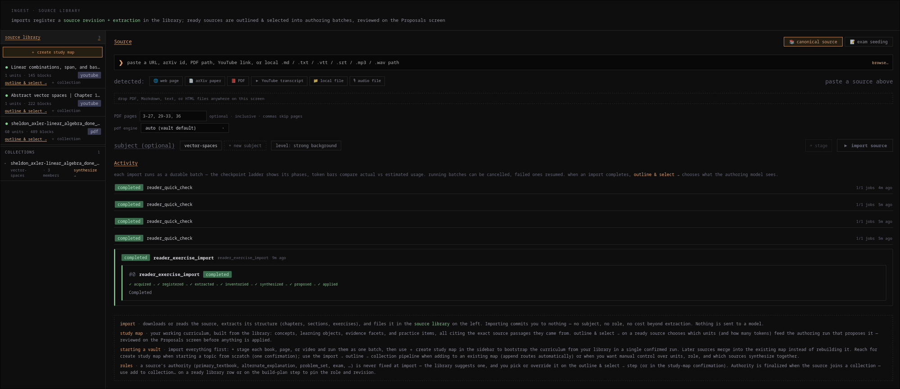
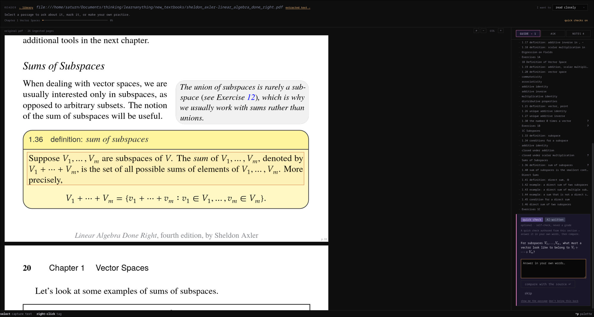
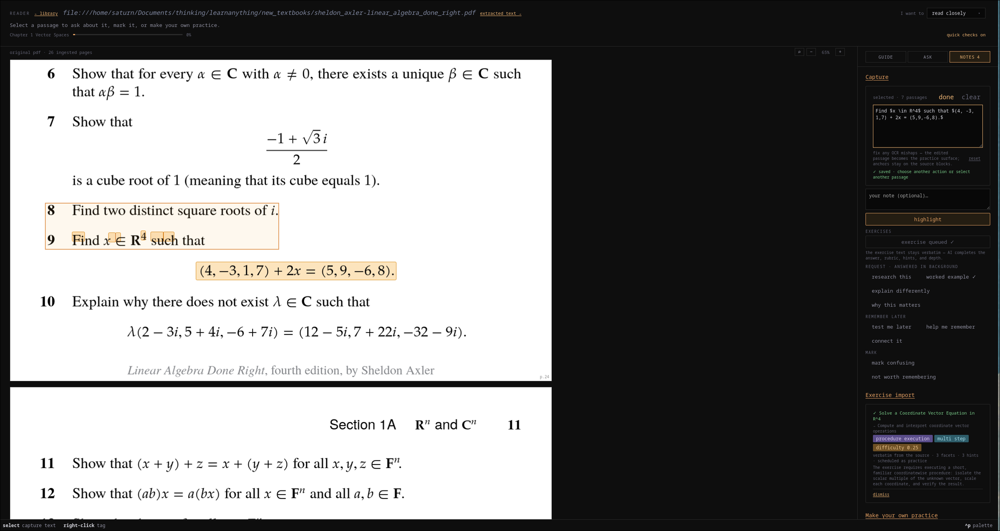
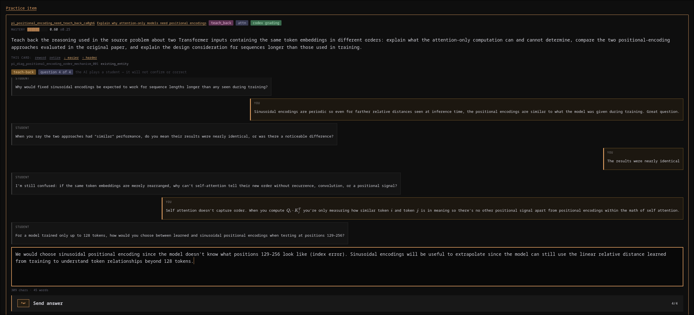
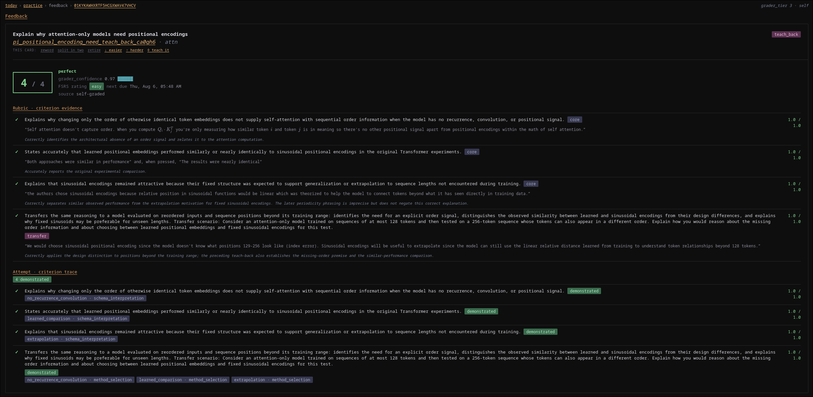
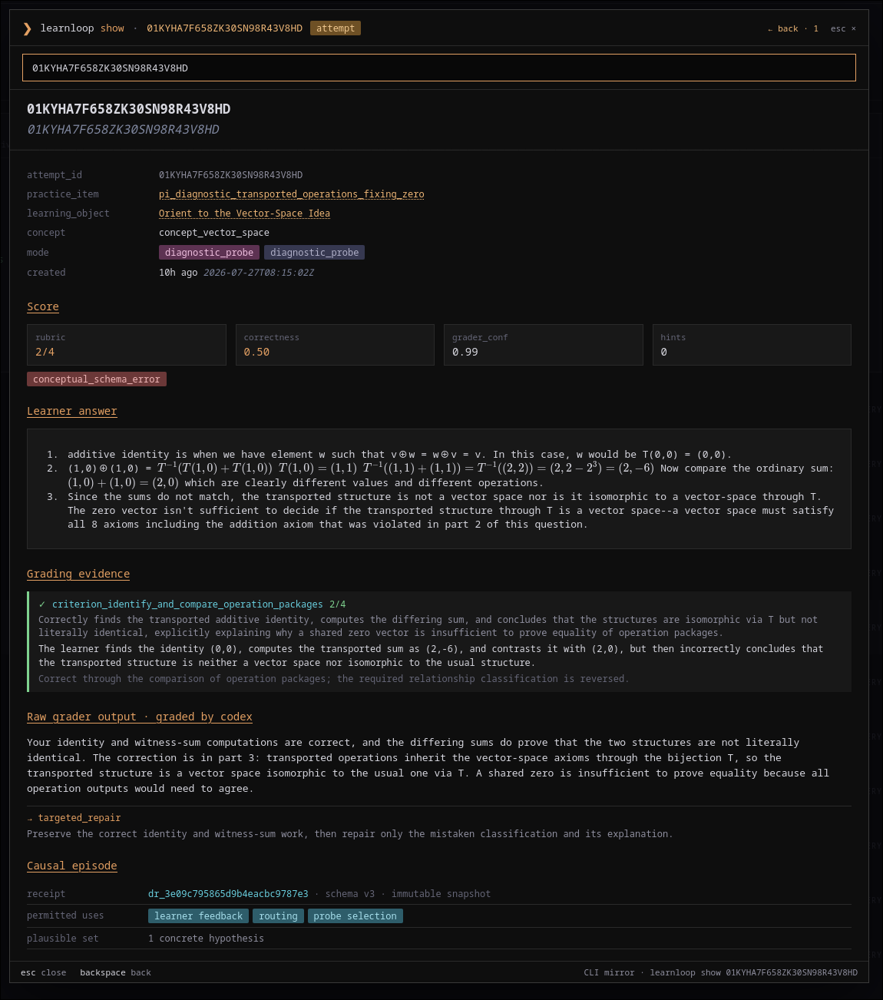
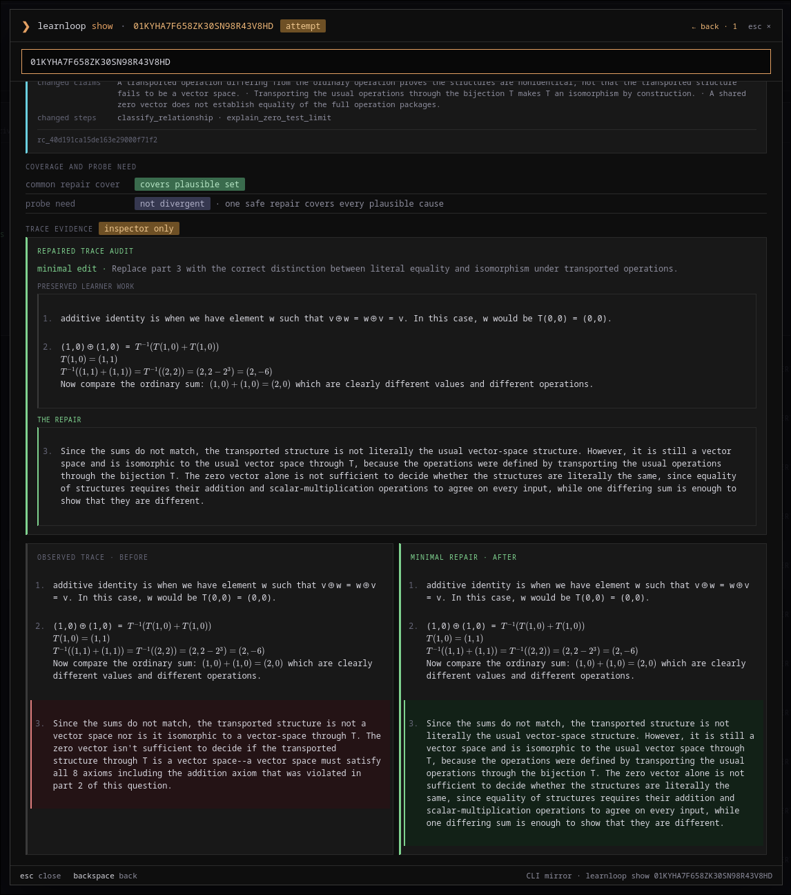
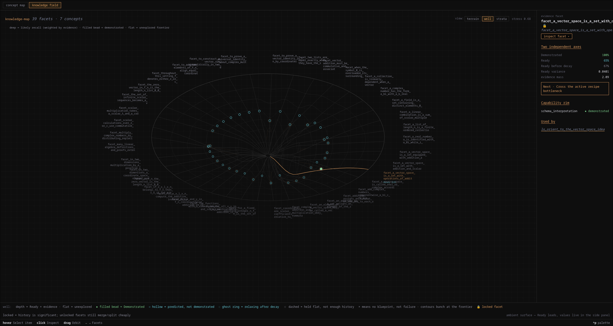

# LearnLoop

**A local-first learning system that turns trusted sources into adaptive practice.**

LearnLoop builds an inspectable model of what you are learning, what you
have demonstrated, what is becoming forgettable, and what to practice next. It
combines FSRS scheduling, learner-aware misconception detection and remediation, and AI-assisted authoring and feedback.

> [!NOTE]
> LearnLoop is under active development. The desktop app currently runs from a
> source checkout, and installer bundling is not yet enabled.
>
> **Implementation snapshot: trying out EVSI to see if it helps cold retrieval


## A look at it

From fixture linear-algebra vault, reading *Linear Algebra
Done Right* by Sheldon Axler.

### 1. Ingest anything you actually trust



One screen for the whole import path. A source can be a textbook PDF, a YouTube
lecture used as an alternate explanation, a problem set, audio lecture or a past exam — the
role you assign decides how it is allowed to influence authoring, so a mock exam
can steer which practice items get written without ever becoming the primary
explanation. Importing commits you to nothing: it downloads, extracts structure,
and files the revision in the library, and nothing is sent to a model until you
outline and select units for a study map. Then, you can have practice items authored as you go through your canonical source.

### 2. Read the source, with checks anchored to the passage



The embedded Reader runs over the original PDF bytes. As you read, optional
quick checks are authored from the section in front of you and stay anchored to
the exact span they came from — answer in your own words, then compare with the
source. These are based on Andy Matuschak's ideas of a mneomic medium

### 3. Turn a textbook exercise into a real practice item



Select an exercise, and it becomes a practice item whose stem is from
the source. The model fills in the answer, rubric, hints, and depth; the item
lands scheduled, tagged with its facets and difficulty, and carries the source
span with it.

### 4. The best way to learn is to teach



Teach a deliberately naive student in your own words. It asks probing questions
about the parts your earlier work showed you were shaky on, making you expose
assumptions, connect steps, and close gaps instead of merely reciting a polished
answer. The student also asks a transfer question: apply the idea to a novel edge
case, changed assumption, or new context. That final turn tests whether the
knowledge is flexible enough to use, not just familiar enough to repeat.



The whole dialogue is graded against the item's rubric. The results show which
criteria were demonstrated and quote the relevant evidence, including the
answer to the transfer question.

### 5. Grading that shows its evidence



Every attempt is inspectable, in the app or via `learnloop show <attempt-id>`.
The score is broken out per rubric criterion with the quoted evidence behind it,
alongside the raw grader output and the causal episode's receipt.

### 6. The minimal repair



LearnLoop looks for the smallest edit that fixes the attempt. Here the identity
and witness sum work was right and is preserved; only the mistaken
classification in step 3 is rewritten. Because one safe repair covers every
plausible cause, the diagnosis is not divergent and no follow-up probe is
needed. when it *is* divergent, that is what commissions a follow-up probe.

### 7. The jagged boundary of what you know



The knowledge field plots evidence facets by depth (readiness weighted by
evidence) rather than by a single mastery score. Filled beads are demonstrated;
hollow ones are predicted but not demonstrated; flat regions are frontier you
have not touched. 

## What LearnLoop does

- Imports webpages, arXiv papers, PDFs, YouTube transcripts, caption files
  (`.vtt`/`.srt`), and local text/Markdown files into a versioned source
  library with immutable revisions and content-addressed extraction.
- Extracts source structure before synthesis so you can inspect scope, page
  health, and estimated model usage — and pay only for the chapters you select.
- Builds reviewable study maps containing concepts, canonical facets, learning
  objects with performance blueprints and recipes, rubrics, and practice items.
  Generated changes stay in proposals or maintenance queues when human review
  is needed.
- Lets you read the source in-app: an embedded Reader (including a real PDF
  reader over the original bytes) with annotations, span-grounded tutor
  questions, owner-placed reading questions, and optional as-you-read practice
  generation.
- Schedules ordinary review, repair, transfer practice, teach-back, and bounded
  diagnostic probes from one Today queue — and explains, term by term, why an
  item was selected.
- Measures what its own question pool can and cannot observe. Every learning
  object declares `(facet, capability)` contract cells; a standing reachability
  check reports which cells no instrument can close, and generation authors at
  the capability the contract names instead of at the learner's mastery band.
- Prices inference before enabling it: a static counterfactual reports how many
  currently unreachable cells B1 capability dominance and B3 prerequisite
  entailment would convert. Untyped/instructional prerequisite edges confer
  nothing, and path-specific candidates stay conditional until their path is
  actually exercised.
- Authors several instrument classes rather than one: conjunctive capstones that
  close multiple cells at once, contrast pairs that isolate a single differing
  component, error hunts seeded from your own misconception registry, laddered
  stems, and discrimination profiles. Each ships with the metric that would
  justify reverting it.
- Asks *you* one bounded clarifying question when the grader is genuinely
  unsure, and rewards an optional one-line "why this approach" without ever
  requiring it. An unanswered question times out to the original honest
  abstention, never to a guess.
- Tracks item memory, predicted ability, demonstrated evidence, errors, claims,
  forecasts, goals, and exam readiness without collapsing them into a single
  score. Prediction is never presented as certification, and every displayed
  facet state is labelled `measured` / `inferred` / `claimed` / `unknown`.
- Diagnoses *causes*, not just scores: repair receipts with permitted uses,
  deterministic verification of a proposed repair, adjudicated verdicts that can
  promote or withdraw a belief, and a learner-visible correction when something
  it told you turns out to be wrong.
- Re-tests certified work cold, two to three weeks later, on a held-out surface —
  the one external validity check available in a single-learner vault.
- Grounds feedback and tutor answers in exact source spans and preserves
  provenance end to end. Raw attempts are retained so derived learning state
  can be deterministically replayed after algorithm changes.
- Supports learner authoring: write your own practice cards, promote useful
  tutor exchanges, request easier/harder variants of an item

The core loop is:

1. Add high quality source material.
2. Select the useful parts and build a study map.
3. Review proposed content and provenance.
4. Read the source in the Reader, learn through questions asked to you and you asking questions.
5. Start a time- and energy-bounded session.
6. Practice, receive feedback, and repair specific weaknesses.
7. Let new evidence update future scheduling, and return for cold retrieval.

For a step-by-step walkthrough, start with the
[quick start](documentation.md#quick-start) in the
[user and algorithm guide](documentation.md), which covers vault creation,
Quick Add versus deliberate ingestion, what the pipeline does mechanistically,
and the daily practice loop then drills into the learner model behind it.
Contributors can find the enforced package boundaries, persistence roles, and
compatibility policy in [ARCHITECTURE.md](ARCHITECTURE.md).

## Quick start: desktop app

### Prerequisites

- Python 3.12 or newer
- [uv](https://docs.astral.sh/uv/getting-started/installation/)
- Node.js and npm
- Rust and Cargo
- The [Tauri 2 platform prerequisites](https://v2.tauri.app/start/prerequisites/)
  for your operating system

On Debian or Ubuntu, Tauri currently requires:

```bash
sudo apt update
sudo apt install libwebkit2gtk-4.1-dev build-essential curl wget file \
  libxdo-dev libssl-dev libayatana-appindicator3-dev librsvg2-dev \
  gstreamer1.0-plugins-base gstreamer1.0-plugins-good gstreamer1.0-libav
```

On Arch Linux, install the matching GStreamer runtime plugins for embedded
audio and video playback:

```bash
sudo pacman -Syu --needed gst-plugins-base gst-plugins-good gst-libav
```

`gst-plugins-good` provides `autoaudiosink`, which WebKitGTK requires when the
Reader plays embedded video. If it is missing, the WebKit web process can exit
when playback starts. `gstreamer1.0-libav` / `gst-libav` provides the H.264
decoder that generated concept animations (mp4) need; without it the inspector
reports a decode error instead of playing the video.

### Run from a checkout

From the repository root:

```bash
uv sync --extra dev
cd apps/learnloop-tauri
npm install
npm run dev
```

`marker-pdf` is not required for canonical source ingestion. Webpages, YouTube
transcripts, Markdown, HTML, and text files do not use it, and text-based PDFs
fall back to the base `pypdf` dependency. Marker is an optional, heavier PDF
provider that preserves richer layout, tables, math, figures, and geometry (I would reccomend using marker when possible). It's enabled when
`[ingest.pdf].engine` is explicitly set to `"marker"`. Install it with:

```bash
uv sync --extra dev --extra pdf
```

The Tauri shell starts the Python `learnloop_sidecar` automatically. When the
tracked linear-algebra fixture is present, it is used as the development default.
Click the green vault path in the app header to select another vault, or use the
new-vault wizard on the Start screen to create and bootstrap one.

To open a particular vault immediately:

```bash
LEARNLOOP_VAULT=/absolute/path/to/my-vault npm run dev
```

On a development machine without the GPU capacity for local Marker, start the
Tauri app with the hosted Datalab Marker route explicitly enabled:

```bash
cd apps/learnloop-tauri
DATALAB_API_KEY='your-key' npm run dev:datalab
```

The API key is inherited by the Python sidecar for that process only; it is not
sent to the frontend or stored in the vault. `npm run dev` keeps the normal
local Marker/pypdf behavior. An explicit pypdf selection in the ingest screen
also continues to bypass Marker in either runtime.

PowerShell:

```powershell
$env:LEARNLOOP_VAULT = "C:\path\to\my-vault"
npm run dev
```

### Finding your way around

The app has ten navigation tabs:

| Tab | Purpose |
|---|---|
| Start | Session start (energy/time), new-vault wizard |
| Today | The practice queue, goal wizard, write-a-card |
| Graph | Concepts, LOs, evidence state, knowledge-map views (terrain / well / strata) |
| Ingest | Single-screen source import, study-map creation, exam seeding, activity feed |
| Proposals | Accept / reject / edit synthesized content |
| Registry | Canonical facet claims, warnings, error taxonomy |
| Library | Source and learner notes |
| Golden Path | Narrow end-to-end certifying runs over one task family |
| Reader | In-app reading with annotations and span-grounded Ask |
| Maintain | Source updates, conflicts, exam readiness |

Review and Repair open as overlays (palette `review`/`diff`, or from feedback)
rather than as tabs.

Useful shortcuts:

| Shortcut | Action |
|---|---|
| `Ctrl/Cmd+P` or `:` | Open the command palette |
| `Alt+1` … `Alt+9`, `Alt+0` | Switch among the ten tabs |
| `Esc` | Close the current overlay or return to the queue |
| `j` / `k` | Move through list-oriented screens |

The command palette accepts navigation commands as well as CLI-style queries
such as `today`, `review` (alias `diff`), `why <practice-item-id>`, `show <id>`,
`attempt <practice-item-id>`, `calibrate`, and `doctor`.

## Create a vault from the CLI

The desktop wizard is the easiest first run, but the Python CLI is useful for
automation and diagnostics:

```bash
uv run learnloop init ~/LearnLoop/my-vault
uv run learnloop add-subject linear-algebra "Linear Algebra" \
  --vault ~/LearnLoop/my-vault
uv run learnloop doctor --fix-state --vault ~/LearnLoop/my-vault
```

A fresh vault starts at `algorithm_version = "mvp-0.9"`. Then add a source and
inspect the queue:

```bash
uv run learnloop quick-add "https://example.com/source" \
  --subject linear-algebra \
  --vault ~/LearnLoop/my-vault
uv run learnloop today --vault ~/LearnLoop/my-vault
```

Quick Add collapses import → outline → unit selection → inventory → synthesis
into one confirmation. The deliberate step-by-step path (`import`,
`source-outline`, `source-set`, `source-coverage`, `build-plan`, `synthesize`)
runs the same machinery with you at each decision point — see the
[quick start](documentation.md#quick-start) for when to prefer which.

Run `uv run learnloop --help` for the complete command list, or append `--help`
to any subcommand. Most read-oriented commands also support stable JSON output
for tooling.

To inspect exactly what configuration LearnLoop will use, including defaults
and legacy-input normalization, run:

```bash
uv run learnloop config effective --vault ~/LearnLoop/my-vault
```

## Vaults and local data

A vault is a normal directory. Its durable source of truth is designed to remain
inspectable and portable:

```text
my-vault/
├── learnloop.toml       # algorithms, scheduling, ingestion, and AI routing
├── state.sqlite         # attempts, events, scheduling, jobs, and derived state
├── concepts/            # vault-wide concept and relation registries
├── subjects/            # study maps, notes, learning objects, and practice items
├── profile/             # goals and learner-owned state
├── errors/              # misconception and error taxonomy
├── canonical-sources/   # registered artifacts, revisions, extractions, and raw originals
└── facets.yaml          # canonical assessable claims
```

Markdown and YAML hold editable learning content. SQLite holds event history,
runtime state, indexes, and model projections. Raw attempts are retained so
derived state can be deterministically replayed and rebuilt
(`learnloop rebuild-derived-state`).

Before applying an algorithm or configuration change to live state, you can
rebuild a copied database and inspect its semantic diff:

```bash
uv run learnloop rebuild --shadow --json --vault ~/LearnLoop/my-vault
```

The shadow command does not mutate the live database.

Before moving, scripting, or directly editing a vault, close LearnLoop or ensure
no other process is writing to it. Run `doctor` after manual content changes.

## AI providers

The scheduler, replay system, source extraction plan, and vault storage are
local. AI-backed study-map synthesis, grading, tutor responses, and some
authoring flows require a configured provider. Ordinary practice can use the
desktop app's `manual` provider for self-grading; diagnostic observations, the
clarification channel, opportunistic trace evidence, and other workflows that
require an independent grader remain unavailable in manual mode.

Provider profiles and per-workflow routing live in the vault's `learnloop.toml`:

```toml
[ai]
active_provider = "codex"

[ai.routing]
grading = "codex_low"
canonical_ingest = "codex_medium"
authoring = "codex_medium"
tutor_qa = "codex_low"
teach_back = "codex_low"
```

Both derived Codex profiles use `gpt-5.6-sol`. Canonical ingestion and authoring
use medium reasoning; interactive grading, Tutor Ask, and teach-back use low.

Secrets and machine-specific values should not be committed to a vault. LearnLoop
loads them in this order:

1. Existing shell environment
2. `<vault>/.env`
3. `~/.config/learnloop/settings.env`

For the local Codex SDK provider, set the checkout path in the machine settings
file or shell:

```dotenv
LEARNLOOP_CODEX_CHECKOUT_PATH=/absolute/path/to/codex
```

OpenAI-compatible provider profiles use the `api_key_env` named in
`learnloop.toml`. Check provider and vault health with:

```bash
uv run learnloop doctor --ai --vault ~/LearnLoop/my-vault
```

The active grading provider can also be changed from the desktop app header.

## Measuring the measurement

A single-learner vault has no population to validate against, so LearnLoop
carries its own instrumentation and is required to abstain rather than report a
number it cannot support. Every command below is read-only unless noted.

```bash
# What can this vault's question pool actually observe?
uv run learnloop contract-reachability --vault ~/LearnLoop/my-vault
uv run learnloop contract-hit-rate --since 2026-07-01 --vault ~/LearnLoop/my-vault

# What would inference buy, before any inference rule is built? Read-only
# counterfactual: writes nothing, applies no inferred credit.
uv run learnloop inference-precheck --vault ~/LearnLoop/my-vault

# Before enabling inference, how many unreachable cells would each rule move?
uv run learnloop inference-precheck --vault ~/LearnLoop/my-vault

# The 15-metric scoreboard: harmful writes, problems-to-cold-success,
# questions-to-certification, regret, cells cleared per question, tokens per
# resolved diagnostic episode, measurement rank.
uv run learnloop scoreboard --vault ~/LearnLoop/my-vault

# Per-instrument-class revert criteria (all four abstain as no_data with
# counts visible rather than reporting a fake 0.0 or 1.0).
uv run learnloop instrument-audit --vault ~/LearnLoop/my-vault

# Cold re-test of certified work on a held-out surface, +2–3 weeks.
uv run learnloop cold-probe-schedule --vault ~/LearnLoop/my-vault
uv run learnloop cold-probe-audit --vault ~/LearnLoop/my-vault

# Causal lane: abstention rate, missing-vocabulary notes, probe commissioning.
uv run learnloop causal-attribution-audit --vault ~/LearnLoop/my-vault
uv run learnloop commission-causal-probes --vault ~/LearnLoop/my-vault
uv run learnloop review-causal-probe --vault ~/LearnLoop/my-vault

# Authoring gates (read-only re-judgements of what already shipped) and the
# contrast-pair commissioning queue (derives authoring requests, writes nothing).
uv run learnloop facet-mint-gate --vault ~/LearnLoop/my-vault
uv run learnloop persona-gate-precision --vault ~/LearnLoop/my-vault
uv run learnloop commission-contrast-pairs --vault ~/LearnLoop/my-vault

# The one vault-content edit here — diff-only unless --apply.
uv run learnloop integration-backfill --vault ~/LearnLoop/my-vault
```

Four things are worth knowing before you read any of this output:

- **A metric that cannot be computed says so.** There are four distinct
  unavailable states — `no_data`, `no_producer`, `unmeasured`, `requires_replay`
  — because each implies a different remedy. There is no code path from an empty
  denominator to a number.
- **A displayed facet state is labelled.** `measured > inferred > claimed >
  unknown`, and ignorance is not inference: a 0.5 default with nothing to pool
  from reports `unknown`, never `inferred`.
- **A cell whose credit is entirely embedded reads as zero certification
  credit**, not as zero evidence. One capstone can supply evidence for several
  cells, but at most half of any cell's certification credit may come from
  supporting-role observations.
- **When displayed numbers move without new evidence** — a coverage denominator
  change, a projection version bump — the vault records exactly one
  recalibration entry saying so, rather than letting the estimate drift under
  you silently.

`documentation.md` sections 8–14 and 21–23 explain the model behind all of it.

## Architecture

```text
React + TypeScript + Vite
          │ Tauri invoke
          ▼
Rust desktop shell and command layer
          │ JSON-RPC over stdio   (+ llpdf:// protocol for original PDF bytes)
          ▼
Python learnloop_sidecar
          │
          ├── Markdown / YAML vault content
          ├── SQLite events and derived state
          └── configured AI provider (optional, workflow-dependent)
```

| Path | Purpose |
|---|---|
| `apps/learnloop-tauri/` | React/Tauri desktop application |
| `src/learnloop/` | Domain packages, infrastructure, scheduling, ingestion, and CLI |
| `src/learnloop_sidecar/` | JSON-RPC bridge used by the desktop app |
| `migrations/` | Ordered SQLite schema migrations |
| `tests/` | Unit, integration, replay, calibration, and CLI tests |
| `fixtures/linear_algebra/` | Development vault with real example content |

The Rust shell finds the sidecar in this order: `LEARNLOOP_PYTHON`, the active
environment (`VIRTUAL_ENV`/`CONDA_PREFIX`, so an activated conda/venv is used),
the repository `.venv`, then `uv`/the platform Python executable. Use
`LEARNLOOP_SIDECAR_TIMEOUT_SECS` to override the default 240-second desktop RPC
timeout when debugging unusually long model calls.

## Development

Everything Python goes through `uv` — there is no expectation that a virtualenv
is activated, and `uv run` is what the Tauri shell falls back to when locating
the sidecar.

```bash
uv sync --extra dev                    # install
uv run pytest                          # full suite (~10 minutes)
uv run pytest tests/test_scheduler.py::test_name -x   # one test
uv run learnloop --help                # CLI
uv run python -m learnloop_sidecar     # sidecar directly, JSON-RPC over stdio
```

Schema changes are ordered SQL files in `migrations/`. Numbering has gaps and
parallel worktrees have collided over it, so check `ls migrations/` for the next
free number rather than assuming.

Check the desktop layers:

```bash
cd apps/learnloop-tauri
npm run typecheck
npm run frontend:build
cargo check --manifest-path src-tauri/Cargo.toml
```

Build the desktop executable with:

```bash
npm run build
```

Frontend assets are written to `apps/learnloop-tauri/dist/`; Rust build output
is written below `apps/learnloop-tauri/src-tauri/target/`. Tauri installer
bundling is currently disabled in `tauri.conf.json`.

For sidecar diagnostics, set `LEARNLOOP_SIDECAR_LOG_LEVEL=DEBUG` (or
`LEARNLOOP_SIDECAR_DEBUG=1`). Use `LEARNLOOP_SIDECAR_DEBUG_LOG` to send logs to a
specific file.

To enable the desktop webview's native zoom hotkeys for debugging, launch the
Tauri app with `LEARNLOOP_TAURI_DEBUG_ZOOM=1`. Use `Ctrl+=`, `Ctrl+-`, and
`Ctrl+0` to zoom in, zoom out, and reset the zoom level.

## Further reading

- [User and algorithm guide](documentation.md) — quick start, first-use
  journey, learner model, and operational details for current behavior
- [Product definition](product_definition.md) — product goals and design thesis
- [Historical MVP specification](spec.md) — original data model and algorithm
  contracts; retained for archaeology, not current package/API guidance
- [Architecture pivot](architecture_pivot.md) — longer-term strategy for learned
  models and search
- [Changelog](CHANGELOG.md) — notable implementation milestones
