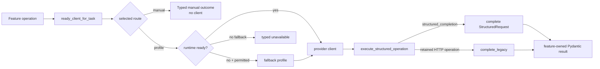

# AI Architecture

AI is an optional bounded capability. Domains own the meaning of an operation; `learnloop.ai` owns selection, readiness, transport, strict wire parsing, token usage, and run provenance.

## Resolution path



`ResolvedClient` preserves requested selection, actual provider, fallback source, runtime report, and the first-class `manual` outcome. Named profiles such as `codex_low` remain in provenance even when profiles share a provider type.

^resolution-path

## Task routes

Configuration chooses providers for semantic tasks: grading, canonical ingest (and retry), authoring, tutor QA, teach-back, rung variants, animation, and transcription. `ROUTE_FOR_OPERATION` assigns every structured feature operation to one of those routes. Callers do not infer routing from a method name or instantiate providers locally.

The complete owner/route ledger is [[AI Operation Registry]].

The transcription route deliberately preserves an independently selected model and audio-specific consent. It does not silently fall back to a text provider.

## Feature-owned operations

Each operation owns three things in its feature package:

1. context/input model;
2. prompt builder and prompt version;
3. result/wire model.

For example, grading contracts live in `learnloop.attempts.ai_contracts`, source synthesis contracts in `learnloop.content.synthesis.ai_contracts`, and probe contracts in `learnloop.diagnosis.ai_contracts`. `ai.schemas` contains only shared wire machinery and genuinely cross-operation primitives.

```python
return execute_structured_operation(
    client,
    purpose="grading",
    prompt=grading_prompt(context),
    result_model=GradingProposal,
    legacy_capability="grading",
    legacy_context=context,
)
```

This shape means operation 24 does not require editing every provider class.

## Transport contract

- `OperationClient` exposes provider identity and `supports(capability)`.
- `StructuredTransport.complete(StructuredRequest)` is the only common structured completion method.
- Optional media transcription, media-to-Markdown, and interruption are explicit capabilities.
- The retained HTTP adapter is intentionally narrower: it supports exactly eight legacy endpoint operations through generic `complete_legacy`, and rejects all others before egress.
- Strict-schema helpers extract and validate model output without giving providers feature semantics.

## Provider implementations

| Type | Role |
|---|---|
| `codex_sdk` | Codex SDK structured completion; default profile type when omitted |
| `http` | retained endpoint adapter with exact declared legacy capabilities |
| `openai_chat` | OpenAI-compatible chat structured completion and optional media |
| `openrouter` | OpenRouter profile/client path, including explicit transcription configuration |

Legacy `http_adapter` is accepted as an input spelling and normalized to `http`; dead auth-mode keys are accepted and ignored. See [[Config - ai]].

## Output trust boundary

Provider output is not application state. The transport validates the declared Pydantic wire model; the owning domain then performs semantic validation, normalization, policy gating, and persistence. Grading additionally validates evidence anchors, criterion totals, fatal errors, coverage, and error vocabulary before [[Attempt Processing]] can write an attempt.

^output-trust-boundary

## Failure and manual behavior

`AIProviderUnavailable` is provider-neutral. Invalid structured output belongs to the same unavailable family where legacy callers require fallback. Manual resolution returns no client rather than a fake provider; workflows retain their existing manual/self-grade semantics. Core storage, scheduling, replay, doctor, and manual practice remain usable with AI disabled.

## Provenance and usage

`agent_runs` receipts record purpose, provider name/type, model, prompt version/context identity, status, and token usage. Named profile identity must survive construction so cost/performance comparisons remain meaningful. See [[Process Model Output]] and [[agent_runs]].

## Modification guidance

- **New operation:** define contract/prompt/result in the owning domain, map it to a semantic route, add the 23-operation parity table row, and add domain validation tests.
- **New structured provider:** implement `complete`, identity, usage, and capabilities; do not add feature methods.
- **New optional media ability:** add a capability constant and explicit branch; do not use `getattr` probing.
- **New configuration type:** add a discriminated profile schema and factory; preserve one-way legacy normalization.
- **New fallback:** change only the composition root and expand the six-path matrix.

## Tests

- `tests/test_structured_transport_parity.py` — all feature operations through SDK/chat, zero feature methods, exact-eight HTTP support.
- `tests/test_provider_resolution_parity.py` — profile/manual/fallback behavior through six production entry paths.
- `tests/test_ai_config.py` and `tests/test_config_refactor.py` — profile normalization and defaults.
- provider client suites — strict schema, usage, media, and endpoint behavior.
