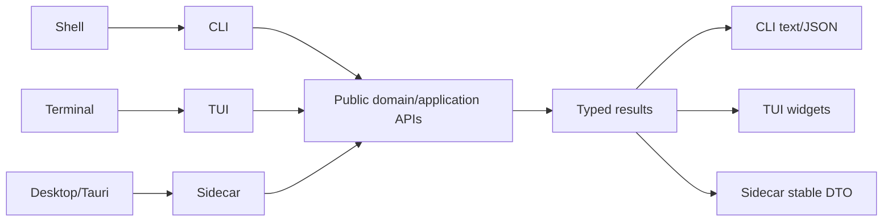

# Adapter Architecture

LearnLoop has three Python adapters over the same public application/domain APIs. The Tauri desktop is a typed client/native shell over the sidecar rather than a fourth Python policy implementation.

| Adapter | Interface | Owns |
|---|---|---|
| `learnloop.cli` | Typer commands and JSON output | shell parsing, rendering, exit codes, help surface |
| `learnloop.tui` | Textual application | terminal UI state/screens/interactions |
| `learnloop_sidecar` | JSON-RPC-style desktop bridge | DTO serialization, handlers, transport/server lifecycle |
| `apps/learnloop-tauri` | React UI + Tauri native shell | desktop presentation, native capabilities, typed RPC client/process bridge |

Adapters do not own learning, provider, or persistence policy and never import one another. The CLI `today` command reaches the TUI through neutral `learnloop.app_launch`, so the dependency remains truthful.

## Request flow

The same typed result may be rendered differently. Serializer snapshots pin the sidecar's externally visible shape; help snapshots pin every CLI root/group/command surface.

The desktop's React → TypeScript client → Rust command → Python sidecar bridge, watcher, concurrency boundary, and per-file catalog are documented in [[Desktop Architecture]].

## CLI structure

The former 8,000-line `cli.py` is a package split by command family. `cli.app` composes Typer commands; focused modules own rendering and domain-specific command groups. Compatibility hooks remain at the package boundary for test/consumer stability, but new behavior should call public domain APIs.

## Sidecar structure

`context.py` holds the loaded application context; `registry.py` maps methods; `handlers/` translates protocol payloads; `dto.py` and serializers define stable output. Durable ingest jobs now live in `content.pipeline.jobs`; the sidecar hosts them rather than owning them.

## Extension guidance

- Add domain behavior first, then the smallest adapter translation.
- Keep DTO/rendering types in the adapter; keep semantic types in domains.
- Add/refresh exact CLI help or sidecar JSON snapshots for public changes.
- Do not share private adapter helpers; promote neutral/public behavior instead.
- Resolve providers through the composition root even for diagnostics.

## Tests

- `tests/test_cli_help_snapshot.py` — 168 recursive help surfaces.
- `tests/test_cli_json.py` and command-family tests.
- `tests/test_sidecar_contract.py` and handler suites.
- `tests/test_sidecar_serializer_snapshot.py` — queue/practice/reader golden JSON.
- `tests/test_desktop_rpc_contract.py` — frontend/Rust/sidecar registration continuity.
- `tests/test_architecture.py` / import-linter — adapter independence and public imports.
