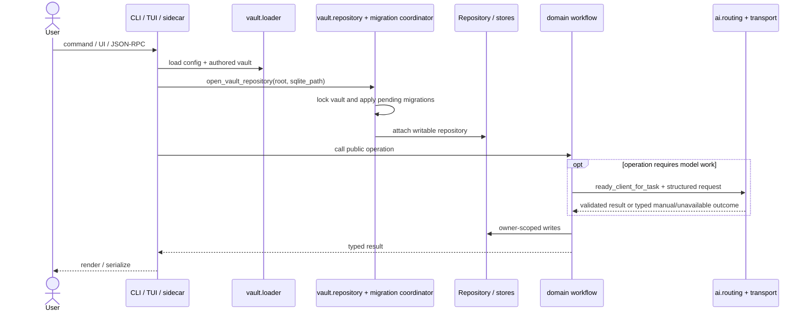

# Architecture Overview

LearnLoop is a local-first learning application built around explicit authorities:

1. Markdown/YAML and immutable source revisions describe what may be learned.
2. SQLite ledgers record what was presented, answered, graded, revealed, or decided.
3. Versioned algorithms project those observations into learner and scheduling state.
4. A deterministic controller chooses the next eligible action.
5. Optional AI performs bounded structured operations; it does not own persistence or policy.

The intent of the algorithm is owned by [[Learning System]]. This note owns the software shape.

## Runtime composition

The adapter coordinates but does not reimplement domain rules. Provider mechanics cannot write learner state; the domain validates output and decides which persistence calls are legal.

^runtime-composition

## Architectural layers

| Layer | Packages | Responsibility |
|---|---|---|
| primitives | `clock`, `ids`, `numeric`, `attempt_types` | stable dependency-free vocabulary |
| infrastructure | `config`, `vault`, `db`, `ingest`, `ai` | I/O, storage, migration, extraction, provider mechanics |
| domains | `attempts`, `learner`, `scheduling`, `goals`, `diagnosis`, `curriculum`, `substrate`, `content`, `reader`, `tutor`, `ops`, `params` | learning behavior and policy |
| evaluation | `sim` | policy measurement, simulation, sensitivity |
| adapters | `cli`, `tui`, `learnloop_sidecar` | translate user/protocol input to public APIs |
| application coordinators | `bootstrap`, `app_launch`, `migration_coordinator` | composition that legitimately spans infrastructure boundaries |

See [[Package Boundaries]] for enforced direction and [[Module Catalog]] for exact files.

## Domain ownership

- **Attempts** owns grading acceptance, immutable attempt records, evidence, correction, and post-attempt sequencing.
- **Learner** owns interpretable learner-state views, mastery calibration, claims, capability/facet evidence, and measurement labels.
- **Scheduling** owns eligibility, constraints, FSRS memory, controller intent, expected value, and next-action selection.
- **Goals** owns scope, forecasts, exams, held-out certification, and cold checks.
- **Diagnosis** owns hypotheses, probes, causal attribution, error taxonomy, and remediation.
- **Curriculum** owns concepts, commitments, depth, blueprints, pattern ladders, and golden paths.
- **Substrate** owns activity/card/surface identity, canonical projection, replay, and compatibility seams.
- **Content** owns sources, inventory, synthesis, proposals, authoring, and the durable pipeline.
- **Reader/Tutor** own source-grounded interaction workflows rather than generic AI chat.
- **Ops/Params** own maintenance and governed parameters respectively.

## Architectural goals

The refactor optimizes for four properties:

1. **Change locality:** a new grading contract is changed in `attempts`, not in every provider.
2. **Historical interpretability:** raw evidence remains immutable and algorithm versions make projection meaning explicit.
3. **Optional external intelligence:** manual/local workflows work without an AI provider.
4. **Executable boundaries:** import contracts, SQL-owner scans, parity matrices, snapshots, and rebuild oracles reject drift.

See [[Design Decision Index]] for alternatives and consequences.

## Current refactor status

The old generic `services/`, provider-specific `codex/`, monolithic `cli.py`, and monolithic `config.py` structures have been removed. `Repository` remains a compatibility facade while store extraction proceeds incrementally; new write ownership cannot expand the monolith. Frozen cross-domain cycles remain as a ratcheted inventory rather than being hidden.

> [!important] Supported versus ideal
> “Current” means executable and tested, not that every internal dependency is ideal. The frozen cycle list and compatibility facade are explicit technical debt with no permission to grow.

## Modification guidance

- Begin with [[Developer Map]].
- Add behavior to the owning domain, exposing a public API to adapters.
- Add storage through one registered owner and classify any new table.
- Add AI operations to a feature `ai_contracts.py`, then extend the parity table.
- If persisted meaning changes, follow [[Algorithm Versions and Reproducibility#Change protocol]].

## Behavioral oracles

- `tests/test_architecture.py`
- `tests/test_provider_resolution_parity.py`
- `tests/test_structured_transport_parity.py`
- `tests/test_attempt_write_order.py`
- `tests/test_rebuild_orchestrator.py`
- `tests/test_cli_help_snapshot.py`
- `tests/test_sidecar_serializer_snapshot.py`

