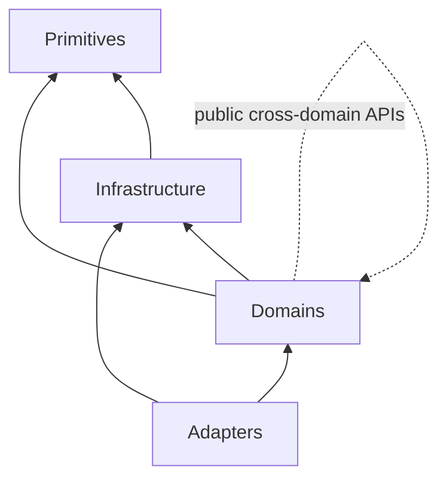

# Package Boundaries

## Enforced dependency rules

1. Primitives import no LearnLoop internals.
2. Infrastructure may depend on primitives and lower infrastructure; it cannot import domains.
3. Domains may depend on infrastructure, primitives, and public names of other domains.
4. Cross-package underscore-prefixed imports are forbidden.
5. CLI, TUI, and sidecar may call public infrastructure/domain APIs but never import one another.
6. Function-local cross-domain edges are an exact frozen inventory; new edges fail CI.
7. Raw SQL writes live only in registered owner modules, including f-string SQL.

^dependency-rules

No downward arrow is reversible. Domain-to-domain edges are permitted because learning behavior is interconnected, but private imports and newly hidden lazy edges are not.

## Why function-local imports are tracked

Python lazy imports can hide cycles from a superficial module graph. `tests/architecture_function_local_domain_imports.txt` records only edges that survived the refactor; `tests/test_architecture.py` parses function bodies and rejects additions. The import-linter separately freezes the cycle-forming subset.

> [!warning] Do not “fix” a cycle by moving an import into a function
> That changes import timing without changing ownership. Prefer a neutral contract, dependency injection, or a public orchestration layer.

## Public versus private

An underscore name is package-private even if Python technically permits importing it. Promote a stable public function/type in the owner package if another domain needs it. Adapter serialization helpers are likewise public contracts when shared; one adapter never reaches into another adapter's helpers.

## Persistence ownership is an architecture boundary

The SQL-owner detector recognizes constant strings and f-strings. A domain may call a store/facade method; it may not become a second write owner for the same table. Owner-gated SQLite administration is an explicit power hatch, not a precedent for application writes. See [[State and Persistence#Write ownership]].

## Runtime references count

Dynamic module strings and registries are executable dependencies. The architecture tests import every runtime module and resolve constructed module names so a move cannot silently degrade to “no producer.”

## Extension guidance

| Need | Preferred technique |
|---|---|
| share a value across infrastructure/domain | dependency-neutral primitive/authority module |
| orchestrate multiple domains | explicit public application/domain coordinator |
| avoid heavy optional import | lazy import only if already allowed and architecturally honest |
| share a type between features | place it at the lowest genuinely shared boundary |
| expose adapter behavior | public domain operation + adapter-specific rendering |
| store a new record | one store owner + table role + migration + tests |

## Tests

- `tests/test_architecture.py` — synthetic negative tests plus live tree scans.
- `pyproject.toml` import-linter contracts — six dependency contracts.
- `tests/test_init.py` — package import/entry-point behavior.
- `tests/test_provider_resolution_parity.py` — six production adapter resolution paths.

