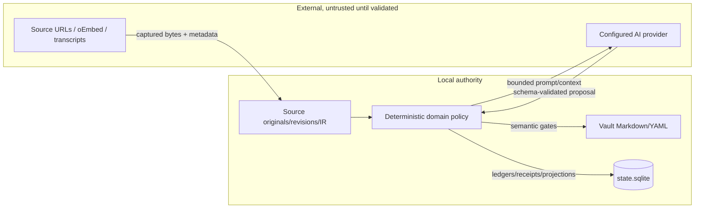

# Privacy and Trust Boundaries

LearnLoop is local-first, not “never networked.” Vault state and source artifacts are stored locally; network egress occurs only through an acquisition or configured provider path that the workflow makes visible.

## Trust zones

External output crosses two boundaries: transport/schema validation and feature semantic validation. It never writes canonical content or learner state directly.

## Source acquisition egress

Local files are read locally. URLs, websites, arXiv, YouTube transcripts/metadata, and other remote sources require network fetches. Acquisition captures immutable bytes/revision identity before later synthesis. PDF extraction is local; optional Marker may load local model resources. Audio transcription follows its separately configured provider and consent policy.

## AI egress

Every feature resolves a named route through [[AI Architecture#Resolution path]]. The operation builds a bounded context rather than handing a provider the whole vault. Provider/profile/model identity and token usage are recorded in run provenance. Manual mode sends nothing.

## Secrets and machine-specific values

API keys are referenced by environment-variable names, not stored as plaintext vault values. Machine paths and global defaults belong in environment/global settings layers described by [[Environment and Machine Settings]]. A vault may inherit AI settings when first created, but existing vaults are not overwritten.

## Diagnostics

Plain doctor is physically database-read-only and does not probe providers. A provider diagnostic happens only when explicitly requested by an AI workflow. This keeps “inspect my vault” from becoming an unexpected mutation or egress event.

## Instruction and evidence trust

Reader/tutor output may reveal source content and therefore records familiarity/exposure; it cannot become ability evidence merely because a model supplied it. Assessment output is treated as a proposal and checked against the frozen contract. See [[Evidence and Measurement]] and [[Reader Tutor and Teach-Back]].

## Modification guidance

- Document every new egress path, required consent, payload scope, retry, and provenance.
- Keep secrets out of TOML/Markdown examples; reference environment variables.
- Make offline/manual behavior explicit.
- Add a no-egress test for unsupported capability/fallback cases.
- Never add a provider call to plain doctor or a read-only data inspection path.

