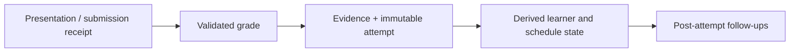

# State and Persistence

LearnLoop separates authored authority, historical evidence, mutable workflow state, and reproducible projections. SQLite is not “the source of truth” as one undifferentiated whole; every table has an explicit lifecycle role.

## State surfaces

- `learnloop.toml` — configuration and algorithm/provider selection.
- Markdown/YAML — authored subjects, concepts, learning objects, items, goals, rubrics, and user-facing records.
- source artifact directories — captured originals, immutable revisions, and extracted IR.
- `state.sqlite` — observations, receipts, projections, queues, sessions, and compatibility state.

See [[Data and State Map#^authority-map]] and [[Vault Lifecycle]].

## Table roles

`learnloop.db.table_roles.TABLE_ROLES` exactly matches the 251 migration-head user tables. Classification is explicit rather than inferred from a suffix:

| Role | Policy |
|---|---|
| RAW_LEDGER | authoritative input; never cleared by rebuild |
| DERIVED | clearable and exactly reconstructed by one replayer |
| RECEIPT | append-only decision/audit history |
| WORKFLOW | mutable queue/session/lease state preserved across replay |
| COMPAT | frozen historical seam |

Only ten tables are currently `DERIVED`; every one has a real clear-and-replay source. Captured calibration, reviewed rows, debug evidence, and mixed-authority tables remain raw rather than pretending preservation is a rebuild.

## Write ownership

Every writable family has one SQL owner. Stores such as `db/stores/ingest_queue.py` own their table-family SQL; `Repository` composes extracted store mixins while retaining a compatibility facade for the remaining API. Cross-family read models are allowed and named, but a second write owner is not.

`tests/test_architecture.py` recognizes literal and f-string SQL and rejects unregistered writers. SQLite admin is a deliberate owner-gated power hatch, not application ownership.

^write-ownership

## Open modes and migrations

Application entry points call `open_vault_repository(vault_root, sqlite_path)`. The factory:

1. takes the vault mutation lock;
2. applies pending migrations to the configured, possibly relocatable database path;
3. attaches a writable repository without remigrating.

Plain doctor uses an explicit read-only attachment and does not create directories, migrate schemas, or write pragmas. `Repository.attach(path, read_only=True|False)` separates migration from access mode.

Incremental migrations execute complete statements inside `BEGIN IMMEDIATE` with the schema receipt in the same transaction. Foreign-key-rebuild scripts disable enforcement before the transaction, run `foreign_key_check` before commit, roll back body plus receipt on failure/interruption, and restore enforcement in `finally`. Fresh databases are built under a temporary path and atomically renamed.

## Attempt write order

The canonical lifecycle is:

The exact order is instrumented by `tests/test_attempt_write_order.py`. Post-attempt work may schedule cold probes, persist feedback metadata, or mint intervention needs, but cannot precede accepted evidence.

^attempt-write-order

## Replay and rebuild

The umbrella rebuild validates that every `DERIVED` table has exactly one owner, orders owners by dependencies, accounts for every raw attempt, clears each owned family, reconstructs it, and appends one rebuild receipt. Current true projection families are learning state, canonical projection, and identifiability; activity substrate backfill is a prerequisite but owns no derived table.

The golden oracle plants stale rows in every derived family, freezes the clock, rebuilds once, and compares every column to the expected projection. A second run proves idempotence.

## Shadow rebuild

Shadow rebuild attaches the live DB read-only, computes a baseline snapshot, validates dotted configuration overrides, copies SQLite into a temporary database, rebuilds the copy, and returns semantic mastery/facet/schedule differences. A before/after SHA-256 assertion guarantees the live file did not change even if candidate validation fails.

> [!important] Evaluation boundary
> Use shadow rebuild before changing algorithm defaults. A green replay only proves reproducibility; a useful candidate also needs acceptable learning/scheduling deltas and simulation metrics.

## Modification guidance

- Add a table through a migration and classify it in `table_roles.py` in the same change.
- If `DERIVED`, register exactly one clearing replayer and extend golden equivalence.
- If raw/receipt, never mutate history to “fix” semantics; append a correction or reinterpretation event.
- Add SQL to the existing family owner or extract a new store; do not expand `repositories.py` ownership accidentally.
- Open databases through application factories; use `attach` only when migration/access policy is explicit.
- Follow [[Algorithm Versions and Reproducibility]] for persisted semantic changes.

## References and tests

- [[Database Catalog]] and [[Inspect Persistent State]]
- `tests/test_table_roles.py`
- `tests/test_persistence_open.py`
- `tests/test_migration_coordinator.py`
- `tests/test_migrations.py`
- `tests/test_rebuild_orchestrator.py`
- `tests/test_shadow_rebuild.py`
- `tests/test_ingest_queue_store.py`

