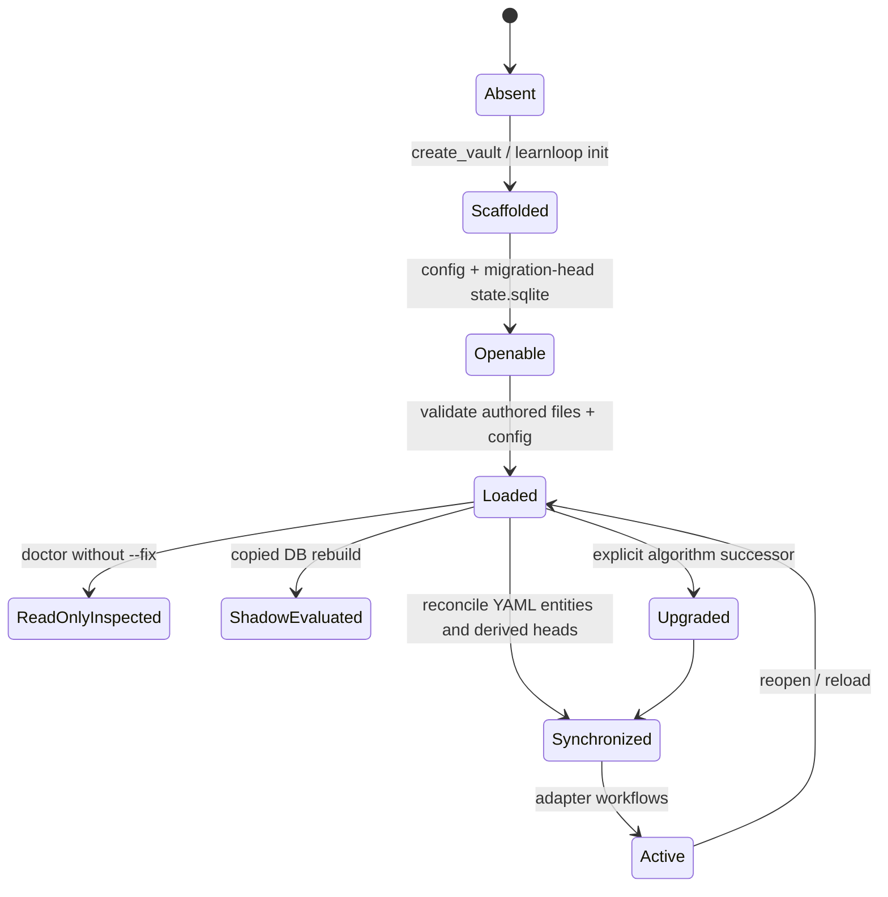

# Vault Lifecycle

## Lifecycle states

The important distinction is **loaded** versus **mutably opened**. Read-only inspection must not migrate or create state; application opens coordinate migrations under the vault lock.

## Creation

`learnloop.bootstrap.create_vault` is shared by CLI and sidecar. It validates the target and optional subject/starting level before writing anything, calls filesystem scaffolding, inherits AI settings only for a genuinely new vault, optionally creates a subject, optionally writes a learner profile, and seeds the matching global learner claim.

Creation is idempotent for an existing vault. `--force` permits scaffolding inside a populated non-vault directory but never overwrites guarded files. See [[Initialize a Vault]] and [[Initialization]].

## Open and synchronize

Adapters load typed configuration and authored vault data, derive `VaultPaths`, open/migrate the configured SQLite path through `open_vault_repository`, and call the relevant startup/state-sync paths. Sync creates missing practice-item/mastery state, deactivates removed items, opens eligible initial diagnostic episodes, and runs bounded maintenance hooks.

## Inspect

Plain doctor is physically read-only: no migration, no directory creation, and no provider diagnostic unless an AI workflow explicitly asks for one. It reports pending migrations, reference issues, config deprecations, and deprecated-table row telemetry. `--fix` is a separate authority boundary.

## Rebuild and evaluate

An explicit full rebuild replays true derived families in place and writes a rebuild receipt. Shadow rebuild copies the database and never changes the live hash. See [[State and Persistence#Replay and rebuild]] and [[Rebuild and Shadow Compare]].

## Upgrade

Algorithm upgrades are immediate-successor transitions. Candidate projection preparation precedes atomic configuration replacement; failures leave the prior version readable. Schema migration and algorithm upgrade are related but different: a schema can support multiple algorithm versions.

## Locking and recovery

The vault-root lock coordinates writers even when `state.sqlite` is relocated. Ingest work has separate durable leases and recovery semantics. An interrupted migration rolls back its body and receipt; an interrupted ingest lease becomes an explicit failed/interrupted record whose eligible siblings can continue.

## Extension guidance

- Put filesystem shape in `vault.loader`/`vault.paths`; put creation policy in `bootstrap`.
- Never make a read-only diagnostic instantiate a migrating repository.
- New open paths must use the shared repository factory.
- New algorithm upgrades follow the playbook and have predecessor fixtures.
- New scaffold files need idempotence and “do not overwrite” tests.

## Tests

- `tests/test_init.py`
- `tests/test_persistence_open.py`
- `tests/test_migration_coordinator.py`
- `tests/test_doctor.py`
- `tests/test_settings_store.py`
- `tests/test_mvp09_upgrade.py`
- `tests/test_vault_lock.py`

