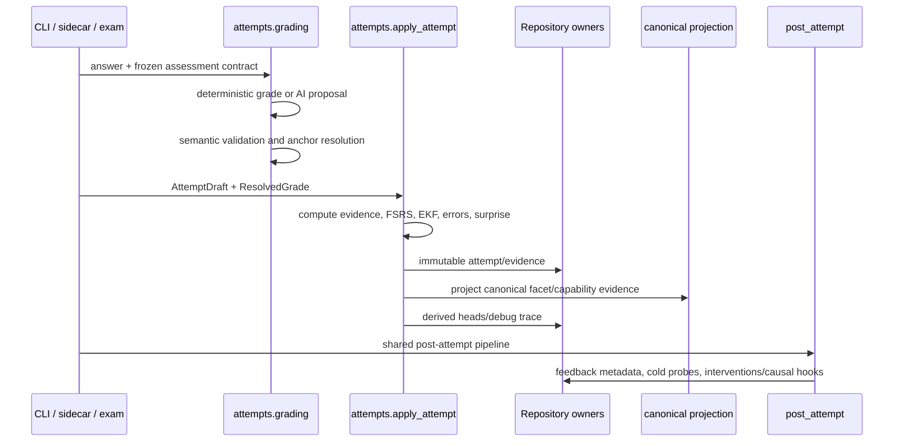

# Attempt Processing

An attempt is the atomic learning observation. CLI practice, desktop practice, and exams share the same application and post-attempt obligations; they differ in declared purpose and presentation context, not in which evidence steps exist.

## Lifecycle

The important shape is convergence: every grading door resolves a grade before the same evidence/application sequence, and every accepted attempt reaches the shared post-attempt pipeline. No adapter or provider may skip directly to learner state. ^attempt-lifecycle

## Grading paths

- Recognition and other closed forms may grade deterministically.
- Self-grade accepts an explicit structured learner judgment with validation.
- AI grading builds a bounded context, requests `GradingProposal`, and validates it before use.
- Optional AI failure can fall back to supported manual/self-grade semantics; required AI fails explicitly.
- Regrade creates correction/reinterpretation records rather than erasing the original attempt.

## Semantic validation

Validation checks rubric totals, criterion IDs and maxima, quote anchors against the learner answer, evidence coverage, fatal errors, exercised facets, error taxonomy, causal attribution, repair splices, and passed-target firewalls. Model confidence is judgment reliability, not learner correctness.

## Computed application

`compute_attempt_application` produces a complete in-memory application before the persistence phase: attempt record, evidence rows, error events, surprise, item memory, LO mastery calibration, canonical updates, quality state, ability transition, debug payload, and item parameters. This makes replay use the same semantics as live application.

## Assistance and reveal

Hints, source-visible work, priming, answer reveals, and tutor exposure are recorded separately and dampen or disqualify specific evidence uses. A revealed cold follow-up is deferred instead of burning a single-use measurement. See [[Evidence and Measurement#Assistance, familiarity, and independence]].

## Post-attempt composition

The one shared pipeline:

1. schedules certification cold probes idempotently;
2. persists feedback metadata used by surfaces/reports;
3. evaluates intervention and causal follow-up needs, including misconception normalization and re-probe hooks.

Exam sittings run all evidence-side steps but cap queue/need insertions per sitting; learner-facing feedback remains an exam report concern.

## Extension guidance

- Add a new attempt-recording door by calling the shared grading/application/post pipeline; never hand-pick obligations.
- Add evidence semantics to the computation/replay path and the write-order oracle.
- New grading output belongs in `attempts.ai_contracts` and semantic validation, not provider code.
- Preserve immutable original evidence; corrections append.
- Update assessment contracts when attribution-affecting content changes.

## Tests

- `tests/test_attempts.py`
- `tests/test_attempt_ai_flow.py`
- `tests/test_post_attempt_pipeline.py`
- `tests/test_attempt_write_order.py`
- `tests/test_assessment_contracts.py`
- `tests/test_grading_context.py`
- `tests/test_codex_grading_validation.py`
- replay/regrade/reveal/evidence suites
