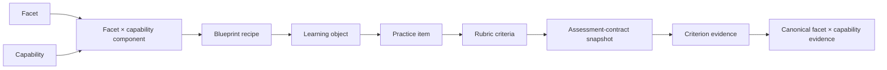

# Canonical Knowledge Model

The knowledge model makes assessment targets explicit enough that an observation can update only what it actually tested.

## Core entities

| Entity | Meaning | Authority |
|---|---|---|
| facet | canonical claim/content unit that can recur across learning objects | authored canonical files |
| capability | closed, domain-general performance operation | configured/model vocabulary |
| learning object | performance blueprint over facet × capability requirements | authored YAML |
| blueprint/recipe | valid composition of components for performing the LO | authored YAML |
| practice item | concrete surface/prompt tied to an LO and mode | authored/generated YAML plus lineage |
| rubric criterion | smallest scored observation boundary | rubric snapshot |
| assessment contract | immutable content-addressed presentation-time target snapshot | SQLite raw ledger |
| depth rung | intended sophistication/depth of a task | curriculum definitions |
| goal contract | scoped terminal evidence requirements | goal definitions/receipts |

## From content to evidence

The snapshot is crucial: changing a live item/rubric after presentation cannot change what a historical answer demonstrated.

^contract-chain

## Facets are shared; evidence is contextual

A facet may appear in several LOs. Canonical projection can share direct evidence across that facet while preserving capability, practice-item, provenance, and independence boundaries. A coincident facet label is not permission to pool every observation indiscriminately.

## Capabilities are not difficulty bands

A capability says what the learner did—recall, explain, apply, analyze, etc.—while a depth rung says how sophisticated the task is. The same facet can be assessed under multiple capabilities and rungs. Readiness projects over blueprint requirements; it is not the LO EKF mean renamed.

## Criteria are the observation boundary

Grading resolves points and evidence per criterion. Criterion targets, dependencies, correlation groups, recipe IDs, fatal errors, and assistance budgets are frozen into the assessment contract. Coverage is computed from these targets, not guessed from the final score.

## Contracts and historical replay

`compile_assessment_contract` creates deterministic content, `contract_hash` content-addresses it, and `snapshot_for_presentation` reuses identical versions. Replay resolves the stored contract so later content edits cannot reinterpret old attempts.

## Extension guidance

- Add a facet only when it is a stable canonical claim, not a transient error description.
- Add capabilities through the closed vocabulary and mapping rules; update reachability and measurement-rank tests.
- Change criterion targets in a new content/contract version, never retrospectively.
- Add a new depth rung/edge through curriculum authoring and admission paths.
- Update synthesis contracts and fixtures when changing canonical source output.

## Tests

- assessment-contract and enforcement suites
- capability mapping/grid/residual tests
- contract reachability/frontier tests
- canonical projection and anti-double-count tests
- measurement-rank tests
- depth/rung/blueprint/golden-path tests

## See also

[[Learning System#Canonical knowledge boundary]], [[Evidence and Measurement]], [[Goals and Certification]], [[Content Pipeline]], and [[Reference/Database/Tables/assessment_contract_versions|assessment contract versions]].
