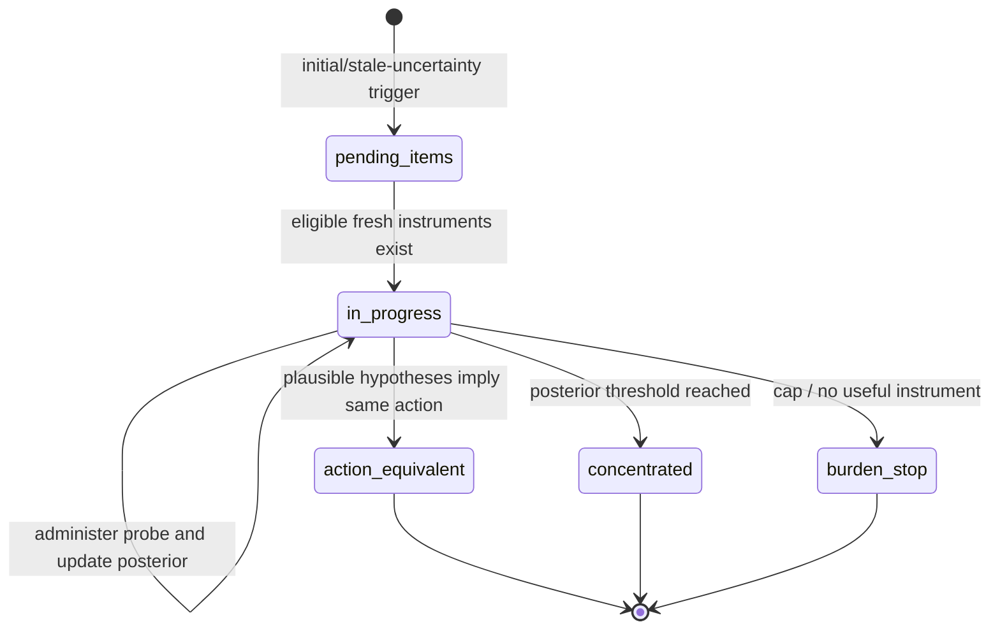

# Diagnosis and Remediation

Diagnosis asks why an observed failure occurred and what next observation or repair would distinguish plausible causes. Error labels are evidence-bearing hypotheses, not a second mastery score.

## Episode lifecycle

A pending episode does not block ordinary learning. An in-progress episode locks its hypothesis set so evidence does not chase a changing target midstream.

## Hypotheses and instruments

Hypotheses may represent missing knowledge, surface-only error, robust misconception, vocabulary gaps, execution slips, or other registered causal factors. Instrument admission checks target binding, validity, freshness, servability, and calibration. Never-before-seen surface rules protect probes from memorization confounds.

## Expected information gain

For each eligible response model, the system computes expected posterior uncertainty reduction. Predictive EIG is used when a held-out predictive target is adequate; otherwise normalized hypothesis EIG is used. Coverage value is logged separately—calling coverage “EIG” would make the audit meaningless.

## Stopping

- posterior concentration uses its configured threshold;
- action equivalence requires at least two plausible hypotheses that recommend the same intervention;
- burden/no-instrument rules stop or park an episode;
- a singleton plausible set cannot vacuously satisfy action equivalence.

## Repair and follow-up

Validated errors can mint intervention needs, guided redo, repair splices, disguised retests, contrast pairs, cold follow-ups, or taxonomy review. Reveals and corrections remain visible. Post-attempt hooks normalize errors and schedule work without changing the original evidence.

## Causal safety

Attribution has abstention and missing-vocabulary paths. A label that the vocabulary cannot honestly express becomes a note/proposal rather than a forced category. Firewalls prevent salience/instructional signals from entering ability updates. Human adjudication can promote, withdraw, or correct causal artifacts through receipts.

## Modification guidance

- Add hypotheses to the registered taxonomy and explicit mapping/adjudication paths.
- Add instruments with admission, freshness, response model, revert criteria, and audit telemetry.
- Keep inference/action semantics separate from mastery/certification semantics.
- Extend simulation with planted causes and blinded trials.
- Preserve old episode/hypothesis versions for replay.

## Tests

Probe episode/EIG/hypothesis/family/gate suites; causal attribution/orchestrator/migration/shadow tests; error taxonomy, remediation, correction, persona, and simulation validation suites.

