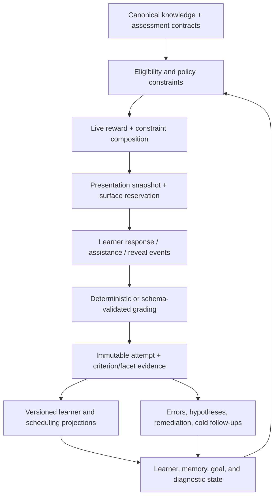
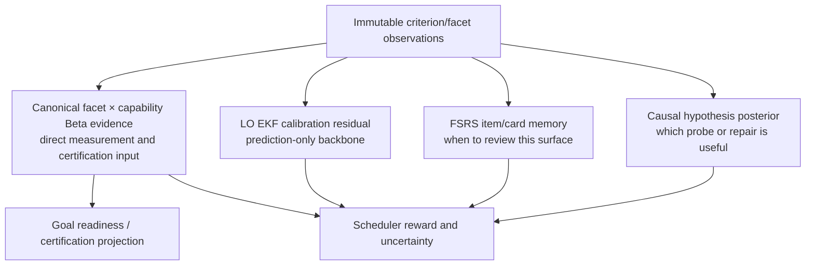

# Learning System

LearnLoop's algorithm is designed to answer a disciplined question: **given what was actually observed, what action is most likely to improve or clarify the learner's ability without pretending uncertain, assisted, repeated, or contaminated evidence is stronger than it is?**

It is not a single mastery score. It is a loop of authored contracts, presentations, validated observations, distinct belief projections, deterministic selection, and targeted diagnosis.

## The feedback loop

The contract bounds what may be learned from an answer; grading does not invent targets after seeing the response. Selection consumes projections, but the next response is recorded as a new observation rather than rewriting history.

^learning-loop

## Larger goals

### Measure rather than flatter

The system distinguishes measured, inferred, claimed, and unknown state. Prediction can help choose an item, but certification requires appropriately independent direct evidence. A high model confidence, familiar prompt, or source-visible answer cannot silently become demonstrated ability.

### Preserve causal interpretability

Failures produce hypotheses, not permanent labels. Diagnostic probes are chosen for information value among plausible causes, with surface-freshness and instrument-admission rules. Repairs and revealed answers affect what should happen next without being counted as cold evidence.

### Optimize action, not a scalar score

The live scheduler applies hard eligibility, per-item reward intent, staged-controller ownership, and deterministic session constraints; it does not reduce the next action to one mastery/priority scalar. Learner requests, held-out exam quarantine, single-use probes, short sessions, source exposure, and active commitments can dominate a naïve score. A separate six-way “choose session intent first” planner is currently **shadow-only**: it logs what it would have selected but never reorders the live queue. See [[Scheduling and Selection#Intent-first session planning is shadow-only]].

### Make every interpretation replayable

Raw ledgers and receipts remain immutable. Versioned projections can be rebuilt and compared, including shadow evaluation on a copied database. See [[Algorithm Versions and Reproducibility]].

## Canonical knowledge boundary

[[Canonical Knowledge Model]] defines the vocabulary that lets evidence be precise:

- facets are canonical claims/content units;
- capabilities are the kind of performance being demonstrated;
- learning objects are performance blueprints composed from facet × capability requirements;
- rubric criteria are the observation boundary;
- assessment-contract snapshots freeze those relationships at presentation time.

Without this boundary, “got the problem right” would be forced to update every possible skill equally.

## Belief layers

These layers answer different questions:

- **FSRS:** how likely is this item/card memory to be retrievable, and when is it due?
- **LO EKF:** how should predicted performance be calibrated for this learning object?
- **Canonical evidence:** what facet/capability has direct licensed evidence?
- **Goal/certification:** does scoped, independent, sufficiently cold evidence meet a terminal contract?
- **Diagnosis:** which cause of failure is plausible, and what observation would discriminate it?

The LO EKF is explicitly prediction-only under current canonical versions; it carries no certification credit. Claims seed priors but do not masquerade as observations.

^belief-layers

## One attempt

[[Attempt Processing]] owns the detailed lifecycle. In summary:

1. presentation freezes an assessment contract and administration context;
2. the learner responds, possibly with hints, source visibility, or reveals recorded separately;
3. deterministic grading is preferred where possible; otherwise a provider returns a typed proposal;
4. domain validation resolves anchors, criterion points, coverage, fatal errors, and attributions;
5. one application computes immutable attempt/evidence plus derived updates;
6. persistence writes evidence before state and runs the shared post-attempt pipeline;
7. replay can recompute the same projections from historical contracts and ledgers.

## Evidence strength

[[Evidence and Measurement]] explains the modifiers. The effective observation depends on more than score:

- criterion coverage and target mapping;
- hints/reveals/priming and whether the source was visible;
- grader confidence and interpretation variance;
- attempt type and purpose;
- repeated/familiar surfaces and independent-evidence discount;
- correlation groups and conjunctive criteria;
- cold versus instructional administration;
- whether the instrument was valid and servable.

These controls prevent double-counting and distinguish teaching from measurement.

## Selection

[[Scheduling and Selection]] separates hard eligibility from reward. Common score components are forgetting risk, recent error, active-goal frontier value, and normalized probe information gain. The final ordering also enforces held-out quarantine, diagnostic freshness, requested-item floors, goal quotas, staged-controller ownership, follow-up precedence, and session caps.

Every slate can persist explanations and propensities, enabling prequential evaluation instead of only anecdotal debugging.

## Diagnosis and repair

[[Diagnosis and Remediation]] treats misconceptions and causal factors as hypotheses. Episodes lock a hypothesis set, admit suitable instruments, update a posterior from response-conditioned evidence, and stop when concentration/action equivalence/burden rules justify it. A singleton cannot vacuously claim action equivalence; concentration uses its separate threshold.

## Goals and certification

[[Goals and Certification]] scopes evidence toward a target without turning forecasts into evidence. Held-out exam items are quarantined from routine practice. Certification uses canonical evidence and cold checks; delayed probes can discover false confidence after initial success.

## Reader and tutor

[[Reader Tutor and Teach-Back]] distinguishes instruction from assessment. Source-grounded reader dialogue can warm familiarity or influence triage but cannot update ability. Teach-back is a real attempt only over the criteria actually asked and answered.

## What AI does—and does not do

AI may grade, author, inventory, synthesize, tutor, generate probe surfaces, transcribe, or animate through [[AI Architecture]]. It does not select persistence semantics. The domain validates its structured output; manual paths remain first-class; deterministic policy owns state transitions.

## How to change the algorithm

Do not patch a weight and reuse the same meaning. Follow [[Algorithm Versions and Reproducibility#Change protocol]] and [[Parameter Governance and Evaluation]], add simulation/prequential evidence, run a shadow rebuild, preserve raw history, and extend the relevant golden tests.

## Implementation anchors

- `learnloop.attempts` — [[Attempt Processing]]
- `learnloop.learner` — learner-state readers and projections
- `learnloop.scheduling` — [[Scheduling and Selection]]
- `learnloop.diagnosis` — [[Diagnosis and Remediation]]
- `learnloop.goals` — [[Goals and Certification]]
- `learnloop.substrate` — canonical projection, activities, replay/rebuild
- `learnloop.sim` — policy evaluation
