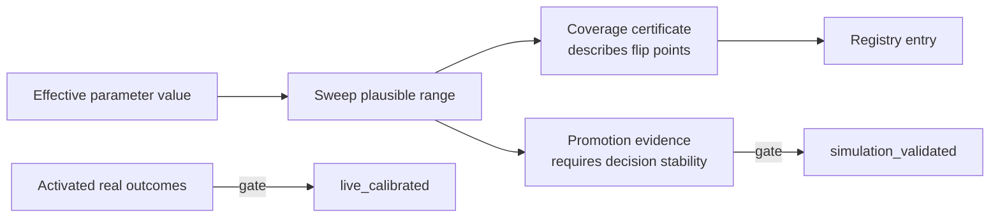

# Parameter Governance and Evaluation

LearnLoop treats behavior-bearing numbers as reviewable policy, not anonymous constants. The registry inventories typed numeric config leaves and named module constants, classifies them, projects their effective values per vault, and records evidence for promotion.

## Classification

- `decision` parameters can change behavior or outcomes and need an owner/rationale.
- `structural` values express enums, versions, numerical mechanics, or fixtures rather than tunable policy.
- Decision classes include weights, constraints, likelihoods, evidence mass, thresholds, priors, display, and operational values.
- Lifecycle is active, dormant, or deleted; calibration status is heuristic, simulation-validated, or live-calibrated.

Any future numeric field/constant that does not match an explicit rule fails the audit rather than entering an open-ended allowlist.

## Coverage versus promotion evidence

A coverage certificate is descriptive and required for active decision parameters; finding flip points is useful, not a failure. Promotion evidence is normative: it gates status beyond heuristic. Dormant constraints instead require bind-event logging so a supposedly inactive guardrail cannot be dead code invisibly.

^parameter-evidence

## Frozen manifests

Per-algorithm-version manifests record effective parameter hashes so historical replay remains byte-stable. Fitted parameter artifacts are separate from handwritten defaults and carry their own provenance.

## Simulation

The simulation runner drives synthetic learners through the real scheduler, attempt application, follow-up, probe, and goal paths under a frozen clock. Sweeps compare queue decisions, beliefs, goals, and metrics across values. Planted-learner and planted-misgrade suites provide promotion gates for specific parameter families.

## Evaluation limits

Simulation validity is not live calibration. Prequential reports, shadow components, policy experiments, and live outcome manifests preserve that distinction. No-data metrics say so explicitly.

## Modification guidance

- Register new decision numbers with owner, rationale, class, lifecycle, and promotion gate.
- Add dormant constraint bind sites and logging.
- Sweep plausible ranges and link coverage certificates.
- Bump algorithm version/default fingerprint when a shipped default changes persisted meaning.
- Use [[Rebuild and Shadow Compare]] plus domain metrics before activation.

## Tests

Parameter registry audit/manifest/bind tests; sensitivity certificate/promotion tests; fitted-parameter tests; simulation, sweep, prequential, and policy evaluation suites.

