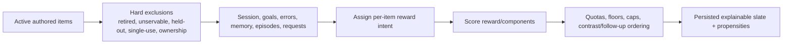

# Scheduling and Selection

The scheduler builds an explainable slate by applying hard eligibility and ownership rules before comparing action value. It does not simply sort `due_at` or mastery.

## Candidate pipeline

Hard rules prevent an attractive score from serving an invalid surface.

## Eligibility examples

- learner-retired or state-inactive items are excluded;
- held-out exam pool items are quarantined from routine practice;
- a diagnostic-probe surface is single-use and reserved for explicit diagnostic flows;
- a pending easier/harder variant can hold its source item;
- unrenderable instruments are not schedulable;
- staged-controller-owned commitments are excluded from the legacy controller;
- source-revealed cold follow-ups are deferred;
- ephemeral diagnostic dialogue turns never enter ordinary practice.

## Reward components

The legacy priority reads four weighted components: forgetting risk, recent error, goal-frontier value, and probe information gain. Richer selection reward code incorporates intent, predicted recall, quality, uncertainty, and configuration while keeping non-priority telemetry separate. Familiarity discounts repeated goal/probe evidence rather than pretending it is independent.

## Intent-first session planning is shadow-only

The **live** reward path classifies each eligible item as `probe`, `practice`, `repair`, `review`, or `transfer`, then scores it and applies requested-item floors, goal quotas, short-session behavior, teach-back caps, contrast/follow-up ordering, same-day rotation, exploration, and any staged-controller ownership rules. That per-item classification is not a choose-one-session-intent-first policy.

`intent_planner.py` separately groups the already composed queue into `diagnose_uncertainty`, `repair_misconception`, `restore_retrievability`, `build_missing_knowledge`, `develop_transfer`, or `practice_integration`. It records the hypothetical first intent and within-intent rankings in scheduler telemetry only.

> [!warning] No live authority
> The six-way planner does not reorder or filter the live queue. Promotion requires held-out predictive gains and an explicit product/algorithm decision; changing its priority today changes shadow evaluation, not learner-facing selection.

## FSRS

FSRS maintains item/card memory and produces forgetting risk/intervals from review ratings. Ratings derive from validated rubric score and assistance caps. FSRS is one selection input; it does not own goal readiness or canonical mastery.

## Probe EIG

During an in-progress diagnostic episode, only admitted instruments bound to the locked hypothesis set receive probe EIG. Predictive EIG is primary when the target set is adequate; normalized hypothesis EIG is fallback. The score is familiarity-discounted and logged separately from coverage value.

## Explainability and evaluation

`ScheduledItem` carries component values, readiness, selected mode/intent, plain-English reasons, and optional reward debug. Persisted slates/propensities enable prequential regret and policy evaluation. `explain_practice_item` exposes why an item did or did not rank.

## Modification guidance

- Add a hard safety/servability rule before reward computation.
- Add a reward term with explicit scale, configuration, explanation, and evaluation metric.
- Do not mix display-only telemetry into `_priority` accidentally.
- Update scheduler golden tests and seeded exploration/propensity tests.
- Evaluate default changes with simulation and shadow rebuild before versioning.

## Tests

- `tests/test_scheduler.py`
- `tests/test_scheduler_golden.py`
- `tests/test_scheduler_probe_eig.py`
- constraint, controller, requested-floor, short-session, exam-quarantine, and prequential suites
