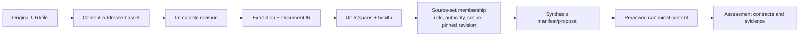

# Source Authority and Provenance

A canonical source is not simply text pasted into a prompt. LearnLoop separates captured material, immutable revision identity, extraction quality, collection membership, synthesis proposals, and applied canonical content.

## Authority chain

Each arrow adds interpretation while retaining the identity behind it. A source-set membership owns role/scope; the raw artifact does not retroactively acquire a subject role.

^source-authority-chain

## Immutability

New bytes create/reuse an asset and revision; they do not mutate an old revision. New extraction settings create a new extraction identity. Synthesis/appends produce manifests, runs, proposals, and change receipts. This supports reproducible citations and lets a reviewer ask exactly which revision shaped a learning object.

## Roles and authority

Sources can be primary, reference, adjunct, exam-like, or otherwise constrained by source-set policy. Role influences synthesis and allowed evidence use, not the truth of the captured bytes. Exam sources have additional leakage/held-out rules.

## Extraction health

Document IR retains blocks/anchors and health flags. Outline/unit selection and budgets let a user inspect what will be synthesized. Poor pages can be repaired or re-extracted without losing the original. A fallback extractor records its degradation rather than presenting identical quality.

## Model output

Inventory and synthesis output are typed proposals. Stable IDs, source refs, manifests, merge/reconciliation rules, validation gates, and reviewed application control canonical mutation. See [[Process Model Output]] and [[AI Architecture#Output trust boundary]].

## Reader citations

Reader/tutor manifests expose bounded source spans and citation IDs. Answers are citation-validated; uncited claims are removed or refused. Source exposure is logged because it affects later measurement coldness.

## Modification guidance

- Preserve asset/revision/extraction identity boundaries.
- Add source kinds through acquisition + typed IR, health, and provenance tests.
- Add synthesis fields to feature-owned contracts and manifests before applying them.
- Keep source role/scope on collection membership, not the global asset.
- Verify citations, append reconciliation, and deletion semantics.

## Workflows and tests

- [[Import Canonical Sources]] and [[Build a Study Map]]
- source layer/objects/refs/sets/inventory/synthesis tests
- ingestion adapters, extraction health, span reanchor, reader citation tests

