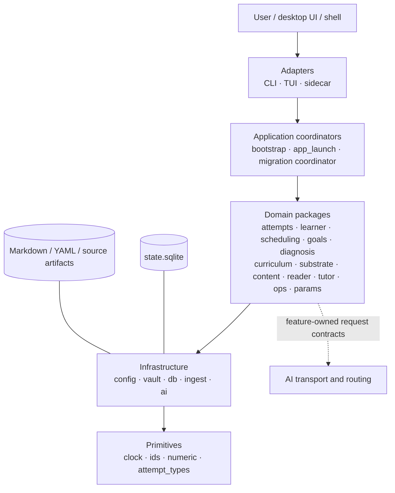

# Architecture Map

## Read top down

The arrows show allowed dependency direction, not the temporal learning workflow. Adapters translate inputs; domains own behavior; infrastructure supplies persistence/provider mechanics; primitives remain dependency-free. See [[Package Boundaries#Enforced dependency rules]].

## Primary notes

- [[Architecture Overview]] — system shape and runtime composition.
- [[Package Boundaries]] — what belongs in each layer and what is forbidden.
- [[Adapter Architecture]] — CLI, TUI, sidecar, and neutral launch coordination.
- [[Desktop Architecture]] — React/Tauri layers and the typed bridge into the sidecar.
- [[AI Architecture]] — task routing and structured provider calls.
- [[State and Persistence]] — write ownership, roles, transactions, replay.
- [[Content Pipeline]] — acquisition through canonical map synthesis.
- [[Privacy and Trust Boundaries]] — local authority, provider/source egress, and validation gates.
- [[Vault Lifecycle]] — create, open, migrate, inspect, rebuild, upgrade.
- [[Testing and Invariants]] — executable architectural constraints.

## Package lookup

Use [[Module Catalog]] for Python modules and [[Desktop Module Catalog]] for TypeScript/TSX/Rust modules. Important package MOCs include `attempts`, `learner`, `scheduling`, `diagnosis`, `content`, `db`, `ai`, `learnloop_sidecar`, and the desktop screen/component/native-host areas.

## Why these boundaries exist

See [[Design Decision Index]], especially [[ADR-001 Domain ownership replaces generic services]], [[ADR-002 Feature-owned structured AI contracts]], and [[ADR-005 Independent adapters]].
