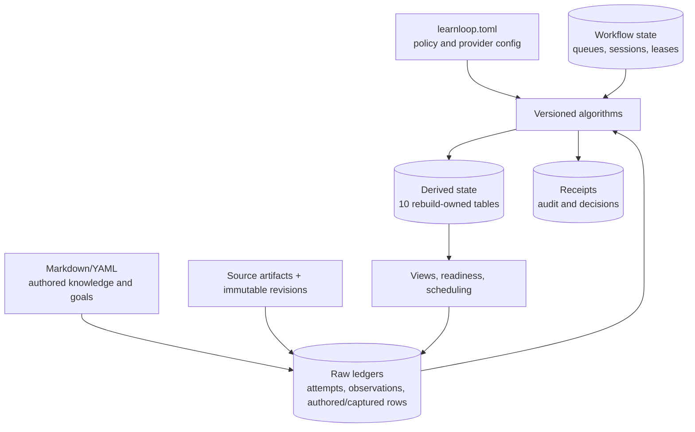

# Data and State Map

## Authority map

Authored files and captured observations are authorities. Derived state can be destroyed and reconstructed; receipts and workflow state cannot. The selection loop creates a new observation rather than rewriting the old one.

^authority-map

## Navigate by concern

- [[Vault Lifecycle]] — filesystem creation/open modes and migrations.
- [[State and Persistence]] — transactions, roles, stores, replay, shadow rebuild.
- [[Database Catalog]] — one note per `state.sqlite` table.
- [[Configuration]] — every current `learnloop.toml` field and default.
- [[Evidence and Measurement]] — what an observation is licensed to mean.
- [[Algorithm Versions and Reproducibility]] — version bumps, fingerprints, upgrades.
- [[ADR-003 Explicit table roles govern rebuild]] — why naming is not enough.
- [[ADR-007 Immutable evidence and append-only correction]] — historical meaning.

## Status counts at migration head 156

| Role | Tables | Rebuild behavior |
|---|---:|---|
| RAW_LEDGER | 126 | preserved |
| DERIVED | 10 | clear + exact owner replay |
| RECEIPT | 51 | append-only |
| WORKFLOW | 54 | preserved mutable lifecycle |
| COMPAT | 10 | frozen |

See [[Database Catalog#Role indexes]] for the actual table lists.

