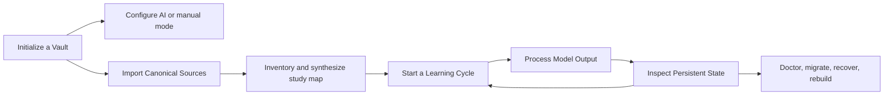

# User Journey Map

Workflows are procedural and observable. They link to concept notes for explanations instead of embedding a second copy of the algorithm.

This loop distinguishes source/build work from repeated learning work. Initialization and canonical synthesis are occasional; attempt → evidence → state → next action repeats continuously.

## First-use path

1. [[Initialize a Vault]]
2. [[Configure AI Providers]] or choose the typed manual path
3. [[Import Canonical Sources]]
4. [[Build a Study Map]]
5. [[Start a Learning Cycle]]
6. [[Process Model Output]]
7. [[Inspect Persistent State]]

The import/build steps preserve the identity chain described by [[Source Authority and Provenance]].

## Continued-use paths

- [[Continue a Learning Cycle]]
- [[Reader to Practice Workflow]]
- [[Tutor and Teach-Back Workflow]]
- [[Goals Exams and Certification Workflow]]
- [[Rebuild and Shadow Compare]]
- [[Doctor Migrations and Recovery]]

## Observable examples

Open [[Example Index]] for copyable configurations, command sessions, expected filesystem artifacts, and representative database queries.
