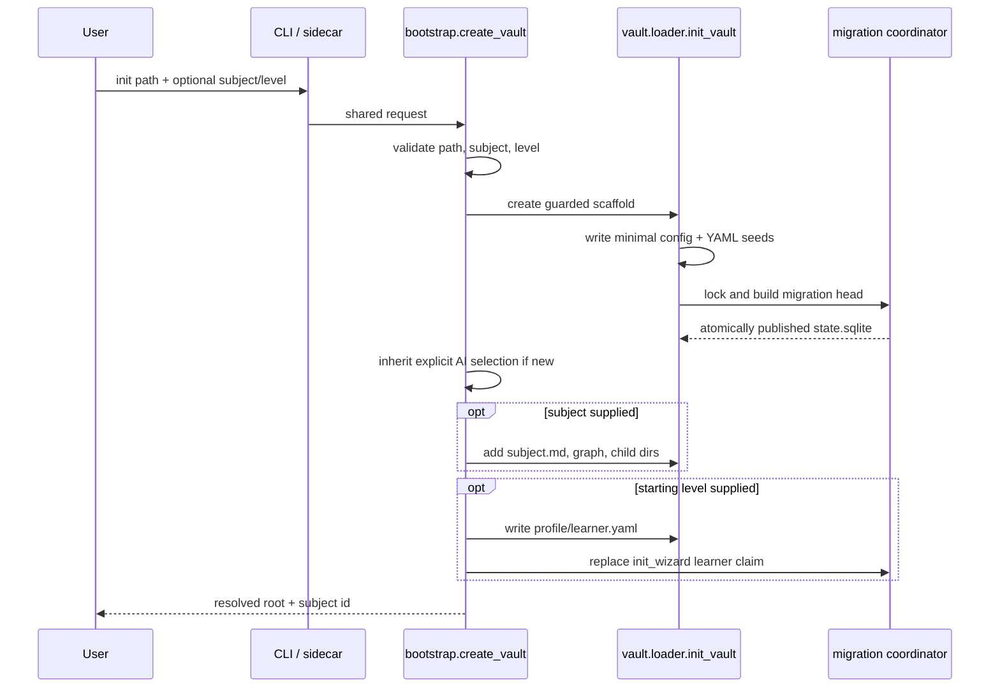

# Initialization

`learnloop init` validates a target, calls the shared application bootstrap, creates or completes guarded vault scaffolding, publishes a fully migrated SQLite database, and optionally seeds a first subject and weak learner prior. The CLI and desktop sidecar use the same `learnloop.bootstrap.create_vault()` policy. ^init-contract

## Command

```bash
learnloop init [PATH] \
  [--force] \
  [--subject TEXT] \
  [--starting-level TEXT] \
  [--level-note TEXT]
```

`PATH` defaults to the current directory. Valid starting levels are:

| Value | Seeded global claim | Interpretation |
|---|---:|---|
| `new_to_this` | 0.15 | Little expected prior familiarity |
| `some_exposure` | 0.35 | Weak prior exposure |
| `comfortable` | 0.55 | Moderate self-reported comfort |
| `strong_background` | 0.75 | Strong background, still only a weak prior |

Every claim uses pseudo-count 1.0 so observed evidence can quickly dominate the self-report. The learning consequences are explained in [[Learning System]] rather than duplicated here.

## Validation happens before writing

The bootstrap rejects:

- an empty path string;
- a path that already exists as a file;
- a subject title that cannot produce a kebab-case ID;
- a starting level outside the four values above;
- a populated directory that does not already contain `learnloop.toml`, unless `--force` is explicit.

Validation errors exit with code 2. An invalid subject or starting level leaves no partial vault. ^init-preflight

> [!warning] What `--force` means
> It allows adding guarded scaffolding inside a populated non-vault directory. It does not replace unrelated files, does not replace existing scaffold/config files, and never turns a file path into a directory.

## End-to-end creation sequence



The ordering is important: validation precedes all writes, the database is complete before optional learner-state seeding, and only a brand-new vault can inherit AI settings.

## What a default init creates

Given:

```bash
learnloop init ~/LearnLoop/my-vault
```

the resulting minimum tree is:

```text
my-vault/
├── .learnloop/
│   └── vault.lock                 # blank while unlocked
├── AGENTS.md
├── learnloop.toml                 # decision-only schema-v2 template
├── state.sqlite                   # migration head 156; 251 user tables
├── concepts/
│   ├── concepts.yaml              # schema_version 1, empty concepts map
│   └── relations.yaml             # schema_version 1, empty edge list
├── errors/
│   └── error_types.yaml           # three default error types
├── facets.yaml                    # schema_version 1, empty facet list
├── profile/
│   ├── goals.md                   # heading scaffold
│   └── goals.yaml                 # schema_version 1, empty goal list
├── rubrics/                       # empty
└── subjects/                      # empty
```

The migration directory currently contains 143 numbered SQL files ending at version 156. Fresh creation applies all of them to a temporary sibling, records all receipts, synchronizes the file, and atomically publishes it as the configured SQLite path. See [[Schema Evolution#Fresh database publication]].

### Default error taxonomy

`errors/error_types.yaml` receives timestamped entries for:

- `recall_failure` — retrieval lapse, severity 0.4, not a misconception;
- `scaffold_failure` — failure after hints/support, severity 0.65, not a misconception;
- `arithmetic_slip` — local calculation error with the right concept, severity 0.15, not a misconception.

### Files intentionally absent

Default init does **not** create `profile/learner.yaml`, a subject, any practice content, `.env`, `prompts/`, `sessions/`, `exports/`, `.learnloop/backups/`, or `.learnloop/session-checkpoints/`.

## Optional subject and learner seed

```bash
learnloop init ~/LearnLoop/linear-algebra \
  --subject "Linear Algebra" \
  --starting-level some_exposure \
  --level-note "Returning after a long break."
```

Additional output:

```text
profile/learner.yaml
subjects/linear-algebra/
├── subject.md
├── concept-graph.yaml
├── learning-objects/
├── notes/
└── practice-items/
```

`profile/learner.yaml` contains schema version 1, the closed starting-level value, optional note, and `updated_at`. Bootstrap also replaces any prior global `source = "init_wizard"` row in [[Reference/Database/Tables/learner_claims|learner_claims]]. Subject metadata starts `status: active`; the graph starts with empty additional scope, exclusions, and ordering hints.

> [!note] No starting level means no fabricated prior
> Without `--starting-level`, no learner profile file or init-wizard claim is created. The learning model begins from its ordinary cold-start prior.

## AI-settings inheritance

For a **brand-new** vault:

- the desktop sidecar first attempts to copy the currently open vault's explicit active/fallback provider, task routes, and non-Codex profiles;
- if that does not yield settings, bootstrap checks machine-global `ai_defaults.toml`;
- CLI init has no open-vault context and therefore checks only global defaults;
- secrets are not copied—they remain in [[Environment and Machine Settings]];
- machine-local Codex profiles are skipped;
- an existing vault's AI settings are never touched.

If no inheritance source exists, the [[learnloop.toml#Generated template]] remains unchanged.

## Idempotent completion

Running init against an existing vault fills missing guarded scaffold files/directories and applies missing migrations. It does not overwrite `learnloop.toml`, `AGENTS.md`, goals notes, registries, taxonomy, facets, or subject files that already exist.

This supports repair of a partial scaffold without erasing user-owned comments or data. It is not a reset command.

## Verify a new vault

```bash
learnloop config effective --vault ~/LearnLoop/my-vault --json
learnloop doctor --vault ~/LearnLoop/my-vault --json
```

Read schema receipts without permitting writes:

```bash
sqlite3 'file:/home/me/LearnLoop/my-vault/state.sqlite?mode=ro' \
  'SELECT COUNT(*), MIN(version), MAX(version) FROM schema_migrations;'
```

At the documented head, this reports 143 applied migrations spanning 1 through 156.

## What comes next

Initialization only creates the safe empty substrate. Follow the separate end-to-end workflow notes for canonical source import, study-map creation, a learning cycle, provider-output review, and persistent-state inspection. At the reference level:

- [[Runtime and Vault Data Files]] explains each scaffold file;
- [[Configuration]] explains effective policy;
- [[Database]] explains persistent state;
- [[Vault Lifecycle]] explains future opens, upgrades, doctor checks, and rebuilds.

## Defining tests

- `tests/test_init.py::test_init_creates_vault_and_applies_migration`
- `tests/test_init.py::test_bootstrap_seeds_subject_and_starting_level`
- `tests/test_init.py::test_bootstrap_validates_request_before_writing`
- `tests/test_init.py::test_cli_init_refuses_populated_non_vault_without_force`
- `tests/test_init.py::test_cli_invalid_starting_level_leaves_no_partial_vault`
- `tests/test_init.py::test_bootstrap_completes_partial_vault_without_touching_config`
- `tests/test_config_refactor.py::test_generated_template_is_decision_only_schema_v2`

## Extension guidance

Keep pure filesystem/SQLite scaffolding in `vault/loader.py`; keep cross-domain application policy in `bootstrap.py`; keep CLI and sidecar adapters thin. Add validation before writes, retain per-file guards, preserve fresh-database atomic publication, and add the same behavior through both adapters.
