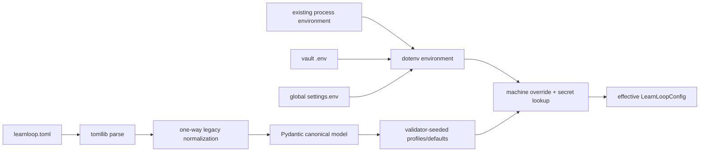

# Configuration

Configuration is split by responsibility: `schema.py` owns typed canonical models, `loader.py` owns TOML/dotenv/environment loading, `compat.py` owns one-way legacy translation, and `template.py` owns the short new-vault template plus its defaults fingerprint. ^configuration-boundaries

> [!important] The file is intentionally not the whole configuration
> [[learnloop.toml]] records user decisions. Omitted policy comes from typed model defaults. `learnloop config effective` is the authoritative way to see what the running code will use.

## Map of content

- [[learnloop.toml]] — exact generated template, explicit decisions, and safe examples.
- [[Configuration Field Catalog]] — all 487 effective leaf values grouped into 27 top-level sections.
- [[Legacy Configuration Compatibility]] — accepted old spellings, retired keys, and canonicalization rules.
- [[Environment and Machine Settings]] — precedence, secrets, global settings, and AI defaults inheritance.
- [[Runtime and Vault Data Files]] — files around the TOML that configure or define a vault.
- [[Repository Tooling Configuration]] — project/developer config outside a learner vault.
- [[Initialization]] — when these files are created.
- [[AI Architecture]] — provider routing and structured operations; this note documents only their configuration surface.
- [[Learning System]] — why learning-policy fields exist; field notes do not duplicate the algorithm.

## Load pipeline



Environment precedence is shell > vault `.env` > global `settings.env`, because dotenv loading never overwrites an existing key. TOML is compatibility-normalized before validation. After validation, the machine-level Codex checkout override is applied and provider clients later resolve the named secret variables.

## Schema versions and algorithm versions

- `schema_version` describes accepted configuration shape. Versions 1 and 2 parse; new vaults write 2.
- `algorithms.algorithm_version` selects learning/projection semantics. New vaults explicitly write `mvp-0.9`.
- If the algorithm key is absent, the model uses the conservative legacy fallback `mvp-0.6`; activation must go through `learnloop upgrade`, not a silent default flip.

These are separate axes. A schema-v1 file can normalize into current provider/config models while retaining an older algorithm version.

## Effective configuration and explicit overrides

Show the complete validated model:

```bash
learnloop config effective --vault /path/to/vault
learnloop config effective --vault /path/to/vault --json
```

Show only what is literally present in the TOML:

```bash
learnloop config effective --vault /path/to/vault --only-overrides
learnloop config effective --vault /path/to/vault --only-overrides --json
```

The second form reparses the raw TOML and therefore does not include compatibility output or validator-seeded defaults. ^effective-versus-explicit

## Defaults reproducibility

The current generated mvp-0.9 effective configuration hashes to:

`9d7298b773fb5d4e5f7226d8ac5b6d24a881f68f632751af77d56ce20d559ca0`

`tests/test_config_refactor.py` keys this fingerprint by algorithm version. Changing a behavior-affecting omitted default therefore requires an explicit algorithm-version/snapshot decision rather than silently changing every minimal-config vault.

> [!note] This is a CI contract, not a runtime bundle
> Old vaults do not carry a full copy of every default. Historical interpretation is governed by algorithm versions and compatibility paths.

## Top-level sections

The exact leaves/defaults live in the generated catalog. Useful entry points:

- [[Config - storage]], [[Config - algorithms]], [[Config - evidence]]
- [[Config - scheduler]], [[Config - goals]], [[Config - mastery]], [[Config - probe]]
- [[Config - ingest]], [[Config - ai]], [[Config - animation]]
- [[Config - capabilities]], [[Config - fitting]], [[Config - diagnostic_augmentation]]

## Safe modification workflow

1. Inspect the current value with `learnloop config effective --json`.
2. Add the smallest dotted override under the matching TOML table.
3. Run `learnloop doctor --vault /path/to/vault --json` to catch parse/model problems.
4. For algorithm experiments, use [[Rebuild Ownership#Shadow rebuild]] before changing live projections.
5. Keep API keys and machine paths in [[Environment and Machine Settings]], not the vault TOML.

For code changes:

1. change the typed owner in `config/schema.py`;
2. add a template field only when it is a real user decision;
3. put old-to-new translation in `config/compat.py`;
4. update the algorithm-version defaults fingerprint when semantics change;
5. update `tests/test_config_refactor.py` and relevant domain tests.

## Search recipes

- `path:"Reference/Configuration/Fields" "cold_start_prior_logit_variance"`
- `path:"Reference/Configuration/Fields" "explicit template decision"`
- `tag:#learnloop/configuration/section/ai`
- `path:"Reference/Configuration" "parse-and-ignore"`

