# Database

`state.sqlite` is LearnLoop's durable machine-state store. It holds raw evidence, audit receipts, mutable workflows, compatibility seams, and the small set of projections that can be rebuilt from retained history. Human-authored learning content remains in vault files; that boundary is explained in [[State and Persistence]]. ^database-purpose

> [!important] The database is not a cache
> Only ten of 251 user tables are classified `DERIVED`. The other 241 tables contain authoritative input, historical receipts, live workflow state, or preserved compatibility state. A whole-history rebuild must not clear them.

## Map of content

- [[Database Catalog]] — exhaustive table MOC, grouped by domain family.
- [[Table Roles]] — the five rebuild policies and their counts.
- [[Rebuild Ownership]] — the exact ten clearable projections and their single owners.
- [[Schema Evolution]] — migration discovery, locking, atomicity, and read-only opening.
- [[Deprecated State Gates]] — the three telemetry-gated dormant tables and why zero fixture rows are not deletion permission.
- [[Initialization]] — when the database is first created and what else appears beside it.
- [[Vault Lifecycle]] — create, open, migrate, diagnose, rebuild, and upgrade workflows.

## The live persistence path

Application entry points open a vault through `open_vault_repository(vault_root, sqlite_path)`. The configured path may be relocated with `storage.sqlite_path`, so schema mutation needs both identities: the vault root locates `.learnloop/vault.lock`, while the configured SQLite path locates the database. ^database-open-path

```mermaid
flowchart LR
    Entry[CLI / TUI / sidecar] --> Load[load learnloop.toml]
    Load --> Paths[resolve VaultPaths.sqlite_path]
    Paths --> Lock[acquire .learnloop/vault.lock]
    Lock --> Migrate[apply missing migrations]
    Migrate --> Attach[Repository.attach read-write]
    Attach --> Domain[domain services]
    Domain --> Repo[Repository / focused stores]
    Repo --> SQLite[(state.sqlite)]
```



The diagram matters because the lock belongs to the vault while the file may live elsewhere; treating the SQLite parent as the lock identity would permit two processes to race.

## Connection invariants

`learnloop.db.connection.connect()` configures every connection with:

- row access by column name (`sqlite3.Row`);
- `PRAGMA foreign_keys = ON`;
- a 5,000 ms busy timeout;
- physical SQLite URI `mode=ro` for read-only callers.

Read-only opening does not create a missing parent or database and causes accidental writes to fail at the SQLite boundary. Plain doctor uses that behavior; state-repair modes must be chosen explicitly. See [[Schema Evolution#Read-only diagnosis]].

## Repository boundary

`src/learnloop/db/repositories.py` is still a large compatibility repository, while focused stores under `src/learnloop/db/stores/` own newly extracted persistence concerns such as the ingest queue and observation ledger. Domain modules call repository/store methods; persistence modules should not own learning policy. The architecture test suite and import-linter enforce that direction.

> [!note] How to read a table note
> Each note distinguishes declared foreign keys from application-validated soft references, lists exact repository methods and detectable callers, cites schema-defining tests, and includes the migration-head DDL so CHECK constraints are visible. Start with [[Reference/Database/Tables/practice_attempts|practice_attempts]] for an authoritative ledger, [[Reference/Database/Tables/learning_object_mastery|learning_object_mastery]] for a projection, [[Reference/Database/Tables/ingest_jobs|ingest_jobs]] for workflow state, and [[Reference/Database/Tables/derived_state_rebuilds|derived_state_rebuilds]] for a receipt.

## Quick inspection

Safe read-only SQL inspection:

```bash
sqlite3 'file:/absolute/path/to/state.sqlite?mode=ro' \
  'SELECT version, name, applied_at FROM schema_migrations ORDER BY version;'
```

List non-SQLite tables:

```sql
SELECT name
FROM sqlite_master
WHERE type = 'table' AND name NOT LIKE 'sqlite_%'
ORDER BY name;
```

> [!warning] Do not hand-edit learner state
> The desktop SQLite administration surface is an intentional power-user hatch, but it bypasses domain invariants. Prefer product commands and repository APIs. Never delete a table because its fixture row count is zero.

## Search recipes

- `path:"Reference/Database/Tables" tag:#learnloop/database/role/raw-ledger`
- `path:"Reference/Database/Tables" tag:#learnloop/status/legacy-preserved`
- `path:"Reference/Database/Tables" "Repository.insert_attempt"`
- `path:"Reference/Database" "read_only"`

## Documentation regeneration

The per-table notes and catalogs are generated from the live schema and typed models:

```bash
.venv/bin/python docs/learnloop-architecture-vault/_scripts/db_generate_reference.py
```

The generator fails if the migration-head table set differs from `TABLE_ROLES`, if the ten derived tables do not have exact single-owner coverage, or if generated frontmatter is incomplete. ^database-doc-regeneration

Run both documentation validators after regeneration:

```bash
.venv/bin/python docs/learnloop-architecture-vault/_scripts/db_validate_reference.py
.venv/bin/python docs/learnloop-architecture-vault/_scripts/validate_vault.py
```

The database/config validator compares all 251 table notes and all 487 effective configuration leaves to live authorities, including operational Function and runtime/refactor Status fields. The global validator then checks the entire Obsidian graph: frontmatter, source paths, Wikilinks, heading links, and block links.
