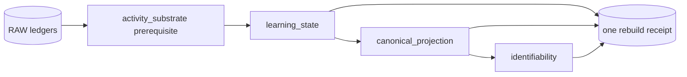

# Rebuild Ownership

The rebuild umbrella provides one ordered, lossless route from preserved history to every table marked `DERIVED`. Registry validation runs before the first write, every raw attempt must be accounted for, and a successful live rebuild appends exactly one [[Reference/Database/Tables/derived_state_rebuilds|derived_state_rebuilds]] receipt. ^rebuild-contract



This order is difficult to infer from table names: activity backfill creates authoritative replay input but owns no derived table; canonical facet projection consumes the complete replayed learning state; identifiability consumes the canonical projection.

## Owner registry

### `activity_substrate` prerequisite

Owns no `DERIVED` table. It backfills missing authoritative activity observations before replay so all raw attempts can be accounted for.

### `learning_state`

- [[Reference/Database/Tables/ability_transition_events|ability_transition_events]]
- [[Reference/Database/Tables/attempt_surprise|attempt_surprise]]
- [[Reference/Database/Tables/item_parameter_state|item_parameter_state]]
- [[Reference/Database/Tables/learning_object_mastery|learning_object_mastery]]
- [[Reference/Database/Tables/learning_outcome_labels|learning_outcome_labels]]
- [[Reference/Database/Tables/practice_item_quality_state|practice_item_quality_state]]

It clears the whole family for a whole-vault rebuild, replays persisted attempts, and recreates cold mastery rows for authored learning objects with no attempt history.

### `canonical_projection`

- [[Reference/Database/Tables/capability_residual_state|capability_residual_state]]
- [[Reference/Database/Tables/facet_capability_evidence|facet_capability_evidence]]
- [[Reference/Database/Tables/facet_recall_state|facet_recall_state]]

It projects canonical facet/capability state after learning-state replay is complete.

### `identifiability`

- [[Reference/Database/Tables/subject_identifiability_watermarks|subject_identifiability_watermarks]]

It recomputes subject-level identifiability findings from the canonical projection.

## Correctness oracles

`tests/test_rebuild_orchestrator.py` pins four properties:

1. every `DERIVED` table has exactly one owner and no non-derived table is claimed;
2. every scoped raw attempt is reported as accounted for;
3. a same-version rebuild reproduces every column exactly, including IDs and timestamps;
4. one planted stale row in each derived table disappears, while preserved roles remain unchanged and exactly one receipt is appended.

> [!important] Rebuild does not call AI providers
> Provider outputs needed for replay are retained in raw grading/source ledgers. Rebuild changes computation over stored evidence; it does not regenerate history. Provider design details live in [[AI Architecture]].

## Live rebuild

```bash
learnloop rebuild-derived-state --vault /path/to/vault --json
```

This command synchronizes authored vault state, mutates the ten live projections, validates attempt coverage, and writes one receipt. `--learning-object` may scope learning-object work, but callers should understand the projection dependencies before using a partial rebuild.

## Shadow rebuild

```bash
learnloop rebuild --shadow \
  --set algorithms.algorithm_version=mvp-0.9 \
  --set mastery.base_observation_variance=2.0 \
  --vault /path/to/vault \
  --json
```

Shadow mode:

- attaches the live database read-only;
- records its SHA-256 before work;
- copies it with SQLite's backup API into a temporary database;
- validates dotted config overrides against the typed configuration;
- runs the ordinary umbrella on the scratch copy;
- reports semantic mastery/facet/schedule deltas;
- verifies the live database hash again and writes no live receipt.

> [!tip] Preferred algorithm-change workflow
> Use shadow rebuild to inspect consequences before changing `learnloop.toml` or running the live rebuild. See [[Learning System]] for algorithm intent and `docs/algorithm-change-playbook.md` for the repository playbook.

## Extension guidance

A new projection family must declare its owned tables, dependencies, runner, row accounting, and deterministic test oracle in `rebuild_orchestrator.py`. Do not classify captured calibration artifacts or mixed authoritative rows as `DERIVED` merely to simplify cleanup.
