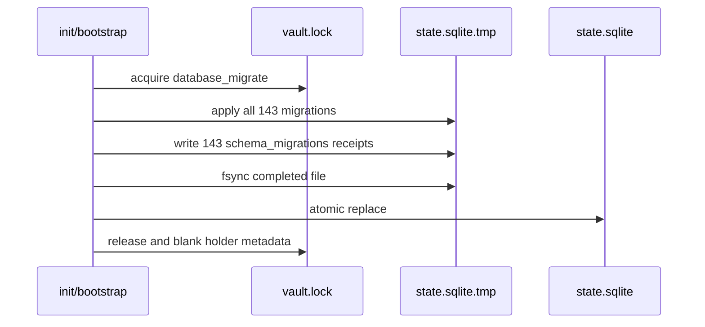

# Schema Evolution

Migration filenames use `<version>_<name>.sql`; the current head is 156 across 143 files. Missing version numbers are historical and are not errors. `schema_migrations` records each applied version, name, and timestamp. ^migration-identity

## Discovery and opening

`discover_migrations()` sorts numbered SQL files. Normal application opening goes through `open_vault_repository()`, which acquires the vault mutation lock, applies every missing migration to the configured database, and then attaches a read-write repository.

> [!note] Two paths, two identities
> `vault_root` locates `.learnloop/vault.lock`; `storage.sqlite_path` locates SQLite. Both are required because the database path is configurable.

## Fresh database publication



A crash during fresh construction leaves only the `.tmp` sibling; the next attempt replaces it. The live filename is published only after all migrations succeed and the completed file is synchronized.

## Existing database upgrades

Each unapplied migration executes under `BEGIN IMMEDIATE`, statement by complete SQLite statement. The Python driver’s `executescript()` is not used for existing databases because it implicitly commits and would break per-migration atomicity.

Migrations containing `PRAGMA foreign_keys = OFF` receive special handling:

1. enforcement is disabled before the transaction begins;
2. the table-rebuild statements and migration receipt run in one transaction;
3. `PRAGMA foreign_key_check` runs before commit;
4. failure rolls back both body and receipt;
5. foreign-key enforcement is restored in `finally`.

Real migration 153 has an injected-interruption test proving rollback and restoration.

## Read-only diagnosis

Plain doctor reads schema versions first through physical SQLite `mode=ro`; it neither creates the database nor migrates it. Checks are gated by the tables their migration level guarantees. Mutating recovery or migration requires the explicit fix path. ^doctor-read-only

```bash
learnloop doctor --vault /path/to/vault --json
```

See [[Deprecated State Gates]] for the read-only row-count warnings that intentionally block table retirement.

## Writing a migration

1. Choose the next unused integer version and a descriptive filename.
2. Make the SQL valid for both a fresh all-migrations build and an incremental existing-vault upgrade.
3. If adding/removing a table, update [[Table Roles]] in the same change.
4. Preserve historical rows and append-only triggers.
5. Add upgrade coverage to `tests/test_migrations.py`; use failure injection for table rebuilds.
6. Run `tests/test_migrate_fresh.py` for atomic publication behavior.
7. Regenerate [[Database Catalog]].

> [!danger] Never rewrite applied history
> Editing an old migration does not change databases that already recorded it. Add a new migration that transforms the old head into the new head.
