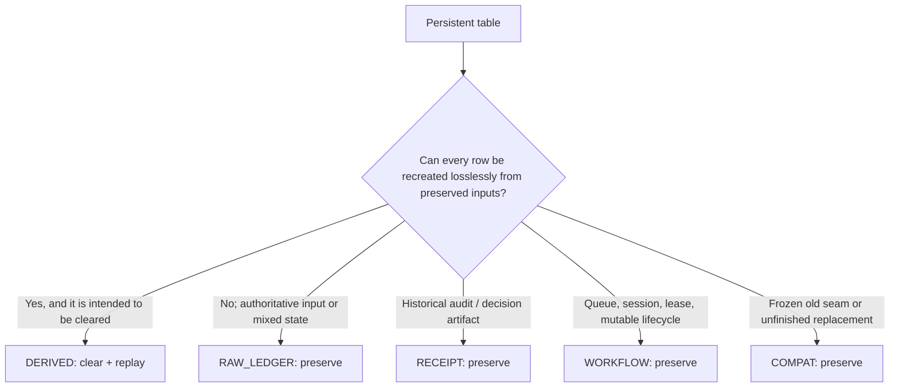

# Table Roles

`TABLE_ROLES` makes the loss policy for every migration-head table explicit. A migration that adds or removes a user table without changing this registry fails the exact-set test. The role answers one question: **what may the rebuild umbrella do to this table?** ^table-role-contract

The decision tree is important because names such as `_state`, `_report`, or `_cache` are not reliable evidence of reconstructability. Classification is explicit, never inferred by suffix.

## Raw Ledger

**126 tables.** `RAW_LEDGER` includes authored definitions, captured provider/source output, measured calibration artifacts, raw observations, and mixed rows whose historical inputs are co-located with their current head. The rebuild umbrella never clears these rows.

Examples:

- [[Reference/Database/Tables/practice_attempts|practice_attempts]] — attempt evidence replay starts here.
- [[Reference/Database/Tables/raw_grade_events|raw_grade_events]] — retained grading output avoids re-calling a provider.
- [[Reference/Database/Tables/activity_card_state|activity_card_state]] — scheduling head plus its only historical review stream remain co-located.
- [[Reference/Database/Tables/parameter_registry|parameter_registry]] — effective values are mixed with lifecycle decisions and evidence links.

> [!danger] “Could recompute some columns” is not enough
> If any authoritative receipt or calibration input would be lost, the whole table remains outside `DERIVED` until those inputs have a separate durable ledger.

## Derived

**10 tables.** A `DERIVED` table is deliberately cleared and reconstructed by exactly one registered owner. See [[Rebuild Ownership]] for the complete set and dependency order. Same-version full-column equivalence, stale-row removal, attempt coverage, and one-receipt accounting are test oracles.

Examples: [[Reference/Database/Tables/attempt_surprise|attempt_surprise]], [[Reference/Database/Tables/learning_object_mastery|learning_object_mastery]], [[Reference/Database/Tables/facet_recall_state|facet_recall_state]], and [[Reference/Database/Tables/subject_identifiability_watermarks|subject_identifiability_watermarks]].

## Receipt

**51 tables.** `RECEIPT` rows record historical decisions, audit facts, lifecycle events, and evaluation reports. They survive rebuilds. Many families also have schema triggers preventing update or delete.

Examples: [[Reference/Database/Tables/derived_state_rebuilds|derived_state_rebuilds]], [[Reference/Database/Tables/attempt_submission_receipts|attempt_submission_receipts]], [[Reference/Database/Tables/controller_decisions|controller_decisions]], and [[Reference/Database/Tables/coldness_receipts|coldness_receipts]].

## Workflow

**54 tables.** `WORKFLOW` covers mutable queues, jobs, reservations, sessions, leases, requests, and other in-flight state. These rows may transition during normal product operations but are not disposable projections.

Examples: [[Reference/Database/Tables/ingest_jobs|ingest_jobs]], [[Reference/Database/Tables/exam_sessions|exam_sessions]], [[Reference/Database/Tables/activity_surface_reservations|activity_surface_reservations]], and [[Reference/Database/Tables/question_promotion_requests|question_promotion_requests]].

## Compat

**10 tables.** `COMPAT` is frozen state retained for old vaults, dormant designs, or incomplete successor cutovers. It is preserved during rebuilds and is not synonymous with “safe to remove.”

The ten tables are:

- actively preserved legacy projections: [[Reference/Database/Tables/evidence_facet_recall_state|evidence_facet_recall_state]], [[Reference/Database/Tables/facet_uncertainty|facet_uncertainty]], [[Reference/Database/Tables/elicitation_events|elicitation_events]], [[Reference/Database/Tables/hypothesis_sets|hypothesis_sets]], [[Reference/Database/Tables/learner_state_beliefs|learner_state_beliefs]], and [[Reference/Database/Tables/lo_probe_state|lo_probe_state]];
- an active historical seam: [[Reference/Database/Tables/practice_item_state|practice_item_state]];
- owner-gated dormant state: [[Reference/Database/Tables/source_exam_profiles|source_exam_profiles]], [[Reference/Database/Tables/source_locator_schemes|source_locator_schemes]], and [[Reference/Database/Tables/learner_theta|learner_theta]].

## Role versus functionality status

Role and current runtime status are orthogonal:

| Functionality status | Meaning | May rebuild clear it? |
|---|---|---|
| `active` | Participates in a current persistence/audit/workflow contract | Only if role is `derived` |
| `active-historical-seam` | Still used while a successor is incomplete | No |
| `legacy-preserved` | Frozen but required for old vault interpretation | No |
| `dormant-shadow` | Executable telemetry with zero live authority | No |
| `dormant-owner-gated` | No established live caller; telemetry and owner decision gate retirement | No |

Shadow tables such as [[Reference/Database/Tables/controller_shadow_predictions|controller_shadow_predictions]] are `RECEIPT`, not `COMPAT`, because their purpose is a live audit trail even though their predictions are deliberately non-authoritative.

## Modification checklist

1. Add the numbered migration.
2. Classify every added/removed table explicitly in `TABLE_ROLES`.
3. If `DERIVED`, add exactly one owner to `DERIVED_STATE_REPLAYERS` and place it after its dependencies.
4. Run `tests/test_migrations.py`, `tests/test_table_roles.py`, and—when applicable—`tests/test_rebuild_orchestrator.py` plus `tests/test_shadow_rebuild.py`.
5. Regenerate [[Database Catalog]].
