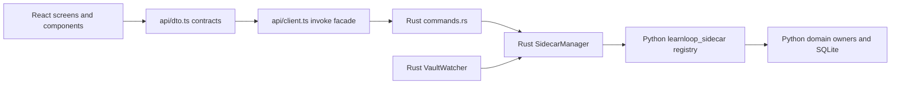

# Desktop Module Catalog

> [!abstract] Exact coverage
> One generated note exists for each of the **102 live TypeScript/TSX modules** under `apps/learnloop-tauri/src` and **5 authored Rust crate modules** under `src-tauri/src`. Cargo `target/` output and `build.rs` are not runtime crate modules and are intentionally excluded.

^desktop-catalog-coverage

## Runtime bridge



The diagram makes the cross-language request boundary explicit: TypeScript presents and adapts, Rust owns native transport/process concerns, and Python remains the learning and persistent-state authority. See [[Architecture/Adapter Architecture#Request flow|request flow]].

## Area maps

| Area | Direct modules | Responsibility |
|---|---:|---|
| [[Reference/Desktop/Rust/_area|Rust]] | 5 | The native Tauri shell, command bridge, sidecar process manager, error contract, and vault watcher. |
| [[Reference/Desktop/TypeScript/_area|TypeScript]] | 4 | The React renderer entry point and cross-cutting frontend modules. |
| [[Reference/Desktop/TypeScript/api/_area|TypeScript/api]] | 2 | Typed DTOs and the renderer-to-Tauri invocation facade. |
| [[Reference/Desktop/TypeScript/app/_area|TypeScript/app]] | 4 | Desktop shell orchestration, keyboard policy, configuration helpers, and recent-vault state. |
| [[Reference/Desktop/TypeScript/components/_area|TypeScript/components]] | 44 | Reusable learner-facing controls and composite interaction surfaces. |
| [[Reference/Desktop/TypeScript/components/goldenpath/_area|TypeScript/components/goldenpath]] | 3 | Golden-path setup and triage components used by the staged learning journey. |
| [[Reference/Desktop/TypeScript/components/graphedit/_area|TypeScript/components/graphedit]] | 5 | Study-map editing widgets, pending edits, and geometry previews. |
| [[Reference/Desktop/TypeScript/components/recipeedit/_area|TypeScript/components/recipeedit]] | 1 | Recipe-tree editing for structured learning plans. |
| [[Reference/Desktop/TypeScript/fixtures/_area|TypeScript/fixtures]] | 1 | Deterministic renderer fixtures used to demonstrate or restore known states. |
| [[Reference/Desktop/TypeScript/fixtures/goldenpath/_area|TypeScript/fixtures/goldenpath]] | 1 | A barrel over checked-in golden-path JSON scenario fixtures. |
| [[Reference/Desktop/TypeScript/render/_area|TypeScript/render]] | 3 | Markdown, mathematics, and live-editor rendering adapters. |
| [[Reference/Desktop/TypeScript/screens/_area|TypeScript/screens]] | 25 | Top-level routed workflow screens in the desktop shell. |
| [[Reference/Desktop/TypeScript/screens/reader/_area|TypeScript/screens/reader]] | 1 | Reader request-state coordination extracted from the main reader screen. |
| [[Reference/Desktop/TypeScript/screens/startBackdrops/_area|TypeScript/screens/startBackdrops]] | 8 | Canvas/SVG simulations and workers used as the start-screen visual backdrop. |

## Status and evidence

| Refactor status | Modules | Positive evidence required |
|---|---:|---|
| `ACTIVE` | 107 | Current entry/build reachability or an explicit compiler inclusion. |
| `DORMANT` | 0 | An owned retained seam plus evidence that no primary workflow uses it. |
| `COMPAT` | 0 | An explicitly frozen compatibility contract. |
| `EVALUATION` | 0 | A simulation/audit surface that measures rather than serves the learner. |

The audit proves **101 TypeScript/TSX files** are reachable through static imports from `src/main.tsx`, **1 ambient declaration** is included by `tsconfig.json`, and **5 Rust modules** are reachable by `mod`/`crate` edges from native `main.rs`.

The reachability set includes all **2 authored fixture modules** through current Reader/GoldenPath screens and all **8 backdrop/worker modules** through StartScreen's supported optional presentation paths. Entry files are active roots. Therefore all 107 files are `ACTIVE`; none has positive evidence for `DORMANT`, `COMPAT`, or `EVALUATION`.

> [!warning] Static graph limits
> Import and symbol-reference edges are reproducible build evidence, not runtime tracing. The generator refuses an unclassified file instead of treating a missing caller as proof of dormancy; a new implicit entry requires an explicit audit rule.

## Find a desktop module

```query
path:"Reference/Desktop" tag:#learnloop/desktop/typescript
```

```query
path:"Reference/Desktop" section:("Modification guidance") "RPC"
```

> [!tip] Optional Dataview index
> The vault works without Dataview; when enabled, this produces a sortable source table.

```dataview
TABLE language AS Language, area AS Area, source_path AS Source, source_commit_timestamp AS Commit
FROM "Reference/Desktop"
WHERE type = "desktop-module-reference"
SORT source_path ASC
```

## How to change the desktop safely

1. Locate a module through its area map and inspect inbound consumers and outbound dependencies.
2. Follow the canonical workflow/concept links for semantics; do not derive learning policy from UI wording.
3. For an RPC shape change, keep TypeScript DTO/client, Rust command registration/bridge, and Python handler/registry synchronized.
4. Run the focused cross-boundary tests, frontend typecheck/build, and Rust tests named in the module note.
5. Regenerate and validate this reference.

## Maintenance

```bash
.venv/bin/python docs/learnloop-architecture-vault/_scripts/desktop_generate.py
.venv/bin/python docs/learnloop-architecture-vault/_scripts/desktop_validate.py
```

Use `desktop_generate.py --check` in CI to verify byte-for-byte reproducibility without writing files.
