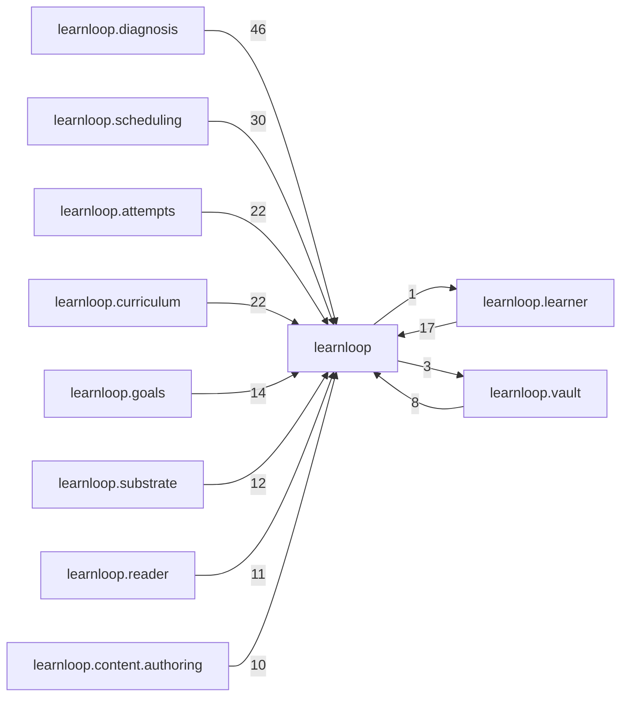

# `learnloop` package map

> [!info] Generated package map
> This map is generated from live modules and their static imports. Follow module links for source-level facts and canonical concept/workflow links for system behavior.

Up: [[Module Catalog]]

## Responsibility

Application-level coordinators and dependency-neutral authorities shared across LearnLoop.

For system intent, use [[Architecture Overview]].

^package-purpose

## Module index

| Module | Purpose | Status | Direct importers | Direct test files |
|---|---|---:|---:|---:|
| [[Reference/Modules/learnloop/__init__|learnloop]] | [[Reference/Modules/learnloop/__init__#^module-purpose|purpose]] | `ACTIVE` | 0 | 0 |
| [[Reference/Modules/learnloop/__main__|learnloop.__main__]] | [[Reference/Modules/learnloop/__main__#^module-purpose|purpose]] | `ACTIVE` | 0 | 0 |
| [[Reference/Modules/learnloop/algorithm_versions|learnloop.algorithm_versions]] | [[Reference/Modules/learnloop/algorithm_versions#^module-purpose|purpose]] | `ACTIVE` | 2 | 2 |
| [[Reference/Modules/learnloop/app_launch|learnloop.app_launch]] | [[Reference/Modules/learnloop/app_launch#^module-purpose|purpose]] | `ACTIVE` | 1 | 0 |
| [[Reference/Modules/learnloop/attempt_types|learnloop.attempt_types]] | [[Reference/Modules/learnloop/attempt_types#^module-purpose|purpose]] | `ACTIVE` | 7 | 1 |
| [[Reference/Modules/learnloop/bootstrap|learnloop.bootstrap]] | [[Reference/Modules/learnloop/bootstrap#^module-purpose|purpose]] | `ACTIVE` | 2 | 1 |
| [[Reference/Modules/learnloop/causal_activity_policy|learnloop.causal_activity_policy]] | [[Reference/Modules/learnloop/causal_activity_policy#^module-purpose|purpose]] | `ACTIVE` | 2 | 1 |
| [[Reference/Modules/learnloop/clock|learnloop.clock]] | [[Reference/Modules/learnloop/clock#^module-purpose|purpose]] | `ACTIVE` | 181 | 260 |
| [[Reference/Modules/learnloop/ids|learnloop.ids]] | [[Reference/Modules/learnloop/ids#^module-purpose|purpose]] | `ACTIVE` | 52 | 16 |
| [[Reference/Modules/learnloop/migration_coordinator|learnloop.migration_coordinator]] | [[Reference/Modules/learnloop/migration_coordinator#^module-purpose|purpose]] | `ACTIVE` | 3 | 1 |
| [[Reference/Modules/learnloop/numeric|learnloop.numeric]] | [[Reference/Modules/learnloop/numeric#^module-purpose|purpose]] | `ACTIVE` | 18 | 2 |
| [[Reference/Modules/learnloop/vault_lock|learnloop.vault_lock]] | [[Reference/Modules/learnloop/vault_lock#^module-purpose|purpose]] | `ACTIVE` | 3 | 0 |

## Child package maps

- [[Reference/Modules/learnloop/ai/_package|learnloop.ai]] — Provider-neutral structured transport, routing, provider composition, capability checks, and usage accounting.
- [[Reference/Modules/learnloop/attempts/_package|learnloop.attempts]] — Attempt acceptance, grading, interaction evidence, feedback, and post-attempt processing.
- [[Reference/Modules/learnloop/cli/_package|learnloop.cli]] — Typer command adapters, rendering, argument contracts, and command registration.
- [[Reference/Modules/learnloop/config/_package|learnloop.config]] — Typed configuration schema, compatibility normalization, loading, and template emission.
- [[Reference/Modules/learnloop/content/_package|learnloop.content]] — Source-derived content, authoring, synthesis, proposal, and canonical pipeline ownership.
- [[Reference/Modules/learnloop/curriculum/_package|learnloop.curriculum]] — Commitments, blueprints, depth structures, concept relationships, and golden paths.
- [[Reference/Modules/learnloop/db/_package|learnloop.db]] — SQLite connections, migrations, repository compatibility, table roles, rebuilds, and persistence infrastructure.
- [[Reference/Modules/learnloop/diagnosis/_package|learnloop.diagnosis]] — Diagnostic probes, causal attribution, error classification, and remediation decisions.
- [[Reference/Modules/learnloop/goals/_package|learnloop.goals]] — Learning goals, forecasts, certification, readiness, and exam workflows.
- [[Reference/Modules/learnloop/ingest/_package|learnloop.ingest]] — Acquisition intermediate representation, locators, fetchers, originals, and ingestion orchestration.
- [[Reference/Modules/learnloop/learner/_package|learnloop.learner]] — Mastery, recall, evidence, claims, ability transitions, and learner-state views.
- [[Reference/Modules/learnloop/ops/_package|learnloop.ops]] — Vault diagnostics, locks, settings, startup, upgrades, and operator-facing maintenance.
- [[Reference/Modules/learnloop/params/_package|learnloop.params]] — Algorithm parameter registry, fitted values, and sensitivity certificates.
- [[Reference/Modules/learnloop/reader/_package|learnloop.reader]] — Reader-mode source exploration, annotations, quick checks, and authoring handoffs.
- [[Reference/Modules/learnloop/scheduling/_package|learnloop.scheduling]] — Selection, review timing, progression, controller decisions, and scheduling projections.
- [[Reference/Modules/learnloop/sim/_package|learnloop.sim]] — Offline simulation, benchmark, sweep, synthetic-student, and algorithm evaluation tools.
- [[Reference/Modules/learnloop/substrate/_package|learnloop.substrate]] — Activity, card, surface, and identity substrate plus canonical projections.
- [[Reference/Modules/learnloop/tui/_package|learnloop.tui]] — Textual UI adapter, screens, widgets, state, and presentation behavior.
- [[Reference/Modules/learnloop/tutor/_package|learnloop.tutor]] — Tutoring, hints, teach-back, and tutor question-and-answer workflows.
- [[Reference/Modules/learnloop/vault/_package|learnloop.vault]] — Filesystem layout, Markdown/YAML I/O, hashes, models, loading, and writing.

## Cross-package dependencies

### This package imports

- [[Reference/Modules/learnloop/vault/_package|learnloop.vault]] — 3 static module edges
- [[Reference/Modules/learnloop/cli/_package|learnloop.cli]] — 1 static module edge
- [[Reference/Modules/learnloop/config/_package|learnloop.config]] — 1 static module edge
- [[Reference/Modules/learnloop/content/synthesis/_package|learnloop.content.synthesis]] — 1 static module edge
- [[Reference/Modules/learnloop/db/_package|learnloop.db]] — 1 static module edge
- [[Reference/Modules/learnloop/learner/_package|learnloop.learner]] — 1 static module edge
- [[Reference/Modules/learnloop/ops/_package|learnloop.ops]] — 1 static module edge
- [[Reference/Modules/learnloop/tui/_package|learnloop.tui]] — 1 static module edge

### Packages that import this package

- [[Reference/Modules/learnloop/diagnosis/_package|learnloop.diagnosis]] — 46 static module edges
- [[Reference/Modules/learnloop/scheduling/_package|learnloop.scheduling]] — 30 static module edges
- [[Reference/Modules/learnloop/attempts/_package|learnloop.attempts]] — 22 static module edges
- [[Reference/Modules/learnloop/curriculum/_package|learnloop.curriculum]] — 22 static module edges
- [[Reference/Modules/learnloop/learner/_package|learnloop.learner]] — 17 static module edges
- [[Reference/Modules/learnloop/goals/_package|learnloop.goals]] — 14 static module edges
- [[Reference/Modules/learnloop/substrate/_package|learnloop.substrate]] — 12 static module edges
- [[Reference/Modules/learnloop/reader/_package|learnloop.reader]] — 11 static module edges
- [[Reference/Modules/learnloop/content/authoring/_package|learnloop.content.authoring]] — 10 static module edges
- [[Reference/Modules/learnloop/content/proposals/_package|learnloop.content.proposals]] — 9 static module edges
- [[Reference/Modules/learnloop/content/synthesis/_package|learnloop.content.synthesis]] — 9 static module edges
- [[Reference/Modules/learnloop_sidecar/handlers/_package|learnloop_sidecar.handlers]] — 9 static module edges
- [[Reference/Modules/learnloop/content/pipeline/_package|learnloop.content.pipeline]] — 8 static module edges
- [[Reference/Modules/learnloop/vault/_package|learnloop.vault]] — 8 static module edges
- [[Reference/Modules/learnloop/tutor/_package|learnloop.tutor]] — 7 static module edges
- [[Reference/Modules/learnloop/cli/_package|learnloop.cli]] — 6 static module edges
- [[Reference/Modules/learnloop/db/_package|learnloop.db]] — 6 static module edges
- [[Reference/Modules/learnloop/ops/_package|learnloop.ops]] — 5 static module edges
- [[Reference/Modules/learnloop/sim/_package|learnloop.sim]] — 5 static module edges
- [[Reference/Modules/learnloop/content/sources/_package|learnloop.content.sources]] — 3 static module edges
- [[Reference/Modules/learnloop/params/_package|learnloop.params]] — 2 static module edges
- [[Reference/Modules/learnloop/substrate/compat/_package|learnloop.substrate.compat]] — 2 static module edges
- [[Reference/Modules/learnloop/ai/_package|learnloop.ai]] — 1 static module edge
- [[Reference/Modules/learnloop/db/stores/_package|learnloop.db.stores]] — 1 static module edge
- [[Reference/Modules/learnloop/tui/screens/_package|learnloop.tui.screens]] — 1 static module edge
- [[Reference/Modules/learnloop_sidecar/_package|learnloop_sidecar]] — 1 static module edge

### Dependency neighborhood

This diagram compresses package-level static imports; edge labels are distinct module-to-module import counts.



Interpretation: arrow direction is static import direction and the label is the number of distinct module-to-module edges. It shows coupling pressure, not runtime call frequency or ownership permission.

## Workflow entry points

- [[Initialize a Vault]]
- [[Start a Learning Cycle]]

## Find and filter

Use Obsidian's native search:

```query
path:"Reference/Modules/learnloop" tag:#docs/module
```

To change this package, start with a module's [[#Module index|purpose link]], then follow its callers, tests, and modification guidance. Re-run the generator after source changes.
