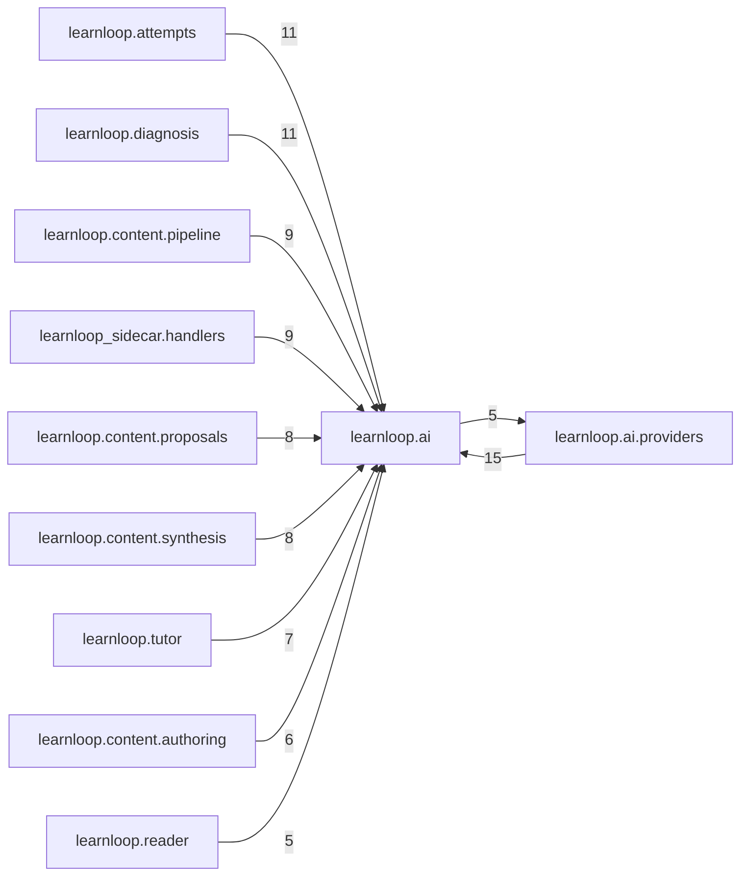

# `learnloop.ai` package map

> [!info] Generated package map
> This map is generated from live modules and their static imports. Follow module links for source-level facts and canonical concept/workflow links for system behavior.

Up: [[Module Catalog]]

## Responsibility

Provider-neutral structured transport, routing, provider composition, capability checks, and usage accounting.

For system intent, use [[AI Architecture]], [[Architecture Overview]].

^package-purpose

## Module index

| Module | Purpose | Status | Direct importers | Direct test files |
|---|---|---:|---:|---:|
| [[Reference/Modules/learnloop/ai/__init__|learnloop.ai]] | [[Reference/Modules/learnloop/ai/__init__#^module-purpose|purpose]] | `ACTIVE` | 0 | 0 |
| [[Reference/Modules/learnloop/ai/client|learnloop.ai.client]] | [[Reference/Modules/learnloop/ai/client#^module-purpose|purpose]] | `ACTIVE` | 6 | 3 |
| [[Reference/Modules/learnloop/ai/errors|learnloop.ai.errors]] | [[Reference/Modules/learnloop/ai/errors#^module-purpose|purpose]] | `ACTIVE` | 19 | 12 |
| [[Reference/Modules/learnloop/ai/multimodal|learnloop.ai.multimodal]] | [[Reference/Modules/learnloop/ai/multimodal#^module-purpose|purpose]] | `ACTIVE` | 2 | 1 |
| [[Reference/Modules/learnloop/ai/routing|learnloop.ai.routing]] | [[Reference/Modules/learnloop/ai/routing#^module-purpose|purpose]] | `ACTIVE` | 10 | 2 |
| [[Reference/Modules/learnloop/ai/runs|learnloop.ai.runs]] | [[Reference/Modules/learnloop/ai/runs#^module-purpose|purpose]] | `ACTIVE` | 7 | 1 |
| [[Reference/Modules/learnloop/ai/runtime|learnloop.ai.runtime]] | [[Reference/Modules/learnloop/ai/runtime#^module-purpose|purpose]] | `ACTIVE` | 7 | 6 |
| [[Reference/Modules/learnloop/ai/schemas|learnloop.ai.schemas]] | [[Reference/Modules/learnloop/ai/schemas#^module-purpose|purpose]] | `ACTIVE` | 13 | 2 |
| [[Reference/Modules/learnloop/ai/strict_schema|learnloop.ai.strict_schema]] | [[Reference/Modules/learnloop/ai/strict_schema#^module-purpose|purpose]] | `ACTIVE` | 4 | 2 |
| [[Reference/Modules/learnloop/ai/transport|learnloop.ai.transport]] | [[Reference/Modules/learnloop/ai/transport#^module-purpose|purpose]] | `ACTIVE` | 38 | 7 |
| [[Reference/Modules/learnloop/ai/usage|learnloop.ai.usage]] | [[Reference/Modules/learnloop/ai/usage#^module-purpose|purpose]] | `ACTIVE` | 8 | 3 |

## Child package maps

- [[Reference/Modules/learnloop/ai/providers/_package|learnloop.ai.providers]] — Concrete AI transport adapters behind the provider-neutral contract.

## Cross-package dependencies

### This package imports

- [[Reference/Modules/learnloop/ai/providers/_package|learnloop.ai.providers]] — 5 static module edges
- [[Reference/Modules/learnloop/config/_package|learnloop.config]] — 4 static module edges
- [[Reference/Modules/learnloop/_package|learnloop]] — 1 static module edge
- [[Reference/Modules/learnloop/db/_package|learnloop.db]] — 1 static module edge

### Packages that import this package

- [[Reference/Modules/learnloop/ai/providers/_package|learnloop.ai.providers]] — 15 static module edges
- [[Reference/Modules/learnloop/attempts/_package|learnloop.attempts]] — 11 static module edges
- [[Reference/Modules/learnloop/diagnosis/_package|learnloop.diagnosis]] — 11 static module edges
- [[Reference/Modules/learnloop/content/pipeline/_package|learnloop.content.pipeline]] — 9 static module edges
- [[Reference/Modules/learnloop_sidecar/handlers/_package|learnloop_sidecar.handlers]] — 9 static module edges
- [[Reference/Modules/learnloop/content/proposals/_package|learnloop.content.proposals]] — 8 static module edges
- [[Reference/Modules/learnloop/content/synthesis/_package|learnloop.content.synthesis]] — 8 static module edges
- [[Reference/Modules/learnloop/tutor/_package|learnloop.tutor]] — 7 static module edges
- [[Reference/Modules/learnloop/content/authoring/_package|learnloop.content.authoring]] — 6 static module edges
- [[Reference/Modules/learnloop/reader/_package|learnloop.reader]] — 5 static module edges
- [[Reference/Modules/learnloop/curriculum/_package|learnloop.curriculum]] — 4 static module edges
- [[Reference/Modules/learnloop/ops/_package|learnloop.ops]] — 4 static module edges
- [[Reference/Modules/learnloop/cli/_package|learnloop.cli]] — 2 static module edges
- [[Reference/Modules/learnloop/tui/screens/_package|learnloop.tui.screens]] — 2 static module edges
- [[Reference/Modules/learnloop/db/_package|learnloop.db]] — 1 static module edge
- [[Reference/Modules/learnloop/sim/_package|learnloop.sim]] — 1 static module edge
- [[Reference/Modules/learnloop_sidecar/_package|learnloop_sidecar]] — 1 static module edge

### Dependency neighborhood

This diagram compresses package-level static imports; edge labels are distinct module-to-module import counts.



Interpretation: arrow direction is static import direction and the label is the number of distinct module-to-module edges. It shows coupling pressure, not runtime call frequency or ownership permission.

## Workflow entry points

- [[Process Model Output]]

## Find and filter

Use Obsidian's native search:

```query
path:"Reference/Modules/learnloop/ai" tag:#docs/module
```

To change this package, start with a module's [[#Module index|purpose link]], then follow its callers, tests, and modification guidance. Re-run the generator after source changes.
