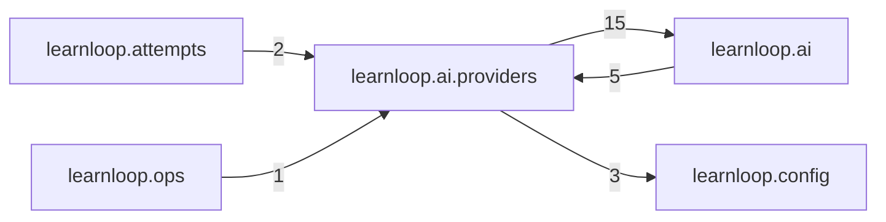

# `learnloop.ai.providers` package map

> [!info] Generated package map
> This map is generated from live modules and their static imports. Follow module links for source-level facts and canonical concept/workflow links for system behavior.

Up: [[Module Catalog]]

## Responsibility

Concrete AI transport adapters behind the provider-neutral contract.

For system intent, use [[AI Architecture]], [[Architecture Overview]].

^package-purpose

## Module index

| Module | Purpose | Status | Direct importers | Direct test files |
|---|---|---:|---:|---:|
| [[Reference/Modules/learnloop/ai/providers/__init__|learnloop.ai.providers]] | [[Reference/Modules/learnloop/ai/providers/__init__#^module-purpose|purpose]] | `ACTIVE` | 0 | 0 |
| [[Reference/Modules/learnloop/ai/providers/codex|learnloop.ai.providers.codex]] | [[Reference/Modules/learnloop/ai/providers/codex#^module-purpose|purpose]] | `ACTIVE` | 6 | 12 |
| [[Reference/Modules/learnloop/ai/providers/codex_http|learnloop.ai.providers.codex_http]] | [[Reference/Modules/learnloop/ai/providers/codex_http#^module-purpose|purpose]] | `ACTIVE` | 2 | 4 |
| [[Reference/Modules/learnloop/ai/providers/openai_chat|learnloop.ai.providers.openai_chat]] | [[Reference/Modules/learnloop/ai/providers/openai_chat#^module-purpose|purpose]] | `ACTIVE` | 2 | 5 |
| [[Reference/Modules/learnloop/ai/providers/openrouter|learnloop.ai.providers.openrouter]] | [[Reference/Modules/learnloop/ai/providers/openrouter#^module-purpose|purpose]] | `ACTIVE` | 1 | 2 |
| [[Reference/Modules/learnloop/ai/providers/structured_output|learnloop.ai.providers.structured_output]] | [[Reference/Modules/learnloop/ai/providers/structured_output#^module-purpose|purpose]] | `ACTIVE` | 1 | 0 |

## Cross-package dependencies

### This package imports

- [[Reference/Modules/learnloop/ai/_package|learnloop.ai]] — 15 static module edges
- [[Reference/Modules/learnloop/config/_package|learnloop.config]] — 3 static module edges

### Packages that import this package

- [[Reference/Modules/learnloop/ai/_package|learnloop.ai]] — 5 static module edges
- [[Reference/Modules/learnloop/attempts/_package|learnloop.attempts]] — 2 static module edges
- [[Reference/Modules/learnloop/ops/_package|learnloop.ops]] — 1 static module edge

### Dependency neighborhood

This diagram compresses package-level static imports; edge labels are distinct module-to-module import counts.



Interpretation: arrow direction is static import direction and the label is the number of distinct module-to-module edges. It shows coupling pressure, not runtime call frequency or ownership permission.

## Workflow entry points

- [[Process Model Output]]

## Find and filter

Use Obsidian's native search:

```query
path:"Reference/Modules/learnloop/ai/providers" tag:#docs/module
```

To change this package, start with a module's [[#Module index|purpose link]], then follow its callers, tests, and modification guidance. Re-run the generator after source changes.
