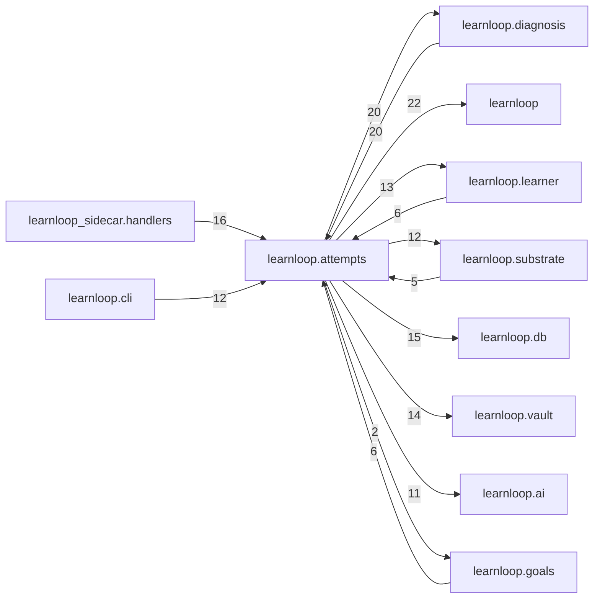

# `learnloop.attempts` package map

> [!info] Generated package map
> This map is generated from live modules and their static imports. Follow module links for source-level facts and canonical concept/workflow links for system behavior.

Up: [[Module Catalog]]

## Responsibility

Attempt acceptance, grading, interaction evidence, feedback, and post-attempt processing.

For system intent, use [[Learning System]].

^package-purpose

## Module index

| Module | Purpose | Status | Direct importers | Direct test files |
|---|---|---:|---:|---:|
| [[Reference/Modules/learnloop/attempts/__init__|learnloop.attempts]] | [[Reference/Modules/learnloop/attempts/__init__#^module-purpose|purpose]] | `ACTIVE` | 0 | 0 |
| [[Reference/Modules/learnloop/attempts/ability_transition|learnloop.attempts.ability_transition]] | [[Reference/Modules/learnloop/attempts/ability_transition#^module-purpose|purpose]] | `ACTIVE` | 2 | 0 |
| [[Reference/Modules/learnloop/attempts/ai_contracts|learnloop.attempts.ai_contracts]] | [[Reference/Modules/learnloop/attempts/ai_contracts#^module-purpose|purpose]] | `ACTIVE` | 8 | 23 |
| [[Reference/Modules/learnloop/attempts/attempt_trace|learnloop.attempts.attempt_trace]] | [[Reference/Modules/learnloop/attempts/attempt_trace#^module-purpose|purpose]] | `ACTIVE` | 1 | 0 |
| [[Reference/Modules/learnloop/attempts/attempts|learnloop.attempts.attempts]] | [[Reference/Modules/learnloop/attempts/attempts#^module-purpose|purpose]] | `ACTIVE` | 20 | 115 |
| [[Reference/Modules/learnloop/attempts/calibration_streams|learnloop.attempts.calibration_streams]] | [[Reference/Modules/learnloop/attempts/calibration_streams#^module-purpose|purpose]] | `ACTIVE` | 2 | 1 |
| [[Reference/Modules/learnloop/attempts/clarification|learnloop.attempts.clarification]] | [[Reference/Modules/learnloop/attempts/clarification#^module-purpose|purpose]] | `ACTIVE` | 6 | 2 |
| [[Reference/Modules/learnloop/attempts/coldness_receipt|learnloop.attempts.coldness_receipt]] | [[Reference/Modules/learnloop/attempts/coldness_receipt#^module-purpose|purpose]] | `ACTIVE` | 4 | 2 |
| [[Reference/Modules/learnloop/attempts/effective_observation|learnloop.attempts.effective_observation]] | [[Reference/Modules/learnloop/attempts/effective_observation#^module-purpose|purpose]] | `ACTIVE` | 3 | 3 |
| [[Reference/Modules/learnloop/attempts/evidence|learnloop.attempts.evidence]] | [[Reference/Modules/learnloop/attempts/evidence#^module-purpose|purpose]] | `ACTIVE` | 7 | 3 |
| [[Reference/Modules/learnloop/attempts/grade_classifier|learnloop.attempts.grade_classifier]] | [[Reference/Modules/learnloop/attempts/grade_classifier#^module-purpose|purpose]] | `ACTIVE` | 3 | 1 |
| [[Reference/Modules/learnloop/attempts/grade_resolution|learnloop.attempts.grade_resolution]] | [[Reference/Modules/learnloop/attempts/grade_resolution#^module-purpose|purpose]] | `ACTIVE` | 5 | 5 |
| [[Reference/Modules/learnloop/attempts/grader_calibration|learnloop.attempts.grader_calibration]] | [[Reference/Modules/learnloop/attempts/grader_calibration#^module-purpose|purpose]] | `ACTIVE` | 4 | 3 |
| [[Reference/Modules/learnloop/attempts/grading|learnloop.attempts.grading]] | [[Reference/Modules/learnloop/attempts/grading#^module-purpose|purpose]] | `ACTIVE` | 19 | 15 |
| [[Reference/Modules/learnloop/attempts/measurement_corrections|learnloop.attempts.measurement_corrections]] | [[Reference/Modules/learnloop/attempts/measurement_corrections#^module-purpose|purpose]] | `ACTIVE` | 1 | 1 |
| [[Reference/Modules/learnloop/attempts/observations|learnloop.attempts.observations]] | [[Reference/Modules/learnloop/attempts/observations#^module-purpose|purpose]] | `ACTIVE` | 1 | 2 |
| [[Reference/Modules/learnloop/attempts/outcome_schemas|learnloop.attempts.outcome_schemas]] | [[Reference/Modules/learnloop/attempts/outcome_schemas#^module-purpose|purpose]] | `ACTIVE` | 6 | 5 |
| [[Reference/Modules/learnloop/attempts/post_attempt|learnloop.attempts.post_attempt]] | [[Reference/Modules/learnloop/attempts/post_attempt#^module-purpose|purpose]] | `ACTIVE` | 6 | 3 |
| [[Reference/Modules/learnloop/attempts/regrade|learnloop.attempts.regrade]] | [[Reference/Modules/learnloop/attempts/regrade#^module-purpose|purpose]] | `ACTIVE` | 3 | 4 |
| [[Reference/Modules/learnloop/attempts/reveal_ledger|learnloop.attempts.reveal_ledger]] | [[Reference/Modules/learnloop/attempts/reveal_ledger#^module-purpose|purpose]] | `ACTIVE` | 4 | 2 |
| [[Reference/Modules/learnloop/attempts/salience_firewall|learnloop.attempts.salience_firewall]] | [[Reference/Modules/learnloop/attempts/salience_firewall#^module-purpose|purpose]] | `ACTIVE` | 6 | 5 |
| [[Reference/Modules/learnloop/attempts/surprise|learnloop.attempts.surprise]] | [[Reference/Modules/learnloop/attempts/surprise#^module-purpose|purpose]] | `ACTIVE` | 1 | 1 |
| [[Reference/Modules/learnloop/attempts/trace_evidence|learnloop.attempts.trace_evidence]] | [[Reference/Modules/learnloop/attempts/trace_evidence#^module-purpose|purpose]] | `ACTIVE` | 4 | 2 |

## Cross-package dependencies

### This package imports

- [[Reference/Modules/learnloop/_package|learnloop]] — 22 static module edges
- [[Reference/Modules/learnloop/diagnosis/_package|learnloop.diagnosis]] — 20 static module edges
- [[Reference/Modules/learnloop/db/_package|learnloop.db]] — 15 static module edges
- [[Reference/Modules/learnloop/vault/_package|learnloop.vault]] — 14 static module edges
- [[Reference/Modules/learnloop/learner/_package|learnloop.learner]] — 13 static module edges
- [[Reference/Modules/learnloop/substrate/_package|learnloop.substrate]] — 12 static module edges
- [[Reference/Modules/learnloop/ai/_package|learnloop.ai]] — 11 static module edges
- [[Reference/Modules/learnloop/params/_package|learnloop.params]] — 4 static module edges
- [[Reference/Modules/learnloop/config/_package|learnloop.config]] — 3 static module edges
- [[Reference/Modules/learnloop/ai/providers/_package|learnloop.ai.providers]] — 2 static module edges
- [[Reference/Modules/learnloop/goals/_package|learnloop.goals]] — 2 static module edges
- [[Reference/Modules/learnloop/content/authoring/_package|learnloop.content.authoring]] — 1 static module edge
- [[Reference/Modules/learnloop/content/proposals/_package|learnloop.content.proposals]] — 1 static module edge
- [[Reference/Modules/learnloop/scheduling/_package|learnloop.scheduling]] — 1 static module edge
- [[Reference/Modules/learnloop/tutor/_package|learnloop.tutor]] — 1 static module edge

### Packages that import this package

- [[Reference/Modules/learnloop/diagnosis/_package|learnloop.diagnosis]] — 20 static module edges
- [[Reference/Modules/learnloop_sidecar/handlers/_package|learnloop_sidecar.handlers]] — 16 static module edges
- [[Reference/Modules/learnloop/cli/_package|learnloop.cli]] — 12 static module edges
- [[Reference/Modules/learnloop/goals/_package|learnloop.goals]] — 6 static module edges
- [[Reference/Modules/learnloop/learner/_package|learnloop.learner]] — 6 static module edges
- [[Reference/Modules/learnloop/scheduling/_package|learnloop.scheduling]] — 6 static module edges
- [[Reference/Modules/learnloop/sim/_package|learnloop.sim]] — 5 static module edges
- [[Reference/Modules/learnloop/substrate/_package|learnloop.substrate]] — 5 static module edges
- [[Reference/Modules/learnloop/reader/_package|learnloop.reader]] — 4 static module edges
- [[Reference/Modules/learnloop/tui/screens/_package|learnloop.tui.screens]] — 4 static module edges
- [[Reference/Modules/learnloop/tutor/_package|learnloop.tutor]] — 3 static module edges
- [[Reference/Modules/learnloop/content/authoring/_package|learnloop.content.authoring]] — 2 static module edges
- [[Reference/Modules/learnloop/ops/_package|learnloop.ops]] — 2 static module edges
- [[Reference/Modules/learnloop/curriculum/_package|learnloop.curriculum]] — 1 static module edge

### Dependency neighborhood

This diagram compresses package-level static imports; edge labels are distinct module-to-module import counts.



Interpretation: arrow direction is static import direction and the label is the number of distinct module-to-module edges. It shows coupling pressure, not runtime call frequency or ownership permission.

## Workflow entry points

- [[Start a Learning Cycle]]
- [[Inspect Persistent State]]

## Find and filter

Use Obsidian's native search:

```query
path:"Reference/Modules/learnloop/attempts" tag:#docs/module
```

To change this package, start with a module's [[#Module index|purpose link]], then follow its callers, tests, and modification guidance. Re-run the generator after source changes.
