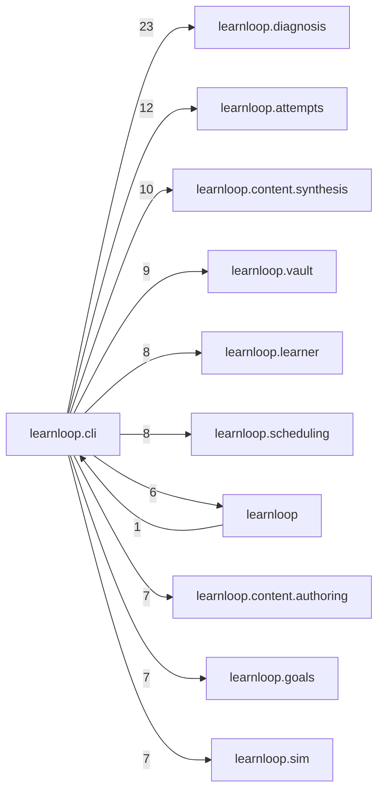

# `learnloop.cli` package map

> [!info] Generated package map
> This map is generated from live modules and their static imports. Follow module links for source-level facts and canonical concept/workflow links for system behavior.

Up: [[Module Catalog]]

## Responsibility

Typer command adapters, rendering, argument contracts, and command registration.

For system intent, use [[Architecture Overview]].

^package-purpose

## Module index

| Module | Purpose | Status | Direct importers | Direct test files |
|---|---|---:|---:|---:|
| [[Reference/Modules/learnloop/cli/__init__|learnloop.cli]] | [[Reference/Modules/learnloop/cli/__init__#^module-purpose|purpose]] | `ACTIVE` | 0 | 3 |
| [[Reference/Modules/learnloop/cli/app|learnloop.cli.app]] | [[Reference/Modules/learnloop/cli/app#^module-purpose|purpose]] | `ACTIVE` | 2 | 35 |
| [[Reference/Modules/learnloop/cli/calibration|learnloop.cli.calibration]] | [[Reference/Modules/learnloop/cli/calibration#^module-purpose|purpose]] | `ACTIVE` | 1 | 0 |
| [[Reference/Modules/learnloop/cli/card|learnloop.cli.card]] | [[Reference/Modules/learnloop/cli/card#^module-purpose|purpose]] | `ACTIVE` | 1 | 0 |
| [[Reference/Modules/learnloop/cli/claims|learnloop.cli.claims]] | [[Reference/Modules/learnloop/cli/claims#^module-purpose|purpose]] | `ACTIVE` | 1 | 0 |
| [[Reference/Modules/learnloop/cli/clarification|learnloop.cli.clarification]] | [[Reference/Modules/learnloop/cli/clarification#^module-purpose|purpose]] | `ACTIVE` | 1 | 0 |
| [[Reference/Modules/learnloop/cli/config|learnloop.cli.config]] | [[Reference/Modules/learnloop/cli/config#^module-purpose|purpose]] | `ACTIVE` | 1 | 0 |
| [[Reference/Modules/learnloop/cli/contracts|learnloop.cli.contracts]] | [[Reference/Modules/learnloop/cli/contracts#^module-purpose|purpose]] | `ACTIVE` | 1 | 0 |
| [[Reference/Modules/learnloop/cli/controller|learnloop.cli.controller]] | [[Reference/Modules/learnloop/cli/controller#^module-purpose|purpose]] | `ACTIVE` | 1 | 0 |
| [[Reference/Modules/learnloop/cli/depth|learnloop.cli.depth]] | [[Reference/Modules/learnloop/cli/depth#^module-purpose|purpose]] | `ACTIVE` | 1 | 0 |
| [[Reference/Modules/learnloop/cli/diagnosis|learnloop.cli.diagnosis]] | [[Reference/Modules/learnloop/cli/diagnosis#^module-purpose|purpose]] | `ACTIVE` | 1 | 0 |
| [[Reference/Modules/learnloop/cli/exam|learnloop.cli.exam]] | [[Reference/Modules/learnloop/cli/exam#^module-purpose|purpose]] | `ACTIVE` | 1 | 0 |
| [[Reference/Modules/learnloop/cli/fit|learnloop.cli.fit]] | [[Reference/Modules/learnloop/cli/fit#^module-purpose|purpose]] | `ACTIVE` | 1 | 0 |
| [[Reference/Modules/learnloop/cli/goldenpath|learnloop.cli.goldenpath]] | [[Reference/Modules/learnloop/cli/goldenpath#^module-purpose|purpose]] | `ACTIVE` | 1 | 0 |
| [[Reference/Modules/learnloop/cli/grading|learnloop.cli.grading]] | [[Reference/Modules/learnloop/cli/grading#^module-purpose|purpose]] | `ACTIVE` | 1 | 0 |
| [[Reference/Modules/learnloop/cli/ingest_batches|learnloop.cli.ingest_batches]] | [[Reference/Modules/learnloop/cli/ingest_batches#^module-purpose|purpose]] | `ACTIVE` | 1 | 0 |
| [[Reference/Modules/learnloop/cli/questions|learnloop.cli.questions]] | [[Reference/Modules/learnloop/cli/questions#^module-purpose|purpose]] | `ACTIVE` | 1 | 0 |
| [[Reference/Modules/learnloop/cli/registry|learnloop.cli.registry]] | [[Reference/Modules/learnloop/cli/registry#^module-purpose|purpose]] | `ACTIVE` | 1 | 0 |
| [[Reference/Modules/learnloop/cli/render|learnloop.cli.render]] | [[Reference/Modules/learnloop/cli/render#^module-purpose|purpose]] | `ACTIVE` | 1 | 0 |
| [[Reference/Modules/learnloop/cli/runtime|learnloop.cli.runtime]] | [[Reference/Modules/learnloop/cli/runtime#^module-purpose|purpose]] | `ACTIVE` | 20 | 1 |
| [[Reference/Modules/learnloop/cli/sim|learnloop.cli.sim]] | [[Reference/Modules/learnloop/cli/sim#^module-purpose|purpose]] | `ACTIVE` | 1 | 0 |
| [[Reference/Modules/learnloop/cli/source_set|learnloop.cli.source_set]] | [[Reference/Modules/learnloop/cli/source_set#^module-purpose|purpose]] | `ACTIVE` | 1 | 0 |
| [[Reference/Modules/learnloop/cli/surfaces|learnloop.cli.surfaces]] | [[Reference/Modules/learnloop/cli/surfaces#^module-purpose|purpose]] | `ACTIVE` | 1 | 0 |

## Cross-package dependencies

### This package imports

- [[Reference/Modules/learnloop/diagnosis/_package|learnloop.diagnosis]] — 23 static module edges
- [[Reference/Modules/learnloop/attempts/_package|learnloop.attempts]] — 12 static module edges
- [[Reference/Modules/learnloop/content/synthesis/_package|learnloop.content.synthesis]] — 10 static module edges
- [[Reference/Modules/learnloop/vault/_package|learnloop.vault]] — 9 static module edges
- [[Reference/Modules/learnloop/learner/_package|learnloop.learner]] — 8 static module edges
- [[Reference/Modules/learnloop/scheduling/_package|learnloop.scheduling]] — 8 static module edges
- [[Reference/Modules/learnloop/content/authoring/_package|learnloop.content.authoring]] — 7 static module edges
- [[Reference/Modules/learnloop/goals/_package|learnloop.goals]] — 7 static module edges
- [[Reference/Modules/learnloop/sim/_package|learnloop.sim]] — 7 static module edges
- [[Reference/Modules/learnloop/_package|learnloop]] — 6 static module edges
- [[Reference/Modules/learnloop/content/pipeline/_package|learnloop.content.pipeline]] — 6 static module edges
- [[Reference/Modules/learnloop/curriculum/_package|learnloop.curriculum]] — 5 static module edges
- [[Reference/Modules/learnloop/ops/_package|learnloop.ops]] — 5 static module edges
- [[Reference/Modules/learnloop/substrate/_package|learnloop.substrate]] — 5 static module edges
- [[Reference/Modules/learnloop/content/proposals/_package|learnloop.content.proposals]] — 4 static module edges
- [[Reference/Modules/learnloop/content/sources/_package|learnloop.content.sources]] — 3 static module edges
- [[Reference/Modules/learnloop/params/_package|learnloop.params]] — 3 static module edges
- [[Reference/Modules/learnloop/ai/_package|learnloop.ai]] — 2 static module edges
- [[Reference/Modules/learnloop/tutor/_package|learnloop.tutor]] — 2 static module edges
- [[Reference/Modules/learnloop/config/_package|learnloop.config]] — 1 static module edge
- [[Reference/Modules/learnloop/db/_package|learnloop.db]] — 1 static module edge
- [[Reference/Modules/learnloop/ingest/_package|learnloop.ingest]] — 1 static module edge

### Packages that import this package

- [[Reference/Modules/learnloop/_package|learnloop]] — 1 static module edge

### Dependency neighborhood

This diagram compresses package-level static imports; edge labels are distinct module-to-module import counts.



Interpretation: arrow direction is static import direction and the label is the number of distinct module-to-module edges. It shows coupling pressure, not runtime call frequency or ownership permission.

## Workflow entry points

- [[Initialize a Vault]]
- [[Start a Learning Cycle]]
- [[Import Canonical Sources]]
- [[Inspect Persistent State]]

## Find and filter

Use Obsidian's native search:

```query
path:"Reference/Modules/learnloop/cli" tag:#docs/module
```

To change this package, start with a module's [[#Module index|purpose link]], then follow its callers, tests, and modification guidance. Re-run the generator after source changes.
