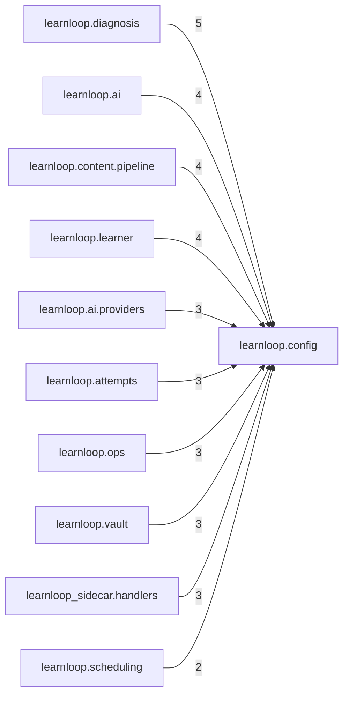

# `learnloop.config` package map

> [!info] Generated package map
> This map is generated from live modules and their static imports. Follow module links for source-level facts and canonical concept/workflow links for system behavior.

Up: [[Module Catalog]]

## Responsibility

Typed configuration schema, compatibility normalization, loading, and template emission.

For system intent, use [[Configuration]], [[Architecture Overview]].

^package-purpose

## Module index

| Module | Purpose | Status | Direct importers | Direct test files |
|---|---|---:|---:|---:|
| [[Reference/Modules/learnloop/config/__init__|learnloop.config]] | [[Reference/Modules/learnloop/config/__init__#^module-purpose|purpose]] | `ACTIVE` | 46 | 43 |
| [[Reference/Modules/learnloop/config/compat|learnloop.config.compat]] | [[Reference/Modules/learnloop/config/compat#^module-purpose|purpose]] | `ACTIVE` | 3 | 1 |
| [[Reference/Modules/learnloop/config/loader|learnloop.config.loader]] | [[Reference/Modules/learnloop/config/loader#^module-purpose|purpose]] | `ACTIVE` | 1 | 1 |
| [[Reference/Modules/learnloop/config/schema|learnloop.config.schema]] | [[Reference/Modules/learnloop/config/schema#^module-purpose|purpose]] | `ACTIVE` | 4 | 1 |
| [[Reference/Modules/learnloop/config/template|learnloop.config.template]] | [[Reference/Modules/learnloop/config/template#^module-purpose|purpose]] | `ACTIVE` | 2 | 1 |

## Cross-package dependencies

- No cross-package imports were found.

### Packages that import this package

- [[Reference/Modules/learnloop/diagnosis/_package|learnloop.diagnosis]] — 5 static module edges
- [[Reference/Modules/learnloop/ai/_package|learnloop.ai]] — 4 static module edges
- [[Reference/Modules/learnloop/content/pipeline/_package|learnloop.content.pipeline]] — 4 static module edges
- [[Reference/Modules/learnloop/learner/_package|learnloop.learner]] — 4 static module edges
- [[Reference/Modules/learnloop/ai/providers/_package|learnloop.ai.providers]] — 3 static module edges
- [[Reference/Modules/learnloop/attempts/_package|learnloop.attempts]] — 3 static module edges
- [[Reference/Modules/learnloop/ops/_package|learnloop.ops]] — 3 static module edges
- [[Reference/Modules/learnloop/vault/_package|learnloop.vault]] — 3 static module edges
- [[Reference/Modules/learnloop_sidecar/handlers/_package|learnloop_sidecar.handlers]] — 3 static module edges
- [[Reference/Modules/learnloop/scheduling/_package|learnloop.scheduling]] — 2 static module edges
- [[Reference/Modules/learnloop/substrate/_package|learnloop.substrate]] — 2 static module edges
- [[Reference/Modules/learnloop/tutor/_package|learnloop.tutor]] — 2 static module edges
- [[Reference/Modules/learnloop/_package|learnloop]] — 1 static module edge
- [[Reference/Modules/learnloop/cli/_package|learnloop.cli]] — 1 static module edge
- [[Reference/Modules/learnloop/content/sources/_package|learnloop.content.sources]] — 1 static module edge
- [[Reference/Modules/learnloop/ingest/_package|learnloop.ingest]] — 1 static module edge
- [[Reference/Modules/learnloop/params/_package|learnloop.params]] — 1 static module edge
- [[Reference/Modules/learnloop/sim/_package|learnloop.sim]] — 1 static module edge
- [[Reference/Modules/learnloop/tui/screens/_package|learnloop.tui.screens]] — 1 static module edge
- [[Reference/Modules/learnloop_sidecar/_package|learnloop_sidecar]] — 1 static module edge

### Dependency neighborhood

This diagram compresses package-level static imports; edge labels are distinct module-to-module import counts.



Interpretation: arrow direction is static import direction and the label is the number of distinct module-to-module edges. It shows coupling pressure, not runtime call frequency or ownership permission.

## Workflow entry points

- [[Initialize a Vault]]

## Find and filter

Use Obsidian's native search:

```query
path:"Reference/Modules/learnloop/config" tag:#docs/module
```

To change this package, start with a module's [[#Module index|purpose link]], then follow its callers, tests, and modification guidance. Re-run the generator after source changes.
