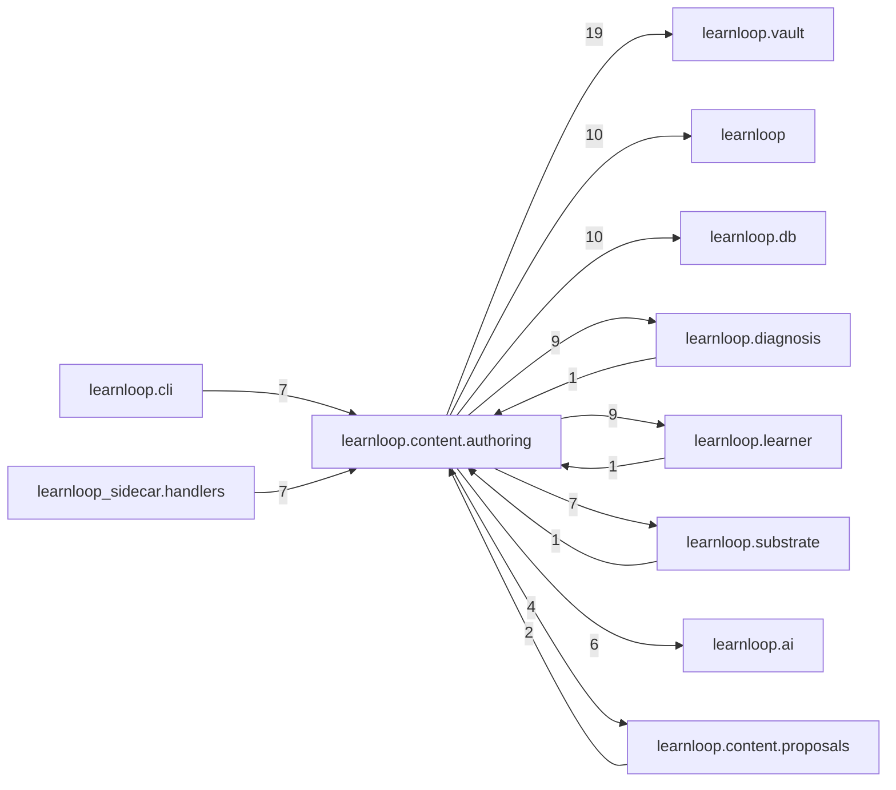

# `learnloop.content.authoring` package map

> [!info] Generated package map
> This map is generated from live modules and their static imports. Follow module links for source-level facts and canonical concept/workflow links for system behavior.

Up: [[Module Catalog]]

## Responsibility

Practice-content authoring gates, generation contracts, and authored artifacts.

For system intent, use [[Learning System]], [[AI Architecture]].

^package-purpose

## Module index

| Module | Purpose | Status | Direct importers | Direct test files |
|---|---|---:|---:|---:|
| [[Reference/Modules/learnloop/content/authoring/__init__|learnloop.content.authoring]] | [[Reference/Modules/learnloop/content/authoring/__init__#^module-purpose|purpose]] | `ACTIVE` | 0 | 0 |
| [[Reference/Modules/learnloop/content/authoring/ai_contracts|learnloop.content.authoring.ai_contracts]] | [[Reference/Modules/learnloop/content/authoring/ai_contracts#^module-purpose|purpose]] | `ACTIVE` | 4 | 9 |
| [[Reference/Modules/learnloop/content/authoring/authoring_gates|learnloop.content.authoring.authoring_gates]] | [[Reference/Modules/learnloop/content/authoring/authoring_gates#^module-purpose|purpose]] | `ACTIVE` | 7 | 1 |
| [[Reference/Modules/learnloop/content/authoring/concept_animation|learnloop.content.authoring.concept_animation]] | [[Reference/Modules/learnloop/content/authoring/concept_animation#^module-purpose|purpose]] | `ACTIVE` | 2 | 4 |
| [[Reference/Modules/learnloop/content/authoring/conjunctive_items|learnloop.content.authoring.conjunctive_items]] | [[Reference/Modules/learnloop/content/authoring/conjunctive_items#^module-purpose|purpose]] | `ACTIVE` | 4 | 1 |
| [[Reference/Modules/learnloop/content/authoring/contract_commissioning|learnloop.content.authoring.contract_commissioning]] | [[Reference/Modules/learnloop/content/authoring/contract_commissioning#^module-purpose|purpose]] | `ACTIVE` | 3 | 1 |
| [[Reference/Modules/learnloop/content/authoring/exercise_authoring|learnloop.content.authoring.exercise_authoring]] | [[Reference/Modules/learnloop/content/authoring/exercise_authoring#^module-purpose|purpose]] | `ACTIVE` | 1 | 3 |
| [[Reference/Modules/learnloop/content/authoring/item_authoring|learnloop.content.authoring.item_authoring]] | [[Reference/Modules/learnloop/content/authoring/item_authoring#^module-purpose|purpose]] | `ACTIVE` | 2 | 2 |
| [[Reference/Modules/learnloop/content/authoring/laddered_stems|learnloop.content.authoring.laddered_stems]] | [[Reference/Modules/learnloop/content/authoring/laddered_stems#^module-purpose|purpose]] | `ACTIVE` | 2 | 1 |
| [[Reference/Modules/learnloop/content/authoring/persona_gate|learnloop.content.authoring.persona_gate]] | [[Reference/Modules/learnloop/content/authoring/persona_gate#^module-purpose|purpose]] | `ACTIVE` | 5 | 4 |
| [[Reference/Modules/learnloop/content/authoring/persona_realism|learnloop.content.authoring.persona_realism]] | [[Reference/Modules/learnloop/content/authoring/persona_realism#^module-purpose|purpose]] | `ACTIVE` | 3 | 2 |
| [[Reference/Modules/learnloop/content/authoring/practice_generation|learnloop.content.authoring.practice_generation]] | [[Reference/Modules/learnloop/content/authoring/practice_generation#^module-purpose|purpose]] | `ACTIVE` | 7 | 11 |
| [[Reference/Modules/learnloop/content/authoring/practice_leakage|learnloop.content.authoring.practice_leakage]] | [[Reference/Modules/learnloop/content/authoring/practice_leakage#^module-purpose|purpose]] | `ACTIVE` | 2 | 1 |
| [[Reference/Modules/learnloop/content/authoring/rung_variants|learnloop.content.authoring.rung_variants]] | [[Reference/Modules/learnloop/content/authoring/rung_variants#^module-purpose|purpose]] | `ACTIVE` | 2 | 2 |

## Cross-package dependencies

### This package imports

- [[Reference/Modules/learnloop/vault/_package|learnloop.vault]] — 19 static module edges
- [[Reference/Modules/learnloop/_package|learnloop]] — 10 static module edges
- [[Reference/Modules/learnloop/db/_package|learnloop.db]] — 10 static module edges
- [[Reference/Modules/learnloop/diagnosis/_package|learnloop.diagnosis]] — 9 static module edges
- [[Reference/Modules/learnloop/learner/_package|learnloop.learner]] — 9 static module edges
- [[Reference/Modules/learnloop/substrate/_package|learnloop.substrate]] — 7 static module edges
- [[Reference/Modules/learnloop/ai/_package|learnloop.ai]] — 6 static module edges
- [[Reference/Modules/learnloop/content/proposals/_package|learnloop.content.proposals]] — 4 static module edges
- [[Reference/Modules/learnloop/curriculum/_package|learnloop.curriculum]] — 4 static module edges
- [[Reference/Modules/learnloop/attempts/_package|learnloop.attempts]] — 2 static module edges
- [[Reference/Modules/learnloop/content/sources/_package|learnloop.content.sources]] — 2 static module edges
- [[Reference/Modules/learnloop/ingest/_package|learnloop.ingest]] — 2 static module edges
- [[Reference/Modules/learnloop/content/synthesis/_package|learnloop.content.synthesis]] — 1 static module edge
- [[Reference/Modules/learnloop/goals/_package|learnloop.goals]] — 1 static module edge
- [[Reference/Modules/learnloop/reader/_package|learnloop.reader]] — 1 static module edge
- [[Reference/Modules/learnloop/tutor/_package|learnloop.tutor]] — 1 static module edge

### Packages that import this package

- [[Reference/Modules/learnloop/cli/_package|learnloop.cli]] — 7 static module edges
- [[Reference/Modules/learnloop_sidecar/handlers/_package|learnloop_sidecar.handlers]] — 7 static module edges
- [[Reference/Modules/learnloop/content/pipeline/_package|learnloop.content.pipeline]] — 5 static module edges
- [[Reference/Modules/learnloop/tutor/_package|learnloop.tutor]] — 4 static module edges
- [[Reference/Modules/learnloop/content/proposals/_package|learnloop.content.proposals]] — 2 static module edges
- [[Reference/Modules/learnloop/content/synthesis/_package|learnloop.content.synthesis]] — 2 static module edges
- [[Reference/Modules/learnloop/attempts/_package|learnloop.attempts]] — 1 static module edge
- [[Reference/Modules/learnloop/diagnosis/_package|learnloop.diagnosis]] — 1 static module edge
- [[Reference/Modules/learnloop/learner/_package|learnloop.learner]] — 1 static module edge
- [[Reference/Modules/learnloop/ops/_package|learnloop.ops]] — 1 static module edge
- [[Reference/Modules/learnloop/reader/_package|learnloop.reader]] — 1 static module edge
- [[Reference/Modules/learnloop/scheduling/_package|learnloop.scheduling]] — 1 static module edge
- [[Reference/Modules/learnloop/substrate/_package|learnloop.substrate]] — 1 static module edge

### Dependency neighborhood

This diagram compresses package-level static imports; edge labels are distinct module-to-module import counts.



Interpretation: arrow direction is static import direction and the label is the number of distinct module-to-module edges. It shows coupling pressure, not runtime call frequency or ownership permission.

## Workflow entry points

- [[Import Canonical Sources]]
- [[Process Model Output]]

## Find and filter

Use Obsidian's native search:

```query
path:"Reference/Modules/learnloop/content/authoring" tag:#docs/module
```

To change this package, start with a module's [[#Module index|purpose link]], then follow its callers, tests, and modification guidance. Re-run the generator after source changes.
