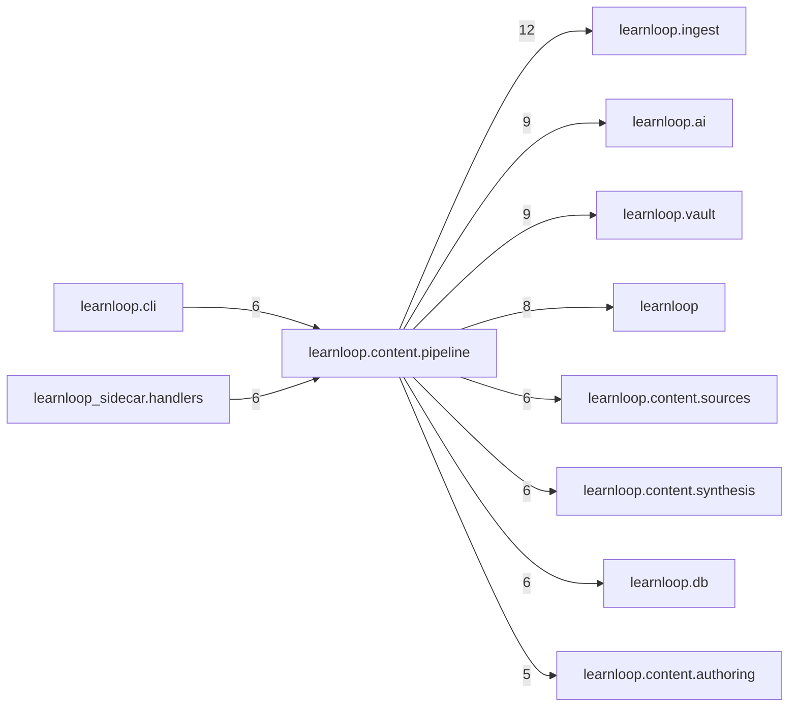

# `learnloop.content.pipeline` package map

> [!info] Generated package map
> This map is generated from live modules and their static imports. Follow module links for source-level facts and canonical concept/workflow links for system behavior.

Up: [[Module Catalog]]

## Responsibility

Canonical content extraction and transformation stages.

For system intent, use [[Learning System]], [[AI Architecture]].

^package-purpose

## Module index

| Module | Purpose | Status | Direct importers | Direct test files |
|---|---|---:|---:|---:|
| [[Reference/Modules/learnloop/content/pipeline/__init__|learnloop.content.pipeline]] | [[Reference/Modules/learnloop/content/pipeline/__init__#^module-purpose|purpose]] | `ACTIVE` | 0 | 0 |
| [[Reference/Modules/learnloop/content/pipeline/acquisition_preview|learnloop.content.pipeline.acquisition_preview]] | [[Reference/Modules/learnloop/content/pipeline/acquisition_preview#^module-purpose|purpose]] | `ACTIVE` | 2 | 1 |
| [[Reference/Modules/learnloop/content/pipeline/ai_contracts|learnloop.content.pipeline.ai_contracts]] | [[Reference/Modules/learnloop/content/pipeline/ai_contracts#^module-purpose|purpose]] | `ACTIVE` | 1 | 8 |
| [[Reference/Modules/learnloop/content/pipeline/build_plan|learnloop.content.pipeline.build_plan]] | [[Reference/Modules/learnloop/content/pipeline/build_plan#^module-purpose|purpose]] | `ACTIVE` | 3 | 1 |
| [[Reference/Modules/learnloop/content/pipeline/jobs|learnloop.content.pipeline.jobs]] | [[Reference/Modules/learnloop/content/pipeline/jobs#^module-purpose|purpose]] | `ACTIVE` | 5 | 9 |
| [[Reference/Modules/learnloop/content/pipeline/quick_add|learnloop.content.pipeline.quick_add]] | [[Reference/Modules/learnloop/content/pipeline/quick_add#^module-purpose|purpose]] | `ACTIVE` | 2 | 1 |
| [[Reference/Modules/learnloop/content/pipeline/revision_refresh|learnloop.content.pipeline.revision_refresh]] | [[Reference/Modules/learnloop/content/pipeline/revision_refresh#^module-purpose|purpose]] | `ACTIVE` | 1 | 1 |
| [[Reference/Modules/learnloop/content/pipeline/runner|learnloop.content.pipeline.runner]] | [[Reference/Modules/learnloop/content/pipeline/runner#^module-purpose|purpose]] | `ACTIVE` | 3 | 12 |
| [[Reference/Modules/learnloop/content/pipeline/source_ingestion|learnloop.content.pipeline.source_ingestion]] | [[Reference/Modules/learnloop/content/pipeline/source_ingestion#^module-purpose|purpose]] | `ACTIVE` | 3 | 9 |

## Cross-package dependencies

### This package imports

- [[Reference/Modules/learnloop/ingest/_package|learnloop.ingest]] — 12 static module edges
- [[Reference/Modules/learnloop/ai/_package|learnloop.ai]] — 9 static module edges
- [[Reference/Modules/learnloop/vault/_package|learnloop.vault]] — 9 static module edges
- [[Reference/Modules/learnloop/_package|learnloop]] — 8 static module edges
- [[Reference/Modules/learnloop/content/sources/_package|learnloop.content.sources]] — 6 static module edges
- [[Reference/Modules/learnloop/content/synthesis/_package|learnloop.content.synthesis]] — 6 static module edges
- [[Reference/Modules/learnloop/db/_package|learnloop.db]] — 6 static module edges
- [[Reference/Modules/learnloop/content/authoring/_package|learnloop.content.authoring]] — 5 static module edges
- [[Reference/Modules/learnloop/content/proposals/_package|learnloop.content.proposals]] — 5 static module edges
- [[Reference/Modules/learnloop/config/_package|learnloop.config]] — 4 static module edges
- [[Reference/Modules/learnloop/ingest/extractors/_package|learnloop.ingest.extractors]] — 3 static module edges
- [[Reference/Modules/learnloop/learner/_package|learnloop.learner]] — 2 static module edges
- [[Reference/Modules/learnloop/reader/_package|learnloop.reader]] — 2 static module edges
- [[Reference/Modules/learnloop/goals/_package|learnloop.goals]] — 1 static module edge
- [[Reference/Modules/learnloop/substrate/_package|learnloop.substrate]] — 1 static module edge
- [[Reference/Modules/learnloop/tutor/_package|learnloop.tutor]] — 1 static module edge

### Packages that import this package

- [[Reference/Modules/learnloop/cli/_package|learnloop.cli]] — 6 static module edges
- [[Reference/Modules/learnloop_sidecar/handlers/_package|learnloop_sidecar.handlers]] — 6 static module edges
- [[Reference/Modules/learnloop/reader/_package|learnloop.reader]] — 1 static module edge
- [[Reference/Modules/learnloop_sidecar/_package|learnloop_sidecar]] — 1 static module edge

### Dependency neighborhood

This diagram compresses package-level static imports; edge labels are distinct module-to-module import counts.



Interpretation: arrow direction is static import direction and the label is the number of distinct module-to-module edges. It shows coupling pressure, not runtime call frequency or ownership permission.

## Workflow entry points

- [[Import Canonical Sources]]
- [[Process Model Output]]

## Find and filter

Use Obsidian's native search:

```query
path:"Reference/Modules/learnloop/content/pipeline" tag:#docs/module
```

To change this package, start with a module's [[#Module index|purpose link]], then follow its callers, tests, and modification guidance. Re-run the generator after source changes.
