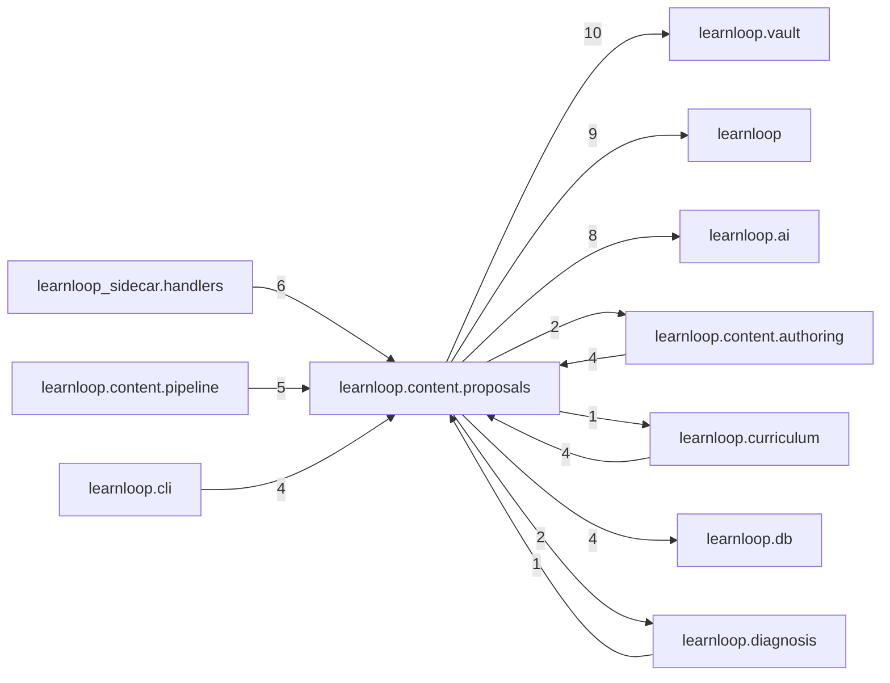

# `learnloop.content.proposals` package map

> [!info] Generated package map
> This map is generated from live modules and their static imports. Follow module links for source-level facts and canonical concept/workflow links for system behavior.

Up: [[Module Catalog]]

## Responsibility

Reviewable content and graph change proposals and their lifecycle.

For system intent, use [[Learning System]], [[AI Architecture]].

^package-purpose

## Module index

| Module | Purpose | Status | Direct importers | Direct test files |
|---|---|---:|---:|---:|
| [[Reference/Modules/learnloop/content/proposals/__init__|learnloop.content.proposals]] | [[Reference/Modules/learnloop/content/proposals/__init__#^module-purpose|purpose]] | `ACTIVE` | 0 | 0 |
| [[Reference/Modules/learnloop/content/proposals/ai_contracts|learnloop.content.proposals.ai_contracts]] | [[Reference/Modules/learnloop/content/proposals/ai_contracts#^module-purpose|purpose]] | `ACTIVE` | 10 | 22 |
| [[Reference/Modules/learnloop/content/proposals/apply_protocol|learnloop.content.proposals.apply_protocol]] | [[Reference/Modules/learnloop/content/proposals/apply_protocol#^module-purpose|purpose]] | `ACTIVE` | 2 | 2 |
| [[Reference/Modules/learnloop/content/proposals/conflict_resolution|learnloop.content.proposals.conflict_resolution]] | [[Reference/Modules/learnloop/content/proposals/conflict_resolution#^module-purpose|purpose]] | `ACTIVE` | 2 | 1 |
| [[Reference/Modules/learnloop/content/proposals/patches|learnloop.content.proposals.patches]] | [[Reference/Modules/learnloop/content/proposals/patches#^module-purpose|purpose]] | `ACTIVE` | 9 | 11 |
| [[Reference/Modules/learnloop/content/proposals/proposals|learnloop.content.proposals.proposals]] | [[Reference/Modules/learnloop/content/proposals/proposals#^module-purpose|purpose]] | `ACTIVE` | 11 | 20 |

## Cross-package dependencies

### This package imports

- [[Reference/Modules/learnloop/vault/_package|learnloop.vault]] — 10 static module edges
- [[Reference/Modules/learnloop/_package|learnloop]] — 9 static module edges
- [[Reference/Modules/learnloop/ai/_package|learnloop.ai]] — 8 static module edges
- [[Reference/Modules/learnloop/db/_package|learnloop.db]] — 4 static module edges
- [[Reference/Modules/learnloop/substrate/_package|learnloop.substrate]] — 3 static module edges
- [[Reference/Modules/learnloop/content/authoring/_package|learnloop.content.authoring]] — 2 static module edges
- [[Reference/Modules/learnloop/diagnosis/_package|learnloop.diagnosis]] — 2 static module edges
- [[Reference/Modules/learnloop/learner/_package|learnloop.learner]] — 2 static module edges
- [[Reference/Modules/learnloop/curriculum/_package|learnloop.curriculum]] — 1 static module edge
- [[Reference/Modules/learnloop/ops/_package|learnloop.ops]] — 1 static module edge

### Packages that import this package

- [[Reference/Modules/learnloop_sidecar/handlers/_package|learnloop_sidecar.handlers]] — 6 static module edges
- [[Reference/Modules/learnloop/content/pipeline/_package|learnloop.content.pipeline]] — 5 static module edges
- [[Reference/Modules/learnloop/cli/_package|learnloop.cli]] — 4 static module edges
- [[Reference/Modules/learnloop/content/authoring/_package|learnloop.content.authoring]] — 4 static module edges
- [[Reference/Modules/learnloop/curriculum/_package|learnloop.curriculum]] — 4 static module edges
- [[Reference/Modules/learnloop/content/synthesis/_package|learnloop.content.synthesis]] — 2 static module edges
- [[Reference/Modules/learnloop/tutor/_package|learnloop.tutor]] — 2 static module edges
- [[Reference/Modules/learnloop/attempts/_package|learnloop.attempts]] — 1 static module edge
- [[Reference/Modules/learnloop/diagnosis/_package|learnloop.diagnosis]] — 1 static module edge
- [[Reference/Modules/learnloop/ops/_package|learnloop.ops]] — 1 static module edge

### Dependency neighborhood

This diagram compresses package-level static imports; edge labels are distinct module-to-module import counts.



Interpretation: arrow direction is static import direction and the label is the number of distinct module-to-module edges. It shows coupling pressure, not runtime call frequency or ownership permission.

## Workflow entry points

- [[Import Canonical Sources]]
- [[Process Model Output]]

## Find and filter

Use Obsidian's native search:

```query
path:"Reference/Modules/learnloop/content/proposals" tag:#docs/module
```

To change this package, start with a module's [[#Module index|purpose link]], then follow its callers, tests, and modification guidance. Re-run the generator after source changes.
