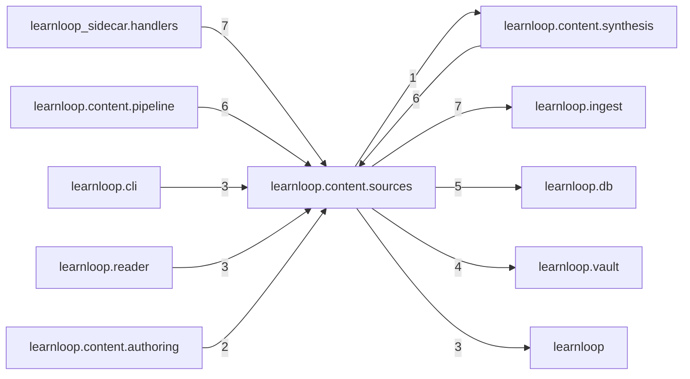

# `learnloop.content.sources` package map

> [!info] Generated package map
> This map is generated from live modules and their static imports. Follow module links for source-level facts and canonical concept/workflow links for system behavior.

Up: [[Module Catalog]]

## Responsibility

Canonical source-library identity, manifests, and source-set behavior.

For system intent, use [[Learning System]], [[AI Architecture]].

^package-purpose

## Module index

| Module | Purpose | Status | Direct importers | Direct test files |
|---|---|---:|---:|---:|
| [[Reference/Modules/learnloop/content/sources/__init__|learnloop.content.sources]] | [[Reference/Modules/learnloop/content/sources/__init__#^module-purpose|purpose]] | `ACTIVE` | 0 | 0 |
| [[Reference/Modules/learnloop/content/sources/block_health|learnloop.content.sources.block_health]] | [[Reference/Modules/learnloop/content/sources/block_health#^module-purpose|purpose]] | `ACTIVE` | 1 | 1 |
| [[Reference/Modules/learnloop/content/sources/extraction_health|learnloop.content.sources.extraction_health]] | [[Reference/Modules/learnloop/content/sources/extraction_health#^module-purpose|purpose]] | `ACTIVE` | 1 | 1 |
| [[Reference/Modules/learnloop/content/sources/math_text|learnloop.content.sources.math_text]] | [[Reference/Modules/learnloop/content/sources/math_text#^module-purpose|purpose]] | `ACTIVE` | 2 | 1 |
| [[Reference/Modules/learnloop/content/sources/pdf_extraction|learnloop.content.sources.pdf_extraction]] | [[Reference/Modules/learnloop/content/sources/pdf_extraction#^module-purpose|purpose]] | `ACTIVE` | 1 | 2 |
| [[Reference/Modules/learnloop/content/sources/provenance|learnloop.content.sources.provenance]] | [[Reference/Modules/learnloop/content/sources/provenance#^module-purpose|purpose]] | `ACTIVE` | 2 | 1 |
| [[Reference/Modules/learnloop/content/sources/role_authority|learnloop.content.sources.role_authority]] | [[Reference/Modules/learnloop/content/sources/role_authority#^module-purpose|purpose]] | `ACTIVE` | 6 | 2 |
| [[Reference/Modules/learnloop/content/sources/source_deletion|learnloop.content.sources.source_deletion]] | [[Reference/Modules/learnloop/content/sources/source_deletion#^module-purpose|purpose]] | `ACTIVE` | 1 | 1 |
| [[Reference/Modules/learnloop/content/sources/source_library|learnloop.content.sources.source_library]] | [[Reference/Modules/learnloop/content/sources/source_library#^module-purpose|purpose]] | `ACTIVE` | 1 | 12 |
| [[Reference/Modules/learnloop/content/sources/source_outcome_analytics|learnloop.content.sources.source_outcome_analytics]] | [[Reference/Modules/learnloop/content/sources/source_outcome_analytics#^module-purpose|purpose]] | `ACTIVE` | 3 | 1 |
| [[Reference/Modules/learnloop/content/sources/source_outline|learnloop.content.sources.source_outline]] | [[Reference/Modules/learnloop/content/sources/source_outline#^module-purpose|purpose]] | `ACTIVE` | 10 | 2 |
| [[Reference/Modules/learnloop/content/sources/source_refs|learnloop.content.sources.source_refs]] | [[Reference/Modules/learnloop/content/sources/source_refs#^module-purpose|purpose]] | `ACTIVE` | 3 | 1 |

## Cross-package dependencies

### This package imports

- [[Reference/Modules/learnloop/ingest/_package|learnloop.ingest]] — 7 static module edges
- [[Reference/Modules/learnloop/db/_package|learnloop.db]] — 5 static module edges
- [[Reference/Modules/learnloop/vault/_package|learnloop.vault]] — 4 static module edges
- [[Reference/Modules/learnloop/_package|learnloop]] — 3 static module edges
- [[Reference/Modules/learnloop/config/_package|learnloop.config]] — 1 static module edge
- [[Reference/Modules/learnloop/content/synthesis/_package|learnloop.content.synthesis]] — 1 static module edge

### Packages that import this package

- [[Reference/Modules/learnloop_sidecar/handlers/_package|learnloop_sidecar.handlers]] — 7 static module edges
- [[Reference/Modules/learnloop/content/pipeline/_package|learnloop.content.pipeline]] — 6 static module edges
- [[Reference/Modules/learnloop/content/synthesis/_package|learnloop.content.synthesis]] — 6 static module edges
- [[Reference/Modules/learnloop/cli/_package|learnloop.cli]] — 3 static module edges
- [[Reference/Modules/learnloop/reader/_package|learnloop.reader]] — 3 static module edges
- [[Reference/Modules/learnloop/content/authoring/_package|learnloop.content.authoring]] — 2 static module edges
- [[Reference/Modules/learnloop/ops/_package|learnloop.ops]] — 2 static module edges
- [[Reference/Modules/learnloop/diagnosis/_package|learnloop.diagnosis]] — 1 static module edge

### Dependency neighborhood

This diagram compresses package-level static imports; edge labels are distinct module-to-module import counts.



Interpretation: arrow direction is static import direction and the label is the number of distinct module-to-module edges. It shows coupling pressure, not runtime call frequency or ownership permission.

## Workflow entry points

- [[Import Canonical Sources]]
- [[Process Model Output]]

## Find and filter

Use Obsidian's native search:

```query
path:"Reference/Modules/learnloop/content/sources" tag:#docs/module
```

To change this package, start with a module's [[#Module index|purpose link]], then follow its callers, tests, and modification guidance. Re-run the generator after source changes.
