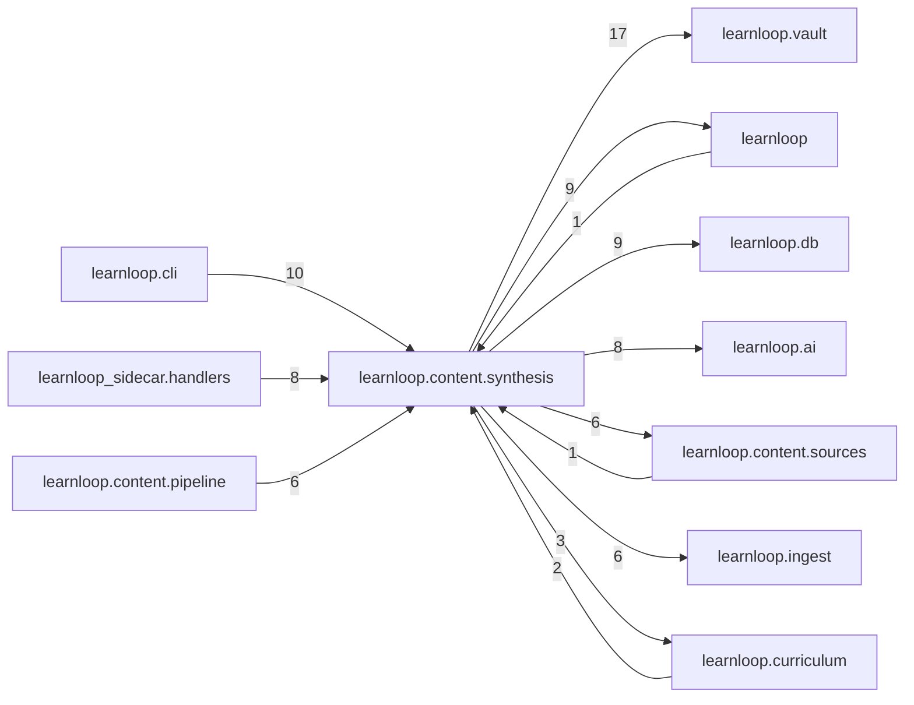

# `learnloop.content.synthesis` package map

> [!info] Generated package map
> This map is generated from live modules and their static imports. Follow module links for source-level facts and canonical concept/workflow links for system behavior.

Up: [[Module Catalog]]

## Responsibility

Synthesis of source material into learning structures and AI-owned contracts.

For system intent, use [[Learning System]], [[AI Architecture]].

^package-purpose

## Module index

| Module | Purpose | Status | Direct importers | Direct test files |
|---|---|---:|---:|---:|
| [[Reference/Modules/learnloop/content/synthesis/__init__|learnloop.content.synthesis]] | [[Reference/Modules/learnloop/content/synthesis/__init__#^module-purpose|purpose]] | `ACTIVE` | 0 | 0 |
| [[Reference/Modules/learnloop/content/synthesis/ai_contracts|learnloop.content.synthesis.ai_contracts]] | [[Reference/Modules/learnloop/content/synthesis/ai_contracts#^module-purpose|purpose]] | `ACTIVE` | 4 | 9 |
| [[Reference/Modules/learnloop/content/synthesis/append_neighborhood|learnloop.content.synthesis.append_neighborhood]] | [[Reference/Modules/learnloop/content/synthesis/append_neighborhood#^module-purpose|purpose]] | `ACTIVE` | 1 | 1 |
| [[Reference/Modules/learnloop/content/synthesis/brief|learnloop.content.synthesis.brief]] | [[Reference/Modules/learnloop/content/synthesis/brief#^module-purpose|purpose]] | `ACTIVE` | 7 | 1 |
| [[Reference/Modules/learnloop/content/synthesis/coverage_rollup|learnloop.content.synthesis.coverage_rollup]] | [[Reference/Modules/learnloop/content/synthesis/coverage_rollup#^module-purpose|purpose]] | `ACTIVE` | 1 | 1 |
| [[Reference/Modules/learnloop/content/synthesis/exam_profile|learnloop.content.synthesis.exam_profile]] | [[Reference/Modules/learnloop/content/synthesis/exam_profile#^module-purpose|purpose]] | `ACTIVE` | 2 | 1 |
| [[Reference/Modules/learnloop/content/synthesis/facet_candidates|learnloop.content.synthesis.facet_candidates]] | [[Reference/Modules/learnloop/content/synthesis/facet_candidates#^module-purpose|purpose]] | `ACTIVE` | 1 | 1 |
| [[Reference/Modules/learnloop/content/synthesis/facet_doctor|learnloop.content.synthesis.facet_doctor]] | [[Reference/Modules/learnloop/content/synthesis/facet_doctor#^module-purpose|purpose]] | `ACTIVE` | 2 | 1 |
| [[Reference/Modules/learnloop/content/synthesis/facet_mint_gate|learnloop.content.synthesis.facet_mint_gate]] | [[Reference/Modules/learnloop/content/synthesis/facet_mint_gate#^module-purpose|purpose]] | `ACTIVE` | 3 | 1 |
| [[Reference/Modules/learnloop/content/synthesis/source_append|learnloop.content.synthesis.source_append]] | [[Reference/Modules/learnloop/content/synthesis/source_append#^module-purpose|purpose]] | `ACTIVE` | 4 | 4 |
| [[Reference/Modules/learnloop/content/synthesis/source_coverage|learnloop.content.synthesis.source_coverage]] | [[Reference/Modules/learnloop/content/synthesis/source_coverage#^module-purpose|purpose]] | `ACTIVE` | 2 | 1 |
| [[Reference/Modules/learnloop/content/synthesis/source_set_synthesis|learnloop.content.synthesis.source_set_synthesis]] | [[Reference/Modules/learnloop/content/synthesis/source_set_synthesis#^module-purpose|purpose]] | `ACTIVE` | 4 | 15 |
| [[Reference/Modules/learnloop/content/synthesis/source_unit_inventory|learnloop.content.synthesis.source_unit_inventory]] | [[Reference/Modules/learnloop/content/synthesis/source_unit_inventory#^module-purpose|purpose]] | `ACTIVE` | 5 | 8 |
| [[Reference/Modules/learnloop/content/synthesis/source_unit_selection|learnloop.content.synthesis.source_unit_selection]] | [[Reference/Modules/learnloop/content/synthesis/source_unit_selection#^module-purpose|purpose]] | `ACTIVE` | 6 | 6 |
| [[Reference/Modules/learnloop/content/synthesis/study_map_diff|learnloop.content.synthesis.study_map_diff]] | [[Reference/Modules/learnloop/content/synthesis/study_map_diff#^module-purpose|purpose]] | `ACTIVE` | 1 | 0 |
| [[Reference/Modules/learnloop/content/synthesis/synthesis_eval|learnloop.content.synthesis.synthesis_eval]] | [[Reference/Modules/learnloop/content/synthesis/synthesis_eval#^module-purpose|purpose]] | `ACTIVE` | 1 | 1 |
| [[Reference/Modules/learnloop/content/synthesis/synthesis_gates|learnloop.content.synthesis.synthesis_gates]] | [[Reference/Modules/learnloop/content/synthesis/synthesis_gates#^module-purpose|purpose]] | `ACTIVE` | 6 | 2 |
| [[Reference/Modules/learnloop/content/synthesis/synthesis_manifests|learnloop.content.synthesis.synthesis_manifests]] | [[Reference/Modules/learnloop/content/synthesis/synthesis_manifests#^module-purpose|purpose]] | `ACTIVE` | 2 | 2 |

## Cross-package dependencies

### This package imports

- [[Reference/Modules/learnloop/vault/_package|learnloop.vault]] — 17 static module edges
- [[Reference/Modules/learnloop/_package|learnloop]] — 9 static module edges
- [[Reference/Modules/learnloop/db/_package|learnloop.db]] — 9 static module edges
- [[Reference/Modules/learnloop/ai/_package|learnloop.ai]] — 8 static module edges
- [[Reference/Modules/learnloop/content/sources/_package|learnloop.content.sources]] — 6 static module edges
- [[Reference/Modules/learnloop/ingest/_package|learnloop.ingest]] — 6 static module edges
- [[Reference/Modules/learnloop/curriculum/_package|learnloop.curriculum]] — 3 static module edges
- [[Reference/Modules/learnloop/learner/_package|learnloop.learner]] — 3 static module edges
- [[Reference/Modules/learnloop/content/authoring/_package|learnloop.content.authoring]] — 2 static module edges
- [[Reference/Modules/learnloop/content/proposals/_package|learnloop.content.proposals]] — 2 static module edges
- [[Reference/Modules/learnloop/diagnosis/_package|learnloop.diagnosis]] — 1 static module edge

### Packages that import this package

- [[Reference/Modules/learnloop/cli/_package|learnloop.cli]] — 10 static module edges
- [[Reference/Modules/learnloop_sidecar/handlers/_package|learnloop_sidecar.handlers]] — 8 static module edges
- [[Reference/Modules/learnloop/content/pipeline/_package|learnloop.content.pipeline]] — 6 static module edges
- [[Reference/Modules/learnloop/curriculum/_package|learnloop.curriculum]] — 2 static module edges
- [[Reference/Modules/learnloop/_package|learnloop]] — 1 static module edge
- [[Reference/Modules/learnloop/content/authoring/_package|learnloop.content.authoring]] — 1 static module edge
- [[Reference/Modules/learnloop/content/sources/_package|learnloop.content.sources]] — 1 static module edge
- [[Reference/Modules/learnloop/learner/_package|learnloop.learner]] — 1 static module edge
- [[Reference/Modules/learnloop/ops/_package|learnloop.ops]] — 1 static module edge

### Dependency neighborhood

This diagram compresses package-level static imports; edge labels are distinct module-to-module import counts.



Interpretation: arrow direction is static import direction and the label is the number of distinct module-to-module edges. It shows coupling pressure, not runtime call frequency or ownership permission.

## Workflow entry points

- [[Import Canonical Sources]]
- [[Process Model Output]]

## Find and filter

Use Obsidian's native search:

```query
path:"Reference/Modules/learnloop/content/synthesis" tag:#docs/module
```

To change this package, start with a module's [[#Module index|purpose link]], then follow its callers, tests, and modification guidance. Re-run the generator after source changes.
