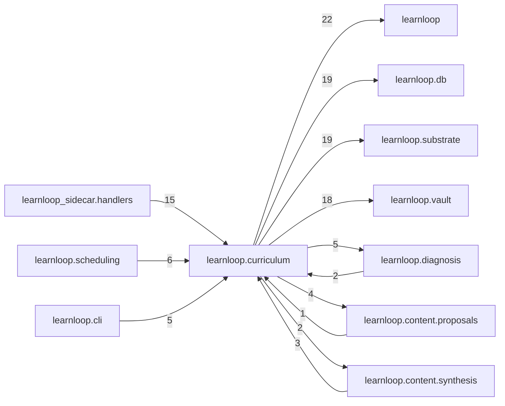

# `learnloop.curriculum` package map

> [!info] Generated package map
> This map is generated from live modules and their static imports. Follow module links for source-level facts and canonical concept/workflow links for system behavior.

Up: [[Module Catalog]]

## Responsibility

Commitments, blueprints, depth structures, concept relationships, and golden paths.

For system intent, use [[Learning System]].

^package-purpose

## Module index

| Module | Purpose | Status | Direct importers | Direct test files |
|---|---|---:|---:|---:|
| [[Reference/Modules/learnloop/curriculum/__init__|learnloop.curriculum]] | [[Reference/Modules/learnloop/curriculum/__init__#^module-purpose|purpose]] | `ACTIVE` | 0 | 0 |
| [[Reference/Modules/learnloop/curriculum/ai_contracts|learnloop.curriculum.ai_contracts]] | [[Reference/Modules/learnloop/curriculum/ai_contracts#^module-purpose|purpose]] | `ACTIVE` | 2 | 4 |
| [[Reference/Modules/learnloop/curriculum/commitment_arcs|learnloop.curriculum.commitment_arcs]] | [[Reference/Modules/learnloop/curriculum/commitment_arcs#^module-purpose|purpose]] | `ACTIVE` | 2 | 2 |
| [[Reference/Modules/learnloop/curriculum/commitments|learnloop.curriculum.commitments]] | [[Reference/Modules/learnloop/curriculum/commitments#^module-purpose|purpose]] | `ACTIVE` | 14 | 11 |
| [[Reference/Modules/learnloop/curriculum/concepts|learnloop.curriculum.concepts]] | [[Reference/Modules/learnloop/curriculum/concepts#^module-purpose|purpose]] | `ACTIVE` | 1 | 1 |
| [[Reference/Modules/learnloop/curriculum/confusable_concepts|learnloop.curriculum.confusable_concepts]] | [[Reference/Modules/learnloop/curriculum/confusable_concepts#^module-purpose|purpose]] | `ACTIVE` | 1 | 1 |
| [[Reference/Modules/learnloop/curriculum/curriculum_locks|learnloop.curriculum.curriculum_locks]] | [[Reference/Modules/learnloop/curriculum/curriculum_locks#^module-purpose|purpose]] | `ACTIVE` | 8 | 3 |
| [[Reference/Modules/learnloop/curriculum/depth_edge_authoring|learnloop.curriculum.depth_edge_authoring]] | [[Reference/Modules/learnloop/curriculum/depth_edge_authoring#^module-purpose|purpose]] | `ACTIVE` | 1 | 1 |
| [[Reference/Modules/learnloop/curriculum/depth_rungs|learnloop.curriculum.depth_rungs]] | [[Reference/Modules/learnloop/curriculum/depth_rungs#^module-purpose|purpose]] | `ACTIVE` | 7 | 2 |
| [[Reference/Modules/learnloop/curriculum/depth_transition|learnloop.curriculum.depth_transition]] | [[Reference/Modules/learnloop/curriculum/depth_transition#^module-purpose|purpose]] | `ACTIVE` | 3 | 4 |
| [[Reference/Modules/learnloop/curriculum/golden_path_assessment|learnloop.curriculum.golden_path_assessment]] | [[Reference/Modules/learnloop/curriculum/golden_path_assessment#^module-purpose|purpose]] | `ACTIVE` | 3 | 2 |
| [[Reference/Modules/learnloop/curriculum/golden_path_compose|learnloop.curriculum.golden_path_compose]] | [[Reference/Modules/learnloop/curriculum/golden_path_compose#^module-purpose|purpose]] | `ACTIVE` | 1 | 0 |
| [[Reference/Modules/learnloop/curriculum/golden_path_confirm|learnloop.curriculum.golden_path_confirm]] | [[Reference/Modules/learnloop/curriculum/golden_path_confirm#^module-purpose|purpose]] | `ACTIVE` | 2 | 6 |
| [[Reference/Modules/learnloop/curriculum/golden_path_fixture|learnloop.curriculum.golden_path_fixture]] | [[Reference/Modules/learnloop/curriculum/golden_path_fixture#^module-purpose|purpose]] | `ACTIVE` | 1 | 11 |
| [[Reference/Modules/learnloop/curriculum/golden_path_restoration|learnloop.curriculum.golden_path_restoration]] | [[Reference/Modules/learnloop/curriculum/golden_path_restoration#^module-purpose|purpose]] | `ACTIVE` | 2 | 2 |
| [[Reference/Modules/learnloop/curriculum/golden_path_run|learnloop.curriculum.golden_path_run]] | [[Reference/Modules/learnloop/curriculum/golden_path_run#^module-purpose|purpose]] | `ACTIVE` | 6 | 12 |
| [[Reference/Modules/learnloop/curriculum/graph_edit_proposals|learnloop.curriculum.graph_edit_proposals]] | [[Reference/Modules/learnloop/curriculum/graph_edit_proposals#^module-purpose|purpose]] | `ACTIVE` | 2 | 1 |
| [[Reference/Modules/learnloop/curriculum/integration_backfill|learnloop.curriculum.integration_backfill]] | [[Reference/Modules/learnloop/curriculum/integration_backfill#^module-purpose|purpose]] | `ACTIVE` | 2 | 2 |
| [[Reference/Modules/learnloop/curriculum/pattern_ladder|learnloop.curriculum.pattern_ladder]] | [[Reference/Modules/learnloop/curriculum/pattern_ladder#^module-purpose|purpose]] | `ACTIVE` | 1 | 2 |
| [[Reference/Modules/learnloop/curriculum/rung_backfill|learnloop.curriculum.rung_backfill]] | [[Reference/Modules/learnloop/curriculum/rung_backfill#^module-purpose|purpose]] | `ACTIVE` | 1 | 1 |
| [[Reference/Modules/learnloop/curriculum/subject_registry|learnloop.curriculum.subject_registry]] | [[Reference/Modules/learnloop/curriculum/subject_registry#^module-purpose|purpose]] | `ACTIVE` | 1 | 1 |
| [[Reference/Modules/learnloop/curriculum/task_blueprints|learnloop.curriculum.task_blueprints]] | [[Reference/Modules/learnloop/curriculum/task_blueprints#^module-purpose|purpose]] | `ACTIVE` | 2 | 8 |

## Cross-package dependencies

### This package imports

- [[Reference/Modules/learnloop/_package|learnloop]] — 22 static module edges
- [[Reference/Modules/learnloop/db/_package|learnloop.db]] — 19 static module edges
- [[Reference/Modules/learnloop/substrate/_package|learnloop.substrate]] — 19 static module edges
- [[Reference/Modules/learnloop/vault/_package|learnloop.vault]] — 18 static module edges
- [[Reference/Modules/learnloop/diagnosis/_package|learnloop.diagnosis]] — 5 static module edges
- [[Reference/Modules/learnloop/ai/_package|learnloop.ai]] — 4 static module edges
- [[Reference/Modules/learnloop/content/proposals/_package|learnloop.content.proposals]] — 4 static module edges
- [[Reference/Modules/learnloop/learner/_package|learnloop.learner]] — 4 static module edges
- [[Reference/Modules/learnloop/goals/_package|learnloop.goals]] — 3 static module edges
- [[Reference/Modules/learnloop/content/synthesis/_package|learnloop.content.synthesis]] — 2 static module edges
- [[Reference/Modules/learnloop/attempts/_package|learnloop.attempts]] — 1 static module edge

### Packages that import this package

- [[Reference/Modules/learnloop_sidecar/handlers/_package|learnloop_sidecar.handlers]] — 15 static module edges
- [[Reference/Modules/learnloop/scheduling/_package|learnloop.scheduling]] — 6 static module edges
- [[Reference/Modules/learnloop/cli/_package|learnloop.cli]] — 5 static module edges
- [[Reference/Modules/learnloop/reader/_package|learnloop.reader]] — 5 static module edges
- [[Reference/Modules/learnloop/content/authoring/_package|learnloop.content.authoring]] — 4 static module edges
- [[Reference/Modules/learnloop/content/synthesis/_package|learnloop.content.synthesis]] — 3 static module edges
- [[Reference/Modules/learnloop/diagnosis/_package|learnloop.diagnosis]] — 2 static module edges
- [[Reference/Modules/learnloop/content/proposals/_package|learnloop.content.proposals]] — 1 static module edge
- [[Reference/Modules/learnloop/ops/_package|learnloop.ops]] — 1 static module edge

### Dependency neighborhood

This diagram compresses package-level static imports; edge labels are distinct module-to-module import counts.



Interpretation: arrow direction is static import direction and the label is the number of distinct module-to-module edges. It shows coupling pressure, not runtime call frequency or ownership permission.

## Workflow entry points

- [[Start a Learning Cycle]]
- [[Import Canonical Sources]]

## Find and filter

Use Obsidian's native search:

```query
path:"Reference/Modules/learnloop/curriculum" tag:#docs/module
```

To change this package, start with a module's [[#Module index|purpose link]], then follow its callers, tests, and modification guidance. Re-run the generator after source changes.
