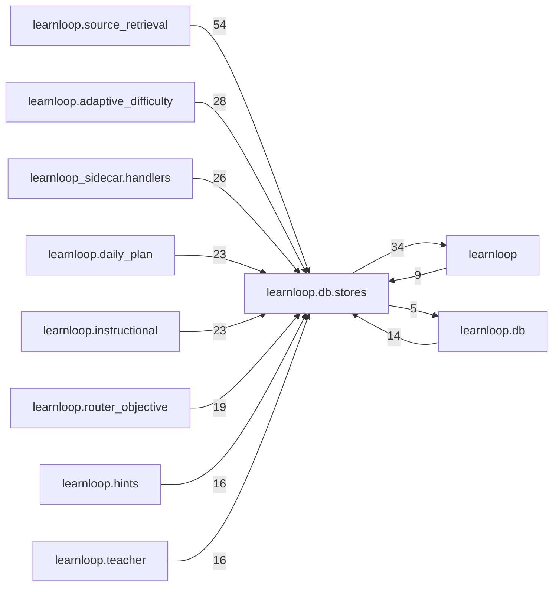

# `learnloop.db.stores` package map

> [!info] Generated package map
> This map is generated from live modules and their static imports. Follow module links for source-level facts and canonical concept/workflow links for system behavior.

Up: [[Module Catalog]]

## Responsibility

Table-family persistence owners extracted from the repository facade.

For system intent, use [[State and Persistence]], [[Architecture Overview]].

^package-purpose

## Module index

| Module | Purpose | Status | Direct importers | Direct test files |
|---|---|---:|---:|---:|
| [[Reference/Modules/learnloop/db/stores/__init__|learnloop.db.stores]] | [[Reference/Modules/learnloop/db/stores/__init__#^module-purpose|purpose]] | `ACTIVE` | 0 | 0 |
| [[Reference/Modules/learnloop/db/stores/ad_receipts|learnloop.db.stores.ad_receipts]] | [[Reference/Modules/learnloop/db/stores/ad_receipts#^module-purpose|purpose]] | `ACTIVE` | 12 | 7 |
| [[Reference/Modules/learnloop/db/stores/ad_serving|learnloop.db.stores.ad_serving]] | [[Reference/Modules/learnloop/db/stores/ad_serving#^module-purpose|purpose]] | `ACTIVE` | 12 | 13 |
| [[Reference/Modules/learnloop/db/stores/answered_contracts|learnloop.db.stores.answered_contracts]] | [[Reference/Modules/learnloop/db/stores/answered_contracts#^module-purpose|purpose]] | `ACTIVE` | 5 | 0 |
| [[Reference/Modules/learnloop/db/stores/approach_maps|learnloop.db.stores.approach_maps]] | [[Reference/Modules/learnloop/db/stores/approach_maps#^module-purpose|purpose]] | `ACTIVE` | 4 | 2 |
| [[Reference/Modules/learnloop/db/stores/collection|learnloop.db.stores.collection]] | [[Reference/Modules/learnloop/db/stores/collection#^module-purpose|purpose]] | `ACTIVE` | 1 | 2 |
| [[Reference/Modules/learnloop/db/stores/completion|learnloop.db.stores.completion]] | [[Reference/Modules/learnloop/db/stores/completion#^module-purpose|purpose]] | `ACTIVE` | 1 | 0 |
| [[Reference/Modules/learnloop/db/stores/daily_plans|learnloop.db.stores.daily_plans]] | [[Reference/Modules/learnloop/db/stores/daily_plans#^module-purpose|purpose]] | `ACTIVE` | 9 | 4 |
| [[Reference/Modules/learnloop/db/stores/data_capture|learnloop.db.stores.data_capture]] | [[Reference/Modules/learnloop/db/stores/data_capture#^module-purpose|purpose]] | `ACTIVE` | 5 | 8 |
| [[Reference/Modules/learnloop/db/stores/deliverables|learnloop.db.stores.deliverables]] | [[Reference/Modules/learnloop/db/stores/deliverables#^module-purpose|purpose]] | `ACTIVE` | 3 | 5 |
| [[Reference/Modules/learnloop/db/stores/diagnoses|learnloop.db.stores.diagnoses]] | [[Reference/Modules/learnloop/db/stores/diagnoses#^module-purpose|purpose]] | `ACTIVE` | 3 | 0 |
| [[Reference/Modules/learnloop/db/stores/diagnosis_review|learnloop.db.stores.diagnosis_review]] | [[Reference/Modules/learnloop/db/stores/diagnosis_review#^module-purpose|purpose]] | `ACTIVE` | 5 | 1 |
| [[Reference/Modules/learnloop/db/stores/embedding_vectors|learnloop.db.stores.embedding_vectors]] | [[Reference/Modules/learnloop/db/stores/embedding_vectors#^module-purpose|purpose]] | `ACTIVE` | 19 | 11 |
| [[Reference/Modules/learnloop/db/stores/facet_identity|learnloop.db.stores.facet_identity]] | [[Reference/Modules/learnloop/db/stores/facet_identity#^module-purpose|purpose]] | `ACTIVE` | 4 | 1 |
| [[Reference/Modules/learnloop/db/stores/families|learnloop.db.stores.families]] | [[Reference/Modules/learnloop/db/stores/families#^module-purpose|purpose]] | `ACTIVE` | 4 | 1 |
| [[Reference/Modules/learnloop/db/stores/field|learnloop.db.stores.field]] | [[Reference/Modules/learnloop/db/stores/field#^module-purpose|purpose]] | `ACTIVE` | 2 | 0 |
| [[Reference/Modules/learnloop/db/stores/field_signal_receipts|learnloop.db.stores.field_signal_receipts]] | [[Reference/Modules/learnloop/db/stores/field_signal_receipts#^module-purpose|purpose]] | `ACTIVE` | 1 | 1 |
| [[Reference/Modules/learnloop/db/stores/figure_prefetch|learnloop.db.stores.figure_prefetch]] | [[Reference/Modules/learnloop/db/stores/figure_prefetch#^module-purpose|purpose]] | `ACTIVE` | 1 | 0 |
| [[Reference/Modules/learnloop/db/stores/figures|learnloop.db.stores.figures]] | [[Reference/Modules/learnloop/db/stores/figures#^module-purpose|purpose]] | `ACTIVE` | 10 | 15 |
| [[Reference/Modules/learnloop/db/stores/followup_serve|learnloop.db.stores.followup_serve]] | [[Reference/Modules/learnloop/db/stores/followup_serve#^module-purpose|purpose]] | `ACTIVE` | 7 | 11 |
| [[Reference/Modules/learnloop/db/stores/followup_value|learnloop.db.stores.followup_value]] | [[Reference/Modules/learnloop/db/stores/followup_value#^module-purpose|purpose]] | `ACTIVE` | 1 | 0 |
| [[Reference/Modules/learnloop/db/stores/forecast_receipts|learnloop.db.stores.forecast_receipts]] | [[Reference/Modules/learnloop/db/stores/forecast_receipts#^module-purpose|purpose]] | `ACTIVE` | 3 | 5 |
| [[Reference/Modules/learnloop/db/stores/held_out_signals|learnloop.db.stores.held_out_signals]] | [[Reference/Modules/learnloop/db/stores/held_out_signals#^module-purpose|purpose]] | `ACTIVE` | 3 | 1 |
| [[Reference/Modules/learnloop/db/stores/help_assists|learnloop.db.stores.help_assists]] | [[Reference/Modules/learnloop/db/stores/help_assists#^module-purpose|purpose]] | `ACTIVE` | 19 | 11 |
| [[Reference/Modules/learnloop/db/stores/hypothesis_marks|learnloop.db.stores.hypothesis_marks]] | [[Reference/Modules/learnloop/db/stores/hypothesis_marks#^module-purpose|purpose]] | `ACTIVE` | 8 | 4 |
| [[Reference/Modules/learnloop/db/stores/ingest_queue|learnloop.db.stores.ingest_queue]] | [[Reference/Modules/learnloop/db/stores/ingest_queue#^module-purpose|purpose]] | `ACTIVE` | 4 | 2 |
| [[Reference/Modules/learnloop/db/stores/intent_reads|learnloop.db.stores.intent_reads]] | [[Reference/Modules/learnloop/db/stores/intent_reads#^module-purpose|purpose]] | `ACTIVE` | 3 | 0 |
| [[Reference/Modules/learnloop/db/stores/judgment_claims|learnloop.db.stores.judgment_claims]] | [[Reference/Modules/learnloop/db/stores/judgment_claims#^module-purpose|purpose]] | `ACTIVE` | 7 | 4 |
| [[Reference/Modules/learnloop/db/stores/judgments|learnloop.db.stores.judgments]] | [[Reference/Modules/learnloop/db/stores/judgments#^module-purpose|purpose]] | `ACTIVE` | 68 | 21 |
| [[Reference/Modules/learnloop/db/stores/learner_gaps|learnloop.db.stores.learner_gaps]] | [[Reference/Modules/learnloop/db/stores/learner_gaps#^module-purpose|purpose]] | `ACTIVE` | 13 | 10 |
| [[Reference/Modules/learnloop/db/stores/learner_notes|learnloop.db.stores.learner_notes]] | [[Reference/Modules/learnloop/db/stores/learner_notes#^module-purpose|purpose]] | `ACTIVE` | 3 | 3 |
| [[Reference/Modules/learnloop/db/stores/lessons|learnloop.db.stores.lessons]] | [[Reference/Modules/learnloop/db/stores/lessons#^module-purpose|purpose]] | `ACTIVE` | 10 | 9 |
| [[Reference/Modules/learnloop/db/stores/library_asks|learnloop.db.stores.library_asks]] | [[Reference/Modules/learnloop/db/stores/library_asks#^module-purpose|purpose]] | `ACTIVE` | 3 | 0 |
| [[Reference/Modules/learnloop/db/stores/model_calls|learnloop.db.stores.model_calls]] | [[Reference/Modules/learnloop/db/stores/model_calls#^module-purpose|purpose]] | `ACTIVE` | 3 | 4 |
| [[Reference/Modules/learnloop/db/stores/observation_ledger|learnloop.db.stores.observation_ledger]] | [[Reference/Modules/learnloop/db/stores/observation_ledger#^module-purpose|purpose]] | `ACTIVE` | 3 | 3 |
| [[Reference/Modules/learnloop/db/stores/pf|learnloop.db.stores.pf]] | [[Reference/Modules/learnloop/db/stores/pf#^module-purpose|purpose]] | `ACTIVE` | 6 | 7 |
| [[Reference/Modules/learnloop/db/stores/placement|learnloop.db.stores.placement]] | [[Reference/Modules/learnloop/db/stores/placement#^module-purpose|purpose]] | `ACTIVE` | 2 | 2 |
| [[Reference/Modules/learnloop/db/stores/plan_presentations|learnloop.db.stores.plan_presentations]] | [[Reference/Modules/learnloop/db/stores/plan_presentations#^module-purpose|purpose]] | `ACTIVE` | 4 | 4 |
| [[Reference/Modules/learnloop/db/stores/practice_index|learnloop.db.stores.practice_index]] | [[Reference/Modules/learnloop/db/stores/practice_index#^module-purpose|purpose]] | `ACTIVE` | 17 | 9 |
| [[Reference/Modules/learnloop/db/stores/provenance|learnloop.db.stores.provenance]] | [[Reference/Modules/learnloop/db/stores/provenance#^module-purpose|purpose]] | `ACTIVE` | 18 | 7 |
| [[Reference/Modules/learnloop/db/stores/reader_cue_links|learnloop.db.stores.reader_cue_links]] | [[Reference/Modules/learnloop/db/stores/reader_cue_links#^module-purpose|purpose]] | `ACTIVE` | 2 | 11 |
| [[Reference/Modules/learnloop/db/stores/reader_digests|learnloop.db.stores.reader_digests]] | [[Reference/Modules/learnloop/db/stores/reader_digests#^module-purpose|purpose]] | `ACTIVE` | 4 | 14 |
| [[Reference/Modules/learnloop/db/stores/reading_paths|learnloop.db.stores.reading_paths]] | [[Reference/Modules/learnloop/db/stores/reading_paths#^module-purpose|purpose]] | `ACTIVE` | 1 | 0 |
| [[Reference/Modules/learnloop/db/stores/recurrence|learnloop.db.stores.recurrence]] | [[Reference/Modules/learnloop/db/stores/recurrence#^module-purpose|purpose]] | `ACTIVE` | 4 | 0 |
| [[Reference/Modules/learnloop/db/stores/retrieval_spaces|learnloop.db.stores.retrieval_spaces]] | [[Reference/Modules/learnloop/db/stores/retrieval_spaces#^module-purpose|purpose]] | `ACTIVE` | 8 | 5 |
| [[Reference/Modules/learnloop/db/stores/router|learnloop.db.stores.router]] | [[Reference/Modules/learnloop/db/stores/router#^module-purpose|purpose]] | `ACTIVE` | 12 | 15 |
| [[Reference/Modules/learnloop/db/stores/router_objective|learnloop.db.stores.router_objective]] | [[Reference/Modules/learnloop/db/stores/router_objective#^module-purpose|purpose]] | `ACTIVE` | 19 | 25 |
| [[Reference/Modules/learnloop/db/stores/router_suggestions|learnloop.db.stores.router_suggestions]] | [[Reference/Modules/learnloop/db/stores/router_suggestions#^module-purpose|purpose]] | `ACTIVE` | 8 | 12 |
| [[Reference/Modules/learnloop/db/stores/section_coverage|learnloop.db.stores.section_coverage]] | [[Reference/Modules/learnloop/db/stores/section_coverage#^module-purpose|purpose]] | `ACTIVE` | 3 | 2 |
| [[Reference/Modules/learnloop/db/stores/session_ownership|learnloop.db.stores.session_ownership]] | [[Reference/Modules/learnloop/db/stores/session_ownership#^module-purpose|purpose]] | `ACTIVE` | 2 | 1 |
| [[Reference/Modules/learnloop/db/stores/source_block_fts|learnloop.db.stores.source_block_fts]] | [[Reference/Modules/learnloop/db/stores/source_block_fts#^module-purpose|purpose]] | `ACTIVE` | 39 | 10 |
| [[Reference/Modules/learnloop/db/stores/source_service|learnloop.db.stores.source_service]] | [[Reference/Modules/learnloop/db/stores/source_service#^module-purpose|purpose]] | `ACTIVE` | 34 | 51 |
| [[Reference/Modules/learnloop/db/stores/voi_forecasts|learnloop.db.stores.voi_forecasts]] | [[Reference/Modules/learnloop/db/stores/voi_forecasts#^module-purpose|purpose]] | `ACTIVE` | 4 | 3 |
| [[Reference/Modules/learnloop/db/stores/workbench|learnloop.db.stores.workbench]] | [[Reference/Modules/learnloop/db/stores/workbench#^module-purpose|purpose]] | `ACTIVE` | 5 | 1 |
| [[Reference/Modules/learnloop/db/stores/write_provenance|learnloop.db.stores.write_provenance]] | [[Reference/Modules/learnloop/db/stores/write_provenance#^module-purpose|purpose]] | `ACTIVE` | 20 | 10 |

## Cross-package dependencies

### This package imports

- [[Reference/Modules/learnloop/_package|learnloop]] — 34 static module edges
- [[Reference/Modules/learnloop/db/_package|learnloop.db]] — 5 static module edges

### Packages that import this package

- [[Reference/Modules/learnloop/source_retrieval/_package|learnloop.source_retrieval]] — 54 static module edges
- [[Reference/Modules/learnloop/adaptive_difficulty/_package|learnloop.adaptive_difficulty]] — 28 static module edges
- [[Reference/Modules/learnloop_sidecar/handlers/_package|learnloop_sidecar.handlers]] — 26 static module edges
- [[Reference/Modules/learnloop/daily_plan/_package|learnloop.daily_plan]] — 23 static module edges
- [[Reference/Modules/learnloop/instructional/_package|learnloop.instructional]] — 23 static module edges
- [[Reference/Modules/learnloop/router_objective/_package|learnloop.router_objective]] — 19 static module edges
- [[Reference/Modules/learnloop/hints/_package|learnloop.hints]] — 16 static module edges
- [[Reference/Modules/learnloop/teacher/_package|learnloop.teacher]] — 16 static module edges
- [[Reference/Modules/learnloop/figures/_package|learnloop.figures]] — 15 static module edges
- [[Reference/Modules/learnloop/db/_package|learnloop.db]] — 14 static module edges
- [[Reference/Modules/learnloop/diagnosis/split/_package|learnloop.diagnosis.split]] — 14 static module edges
- [[Reference/Modules/learnloop/ops/_package|learnloop.ops]] — 14 static module edges
- [[Reference/Modules/learnloop/reader/_package|learnloop.reader]] — 14 static module edges
- [[Reference/Modules/learnloop/diagnosis/text_gaps/_package|learnloop.diagnosis.text_gaps]] — 13 static module edges
- [[Reference/Modules/learnloop/workbench/_package|learnloop.workbench]] — 12 static module edges
- [[Reference/Modules/learnloop/practice_index/_package|learnloop.practice_index]] — 11 static module edges
- [[Reference/Modules/learnloop/_package|learnloop]] — 9 static module edges
- [[Reference/Modules/learnloop/attempts/_package|learnloop.attempts]] — 9 static module edges
- [[Reference/Modules/learnloop/field/_package|learnloop.field]] — 9 static module edges
- [[Reference/Modules/learnloop/content/pipeline/_package|learnloop.content.pipeline]] — 7 static module edges
- [[Reference/Modules/learnloop/diagnosis/_package|learnloop.diagnosis]] — 7 static module edges
- [[Reference/Modules/learnloop/router/_package|learnloop.router]] — 7 static module edges
- [[Reference/Modules/learnloop/substrate/_package|learnloop.substrate]] — 7 static module edges
- [[Reference/Modules/learnloop/cli/_package|learnloop.cli]] — 6 static module edges
- [[Reference/Modules/learnloop/diagnosis/offline_review/_package|learnloop.diagnosis.offline_review]] — 6 static module edges
- [[Reference/Modules/learnloop/diagnosis/recurrence/_package|learnloop.diagnosis.recurrence]] — 6 static module edges
- [[Reference/Modules/learnloop/followup_run/_package|learnloop.followup_run]] — 6 static module edges
- [[Reference/Modules/learnloop/content/authoring/_package|learnloop.content.authoring]] — 5 static module edges
- [[Reference/Modules/learnloop/evsi_calibration/_package|learnloop.evsi_calibration]] — 5 static module edges
- [[Reference/Modules/learnloop/followup_serve/_package|learnloop.followup_serve]] — 5 static module edges
- [[Reference/Modules/learnloop/scheduling/intent/_package|learnloop.scheduling.intent]] — 5 static module edges
- [[Reference/Modules/learnloop/content/facet_identity/_package|learnloop.content.facet_identity]] — 4 static module edges
- [[Reference/Modules/learnloop/placement/_package|learnloop.placement]] — 4 static module edges
- [[Reference/Modules/learnloop/scheduling/_package|learnloop.scheduling]] — 4 static module edges
- [[Reference/Modules/learnloop/tutor/_package|learnloop.tutor]] — 4 static module edges
- [[Reference/Modules/learnloop/vault/_package|learnloop.vault]] — 4 static module edges
- [[Reference/Modules/learnloop/content/proposals/_package|learnloop.content.proposals]] — 3 static module edges
- [[Reference/Modules/learnloop/content/sources/_package|learnloop.content.sources]] — 3 static module edges
- [[Reference/Modules/learnloop/data_capture/_package|learnloop.data_capture]] — 3 static module edges
- [[Reference/Modules/learnloop/experiments/contextual_embeddings/_package|learnloop.experiments.contextual_embeddings]] — 3 static module edges
- [[Reference/Modules/learnloop/matching/_package|learnloop.matching]] — 3 static module edges
- [[Reference/Modules/learnloop/ops/contamination/_package|learnloop.ops.contamination]] — 3 static module edges
- [[Reference/Modules/learnloop/why/_package|learnloop.why]] — 3 static module edges
- [[Reference/Modules/learnloop/content/synthesis/_package|learnloop.content.synthesis]] — 2 static module edges
- [[Reference/Modules/learnloop/goals/_package|learnloop.goals]] — 2 static module edges
- [[Reference/Modules/learnloop/curriculum/_package|learnloop.curriculum]] — 1 static module edge
- [[Reference/Modules/learnloop/learner/_package|learnloop.learner]] — 1 static module edge
- [[Reference/Modules/learnloop/local_embeddings/_package|learnloop.local_embeddings]] — 1 static module edge
- [[Reference/Modules/learnloop/recognition/_package|learnloop.recognition]] — 1 static module edge
- [[Reference/Modules/learnloop/remote/_package|learnloop.remote]] — 1 static module edge

### Dependency neighborhood

This diagram compresses package-level static imports; edge labels are distinct module-to-module import counts.


```mermaid
flowchart LR
    center["learnloop.db.stores"]
    n_learnloop_source_retrieval["learnloop.source_retrieval"]
    n_learnloop["learnloop"]
    n_learnloop_adaptive_difficulty["learnloop.adaptive_difficulty"]
    n_learnloop_sidecar_handlers["learnloop_sidecar.handlers"]
    n_learnloop_daily_plan["learnloop.daily_plan"]
    n_learnloop_instructional["learnloop.instructional"]
    n_learnloop_db["learnloop.db"]
    n_learnloop_router_objective["learnloop.router_objective"]
    n_learnloop_hints["learnloop.hints"]
    n_learnloop_teacher["learnloop.teacher"]
    n_learnloop_source_retrieval -->|54| center
    n_learnloop -->|9| center
    center -->|34| n_learnloop
    n_learnloop_adaptive_difficulty -->|28| center
    n_learnloop_sidecar_handlers -->|26| center
    n_learnloop_daily_plan -->|23| center
    n_learnloop_instructional -->|23| center
    n_learnloop_db -->|14| center
    center -->|5| n_learnloop_db
    n_learnloop_router_objective -->|19| center
    n_learnloop_hints -->|16| center
    n_learnloop_teacher -->|16| center
```

Interpretation: arrow direction is static import direction and the label is the number of distinct module-to-module edges. It shows coupling pressure, not runtime call frequency or ownership permission.

## Workflow entry points

- [[Initialize a Vault]]
- [[Inspect Persistent State]]

## Find and filter

Use Obsidian's native search:

```query
path:"Reference/Modules/learnloop/db/stores" tag:#docs/module
```

To change this package, start with a module's [[#Module index|purpose link]], then follow its callers, tests, and modification guidance. Re-run the generator after source changes.
