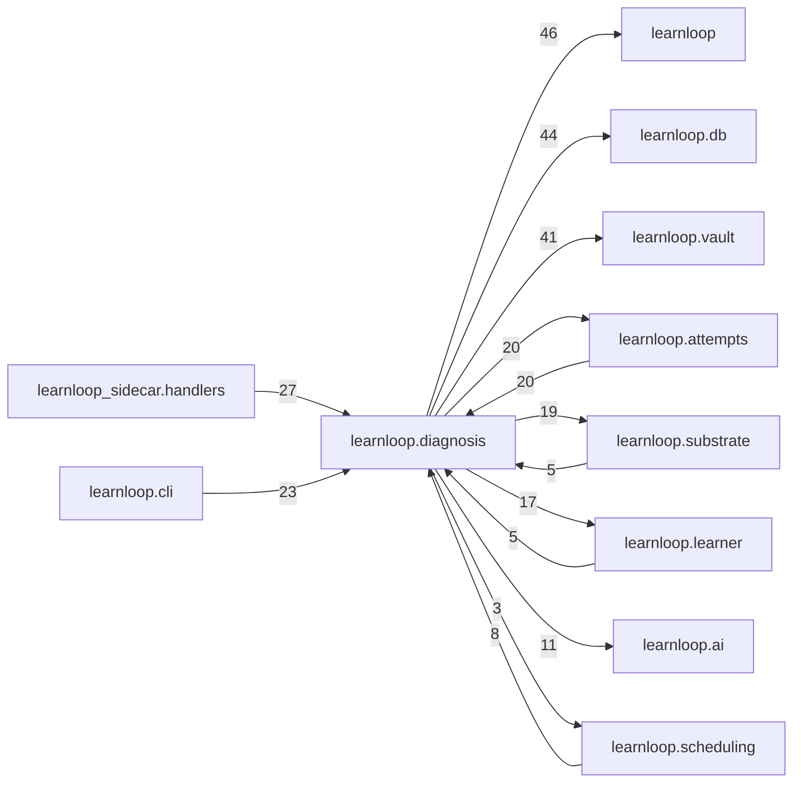

# `learnloop.diagnosis` package map

> [!info] Generated package map
> This map is generated from live modules and their static imports. Follow module links for source-level facts and canonical concept/workflow links for system behavior.

Up: [[Module Catalog]]

## Responsibility

Diagnostic probes, causal attribution, error classification, and remediation decisions.

For system intent, use [[Learning System]].

^package-purpose

## Module index

| Module | Purpose | Status | Direct importers | Direct test files |
|---|---|---:|---:|---:|
| [[Reference/Modules/learnloop/diagnosis/__init__|learnloop.diagnosis]] | [[Reference/Modules/learnloop/diagnosis/__init__#^module-purpose|purpose]] | `ACTIVE` | 0 | 0 |
| [[Reference/Modules/learnloop/diagnosis/ai_contracts|learnloop.diagnosis.ai_contracts]] | [[Reference/Modules/learnloop/diagnosis/ai_contracts#^module-purpose|purpose]] | `ACTIVE` | 4 | 10 |
| [[Reference/Modules/learnloop/diagnosis/calibration_sessions|learnloop.diagnosis.calibration_sessions]] | [[Reference/Modules/learnloop/diagnosis/calibration_sessions#^module-purpose|purpose]] | `ACTIVE` | 3 | 4 |
| [[Reference/Modules/learnloop/diagnosis/causal_activity_policy|learnloop.diagnosis.causal_activity_policy]] | [[Reference/Modules/learnloop/diagnosis/causal_activity_policy#^module-purpose|purpose]] | `ACTIVE` | 7 | 3 |
| [[Reference/Modules/learnloop/diagnosis/causal_attribution|learnloop.diagnosis.causal_attribution]] | [[Reference/Modules/learnloop/diagnosis/causal_attribution#^module-purpose|purpose]] | `ACTIVE` | 20 | 13 |
| [[Reference/Modules/learnloop/diagnosis/causal_diagnostic_selector|learnloop.diagnosis.causal_diagnostic_selector]] | [[Reference/Modules/learnloop/diagnosis/causal_diagnostic_selector#^module-purpose|purpose]] | `EVALUATION` | 2 | 1 |
| [[Reference/Modules/learnloop/diagnosis/causal_factor_deferral|learnloop.diagnosis.causal_factor_deferral]] | [[Reference/Modules/learnloop/diagnosis/causal_factor_deferral#^module-purpose|purpose]] | `ACTIVE` | 3 | 1 |
| [[Reference/Modules/learnloop/diagnosis/causal_health|learnloop.diagnosis.causal_health]] | [[Reference/Modules/learnloop/diagnosis/causal_health#^module-purpose|purpose]] | `ACTIVE` | 2 | 1 |
| [[Reference/Modules/learnloop/diagnosis/causal_migration|learnloop.diagnosis.causal_migration]] | [[Reference/Modules/learnloop/diagnosis/causal_migration#^module-purpose|purpose]] | `ACTIVE` | 0 | 1 |
| [[Reference/Modules/learnloop/diagnosis/causal_orchestrator|learnloop.diagnosis.causal_orchestrator]] | [[Reference/Modules/learnloop/diagnosis/causal_orchestrator#^module-purpose|purpose]] | `ACTIVE` | 5 | 10 |
| [[Reference/Modules/learnloop/diagnosis/causal_probe_coherence|learnloop.diagnosis.causal_probe_coherence]] | [[Reference/Modules/learnloop/diagnosis/causal_probe_coherence#^module-purpose|purpose]] | `ACTIVE` | 11 | 11 |
| [[Reference/Modules/learnloop/diagnosis/causal_probe_commissioning|learnloop.diagnosis.causal_probe_commissioning]] | [[Reference/Modules/learnloop/diagnosis/causal_probe_commissioning#^module-purpose|purpose]] | `ACTIVE` | 1 | 2 |
| [[Reference/Modules/learnloop/diagnosis/causal_selection_audit|learnloop.diagnosis.causal_selection_audit]] | [[Reference/Modules/learnloop/diagnosis/causal_selection_audit#^module-purpose|purpose]] | `EVALUATION` | 2 | 1 |
| [[Reference/Modules/learnloop/diagnosis/contrast_pairs|learnloop.diagnosis.contrast_pairs]] | [[Reference/Modules/learnloop/diagnosis/contrast_pairs#^module-purpose|purpose]] | `ACTIVE` | 5 | 1 |
| [[Reference/Modules/learnloop/diagnosis/diagnosis_adjudication|learnloop.diagnosis.diagnosis_adjudication]] | [[Reference/Modules/learnloop/diagnosis/diagnosis_adjudication#^module-purpose|purpose]] | `ACTIVE` | 4 | 4 |
| [[Reference/Modules/learnloop/diagnosis/diagnostic_augmentation|learnloop.diagnosis.diagnostic_augmentation]] | [[Reference/Modules/learnloop/diagnosis/diagnostic_augmentation#^module-purpose|purpose]] | `ACTIVE` | 3 | 2 |
| [[Reference/Modules/learnloop/diagnosis/diagnostic_gate|learnloop.diagnosis.diagnostic_gate]] | [[Reference/Modules/learnloop/diagnosis/diagnostic_gate#^module-purpose|purpose]] | `ACTIVE` | 8 | 4 |
| [[Reference/Modules/learnloop/diagnosis/diagnostic_pack|learnloop.diagnosis.diagnostic_pack]] | [[Reference/Modules/learnloop/diagnosis/diagnostic_pack#^module-purpose|purpose]] | `ACTIVE` | 3 | 3 |
| [[Reference/Modules/learnloop/diagnosis/diagnostic_surface_supply|learnloop.diagnosis.diagnostic_surface_supply]] | [[Reference/Modules/learnloop/diagnosis/diagnostic_surface_supply#^module-purpose|purpose]] | `ACTIVE` | 2 | 3 |
| [[Reference/Modules/learnloop/diagnosis/discrimination_profiles|learnloop.diagnosis.discrimination_profiles]] | [[Reference/Modules/learnloop/diagnosis/discrimination_profiles#^module-purpose|purpose]] | `ACTIVE` | 6 | 1 |
| [[Reference/Modules/learnloop/diagnosis/error_hunt|learnloop.diagnosis.error_hunt]] | [[Reference/Modules/learnloop/diagnosis/error_hunt#^module-purpose|purpose]] | `ACTIVE` | 4 | 1 |
| [[Reference/Modules/learnloop/diagnosis/error_taxonomy|learnloop.diagnosis.error_taxonomy]] | [[Reference/Modules/learnloop/diagnosis/error_taxonomy#^module-purpose|purpose]] | `ACTIVE` | 2 | 0 |
| [[Reference/Modules/learnloop/diagnosis/error_taxonomy_map|learnloop.diagnosis.error_taxonomy_map]] | [[Reference/Modules/learnloop/diagnosis/error_taxonomy_map#^module-purpose|purpose]] | `ACTIVE` | 10 | 3 |
| [[Reference/Modules/learnloop/diagnosis/failure_triage|learnloop.diagnosis.failure_triage]] | [[Reference/Modules/learnloop/diagnosis/failure_triage#^module-purpose|purpose]] | `ACTIVE` | 1 | 6 |
| [[Reference/Modules/learnloop/diagnosis/followups|learnloop.diagnosis.followups]] | [[Reference/Modules/learnloop/diagnosis/followups#^module-purpose|purpose]] | `ACTIVE` | 7 | 18 |
| [[Reference/Modules/learnloop/diagnosis/gate_fit|learnloop.diagnosis.gate_fit]] | [[Reference/Modules/learnloop/diagnosis/gate_fit#^module-purpose|purpose]] | `ACTIVE` | 1 | 1 |
| [[Reference/Modules/learnloop/diagnosis/gate_score|learnloop.diagnosis.gate_score]] | [[Reference/Modules/learnloop/diagnosis/gate_score#^module-purpose|purpose]] | `ACTIVE` | 3 | 3 |
| [[Reference/Modules/learnloop/diagnosis/guided_redo|learnloop.diagnosis.guided_redo]] | [[Reference/Modules/learnloop/diagnosis/guided_redo#^module-purpose|purpose]] | `ACTIVE` | 4 | 1 |
| [[Reference/Modules/learnloop/diagnosis/longform_trace|learnloop.diagnosis.longform_trace]] | [[Reference/Modules/learnloop/diagnosis/longform_trace#^module-purpose|purpose]] | `ACTIVE` | 1 | 1 |
| [[Reference/Modules/learnloop/diagnosis/misconceptions|learnloop.diagnosis.misconceptions]] | [[Reference/Modules/learnloop/diagnosis/misconceptions#^module-purpose|purpose]] | `ACTIVE` | 5 | 8 |
| [[Reference/Modules/learnloop/diagnosis/missing_vocabulary|learnloop.diagnosis.missing_vocabulary]] | [[Reference/Modules/learnloop/diagnosis/missing_vocabulary#^module-purpose|purpose]] | `ACTIVE` | 4 | 1 |
| [[Reference/Modules/learnloop/diagnosis/predictive_eig|learnloop.diagnosis.predictive_eig]] | [[Reference/Modules/learnloop/diagnosis/predictive_eig#^module-purpose|purpose]] | `ACTIVE` | 1 | 2 |
| [[Reference/Modules/learnloop/diagnosis/probe_audit|learnloop.diagnosis.probe_audit]] | [[Reference/Modules/learnloop/diagnosis/probe_audit#^module-purpose|purpose]] | `ACTIVE` | 3 | 4 |
| [[Reference/Modules/learnloop/diagnosis/probe_blocks|learnloop.diagnosis.probe_blocks]] | [[Reference/Modules/learnloop/diagnosis/probe_blocks#^module-purpose|purpose]] | `ACTIVE` | 3 | 1 |
| [[Reference/Modules/learnloop/diagnosis/probe_coverage|learnloop.diagnosis.probe_coverage]] | [[Reference/Modules/learnloop/diagnosis/probe_coverage#^module-purpose|purpose]] | `ACTIVE` | 1 | 2 |
| [[Reference/Modules/learnloop/diagnosis/probe_dialogue|learnloop.diagnosis.probe_dialogue]] | [[Reference/Modules/learnloop/diagnosis/probe_dialogue#^module-purpose|purpose]] | `ACTIVE` | 1 | 2 |
| [[Reference/Modules/learnloop/diagnosis/probe_episodes|learnloop.diagnosis.probe_episodes]] | [[Reference/Modules/learnloop/diagnosis/probe_episodes#^module-purpose|purpose]] | `ACTIVE` | 19 | 32 |
| [[Reference/Modules/learnloop/diagnosis/probe_families|learnloop.diagnosis.probe_families]] | [[Reference/Modules/learnloop/diagnosis/probe_families#^module-purpose|purpose]] | `ACTIVE` | 11 | 20 |
| [[Reference/Modules/learnloop/diagnosis/probe_hypotheses|learnloop.diagnosis.probe_hypotheses]] | [[Reference/Modules/learnloop/diagnosis/probe_hypotheses#^module-purpose|purpose]] | `ACTIVE` | 11 | 7 |
| [[Reference/Modules/learnloop/diagnosis/probe_instance_generation|learnloop.diagnosis.probe_instance_generation]] | [[Reference/Modules/learnloop/diagnosis/probe_instance_generation#^module-purpose|purpose]] | `ACTIVE` | 8 | 7 |
| [[Reference/Modules/learnloop/diagnosis/probe_lifecycle|learnloop.diagnosis.probe_lifecycle]] | [[Reference/Modules/learnloop/diagnosis/probe_lifecycle#^module-purpose|purpose]] | `ACTIVE` | 1 | 1 |
| [[Reference/Modules/learnloop/diagnosis/probe_outcome_mapping|learnloop.diagnosis.probe_outcome_mapping]] | [[Reference/Modules/learnloop/diagnosis/probe_outcome_mapping#^module-purpose|purpose]] | `ACTIVE` | 2 | 1 |
| [[Reference/Modules/learnloop/diagnosis/probe_remint|learnloop.diagnosis.probe_remint]] | [[Reference/Modules/learnloop/diagnosis/probe_remint#^module-purpose|purpose]] | `ACTIVE` | 1 | 1 |
| [[Reference/Modules/learnloop/diagnosis/probe_robust|learnloop.diagnosis.probe_robust]] | [[Reference/Modules/learnloop/diagnosis/probe_robust#^module-purpose|purpose]] | `ACTIVE` | 1 | 1 |
| [[Reference/Modules/learnloop/diagnosis/probe_targeting|learnloop.diagnosis.probe_targeting]] | [[Reference/Modules/learnloop/diagnosis/probe_targeting#^module-purpose|purpose]] | `ACTIVE` | 2 | 3 |
| [[Reference/Modules/learnloop/diagnosis/probes|learnloop.diagnosis.probes]] | [[Reference/Modules/learnloop/diagnosis/probes#^module-purpose|purpose]] | `ACTIVE` | 10 | 15 |
| [[Reference/Modules/learnloop/diagnosis/remediation|learnloop.diagnosis.remediation]] | [[Reference/Modules/learnloop/diagnosis/remediation#^module-purpose|purpose]] | `ACTIVE` | 9 | 14 |
| [[Reference/Modules/learnloop/diagnosis/remediation_intake|learnloop.diagnosis.remediation_intake]] | [[Reference/Modules/learnloop/diagnosis/remediation_intake#^module-purpose|purpose]] | `ACTIVE` | 0 | 1 |
| [[Reference/Modules/learnloop/diagnosis/repair_splice|learnloop.diagnosis.repair_splice]] | [[Reference/Modules/learnloop/diagnosis/repair_splice#^module-purpose|purpose]] | `ACTIVE` | 1 | 1 |
| [[Reference/Modules/learnloop/diagnosis/robust_composition|learnloop.diagnosis.robust_composition]] | [[Reference/Modules/learnloop/diagnosis/robust_composition#^module-purpose|purpose]] | `ACTIVE` | 6 | 7 |
| [[Reference/Modules/learnloop/diagnosis/scoreboard|learnloop.diagnosis.scoreboard]] | [[Reference/Modules/learnloop/diagnosis/scoreboard#^module-purpose|purpose]] | `ACTIVE` | 7 | 3 |
| [[Reference/Modules/learnloop/diagnosis/signal_quantiles|learnloop.diagnosis.signal_quantiles]] | [[Reference/Modules/learnloop/diagnosis/signal_quantiles#^module-purpose|purpose]] | `ACTIVE` | 2 | 2 |
| [[Reference/Modules/learnloop/diagnosis/taxonomy_regrade|learnloop.diagnosis.taxonomy_regrade]] | [[Reference/Modules/learnloop/diagnosis/taxonomy_regrade#^module-purpose|purpose]] | `ACTIVE` | 1 | 1 |

## Cross-package dependencies

### This package imports

- [[Reference/Modules/learnloop/_package|learnloop]] — 46 static module edges
- [[Reference/Modules/learnloop/db/_package|learnloop.db]] — 44 static module edges
- [[Reference/Modules/learnloop/vault/_package|learnloop.vault]] — 41 static module edges
- [[Reference/Modules/learnloop/attempts/_package|learnloop.attempts]] — 20 static module edges
- [[Reference/Modules/learnloop/substrate/_package|learnloop.substrate]] — 19 static module edges
- [[Reference/Modules/learnloop/learner/_package|learnloop.learner]] — 17 static module edges
- [[Reference/Modules/learnloop/ai/_package|learnloop.ai]] — 11 static module edges
- [[Reference/Modules/learnloop/config/_package|learnloop.config]] — 5 static module edges
- [[Reference/Modules/learnloop/goals/_package|learnloop.goals]] — 5 static module edges
- [[Reference/Modules/learnloop/scheduling/_package|learnloop.scheduling]] — 3 static module edges
- [[Reference/Modules/learnloop/tutor/_package|learnloop.tutor]] — 3 static module edges
- [[Reference/Modules/learnloop/curriculum/_package|learnloop.curriculum]] — 2 static module edges
- [[Reference/Modules/learnloop/params/_package|learnloop.params]] — 2 static module edges
- [[Reference/Modules/learnloop/content/authoring/_package|learnloop.content.authoring]] — 1 static module edge
- [[Reference/Modules/learnloop/content/proposals/_package|learnloop.content.proposals]] — 1 static module edge
- [[Reference/Modules/learnloop/content/sources/_package|learnloop.content.sources]] — 1 static module edge
- [[Reference/Modules/learnloop/ingest/_package|learnloop.ingest]] — 1 static module edge
- [[Reference/Modules/learnloop/reader/_package|learnloop.reader]] — 1 static module edge

### Packages that import this package

- [[Reference/Modules/learnloop_sidecar/handlers/_package|learnloop_sidecar.handlers]] — 27 static module edges
- [[Reference/Modules/learnloop/cli/_package|learnloop.cli]] — 23 static module edges
- [[Reference/Modules/learnloop/attempts/_package|learnloop.attempts]] — 20 static module edges
- [[Reference/Modules/learnloop/content/authoring/_package|learnloop.content.authoring]] — 9 static module edges
- [[Reference/Modules/learnloop/scheduling/_package|learnloop.scheduling]] — 8 static module edges
- [[Reference/Modules/learnloop/sim/_package|learnloop.sim]] — 7 static module edges
- [[Reference/Modules/learnloop/curriculum/_package|learnloop.curriculum]] — 5 static module edges
- [[Reference/Modules/learnloop/learner/_package|learnloop.learner]] — 5 static module edges
- [[Reference/Modules/learnloop/substrate/_package|learnloop.substrate]] — 5 static module edges
- [[Reference/Modules/learnloop/tutor/_package|learnloop.tutor]] — 4 static module edges
- [[Reference/Modules/learnloop/ops/_package|learnloop.ops]] — 3 static module edges
- [[Reference/Modules/learnloop/tui/screens/_package|learnloop.tui.screens]] — 3 static module edges
- [[Reference/Modules/learnloop/content/proposals/_package|learnloop.content.proposals]] — 2 static module edges
- [[Reference/Modules/learnloop/content/synthesis/_package|learnloop.content.synthesis]] — 1 static module edge
- [[Reference/Modules/learnloop/goals/_package|learnloop.goals]] — 1 static module edge
- [[Reference/Modules/learnloop_sidecar/_package|learnloop_sidecar]] — 1 static module edge

### Dependency neighborhood

This diagram compresses package-level static imports; edge labels are distinct module-to-module import counts.



Interpretation: arrow direction is static import direction and the label is the number of distinct module-to-module edges. It shows coupling pressure, not runtime call frequency or ownership permission.

## Workflow entry points

- [[Start a Learning Cycle]]
- [[Process Model Output]]

## Find and filter

Use Obsidian's native search:

```query
path:"Reference/Modules/learnloop/diagnosis" tag:#docs/module
```

To change this package, start with a module's [[#Module index|purpose link]], then follow its callers, tests, and modification guidance. Re-run the generator after source changes.
