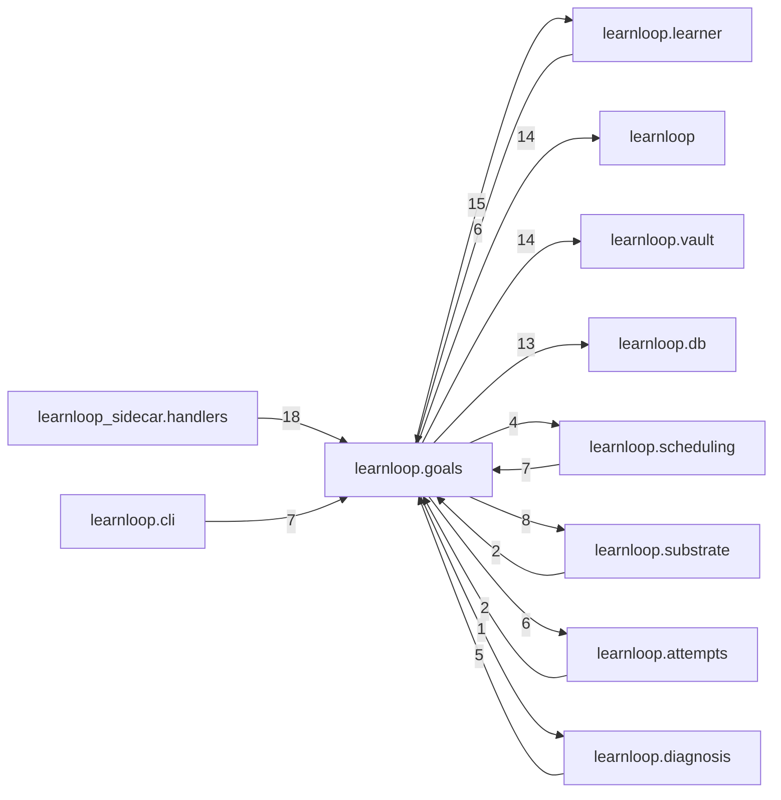

# `learnloop.goals` package map

> [!info] Generated package map
> This map is generated from live modules and their static imports. Follow module links for source-level facts and canonical concept/workflow links for system behavior.

Up: [[Module Catalog]]

## Responsibility

Learning goals, forecasts, certification, readiness, and exam workflows.

For system intent, use [[Learning System]].

^package-purpose

## Module index

| Module | Purpose | Status | Direct importers | Direct test files |
|---|---|---:|---:|---:|
| [[Reference/Modules/learnloop/goals/__init__|learnloop.goals]] | [[Reference/Modules/learnloop/goals/__init__#^module-purpose|purpose]] | `ACTIVE` | 0 | 0 |
| [[Reference/Modules/learnloop/goals/certification|learnloop.goals.certification]] | [[Reference/Modules/learnloop/goals/certification#^module-purpose|purpose]] | `ACTIVE` | 5 | 0 |
| [[Reference/Modules/learnloop/goals/certification_cold_probe|learnloop.goals.certification_cold_probe]] | [[Reference/Modules/learnloop/goals/certification_cold_probe#^module-purpose|purpose]] | `ACTIVE` | 5 | 5 |
| [[Reference/Modules/learnloop/goals/exam_calibration|learnloop.goals.exam_calibration]] | [[Reference/Modules/learnloop/goals/exam_calibration#^module-purpose|purpose]] | `ACTIVE` | 3 | 2 |
| [[Reference/Modules/learnloop/goals/exam_pool|learnloop.goals.exam_pool]] | [[Reference/Modules/learnloop/goals/exam_pool#^module-purpose|purpose]] | `ACTIVE` | 4 | 12 |
| [[Reference/Modules/learnloop/goals/exam_readiness|learnloop.goals.exam_readiness]] | [[Reference/Modules/learnloop/goals/exam_readiness#^module-purpose|purpose]] | `ACTIVE` | 2 | 1 |
| [[Reference/Modules/learnloop/goals/exam_seeding|learnloop.goals.exam_seeding]] | [[Reference/Modules/learnloop/goals/exam_seeding#^module-purpose|purpose]] | `ACTIVE` | 2 | 1 |
| [[Reference/Modules/learnloop/goals/exam_session|learnloop.goals.exam_session]] | [[Reference/Modules/learnloop/goals/exam_session#^module-purpose|purpose]] | `ACTIVE` | 2 | 5 |
| [[Reference/Modules/learnloop/goals/forecast_ledger|learnloop.goals.forecast_ledger]] | [[Reference/Modules/learnloop/goals/forecast_ledger#^module-purpose|purpose]] | `ACTIVE` | 3 | 2 |
| [[Reference/Modules/learnloop/goals/goal_certification|learnloop.goals.goal_certification]] | [[Reference/Modules/learnloop/goals/goal_certification#^module-purpose|purpose]] | `ACTIVE` | 7 | 2 |
| [[Reference/Modules/learnloop/goals/goal_contracts|learnloop.goals.goal_contracts]] | [[Reference/Modules/learnloop/goals/goal_contracts#^module-purpose|purpose]] | `ACTIVE` | 9 | 3 |
| [[Reference/Modules/learnloop/goals/goal_intent|learnloop.goals.goal_intent]] | [[Reference/Modules/learnloop/goals/goal_intent#^module-purpose|purpose]] | `ACTIVE` | 2 | 1 |
| [[Reference/Modules/learnloop/goals/goal_pace|learnloop.goals.goal_pace]] | [[Reference/Modules/learnloop/goals/goal_pace#^module-purpose|purpose]] | `ACTIVE` | 2 | 2 |
| [[Reference/Modules/learnloop/goals/goal_projection|learnloop.goals.goal_projection]] | [[Reference/Modules/learnloop/goals/goal_projection#^module-purpose|purpose]] | `ACTIVE` | 20 | 9 |
| [[Reference/Modules/learnloop/goals/goal_series|learnloop.goals.goal_series]] | [[Reference/Modules/learnloop/goals/goal_series#^module-purpose|purpose]] | `ACTIVE` | 2 | 1 |
| [[Reference/Modules/learnloop/goals/goal_series_store|learnloop.goals.goal_series_store]] | [[Reference/Modules/learnloop/goals/goal_series_store#^module-purpose|purpose]] | `ACTIVE` | 1 | 0 |
| [[Reference/Modules/learnloop/goals/receipt_contributions|learnloop.goals.receipt_contributions]] | [[Reference/Modules/learnloop/goals/receipt_contributions#^module-purpose|purpose]] | `ACTIVE` | 2 | 0 |

## Cross-package dependencies

### This package imports

- [[Reference/Modules/learnloop/learner/_package|learnloop.learner]] — 15 static module edges
- [[Reference/Modules/learnloop/_package|learnloop]] — 14 static module edges
- [[Reference/Modules/learnloop/vault/_package|learnloop.vault]] — 14 static module edges
- [[Reference/Modules/learnloop/db/_package|learnloop.db]] — 13 static module edges
- [[Reference/Modules/learnloop/substrate/_package|learnloop.substrate]] — 8 static module edges
- [[Reference/Modules/learnloop/attempts/_package|learnloop.attempts]] — 6 static module edges
- [[Reference/Modules/learnloop/scheduling/_package|learnloop.scheduling]] — 4 static module edges
- [[Reference/Modules/learnloop/params/_package|learnloop.params]] — 2 static module edges
- [[Reference/Modules/learnloop/diagnosis/_package|learnloop.diagnosis]] — 1 static module edge

### Packages that import this package

- [[Reference/Modules/learnloop_sidecar/handlers/_package|learnloop_sidecar.handlers]] — 18 static module edges
- [[Reference/Modules/learnloop/cli/_package|learnloop.cli]] — 7 static module edges
- [[Reference/Modules/learnloop/scheduling/_package|learnloop.scheduling]] — 7 static module edges
- [[Reference/Modules/learnloop/learner/_package|learnloop.learner]] — 6 static module edges
- [[Reference/Modules/learnloop/diagnosis/_package|learnloop.diagnosis]] — 5 static module edges
- [[Reference/Modules/learnloop/curriculum/_package|learnloop.curriculum]] — 3 static module edges
- [[Reference/Modules/learnloop/attempts/_package|learnloop.attempts]] — 2 static module edges
- [[Reference/Modules/learnloop/substrate/_package|learnloop.substrate]] — 2 static module edges
- [[Reference/Modules/learnloop/tutor/_package|learnloop.tutor]] — 2 static module edges
- [[Reference/Modules/learnloop/content/authoring/_package|learnloop.content.authoring]] — 1 static module edge
- [[Reference/Modules/learnloop/content/pipeline/_package|learnloop.content.pipeline]] — 1 static module edge
- [[Reference/Modules/learnloop/ops/_package|learnloop.ops]] — 1 static module edge
- [[Reference/Modules/learnloop/sim/_package|learnloop.sim]] — 1 static module edge
- [[Reference/Modules/learnloop_sidecar/_package|learnloop_sidecar]] — 1 static module edge

### Dependency neighborhood

This diagram compresses package-level static imports; edge labels are distinct module-to-module import counts.



Interpretation: arrow direction is static import direction and the label is the number of distinct module-to-module edges. It shows coupling pressure, not runtime call frequency or ownership permission.

## Workflow entry points

- [[Start a Learning Cycle]]
- [[Inspect Persistent State]]

## Find and filter

Use Obsidian's native search:

```query
path:"Reference/Modules/learnloop/goals" tag:#docs/module
```

To change this package, start with a module's [[#Module index|purpose link]], then follow its callers, tests, and modification guidance. Re-run the generator after source changes.
