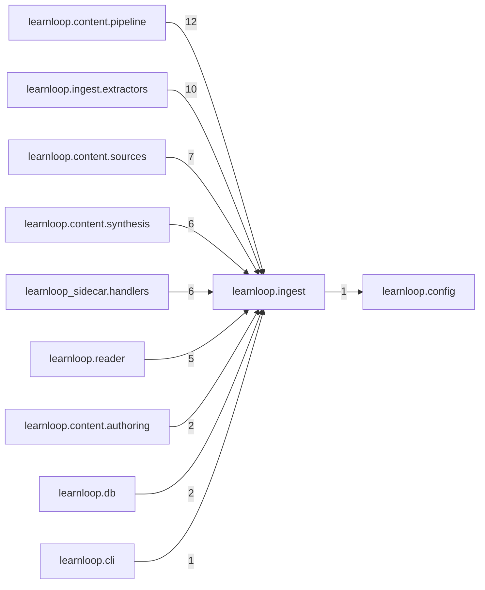

# `learnloop.ingest` package map

> [!info] Generated package map
> This map is generated from live modules and their static imports. Follow module links for source-level facts and canonical concept/workflow links for system behavior.

Up: [[Module Catalog]]

## Responsibility

Acquisition intermediate representation, locators, fetchers, originals, and ingestion orchestration.

For system intent, use [[Architecture Overview]].

^package-purpose

## Module index

| Module | Purpose | Status | Direct importers | Direct test files |
|---|---|---:|---:|---:|
| [[Reference/Modules/learnloop/ingest/__init__|learnloop.ingest]] | [[Reference/Modules/learnloop/ingest/__init__#^module-purpose|purpose]] | `ACTIVE` | 0 | 0 |
| [[Reference/Modules/learnloop/ingest/block_roles|learnloop.ingest.block_roles]] | [[Reference/Modules/learnloop/ingest/block_roles#^module-purpose|purpose]] | `ACTIVE` | 3 | 1 |
| [[Reference/Modules/learnloop/ingest/detect|learnloop.ingest.detect]] | [[Reference/Modules/learnloop/ingest/detect#^module-purpose|purpose]] | `ACTIVE` | 1 | 1 |
| [[Reference/Modules/learnloop/ingest/fetchers|learnloop.ingest.fetchers]] | [[Reference/Modules/learnloop/ingest/fetchers#^module-purpose|purpose]] | `ACTIVE` | 3 | 2 |
| [[Reference/Modules/learnloop/ingest/hashing|learnloop.ingest.hashing]] | [[Reference/Modules/learnloop/ingest/hashing#^module-purpose|purpose]] | `ACTIVE` | 8 | 12 |
| [[Reference/Modules/learnloop/ingest/ir|learnloop.ingest.ir]] | [[Reference/Modules/learnloop/ingest/ir#^module-purpose|purpose]] | `ACTIVE` | 15 | 28 |
| [[Reference/Modules/learnloop/ingest/locators|learnloop.ingest.locators]] | [[Reference/Modules/learnloop/ingest/locators#^module-purpose|purpose]] | `ACTIVE` | 9 | 1 |
| [[Reference/Modules/learnloop/ingest/models|learnloop.ingest.models]] | [[Reference/Modules/learnloop/ingest/models#^module-purpose|purpose]] | `ACTIVE` | 7 | 2 |
| [[Reference/Modules/learnloop/ingest/originals|learnloop.ingest.originals]] | [[Reference/Modules/learnloop/ingest/originals#^module-purpose|purpose]] | `ACTIVE` | 5 | 2 |
| [[Reference/Modules/learnloop/ingest/reanchor|learnloop.ingest.reanchor]] | [[Reference/Modules/learnloop/ingest/reanchor#^module-purpose|purpose]] | `ACTIVE` | 4 | 1 |
| [[Reference/Modules/learnloop/ingest/resolution|learnloop.ingest.resolution]] | [[Reference/Modules/learnloop/ingest/resolution#^module-purpose|purpose]] | `ACTIVE` | 6 | 3 |
| [[Reference/Modules/learnloop/ingest/transcription|learnloop.ingest.transcription]] | [[Reference/Modules/learnloop/ingest/transcription#^module-purpose|purpose]] | `ACTIVE` | 1 | 1 |
| [[Reference/Modules/learnloop/ingest/transcripts|learnloop.ingest.transcripts]] | [[Reference/Modules/learnloop/ingest/transcripts#^module-purpose|purpose]] | `ACTIVE` | 2 | 1 |

## Child package maps

- [[Reference/Modules/learnloop/ingest/extractors/_package|learnloop.ingest.extractors]] — Format-specific extraction adapters for canonical sources.

## Cross-package dependencies

### This package imports

- [[Reference/Modules/learnloop/config/_package|learnloop.config]] — 1 static module edge

### Packages that import this package

- [[Reference/Modules/learnloop/content/pipeline/_package|learnloop.content.pipeline]] — 12 static module edges
- [[Reference/Modules/learnloop/ingest/extractors/_package|learnloop.ingest.extractors]] — 10 static module edges
- [[Reference/Modules/learnloop/content/sources/_package|learnloop.content.sources]] — 7 static module edges
- [[Reference/Modules/learnloop/content/synthesis/_package|learnloop.content.synthesis]] — 6 static module edges
- [[Reference/Modules/learnloop_sidecar/handlers/_package|learnloop_sidecar.handlers]] — 6 static module edges
- [[Reference/Modules/learnloop/reader/_package|learnloop.reader]] — 5 static module edges
- [[Reference/Modules/learnloop/content/authoring/_package|learnloop.content.authoring]] — 2 static module edges
- [[Reference/Modules/learnloop/db/_package|learnloop.db]] — 2 static module edges
- [[Reference/Modules/learnloop/cli/_package|learnloop.cli]] — 1 static module edge
- [[Reference/Modules/learnloop/diagnosis/_package|learnloop.diagnosis]] — 1 static module edge
- [[Reference/Modules/learnloop/vault/_package|learnloop.vault]] — 1 static module edge

### Dependency neighborhood

This diagram compresses package-level static imports; edge labels are distinct module-to-module import counts.



Interpretation: arrow direction is static import direction and the label is the number of distinct module-to-module edges. It shows coupling pressure, not runtime call frequency or ownership permission.

## Workflow entry points

- [[Import Canonical Sources]]

## Find and filter

Use Obsidian's native search:

```query
path:"Reference/Modules/learnloop/ingest" tag:#docs/module
```

To change this package, start with a module's [[#Module index|purpose link]], then follow its callers, tests, and modification guidance. Re-run the generator after source changes.
