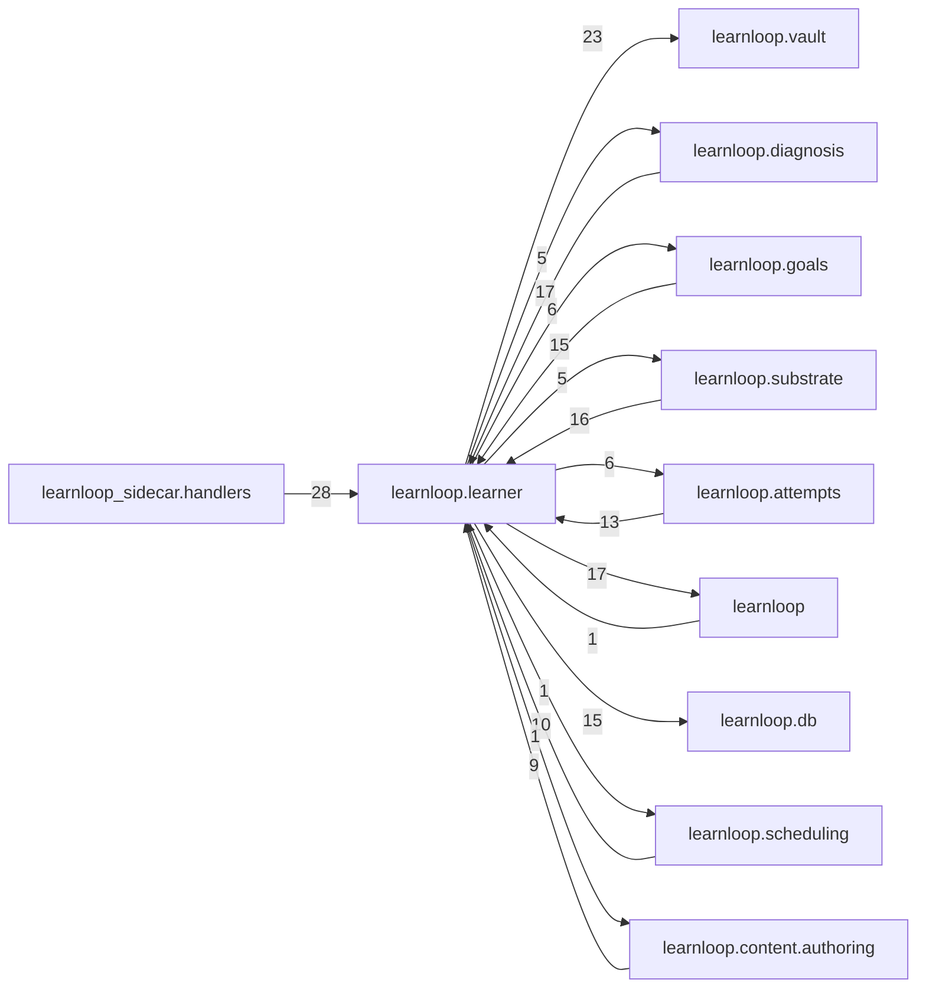

# `learnloop.learner` package map

> [!info] Generated package map
> This map is generated from live modules and their static imports. Follow module links for source-level facts and canonical concept/workflow links for system behavior.

Up: [[Module Catalog]]

## Responsibility

Mastery, recall, evidence, claims, ability transitions, and learner-state views.

For system intent, use [[Learning System]].

^package-purpose

## Module index

| Module | Purpose | Status | Direct importers | Direct test files |
|---|---|---:|---:|---:|
| [[Reference/Modules/learnloop/learner/__init__|learnloop.learner]] | [[Reference/Modules/learnloop/learner/__init__#^module-purpose|purpose]] | `ACTIVE` | 0 | 0 |
| [[Reference/Modules/learnloop/learner/assessment_contracts|learnloop.learner.assessment_contracts]] | [[Reference/Modules/learnloop/learner/assessment_contracts#^module-purpose|purpose]] | `ACTIVE` | 19 | 3 |
| [[Reference/Modules/learnloop/learner/blueprint_projection|learnloop.learner.blueprint_projection]] | [[Reference/Modules/learnloop/learner/blueprint_projection#^module-purpose|purpose]] | `ACTIVE` | 4 | 4 |
| [[Reference/Modules/learnloop/learner/calibration|learnloop.learner.calibration]] | [[Reference/Modules/learnloop/learner/calibration#^module-purpose|purpose]] | `ACTIVE` | 1 | 1 |
| [[Reference/Modules/learnloop/learner/capability_grid|learnloop.learner.capability_grid]] | [[Reference/Modules/learnloop/learner/capability_grid#^module-purpose|purpose]] | `ACTIVE` | 3 | 1 |
| [[Reference/Modules/learnloop/learner/capability_mapping|learnloop.learner.capability_mapping]] | [[Reference/Modules/learnloop/learner/capability_mapping#^module-purpose|purpose]] | `ACTIVE` | 19 | 3 |
| [[Reference/Modules/learnloop/learner/contract_reachability|learnloop.learner.contract_reachability]] | [[Reference/Modules/learnloop/learner/contract_reachability#^module-purpose|purpose]] | `ACTIVE` | 11 | 4 |
| [[Reference/Modules/learnloop/learner/facet_diagnostics|learnloop.learner.facet_diagnostics]] | [[Reference/Modules/learnloop/learner/facet_diagnostics#^module-purpose|purpose]] | `ACTIVE` | 19 | 5 |
| [[Reference/Modules/learnloop/learner/facet_evidence_timeline|learnloop.learner.facet_evidence_timeline]] | [[Reference/Modules/learnloop/learner/facet_evidence_timeline#^module-purpose|purpose]] | `ACTIVE` | 3 | 7 |
| [[Reference/Modules/learnloop/learner/facet_state_reader|learnloop.learner.facet_state_reader]] | [[Reference/Modules/learnloop/learner/facet_state_reader#^module-purpose|purpose]] | `ACTIVE` | 21 | 1 |
| [[Reference/Modules/learnloop/learner/familiarity|learnloop.learner.familiarity]] | [[Reference/Modules/learnloop/learner/familiarity#^module-purpose|purpose]] | `ACTIVE` | 6 | 7 |
| [[Reference/Modules/learnloop/learner/hypothesis_claims|learnloop.learner.hypothesis_claims]] | [[Reference/Modules/learnloop/learner/hypothesis_claims#^module-purpose|purpose]] | `ACTIVE` | 2 | 2 |
| [[Reference/Modules/learnloop/learner/identifiability|learnloop.learner.identifiability]] | [[Reference/Modules/learnloop/learner/identifiability#^module-purpose|purpose]] | `ACTIVE` | 9 | 5 |
| [[Reference/Modules/learnloop/learner/independence_audit|learnloop.learner.independence_audit]] | [[Reference/Modules/learnloop/learner/independence_audit#^module-purpose|purpose]] | `ACTIVE` | 1 | 0 |
| [[Reference/Modules/learnloop/learner/inference_precheck|learnloop.learner.inference_precheck]] | [[Reference/Modules/learnloop/learner/inference_precheck#^module-purpose|purpose]] | `ACTIVE` | 2 | 1 |
| [[Reference/Modules/learnloop/learner/learner_profile|learnloop.learner.learner_profile]] | [[Reference/Modules/learnloop/learner/learner_profile#^module-purpose|purpose]] | `ACTIVE` | 4 | 0 |
| [[Reference/Modules/learnloop/learner/learner_review_feed|learnloop.learner.learner_review_feed]] | [[Reference/Modules/learnloop/learner/learner_review_feed#^module-purpose|purpose]] | `ACTIVE` | 1 | 6 |
| [[Reference/Modules/learnloop/learner/mastery|learnloop.learner.mastery]] | [[Reference/Modules/learnloop/learner/mastery#^module-purpose|purpose]] | `ACTIVE` | 27 | 12 |
| [[Reference/Modules/learnloop/learner/mastery_step_attribution|learnloop.learner.mastery_step_attribution]] | [[Reference/Modules/learnloop/learner/mastery_step_attribution#^module-purpose|purpose]] | `ACTIVE` | 1 | 1 |
| [[Reference/Modules/learnloop/learner/measurement_state|learnloop.learner.measurement_state]] | [[Reference/Modules/learnloop/learner/measurement_state#^module-purpose|purpose]] | `ACTIVE` | 3 | 1 |
| [[Reference/Modules/learnloop/learner/overconfidence|learnloop.learner.overconfidence]] | [[Reference/Modules/learnloop/learner/overconfidence#^module-purpose|purpose]] | `ACTIVE` | 4 | 1 |
| [[Reference/Modules/learnloop/learner/recall_calibration|learnloop.learner.recall_calibration]] | [[Reference/Modules/learnloop/learner/recall_calibration#^module-purpose|purpose]] | `ACTIVE` | 1 | 1 |
| [[Reference/Modules/learnloop/learner/recall_coverage|learnloop.learner.recall_coverage]] | [[Reference/Modules/learnloop/learner/recall_coverage#^module-purpose|purpose]] | `ACTIVE` | 9 | 7 |
| [[Reference/Modules/learnloop/learner/residual_diagnostics|learnloop.learner.residual_diagnostics]] | [[Reference/Modules/learnloop/learner/residual_diagnostics#^module-purpose|purpose]] | `ACTIVE` | 1 | 1 |
| [[Reference/Modules/learnloop/learner/session_learning_diff|learnloop.learner.session_learning_diff]] | [[Reference/Modules/learnloop/learner/session_learning_diff#^module-purpose|purpose]] | `ACTIVE` | 2 | 0 |
| [[Reference/Modules/learnloop/learner/surfaced_beliefs|learnloop.learner.surfaced_beliefs]] | [[Reference/Modules/learnloop/learner/surfaced_beliefs#^module-purpose|purpose]] | `ACTIVE` | 8 | 3 |

## Cross-package dependencies

### This package imports

- [[Reference/Modules/learnloop/vault/_package|learnloop.vault]] — 23 static module edges
- [[Reference/Modules/learnloop/_package|learnloop]] — 17 static module edges
- [[Reference/Modules/learnloop/db/_package|learnloop.db]] — 15 static module edges
- [[Reference/Modules/learnloop/attempts/_package|learnloop.attempts]] — 6 static module edges
- [[Reference/Modules/learnloop/goals/_package|learnloop.goals]] — 6 static module edges
- [[Reference/Modules/learnloop/diagnosis/_package|learnloop.diagnosis]] — 5 static module edges
- [[Reference/Modules/learnloop/substrate/_package|learnloop.substrate]] — 5 static module edges
- [[Reference/Modules/learnloop/config/_package|learnloop.config]] — 4 static module edges
- [[Reference/Modules/learnloop/content/authoring/_package|learnloop.content.authoring]] — 1 static module edge
- [[Reference/Modules/learnloop/content/synthesis/_package|learnloop.content.synthesis]] — 1 static module edge
- [[Reference/Modules/learnloop/ops/_package|learnloop.ops]] — 1 static module edge
- [[Reference/Modules/learnloop/scheduling/_package|learnloop.scheduling]] — 1 static module edge
- [[Reference/Modules/learnloop/tutor/_package|learnloop.tutor]] — 1 static module edge

### Packages that import this package

- [[Reference/Modules/learnloop_sidecar/handlers/_package|learnloop_sidecar.handlers]] — 28 static module edges
- [[Reference/Modules/learnloop/diagnosis/_package|learnloop.diagnosis]] — 17 static module edges
- [[Reference/Modules/learnloop/substrate/_package|learnloop.substrate]] — 16 static module edges
- [[Reference/Modules/learnloop/goals/_package|learnloop.goals]] — 15 static module edges
- [[Reference/Modules/learnloop/attempts/_package|learnloop.attempts]] — 13 static module edges
- [[Reference/Modules/learnloop/scheduling/_package|learnloop.scheduling]] — 10 static module edges
- [[Reference/Modules/learnloop/content/authoring/_package|learnloop.content.authoring]] — 9 static module edges
- [[Reference/Modules/learnloop/cli/_package|learnloop.cli]] — 8 static module edges
- [[Reference/Modules/learnloop/tutor/_package|learnloop.tutor]] — 7 static module edges
- [[Reference/Modules/learnloop/ops/_package|learnloop.ops]] — 6 static module edges
- [[Reference/Modules/learnloop/sim/_package|learnloop.sim]] — 6 static module edges
- [[Reference/Modules/learnloop/curriculum/_package|learnloop.curriculum]] — 4 static module edges
- [[Reference/Modules/learnloop/content/synthesis/_package|learnloop.content.synthesis]] — 3 static module edges
- [[Reference/Modules/learnloop/tui/screens/_package|learnloop.tui.screens]] — 3 static module edges
- [[Reference/Modules/learnloop/content/pipeline/_package|learnloop.content.pipeline]] — 2 static module edges
- [[Reference/Modules/learnloop/content/proposals/_package|learnloop.content.proposals]] — 2 static module edges
- [[Reference/Modules/learnloop/substrate/compat/_package|learnloop.substrate.compat]] — 2 static module edges
- [[Reference/Modules/learnloop_sidecar/_package|learnloop_sidecar]] — 2 static module edges
- [[Reference/Modules/learnloop/_package|learnloop]] — 1 static module edge
- [[Reference/Modules/learnloop/reader/_package|learnloop.reader]] — 1 static module edge

### Dependency neighborhood

This diagram compresses package-level static imports; edge labels are distinct module-to-module import counts.



Interpretation: arrow direction is static import direction and the label is the number of distinct module-to-module edges. It shows coupling pressure, not runtime call frequency or ownership permission.

## Workflow entry points

- [[Start a Learning Cycle]]
- [[Inspect Persistent State]]

## Find and filter

Use Obsidian's native search:

```query
path:"Reference/Modules/learnloop/learner" tag:#docs/module
```

To change this package, start with a module's [[#Module index|purpose link]], then follow its callers, tests, and modification guidance. Re-run the generator after source changes.
