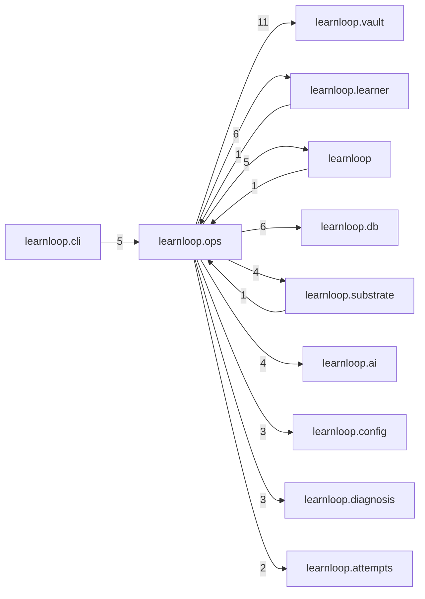

# `learnloop.ops` package map

> [!info] Generated package map
> This map is generated from live modules and their static imports. Follow module links for source-level facts and canonical concept/workflow links for system behavior.

Up: [[Module Catalog]]

## Responsibility

Vault diagnostics, locks, settings, startup, upgrades, and operator-facing maintenance.

For system intent, use [[State and Persistence]], [[Configuration]].

^package-purpose

## Module index

| Module | Purpose | Status | Direct importers | Direct test files |
|---|---|---:|---:|---:|
| [[Reference/Modules/learnloop/ops/__init__|learnloop.ops]] | [[Reference/Modules/learnloop/ops/__init__#^module-purpose|purpose]] | `ACTIVE` | 0 | 0 |
| [[Reference/Modules/learnloop/ops/debug_time|learnloop.ops.debug_time]] | [[Reference/Modules/learnloop/ops/debug_time#^module-purpose|purpose]] | `ACTIVE` | 1 | 0 |
| [[Reference/Modules/learnloop/ops/debug_time_store|learnloop.ops.debug_time_store]] | [[Reference/Modules/learnloop/ops/debug_time_store#^module-purpose|purpose]] | `ACTIVE` | 1 | 0 |
| [[Reference/Modules/learnloop/ops/doctor|learnloop.ops.doctor]] | [[Reference/Modules/learnloop/ops/doctor#^module-purpose|purpose]] | `ACTIVE` | 1 | 15 |
| [[Reference/Modules/learnloop/ops/maintenance_feed|learnloop.ops.maintenance_feed]] | [[Reference/Modules/learnloop/ops/maintenance_feed#^module-purpose|purpose]] | `ACTIVE` | 2 | 4 |
| [[Reference/Modules/learnloop/ops/settings_store|learnloop.ops.settings_store]] | [[Reference/Modules/learnloop/ops/settings_store#^module-purpose|purpose]] | `ACTIVE` | 2 | 3 |
| [[Reference/Modules/learnloop/ops/startup|learnloop.ops.startup]] | [[Reference/Modules/learnloop/ops/startup#^module-purpose|purpose]] | `ACTIVE` | 3 | 2 |
| [[Reference/Modules/learnloop/ops/vault_lock|learnloop.ops.vault_lock]] | [[Reference/Modules/learnloop/ops/vault_lock#^module-purpose|purpose]] | `ACTIVE` | 3 | 2 |
| [[Reference/Modules/learnloop/ops/vault_upgrade|learnloop.ops.vault_upgrade]] | [[Reference/Modules/learnloop/ops/vault_upgrade#^module-purpose|purpose]] | `ACTIVE` | 2 | 3 |

## Cross-package dependencies

### This package imports

- [[Reference/Modules/learnloop/vault/_package|learnloop.vault]] — 11 static module edges
- [[Reference/Modules/learnloop/db/_package|learnloop.db]] — 6 static module edges
- [[Reference/Modules/learnloop/learner/_package|learnloop.learner]] — 6 static module edges
- [[Reference/Modules/learnloop/_package|learnloop]] — 5 static module edges
- [[Reference/Modules/learnloop/ai/_package|learnloop.ai]] — 4 static module edges
- [[Reference/Modules/learnloop/substrate/_package|learnloop.substrate]] — 4 static module edges
- [[Reference/Modules/learnloop/config/_package|learnloop.config]] — 3 static module edges
- [[Reference/Modules/learnloop/diagnosis/_package|learnloop.diagnosis]] — 3 static module edges
- [[Reference/Modules/learnloop/attempts/_package|learnloop.attempts]] — 2 static module edges
- [[Reference/Modules/learnloop/content/sources/_package|learnloop.content.sources]] — 2 static module edges
- [[Reference/Modules/learnloop/ai/providers/_package|learnloop.ai.providers]] — 1 static module edge
- [[Reference/Modules/learnloop/content/authoring/_package|learnloop.content.authoring]] — 1 static module edge
- [[Reference/Modules/learnloop/content/proposals/_package|learnloop.content.proposals]] — 1 static module edge
- [[Reference/Modules/learnloop/content/synthesis/_package|learnloop.content.synthesis]] — 1 static module edge
- [[Reference/Modules/learnloop/curriculum/_package|learnloop.curriculum]] — 1 static module edge
- [[Reference/Modules/learnloop/goals/_package|learnloop.goals]] — 1 static module edge
- [[Reference/Modules/learnloop/params/_package|learnloop.params]] — 1 static module edge

### Packages that import this package

- [[Reference/Modules/learnloop/cli/_package|learnloop.cli]] — 5 static module edges
- [[Reference/Modules/learnloop_sidecar/handlers/_package|learnloop_sidecar.handlers]] — 2 static module edges
- [[Reference/Modules/learnloop/_package|learnloop]] — 1 static module edge
- [[Reference/Modules/learnloop/content/proposals/_package|learnloop.content.proposals]] — 1 static module edge
- [[Reference/Modules/learnloop/learner/_package|learnloop.learner]] — 1 static module edge
- [[Reference/Modules/learnloop/substrate/_package|learnloop.substrate]] — 1 static module edge
- [[Reference/Modules/learnloop/tui/_package|learnloop.tui]] — 1 static module edge
- [[Reference/Modules/learnloop_sidecar/_package|learnloop_sidecar]] — 1 static module edge

### Dependency neighborhood

This diagram compresses package-level static imports; edge labels are distinct module-to-module import counts.



Interpretation: arrow direction is static import direction and the label is the number of distinct module-to-module edges. It shows coupling pressure, not runtime call frequency or ownership permission.

## Workflow entry points

- [[Initialize a Vault]]
- [[Inspect Persistent State]]

## Find and filter

Use Obsidian's native search:

```query
path:"Reference/Modules/learnloop/ops" tag:#docs/module
```

To change this package, start with a module's [[#Module index|purpose link]], then follow its callers, tests, and modification guidance. Re-run the generator after source changes.
