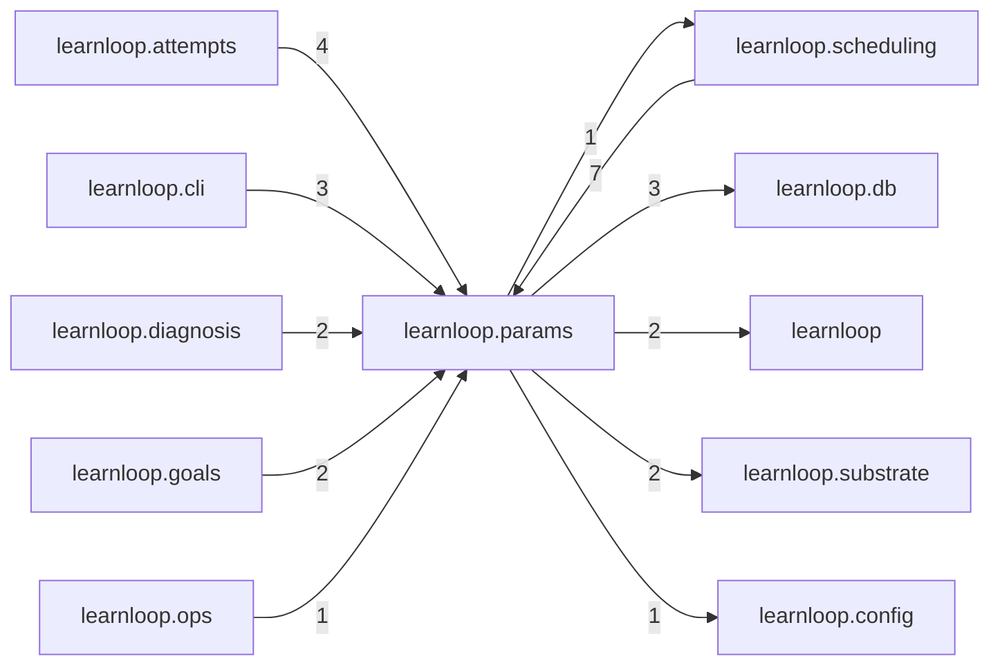

# `learnloop.params` package map

> [!info] Generated package map
> This map is generated from live modules and their static imports. Follow module links for source-level facts and canonical concept/workflow links for system behavior.

Up: [[Module Catalog]]

## Responsibility

Algorithm parameter registry, fitted values, and sensitivity certificates.

For system intent, use [[Learning System]], [[Configuration]].

^package-purpose

## Module index

| Module | Purpose | Status | Direct importers | Direct test files |
|---|---|---:|---:|---:|
| [[Reference/Modules/learnloop/params/__init__|learnloop.params]] | [[Reference/Modules/learnloop/params/__init__#^module-purpose|purpose]] | `ACTIVE` | 0 | 0 |
| [[Reference/Modules/learnloop/params/fitted_params|learnloop.params.fitted_params]] | [[Reference/Modules/learnloop/params/fitted_params#^module-purpose|purpose]] | `ACTIVE` | 12 | 2 |
| [[Reference/Modules/learnloop/params/parameter_registry|learnloop.params.parameter_registry]] | [[Reference/Modules/learnloop/params/parameter_registry#^module-purpose|purpose]] | `ACTIVE` | 6 | 8 |
| [[Reference/Modules/learnloop/params/sensitivity_certificates|learnloop.params.sensitivity_certificates]] | [[Reference/Modules/learnloop/params/sensitivity_certificates#^module-purpose|purpose]] | `ACTIVE` | 3 | 1 |

## Cross-package dependencies

### This package imports

- [[Reference/Modules/learnloop/db/_package|learnloop.db]] — 3 static module edges
- [[Reference/Modules/learnloop/_package|learnloop]] — 2 static module edges
- [[Reference/Modules/learnloop/substrate/_package|learnloop.substrate]] — 2 static module edges
- [[Reference/Modules/learnloop/config/_package|learnloop.config]] — 1 static module edge
- [[Reference/Modules/learnloop/scheduling/_package|learnloop.scheduling]] — 1 static module edge
- [[Reference/Modules/learnloop/sim/_package|learnloop.sim]] — 1 static module edge
- [[Reference/Modules/learnloop/vault/_package|learnloop.vault]] — 1 static module edge

### Packages that import this package

- [[Reference/Modules/learnloop/scheduling/_package|learnloop.scheduling]] — 7 static module edges
- [[Reference/Modules/learnloop/attempts/_package|learnloop.attempts]] — 4 static module edges
- [[Reference/Modules/learnloop/cli/_package|learnloop.cli]] — 3 static module edges
- [[Reference/Modules/learnloop/diagnosis/_package|learnloop.diagnosis]] — 2 static module edges
- [[Reference/Modules/learnloop/goals/_package|learnloop.goals]] — 2 static module edges
- [[Reference/Modules/learnloop/ops/_package|learnloop.ops]] — 1 static module edge
- [[Reference/Modules/learnloop_sidecar/handlers/_package|learnloop_sidecar.handlers]] — 1 static module edge

### Dependency neighborhood

This diagram compresses package-level static imports; edge labels are distinct module-to-module import counts.



Interpretation: arrow direction is static import direction and the label is the number of distinct module-to-module edges. It shows coupling pressure, not runtime call frequency or ownership permission.

## Workflow entry points

- [[Start a Learning Cycle]]

## Find and filter

Use Obsidian's native search:

```query
path:"Reference/Modules/learnloop/params" tag:#docs/module
```

To change this package, start with a module's [[#Module index|purpose link]], then follow its callers, tests, and modification guidance. Re-run the generator after source changes.
