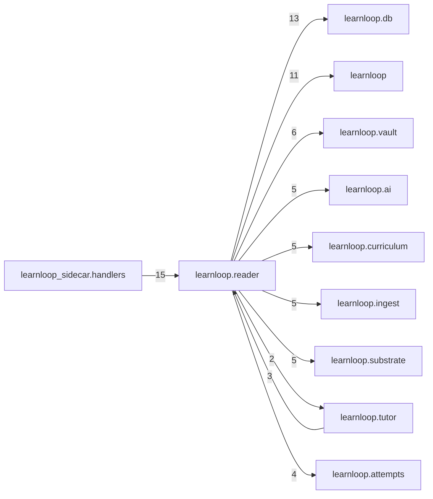

# `learnloop.reader` package map

> [!info] Generated package map
> This map is generated from live modules and their static imports. Follow module links for source-level facts and canonical concept/workflow links for system behavior.

Up: [[Module Catalog]]

## Responsibility

Reader-mode source exploration, annotations, quick checks, and authoring handoffs.

For system intent, use [[Learning System]].

^package-purpose

## Module index

| Module | Purpose | Status | Direct importers | Direct test files |
|---|---|---:|---:|---:|
| [[Reference/Modules/learnloop/reader/__init__|learnloop.reader]] | [[Reference/Modules/learnloop/reader/__init__#^module-purpose|purpose]] | `ACTIVE` | 0 | 0 |
| [[Reference/Modules/learnloop/reader/ai_contracts|learnloop.reader.ai_contracts]] | [[Reference/Modules/learnloop/reader/ai_contracts#^module-purpose|purpose]] | `ACTIVE` | 2 | 6 |
| [[Reference/Modules/learnloop/reader/annotations|learnloop.reader.annotations]] | [[Reference/Modules/learnloop/reader/annotations#^module-purpose|purpose]] | `ACTIVE` | 3 | 4 |
| [[Reference/Modules/learnloop/reader/reader_authoring|learnloop.reader.reader_authoring]] | [[Reference/Modules/learnloop/reader/reader_authoring#^module-purpose|purpose]] | `ACTIVE` | 1 | 2 |
| [[Reference/Modules/learnloop/reader/reader_capture|learnloop.reader.reader_capture]] | [[Reference/Modules/learnloop/reader/reader_capture#^module-purpose|purpose]] | `ACTIVE` | 1 | 2 |
| [[Reference/Modules/learnloop/reader/reader_dialogue|learnloop.reader.reader_dialogue]] | [[Reference/Modules/learnloop/reader/reader_dialogue#^module-purpose|purpose]] | `ACTIVE` | 2 | 4 |
| [[Reference/Modules/learnloop/reader/reader_guidance|learnloop.reader.reader_guidance]] | [[Reference/Modules/learnloop/reader/reader_guidance#^module-purpose|purpose]] | `ACTIVE` | 3 | 2 |
| [[Reference/Modules/learnloop/reader/reader_progression|learnloop.reader.reader_progression]] | [[Reference/Modules/learnloop/reader/reader_progression#^module-purpose|purpose]] | `ACTIVE` | 3 | 1 |
| [[Reference/Modules/learnloop/reader/reader_quick_check|learnloop.reader.reader_quick_check]] | [[Reference/Modules/learnloop/reader/reader_quick_check#^module-purpose|purpose]] | `ACTIVE` | 2 | 2 |
| [[Reference/Modules/learnloop/reader/reader_requests|learnloop.reader.reader_requests]] | [[Reference/Modules/learnloop/reader/reader_requests#^module-purpose|purpose]] | `ACTIVE` | 3 | 4 |
| [[Reference/Modules/learnloop/reader/reader_restoration|learnloop.reader.reader_restoration]] | [[Reference/Modules/learnloop/reader/reader_restoration#^module-purpose|purpose]] | `ACTIVE` | 1 | 2 |
| [[Reference/Modules/learnloop/reader/source_objects|learnloop.reader.source_objects]] | [[Reference/Modules/learnloop/reader/source_objects#^module-purpose|purpose]] | `ACTIVE` | 2 | 1 |
| [[Reference/Modules/learnloop/reader/source_render_views|learnloop.reader.source_render_views]] | [[Reference/Modules/learnloop/reader/source_render_views#^module-purpose|purpose]] | `ACTIVE` | 1 | 2 |
| [[Reference/Modules/learnloop/reader/source_review|learnloop.reader.source_review]] | [[Reference/Modules/learnloop/reader/source_review#^module-purpose|purpose]] | `ACTIVE` | 1 | 1 |
| [[Reference/Modules/learnloop/reader/source_search|learnloop.reader.source_search]] | [[Reference/Modules/learnloop/reader/source_search#^module-purpose|purpose]] | `ACTIVE` | 1 | 1 |
| [[Reference/Modules/learnloop/reader/span_view|learnloop.reader.span_view]] | [[Reference/Modules/learnloop/reader/span_view#^module-purpose|purpose]] | `ACTIVE` | 6 | 3 |

## Cross-package dependencies

### This package imports

- [[Reference/Modules/learnloop/db/_package|learnloop.db]] — 13 static module edges
- [[Reference/Modules/learnloop/_package|learnloop]] — 11 static module edges
- [[Reference/Modules/learnloop/vault/_package|learnloop.vault]] — 6 static module edges
- [[Reference/Modules/learnloop/ai/_package|learnloop.ai]] — 5 static module edges
- [[Reference/Modules/learnloop/curriculum/_package|learnloop.curriculum]] — 5 static module edges
- [[Reference/Modules/learnloop/ingest/_package|learnloop.ingest]] — 5 static module edges
- [[Reference/Modules/learnloop/substrate/_package|learnloop.substrate]] — 5 static module edges
- [[Reference/Modules/learnloop/attempts/_package|learnloop.attempts]] — 4 static module edges
- [[Reference/Modules/learnloop/content/sources/_package|learnloop.content.sources]] — 3 static module edges
- [[Reference/Modules/learnloop/tutor/_package|learnloop.tutor]] — 2 static module edges
- [[Reference/Modules/learnloop/content/authoring/_package|learnloop.content.authoring]] — 1 static module edge
- [[Reference/Modules/learnloop/content/pipeline/_package|learnloop.content.pipeline]] — 1 static module edge
- [[Reference/Modules/learnloop/learner/_package|learnloop.learner]] — 1 static module edge

### Packages that import this package

- [[Reference/Modules/learnloop_sidecar/handlers/_package|learnloop_sidecar.handlers]] — 15 static module edges
- [[Reference/Modules/learnloop/tutor/_package|learnloop.tutor]] — 3 static module edges
- [[Reference/Modules/learnloop/content/pipeline/_package|learnloop.content.pipeline]] — 2 static module edges
- [[Reference/Modules/learnloop/content/authoring/_package|learnloop.content.authoring]] — 1 static module edge
- [[Reference/Modules/learnloop/diagnosis/_package|learnloop.diagnosis]] — 1 static module edge

### Dependency neighborhood

This diagram compresses package-level static imports; edge labels are distinct module-to-module import counts.



Interpretation: arrow direction is static import direction and the label is the number of distinct module-to-module edges. It shows coupling pressure, not runtime call frequency or ownership permission.

## Workflow entry points

- [[Import Canonical Sources]]
- [[Start a Learning Cycle]]

## Find and filter

Use Obsidian's native search:

```query
path:"Reference/Modules/learnloop/reader" tag:#docs/module
```

To change this package, start with a module's [[#Module index|purpose link]], then follow its callers, tests, and modification guidance. Re-run the generator after source changes.
