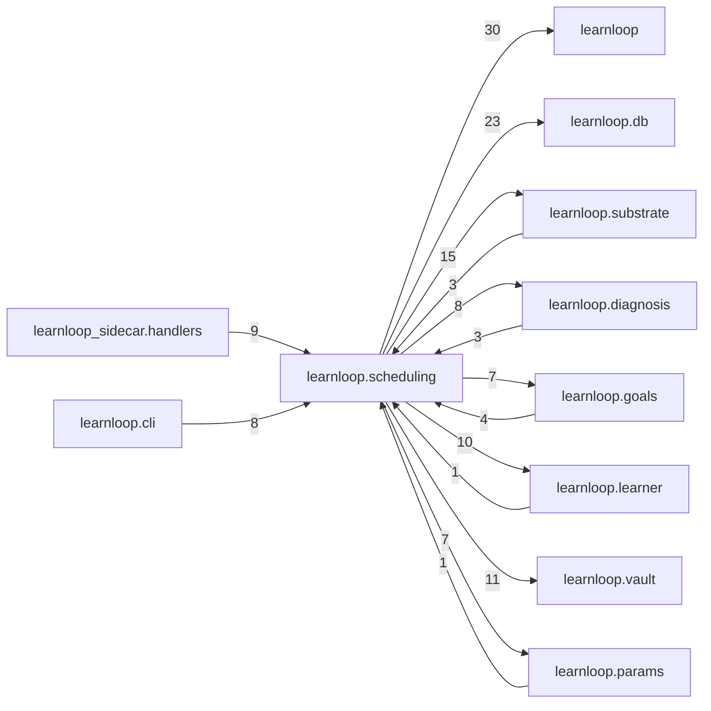

# `learnloop.scheduling` package map

> [!info] Generated package map
> This map is generated from live modules and their static imports. Follow module links for source-level facts and canonical concept/workflow links for system behavior.

Up: [[Module Catalog]]

## Responsibility

Selection, review timing, progression, controller decisions, and scheduling projections.

For system intent, use [[Learning System]].

^package-purpose

## Module index

| Module | Purpose | Status | Direct importers | Direct test files |
|---|---|---:|---:|---:|
| [[Reference/Modules/learnloop/scheduling/__init__|learnloop.scheduling]] | [[Reference/Modules/learnloop/scheduling/__init__#^module-purpose|purpose]] | `ACTIVE` | 0 | 0 |
| [[Reference/Modules/learnloop/scheduling/action_loss|learnloop.scheduling.action_loss]] | [[Reference/Modules/learnloop/scheduling/action_loss#^module-purpose|purpose]] | `ACTIVE` | 4 | 4 |
| [[Reference/Modules/learnloop/scheduling/constraint_engine|learnloop.scheduling.constraint_engine]] | [[Reference/Modules/learnloop/scheduling/constraint_engine#^module-purpose|purpose]] | `ACTIVE` | 2 | 6 |
| [[Reference/Modules/learnloop/scheduling/controller_actions|learnloop.scheduling.controller_actions]] | [[Reference/Modules/learnloop/scheduling/controller_actions#^module-purpose|purpose]] | `ACTIVE` | 3 | 4 |
| [[Reference/Modules/learnloop/scheduling/controller_cutover|learnloop.scheduling.controller_cutover]] | [[Reference/Modules/learnloop/scheduling/controller_cutover#^module-purpose|purpose]] | `ACTIVE` | 0 | 2 |
| [[Reference/Modules/learnloop/scheduling/controller_ownership|learnloop.scheduling.controller_ownership]] | [[Reference/Modules/learnloop/scheduling/controller_ownership#^module-purpose|purpose]] | `ACTIVE` | 4 | 4 |
| [[Reference/Modules/learnloop/scheduling/controller_snapshot|learnloop.scheduling.controller_snapshot]] | [[Reference/Modules/learnloop/scheduling/controller_snapshot#^module-purpose|purpose]] | `ACTIVE` | 8 | 11 |
| [[Reference/Modules/learnloop/scheduling/controller_store|learnloop.scheduling.controller_store]] | [[Reference/Modules/learnloop/scheduling/controller_store#^module-purpose|purpose]] | `ACTIVE` | 5 | 7 |
| [[Reference/Modules/learnloop/scheduling/decay_pressure|learnloop.scheduling.decay_pressure]] | [[Reference/Modules/learnloop/scheduling/decay_pressure#^module-purpose|purpose]] | `ACTIVE` | 2 | 1 |
| [[Reference/Modules/learnloop/scheduling/dispersion|learnloop.scheduling.dispersion]] | [[Reference/Modules/learnloop/scheduling/dispersion#^module-purpose|purpose]] | `ACTIVE` | 1 | 1 |
| [[Reference/Modules/learnloop/scheduling/evaluation|learnloop.scheduling.evaluation]] | [[Reference/Modules/learnloop/scheduling/evaluation#^module-purpose|purpose]] | `ACTIVE` | 1 | 1 |
| [[Reference/Modules/learnloop/scheduling/evsi|learnloop.scheduling.evsi]] | [[Reference/Modules/learnloop/scheduling/evsi#^module-purpose|purpose]] | `ACTIVE` | 3 | 2 |
| [[Reference/Modules/learnloop/scheduling/fsrs|learnloop.scheduling.fsrs]] | [[Reference/Modules/learnloop/scheduling/fsrs#^module-purpose|purpose]] | `ACTIVE` | 13 | 10 |
| [[Reference/Modules/learnloop/scheduling/fsrs_fitting|learnloop.scheduling.fsrs_fitting]] | [[Reference/Modules/learnloop/scheduling/fsrs_fitting#^module-purpose|purpose]] | `ACTIVE` | 1 | 1 |
| [[Reference/Modules/learnloop/scheduling/intent_planner|learnloop.scheduling.intent_planner]] | [[Reference/Modules/learnloop/scheduling/intent_planner#^module-purpose|purpose]] | `EVALUATION` | 1 | 1 |
| [[Reference/Modules/learnloop/scheduling/interleaving|learnloop.scheduling.interleaving]] | [[Reference/Modules/learnloop/scheduling/interleaving#^module-purpose|purpose]] | `ACTIVE` | 1 | 1 |
| [[Reference/Modules/learnloop/scheduling/kinship_feature|learnloop.scheduling.kinship_feature]] | [[Reference/Modules/learnloop/scheduling/kinship_feature#^module-purpose|purpose]] | `DORMANT` | 1 | 2 |
| [[Reference/Modules/learnloop/scheduling/open_world_gate|learnloop.scheduling.open_world_gate]] | [[Reference/Modules/learnloop/scheduling/open_world_gate#^module-purpose|purpose]] | `ACTIVE` | 1 | 1 |
| [[Reference/Modules/learnloop/scheduling/predictive_targets|learnloop.scheduling.predictive_targets]] | [[Reference/Modules/learnloop/scheduling/predictive_targets#^module-purpose|purpose]] | `ACTIVE` | 1 | 1 |
| [[Reference/Modules/learnloop/scheduling/prequential|learnloop.scheduling.prequential]] | [[Reference/Modules/learnloop/scheduling/prequential#^module-purpose|purpose]] | `DORMANT` | 0 | 2 |
| [[Reference/Modules/learnloop/scheduling/progression|learnloop.scheduling.progression]] | [[Reference/Modules/learnloop/scheduling/progression#^module-purpose|purpose]] | `ACTIVE` | 0 | 3 |
| [[Reference/Modules/learnloop/scheduling/progression_policy|learnloop.scheduling.progression_policy]] | [[Reference/Modules/learnloop/scheduling/progression_policy#^module-purpose|purpose]] | `ACTIVE` | 1 | 2 |
| [[Reference/Modules/learnloop/scheduling/randomization_layer|learnloop.scheduling.randomization_layer]] | [[Reference/Modules/learnloop/scheduling/randomization_layer#^module-purpose|purpose]] | `ACTIVE` | 1 | 1 |
| [[Reference/Modules/learnloop/scheduling/reentry_adapter|learnloop.scheduling.reentry_adapter]] | [[Reference/Modules/learnloop/scheduling/reentry_adapter#^module-purpose|purpose]] | `ACTIVE` | 0 | 1 |
| [[Reference/Modules/learnloop/scheduling/reentry_summary|learnloop.scheduling.reentry_summary]] | [[Reference/Modules/learnloop/scheduling/reentry_summary#^module-purpose|purpose]] | `ACTIVE` | 3 | 1 |
| [[Reference/Modules/learnloop/scheduling/review_log|learnloop.scheduling.review_log]] | [[Reference/Modules/learnloop/scheduling/review_log#^module-purpose|purpose]] | `ACTIVE` | 2 | 2 |
| [[Reference/Modules/learnloop/scheduling/scheduler|learnloop.scheduling.scheduler]] | [[Reference/Modules/learnloop/scheduling/scheduler#^module-purpose|purpose]] | `ACTIVE` | 13 | 38 |
| [[Reference/Modules/learnloop/scheduling/selection_rewards|learnloop.scheduling.selection_rewards]] | [[Reference/Modules/learnloop/scheduling/selection_rewards#^module-purpose|purpose]] | `ACTIVE` | 5 | 4 |
| [[Reference/Modules/learnloop/scheduling/shadow_components|learnloop.scheduling.shadow_components]] | [[Reference/Modules/learnloop/scheduling/shadow_components#^module-purpose|purpose]] | `EVALUATION` | 1 | 1 |
| [[Reference/Modules/learnloop/scheduling/short_session|learnloop.scheduling.short_session]] | [[Reference/Modules/learnloop/scheduling/short_session#^module-purpose|purpose]] | `ACTIVE` | 0 | 1 |
| [[Reference/Modules/learnloop/scheduling/staged_policy|learnloop.scheduling.staged_policy]] | [[Reference/Modules/learnloop/scheduling/staged_policy#^module-purpose|purpose]] | `ACTIVE` | 7 | 7 |
| [[Reference/Modules/learnloop/scheduling/state_signals|learnloop.scheduling.state_signals]] | [[Reference/Modules/learnloop/scheduling/state_signals#^module-purpose|purpose]] | `ACTIVE` | 2 | 1 |

## Cross-package dependencies

### This package imports

- [[Reference/Modules/learnloop/_package|learnloop]] — 30 static module edges
- [[Reference/Modules/learnloop/db/_package|learnloop.db]] — 23 static module edges
- [[Reference/Modules/learnloop/substrate/_package|learnloop.substrate]] — 15 static module edges
- [[Reference/Modules/learnloop/vault/_package|learnloop.vault]] — 11 static module edges
- [[Reference/Modules/learnloop/learner/_package|learnloop.learner]] — 10 static module edges
- [[Reference/Modules/learnloop/diagnosis/_package|learnloop.diagnosis]] — 8 static module edges
- [[Reference/Modules/learnloop/goals/_package|learnloop.goals]] — 7 static module edges
- [[Reference/Modules/learnloop/params/_package|learnloop.params]] — 7 static module edges
- [[Reference/Modules/learnloop/attempts/_package|learnloop.attempts]] — 6 static module edges
- [[Reference/Modules/learnloop/curriculum/_package|learnloop.curriculum]] — 6 static module edges
- [[Reference/Modules/learnloop/config/_package|learnloop.config]] — 2 static module edges
- [[Reference/Modules/learnloop/content/authoring/_package|learnloop.content.authoring]] — 1 static module edge
- [[Reference/Modules/learnloop/sim/_package|learnloop.sim]] — 1 static module edge

### Packages that import this package

- [[Reference/Modules/learnloop_sidecar/handlers/_package|learnloop_sidecar.handlers]] — 9 static module edges
- [[Reference/Modules/learnloop/cli/_package|learnloop.cli]] — 8 static module edges
- [[Reference/Modules/learnloop/goals/_package|learnloop.goals]] — 4 static module edges
- [[Reference/Modules/learnloop/sim/_package|learnloop.sim]] — 4 static module edges
- [[Reference/Modules/learnloop/tui/screens/_package|learnloop.tui.screens]] — 4 static module edges
- [[Reference/Modules/learnloop/diagnosis/_package|learnloop.diagnosis]] — 3 static module edges
- [[Reference/Modules/learnloop/substrate/_package|learnloop.substrate]] — 3 static module edges
- [[Reference/Modules/learnloop/attempts/_package|learnloop.attempts]] — 1 static module edge
- [[Reference/Modules/learnloop/learner/_package|learnloop.learner]] — 1 static module edge
- [[Reference/Modules/learnloop/params/_package|learnloop.params]] — 1 static module edge
- [[Reference/Modules/learnloop/substrate/compat/_package|learnloop.substrate.compat]] — 1 static module edge
- [[Reference/Modules/learnloop/tui/_package|learnloop.tui]] — 1 static module edge

### Dependency neighborhood

This diagram compresses package-level static imports; edge labels are distinct module-to-module import counts.



Interpretation: arrow direction is static import direction and the label is the number of distinct module-to-module edges. It shows coupling pressure, not runtime call frequency or ownership permission.

## Workflow entry points

- [[Start a Learning Cycle]]

## Find and filter

Use Obsidian's native search:

```query
path:"Reference/Modules/learnloop/scheduling" tag:#docs/module
```

To change this package, start with a module's [[#Module index|purpose link]], then follow its callers, tests, and modification guidance. Re-run the generator after source changes.
