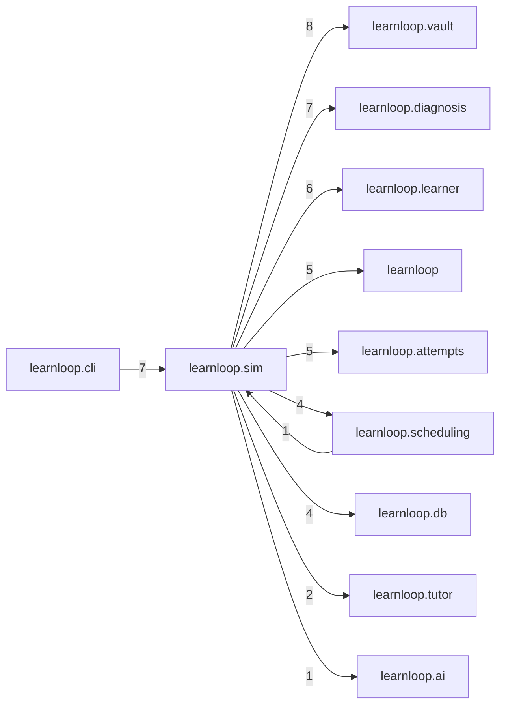

# `learnloop.sim` package map

> [!info] Generated package map
> This map is generated from live modules and their static imports. Follow module links for source-level facts and canonical concept/workflow links for system behavior.

Up: [[Module Catalog]]

## Responsibility

Offline simulation, benchmark, sweep, synthetic-student, and algorithm evaluation tools.

For system intent, use [[Learning System]].

^package-purpose

## Module index

| Module | Purpose | Status | Direct importers | Direct test files |
|---|---|---:|---:|---:|
| [[Reference/Modules/learnloop/sim/__init__|learnloop.sim]] | [[Reference/Modules/learnloop/sim/__init__#^module-purpose|purpose]] | `EVALUATION` | 0 | 0 |
| [[Reference/Modules/learnloop/sim/diagnostic_validation|learnloop.sim.diagnostic_validation]] | [[Reference/Modules/learnloop/sim/diagnostic_validation#^module-purpose|purpose]] | `EVALUATION` | 1 | 1 |
| [[Reference/Modules/learnloop/sim/grader_confusion|learnloop.sim.grader_confusion]] | [[Reference/Modules/learnloop/sim/grader_confusion#^module-purpose|purpose]] | `EVALUATION` | 1 | 1 |
| [[Reference/Modules/learnloop/sim/interval_width_viability|learnloop.sim.interval_width_viability]] | [[Reference/Modules/learnloop/sim/interval_width_viability#^module-purpose|purpose]] | `EVALUATION` | 0 | 1 |
| [[Reference/Modules/learnloop/sim/kinship_admission|learnloop.sim.kinship_admission]] | [[Reference/Modules/learnloop/sim/kinship_admission#^module-purpose|purpose]] | `EVALUATION` | 1 | 0 |
| [[Reference/Modules/learnloop/sim/metrics|learnloop.sim.metrics]] | [[Reference/Modules/learnloop/sim/metrics#^module-purpose|purpose]] | `EVALUATION` | 1 | 1 |
| [[Reference/Modules/learnloop/sim/offline_benchmarks|learnloop.sim.offline_benchmarks]] | [[Reference/Modules/learnloop/sim/offline_benchmarks#^module-purpose|purpose]] | `EVALUATION` | 1 | 1 |
| [[Reference/Modules/learnloop/sim/profiles|learnloop.sim.profiles]] | [[Reference/Modules/learnloop/sim/profiles#^module-purpose|purpose]] | `EVALUATION` | 4 | 5 |
| [[Reference/Modules/learnloop/sim/runner|learnloop.sim.runner]] | [[Reference/Modules/learnloop/sim/runner#^module-purpose|purpose]] | `EVALUATION` | 6 | 4 |
| [[Reference/Modules/learnloop/sim/student|learnloop.sim.student]] | [[Reference/Modules/learnloop/sim/student#^module-purpose|purpose]] | `EVALUATION` | 4 | 5 |
| [[Reference/Modules/learnloop/sim/sweep|learnloop.sim.sweep]] | [[Reference/Modules/learnloop/sim/sweep#^module-purpose|purpose]] | `EVALUATION` | 3 | 2 |

## Cross-package dependencies

### This package imports

- [[Reference/Modules/learnloop/vault/_package|learnloop.vault]] — 8 static module edges
- [[Reference/Modules/learnloop/diagnosis/_package|learnloop.diagnosis]] — 7 static module edges
- [[Reference/Modules/learnloop/learner/_package|learnloop.learner]] — 6 static module edges
- [[Reference/Modules/learnloop/_package|learnloop]] — 5 static module edges
- [[Reference/Modules/learnloop/attempts/_package|learnloop.attempts]] — 5 static module edges
- [[Reference/Modules/learnloop/db/_package|learnloop.db]] — 4 static module edges
- [[Reference/Modules/learnloop/scheduling/_package|learnloop.scheduling]] — 4 static module edges
- [[Reference/Modules/learnloop/tutor/_package|learnloop.tutor]] — 2 static module edges
- [[Reference/Modules/learnloop/ai/_package|learnloop.ai]] — 1 static module edge
- [[Reference/Modules/learnloop/config/_package|learnloop.config]] — 1 static module edge
- [[Reference/Modules/learnloop/goals/_package|learnloop.goals]] — 1 static module edge
- [[Reference/Modules/learnloop/substrate/_package|learnloop.substrate]] — 1 static module edge

### Packages that import this package

- [[Reference/Modules/learnloop/cli/_package|learnloop.cli]] — 7 static module edges
- [[Reference/Modules/learnloop/params/_package|learnloop.params]] — 1 static module edge
- [[Reference/Modules/learnloop/scheduling/_package|learnloop.scheduling]] — 1 static module edge

### Dependency neighborhood

This diagram compresses package-level static imports; edge labels are distinct module-to-module import counts.



Interpretation: arrow direction is static import direction and the label is the number of distinct module-to-module edges. It shows coupling pressure, not runtime call frequency or ownership permission.

## Workflow entry points

- No direct user-facing workflow; this package is offline/evaluation support.

## Find and filter

Use Obsidian's native search:

```query
path:"Reference/Modules/learnloop/sim" tag:#docs/module
```

To change this package, start with a module's [[#Module index|purpose link]], then follow its callers, tests, and modification guidance. Re-run the generator after source changes.
