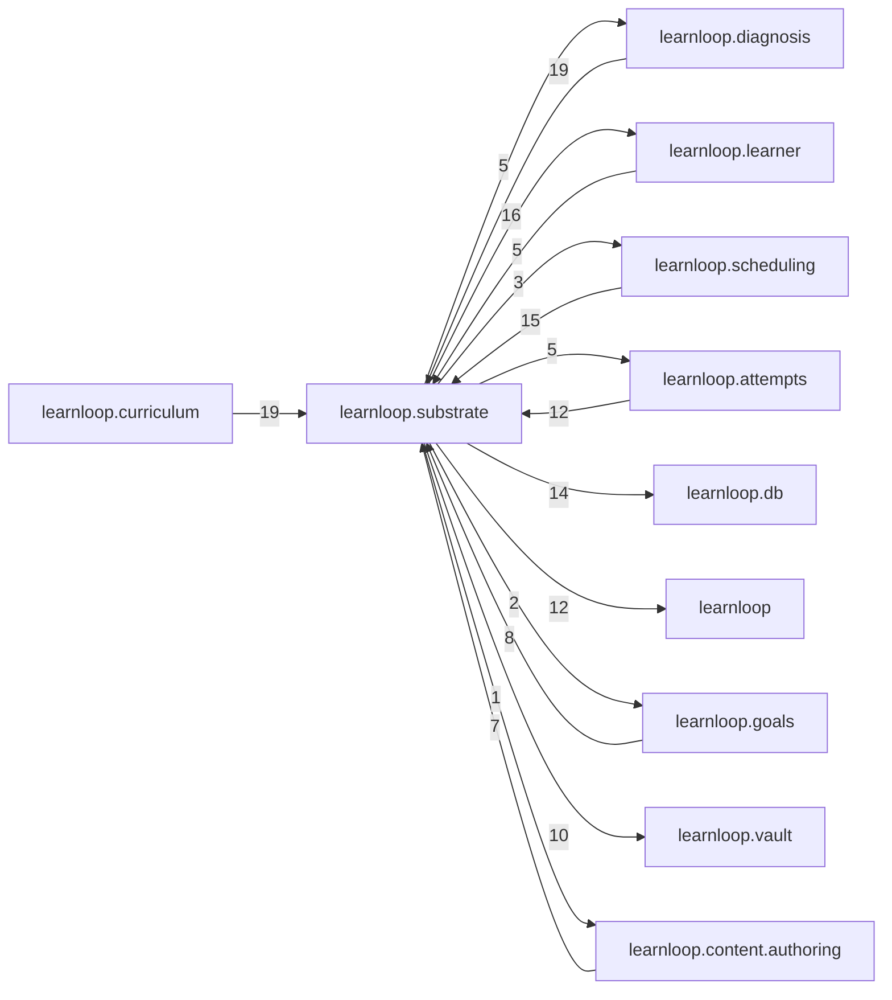

# `learnloop.substrate` package map

> [!info] Generated package map
> This map is generated from live modules and their static imports. Follow module links for source-level facts and canonical concept/workflow links for system behavior.

Up: [[Module Catalog]]

## Responsibility

Activity, card, surface, and identity substrate plus canonical projections.

For system intent, use [[Learning System]], [[State and Persistence]].

^package-purpose

## Module index

| Module | Purpose | Status | Direct importers | Direct test files |
|---|---|---:|---:|---:|
| [[Reference/Modules/learnloop/substrate/__init__|learnloop.substrate]] | [[Reference/Modules/learnloop/substrate/__init__#^module-purpose|purpose]] | `ACTIVE` | 0 | 0 |
| [[Reference/Modules/learnloop/substrate/activities|learnloop.substrate.activities]] | [[Reference/Modules/learnloop/substrate/activities#^module-purpose|purpose]] | `ACTIVE` | 47 | 31 |
| [[Reference/Modules/learnloop/substrate/activity_patterns|learnloop.substrate.activity_patterns]] | [[Reference/Modules/learnloop/substrate/activity_patterns#^module-purpose|purpose]] | `ACTIVE` | 5 | 2 |
| [[Reference/Modules/learnloop/substrate/administration_adapters|learnloop.substrate.administration_adapters]] | [[Reference/Modules/learnloop/substrate/administration_adapters#^module-purpose|purpose]] | `ACTIVE` | 4 | 3 |
| [[Reference/Modules/learnloop/substrate/canonical_projection|learnloop.substrate.canonical_projection]] | [[Reference/Modules/learnloop/substrate/canonical_projection#^module-purpose|purpose]] | `ACTIVE` | 27 | 19 |
| [[Reference/Modules/learnloop/substrate/canonical_projection_rollout|learnloop.substrate.canonical_projection_rollout]] | [[Reference/Modules/learnloop/substrate/canonical_projection_rollout#^module-purpose|purpose]] | `ACTIVE` | 1 | 0 |
| [[Reference/Modules/learnloop/substrate/card_lineage|learnloop.substrate.card_lineage]] | [[Reference/Modules/learnloop/substrate/card_lineage#^module-purpose|purpose]] | `ACTIVE` | 4 | 6 |
| [[Reference/Modules/learnloop/substrate/instrument_serving|learnloop.substrate.instrument_serving]] | [[Reference/Modules/learnloop/substrate/instrument_serving#^module-purpose|purpose]] | `ACTIVE` | 13 | 2 |
| [[Reference/Modules/learnloop/substrate/p0_projection|learnloop.substrate.p0_projection]] | [[Reference/Modules/learnloop/substrate/p0_projection#^module-purpose|purpose]] | `ACTIVE` | 2 | 2 |
| [[Reference/Modules/learnloop/substrate/rebuild_orchestrator|learnloop.substrate.rebuild_orchestrator]] | [[Reference/Modules/learnloop/substrate/rebuild_orchestrator#^module-purpose|purpose]] | `ACTIVE` | 2 | 1 |
| [[Reference/Modules/learnloop/substrate/replay|learnloop.substrate.replay]] | [[Reference/Modules/learnloop/substrate/replay#^module-purpose|purpose]] | `ACTIVE` | 7 | 21 |
| [[Reference/Modules/learnloop/substrate/shadow_rebuild|learnloop.substrate.shadow_rebuild]] | [[Reference/Modules/learnloop/substrate/shadow_rebuild#^module-purpose|purpose]] | `ACTIVE` | 1 | 1 |
| [[Reference/Modules/learnloop/substrate/state_sync|learnloop.substrate.state_sync]] | [[Reference/Modules/learnloop/substrate/state_sync#^module-purpose|purpose]] | `ACTIVE` | 13 | 90 |
| [[Reference/Modules/learnloop/substrate/surface_mint|learnloop.substrate.surface_mint]] | [[Reference/Modules/learnloop/substrate/surface_mint#^module-purpose|purpose]] | `ACTIVE` | 2 | 2 |
| [[Reference/Modules/learnloop/substrate/surface_pool|learnloop.substrate.surface_pool]] | [[Reference/Modules/learnloop/substrate/surface_pool#^module-purpose|purpose]] | `ACTIVE` | 1 | 2 |

## Child package maps

- [[Reference/Modules/learnloop/substrate/compat/_package|learnloop.substrate.compat]] — Frozen compatibility machinery retained for old vaults.

## Cross-package dependencies

### This package imports

- [[Reference/Modules/learnloop/learner/_package|learnloop.learner]] — 16 static module edges
- [[Reference/Modules/learnloop/db/_package|learnloop.db]] — 14 static module edges
- [[Reference/Modules/learnloop/_package|learnloop]] — 12 static module edges
- [[Reference/Modules/learnloop/vault/_package|learnloop.vault]] — 10 static module edges
- [[Reference/Modules/learnloop/attempts/_package|learnloop.attempts]] — 5 static module edges
- [[Reference/Modules/learnloop/diagnosis/_package|learnloop.diagnosis]] — 5 static module edges
- [[Reference/Modules/learnloop/scheduling/_package|learnloop.scheduling]] — 3 static module edges
- [[Reference/Modules/learnloop/config/_package|learnloop.config]] — 2 static module edges
- [[Reference/Modules/learnloop/goals/_package|learnloop.goals]] — 2 static module edges
- [[Reference/Modules/learnloop/content/authoring/_package|learnloop.content.authoring]] — 1 static module edge
- [[Reference/Modules/learnloop/ops/_package|learnloop.ops]] — 1 static module edge
- [[Reference/Modules/learnloop/substrate/compat/_package|learnloop.substrate.compat]] — 1 static module edge

### Packages that import this package

- [[Reference/Modules/learnloop/curriculum/_package|learnloop.curriculum]] — 19 static module edges
- [[Reference/Modules/learnloop/diagnosis/_package|learnloop.diagnosis]] — 19 static module edges
- [[Reference/Modules/learnloop/scheduling/_package|learnloop.scheduling]] — 15 static module edges
- [[Reference/Modules/learnloop/attempts/_package|learnloop.attempts]] — 12 static module edges
- [[Reference/Modules/learnloop/goals/_package|learnloop.goals]] — 8 static module edges
- [[Reference/Modules/learnloop/content/authoring/_package|learnloop.content.authoring]] — 7 static module edges
- [[Reference/Modules/learnloop/cli/_package|learnloop.cli]] — 5 static module edges
- [[Reference/Modules/learnloop/learner/_package|learnloop.learner]] — 5 static module edges
- [[Reference/Modules/learnloop/reader/_package|learnloop.reader]] — 5 static module edges
- [[Reference/Modules/learnloop_sidecar/handlers/_package|learnloop_sidecar.handlers]] — 5 static module edges
- [[Reference/Modules/learnloop/ops/_package|learnloop.ops]] — 4 static module edges
- [[Reference/Modules/learnloop/substrate/compat/_package|learnloop.substrate.compat]] — 4 static module edges
- [[Reference/Modules/learnloop/content/proposals/_package|learnloop.content.proposals]] — 3 static module edges
- [[Reference/Modules/learnloop/params/_package|learnloop.params]] — 2 static module edges
- [[Reference/Modules/learnloop_sidecar/_package|learnloop_sidecar]] — 2 static module edges
- [[Reference/Modules/learnloop/content/pipeline/_package|learnloop.content.pipeline]] — 1 static module edge
- [[Reference/Modules/learnloop/sim/_package|learnloop.sim]] — 1 static module edge
- [[Reference/Modules/learnloop/tui/_package|learnloop.tui]] — 1 static module edge

### Dependency neighborhood

This diagram compresses package-level static imports; edge labels are distinct module-to-module import counts.



Interpretation: arrow direction is static import direction and the label is the number of distinct module-to-module edges. It shows coupling pressure, not runtime call frequency or ownership permission.

## Workflow entry points

- [[Start a Learning Cycle]]
- [[Inspect Persistent State]]

## Find and filter

Use Obsidian's native search:

```query
path:"Reference/Modules/learnloop/substrate" tag:#docs/module
```

To change this package, start with a module's [[#Module index|purpose link]], then follow its callers, tests, and modification guidance. Re-run the generator after source changes.
