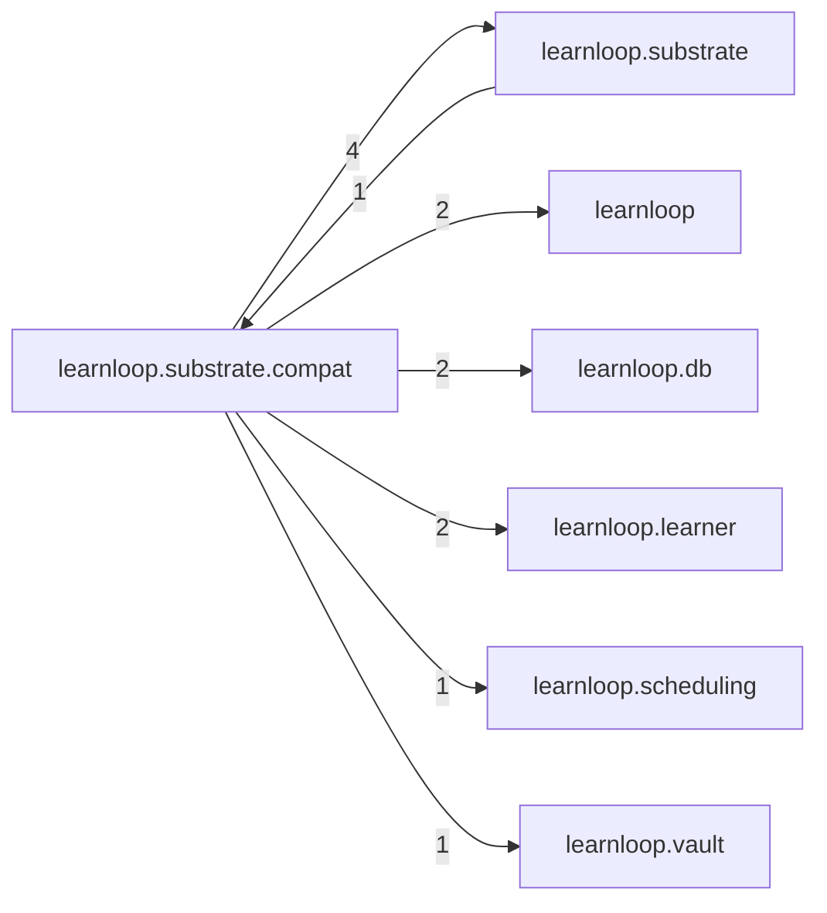

# `learnloop.substrate.compat` package map

> [!info] Generated package map
> This map is generated from live modules and their static imports. Follow module links for source-level facts and canonical concept/workflow links for system behavior.

Up: [[Module Catalog]]

## Responsibility

Frozen compatibility machinery retained for old vaults.

For system intent, use [[Learning System]], [[State and Persistence]].

^package-purpose

## Module index

| Module | Purpose | Status | Direct importers | Direct test files |
|---|---|---:|---:|---:|
| [[Reference/Modules/learnloop/substrate/compat/__init__|learnloop.substrate.compat]] | [[Reference/Modules/learnloop/substrate/compat/__init__#^module-purpose|purpose]] | `COMPAT` | 0 | 0 |
| [[Reference/Modules/learnloop/substrate/compat/activity_backfill|learnloop.substrate.compat.activity_backfill]] | [[Reference/Modules/learnloop/substrate/compat/activity_backfill#^module-purpose|purpose]] | `COMPAT` | 1 | 2 |
| [[Reference/Modules/learnloop/substrate/compat/card_outcome_replay|learnloop.substrate.compat.card_outcome_replay]] | [[Reference/Modules/learnloop/substrate/compat/card_outcome_replay#^module-purpose|purpose]] | `COMPAT` | 0 | 2 |
| [[Reference/Modules/learnloop/substrate/compat/substrate_cutover|learnloop.substrate.compat.substrate_cutover]] | [[Reference/Modules/learnloop/substrate/compat/substrate_cutover#^module-purpose|purpose]] | `COMPAT` | 0 | 3 |

## Cross-package dependencies

### This package imports

- [[Reference/Modules/learnloop/substrate/_package|learnloop.substrate]] — 4 static module edges
- [[Reference/Modules/learnloop/_package|learnloop]] — 2 static module edges
- [[Reference/Modules/learnloop/db/_package|learnloop.db]] — 2 static module edges
- [[Reference/Modules/learnloop/learner/_package|learnloop.learner]] — 2 static module edges
- [[Reference/Modules/learnloop/scheduling/_package|learnloop.scheduling]] — 1 static module edge
- [[Reference/Modules/learnloop/vault/_package|learnloop.vault]] — 1 static module edge

### Packages that import this package

- [[Reference/Modules/learnloop/substrate/_package|learnloop.substrate]] — 1 static module edge

### Dependency neighborhood

This diagram compresses package-level static imports; edge labels are distinct module-to-module import counts.



Interpretation: arrow direction is static import direction and the label is the number of distinct module-to-module edges. It shows coupling pressure, not runtime call frequency or ownership permission.

## Workflow entry points

- [[Start a Learning Cycle]]
- [[Inspect Persistent State]]

## Find and filter

Use Obsidian's native search:

```query
path:"Reference/Modules/learnloop/substrate/compat" tag:#docs/module
```

To change this package, start with a module's [[#Module index|purpose link]], then follow its callers, tests, and modification guidance. Re-run the generator after source changes.
